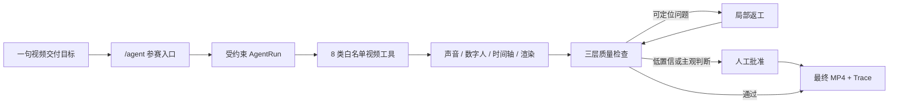

# VideoOps Agent

<div align="center">

**让数字人口播视频从“七步人工操作”变成一条可执行、可恢复、可质检、可追踪的 Agent 交付链。**

[▶ 在线体验 Demo](https://humingyu234.github.io/videoops-agent/) · [▶ 直接播放真实样片](https://humingyu234.github.io/videoops-agent/VideoOps-Agent-digital-human-demo.mp4) · [查看源码](https://github.com/humingyu234/videoops-agent)

</div>

VideoOps Agent 面向品牌、电商和内容运营团队。用户只需要给出视频交付目标、人物与声音选择，Agent 就会沿着受约束的生产链完成脚本确认、声音、数字人、时间轴、字幕、渲染、质量检查和人工批准，最终交付可下载的竖屏 MP4，并保留完整执行轨迹。

> 它不是一个只给建议的聊天机器人，而是一个真正调用现有视频生产能力、持续跟踪异步任务并对交付结果负责的行业 Agent。

## 一眼看懂

| 用户交给它 | Agent 负责 | 最终得到 |
| --- | --- | --- |
| 品牌/商品事实、口播目标、人物和声音 | 澄清输入、调用工具、等待任务、逐项质检、有限返工、请求批准 | 可下载 MP4、质量结论、人工决定与可回放 Trace |



## 为什么这个产品有价值

- **把工具拼接变成结果交付**：Agent 直接复用已有声音、数字人、资产、时间轴和渲染 Service，不重新搭建一套孤立的演示链。
- **长任务可以恢复**：AgentRun、外部任务 ID、幂等键和等待状态持久化；服务重启后继续查询同一根任务，避免重复提交 Provider。
- **质检结果可解释**：媒体、内容版式、感知判断分层输出，每条标准都有 criterion code、版本和证据，不用一个黑盒总分掩盖具体问题。
- **只修真正出错的部分**：字幕或版式问题只重做时间轴与渲染，保留已经成功的声音和数字人底片，节省时间与生成成本。
- **自动化有清晰边界**：自动返工默认 1 次、硬上限 2 次；无法可靠改善、超预算或涉及主观判断时转人工，不陷入无休止循环。
- **全过程可审计**：输入、工具调用、任务状态、质量结论、批准 revision/digest 和最终资产归属都进入 Trace，适合比赛演示，也适合真实团队协作。

## 核心能力

| 能力 | 产品表现 | 工程保障 |
| --- | --- | --- |
| 受约束执行 | 根据输入决定需要的步骤，可澄清、跳过或等待 | 固定状态机 + 类型化白名单工具，拒绝未知工具和多余参数 |
| 异步任务恢复 | 生成期间刷新或重启，仍能继续原任务 | MySQL 持久状态、租约恢复、幂等同根任务、Provider submit=1 边界 |
| 三层质量检查 | 检查可播放性、音视频、字幕、脚本与版式；主观项进入 REVIEW | FFmpeg 媒体事实 + 明确规则 + 低置信人工判断 |
| 依赖感知返工 | 只重做受影响的下游步骤 | 保留上游任务身份、限制重试次数、无改善即转人工 |
| 批准与权限 | 关键节点由素材所有者确认 | owner-scoped、revision/digest fail-closed、跨用户零副作用 |
| 交付与追踪 | 下载最终成片，回放完整过程 | owned ready asset + 持久化 AgentRun Trace |

## 在线 Demo 与真实样片

### [打开 VideoOps Agent Demo 页面 →](https://humingyu234.github.io/videoops-agent/)

Demo 页面内置一条经过真实声音、数字人、字幕和 FFmpeg 渲染链生成的竖屏效果样片；也可以[直接打开 MP4](https://humingyu234.github.io/videoops-agent/VideoOps-Agent-digital-human-demo.mp4)。

| 样片指标 | 实测结果 |
| --- | --- |
| 时长 / 画幅 / 帧率 | 25.8 秒 / 1080 × 1920 / 30 fps |
| 编码 | H.264 视频 + AAC 音频 |
| 文件大小 | 5,244,591 bytes |
| SHA-256 | `70AF66B5D57A43B3626DF1FE3C1CC85417010EC600C04050F3A93BA77FFEE0B7` |
| 媒体验证 | ffprobe、完整解码、音轨、字幕可读性、黑帧/冻结/静音检查通过 |

这条样片证明系统可以完成真实数字人口播视频输出；Agent 层在此基础上增加受约束执行、恢复、质检、局部返工与批准追踪。

## 一条典型交付链

1. 用户在 `/agent` 输入视频目标，选择新生成或复用自己已有的成功人物/声音/任务。
2. Agent 校验输入与归属，创建可持久恢复的 AgentRun。
3. Agent 通过白名单工具驱动声音、数字人、项目、时间轴与最终渲染。
4. 每个异步步骤持续写入状态；刷新或重启后继续同一任务。
5. 质量模块逐项输出证据：确定性问题阻断，主观或低置信项请求人工确认。
6. 可定位问题只触发下游局部返工；通过批准后交付 owned ready MP4。
7. 用户可回放 Trace，查看每一步调用、等待、质量判断、批准和最终资产关系。

## 技术架构

```text
ai-video-ui/       React 19 + Ant Design：/agent、Trace、批准与专家工作台
ai-video-api/      Java 21 + Spring：AgentRun、白名单工具、权限、任务与资产
ai-video-worker/   Python：媒体处理与任务工作进程
MySQL / Redis      持久状态、租约、幂等与隔离运行数据
FFmpeg             时间轴渲染、媒体探测与确定性质检
Provider Adapter   IndexTTS2 / ComfyUI 等可替换生成能力
```

设计原则是“Agent 负责编排，现有 Service 负责业务事实”：认证、owner、资产、任务终态和下载权限始终由服务端决定，模型不能绕过这些边界。

## 本地开发启动

环境要求：Java 21、Node.js 22+，以及项目独立的 MySQL / Redis 配置。敏感配置通过 Git-ignored 的本机安全载体注入。

```powershell
# 后端：默认监听 18081
.\scripts\start-local-user-api.ps1 -Port 18081

# 前端：开发代理指向 http://127.0.0.1:18081
Set-Location .\ai-video-ui\ai-video-webapp
npm ci
npm run dev
```

默认配置保持 Provider fail-closed；接入真实生成资源时，需要使用已授权的素材、账号和项目 namespace。数据库初始化见 [开发数据库说明](docs/DEVELOPMENT_DATABASE_INITIALIZATION.md)，实时工程证据见 [EXECUTION](docs/EXECUTION.md)。

## 项目地图

```text
ai-video-ui/       用户端与运营端界面
ai-video-api/      多模块后端与领域 Service
ai-video-worker/   媒体与任务工作进程
ai-video-desktop/  Electron 桌面薄壳
docs/              产品范围、架构、契约与执行证据
scripts/           本地启动、验证与公开安全检查
```

- [产品目标](docs/PROJECT.md)
- [系统架构](docs/ARCHITECTURE.md)
- [阶段路线](docs/PLAN.md)
- [实时执行与验证记录](docs/EXECUTION.md)
- [代码来源与脱敏基线](docs/BASELINE.md)

## 许可与安全

本仓库用于公开评审与比赛展示。原创贡献部分适用根目录 [LICENSE](LICENSE)，上游代码、字体和依赖分别适用其自身许可证，详见 [THIRD_PARTY_NOTICES.md](THIRD_PARTY_NOTICES.md)。

仓库不提交密钥、口令、Token、签名 URL、私有地址、证书、未授权素材或本机媒体产物；公开更新前会执行秘密、媒体与快照扫描。
