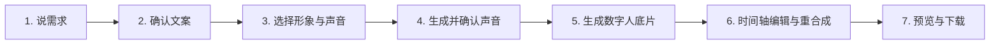
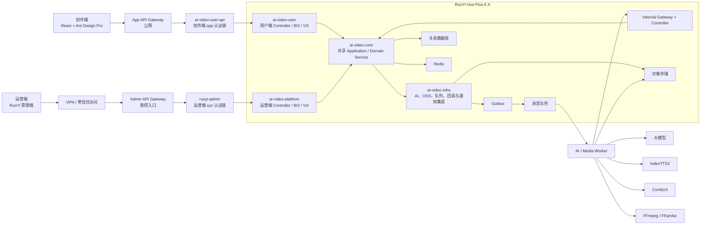
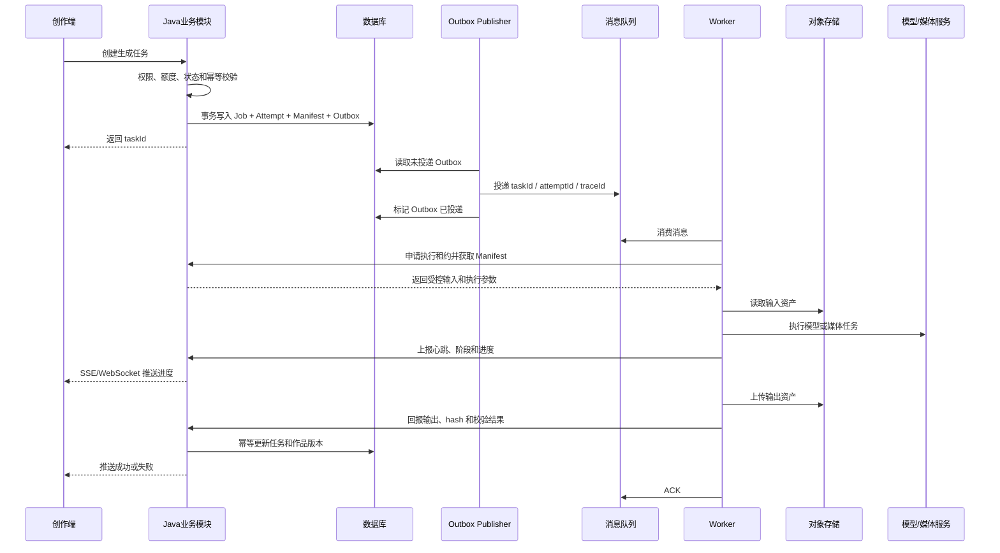
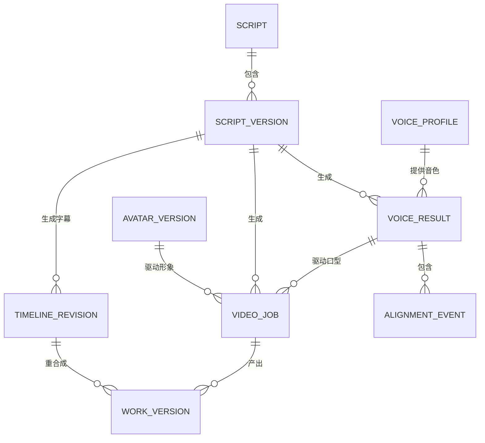

# AI 数字人视频平台产品需求文档

> 文档版本：v2.0
>
> 产品形态：创作端 + Java 业务后端 + 运营端 + AI/Media Worker
>
> 适用对象：产品、设计、前端、Java 后端、AI/媒体服务、测试、运维

## 1. 文档目标

本文件定义 AI 数字人视频平台的完整产品功能、系统边界和生产技术方案，用于指导全新开发。

核心技术决策：

| 层级 | 方案 |
| --- | --- |
| 创作前端 | React + TypeScript + Ant Design + Ant Design Pro Components |
| Java 后端 | RuoYi-Vue-Plus 6.X |
| Java 业务模块 | `ai-video-core`（共享核心业务）、`ai-video-infra`（基础设施集成）、`ai-video-user`（用户端适配）、`ai-video-platform`（运营端适配） |
| 后端启动模块 | `ai-video-user-api`（创作端 API）与 `ruoyi-admin`（运营端 API）独立部署、独立装配 |
| 运营端 | 使用 RuoYi 管理端，通过 `ruoyi-admin` 的独立运营端 API 管理数字人业务 |
| AI/媒体执行 | 独立 Worker，负责大模型、IndexTTS2、ComfyUI、FFmpeg/FFprobe |
| 业务数据 | 关系数据库 |
| 缓存与锁 | Redis |
| 媒体文件 | OSS、MinIO 或兼容 S3 的对象存储 |
| 异步任务 | 可靠消息队列 + Outbox |
| 接口合约 | SpringDoc/OpenAPI + TypeScript Client |

## 2. 产品定位

### 2.1 产品目标

用户通过填写需求、确认文案、选择形象与声音、试听克隆声音、生成数字人底片、编辑时间轴和包装，最终得到可预览、下载和持续编辑的数字人口播视频。

产品应做到：

- 没有完整文案也能开始创作；
- 先确认克隆声音，再生成耗时较长的数字人视频；
- 字幕、画中画和花字可在时间轴中独立编辑；
- 修改包装时不重新生成声音和数字人底片；
- 所有项目、素材、任务、版本和作品可持久化恢复；
- 所有模型和媒体处理均由后端内部服务完成；
- 运营人员可管理用户、项目、任务、模型、工作流和资源。

### 2.2 目标用户

- 商家和本地生活经营者；
- 知识分享和课程创作者；
- 自媒体和 IP 创作者；
- 企业内容团队；
- 负责内容、任务和模型配置的运营人员。

### 2.3 首期产品范围

- 9:16 竖屏数字人口播视频；
- AI 需求问卷；
- 多版本口播文案；
- 形象和声音资产管理；
- IndexTTS2 声音克隆；
- 数字人底片生成；
- 五轨时间轴；
- 单行字幕；
- 图片或视频画中画；
- 重点花字；
- 视频重合成；
- 作品预览和下载；
- 项目、资产、任务和作品持久化；
- 运营端管理。

### 2.4 非首期范围

- 专业非线性剪辑；
- 多机位剪辑；
- 复杂关键帧动画；
- 直播；
- 自动发布到外部平台；
- 多人实时协同编辑；
- 16:9、1:1 等多画幅批量输出；
- 在线计费和结算。

## 3. 用户角色和权限

### 3.1 创作端身份域

创作端用户与运营端用户使用不同的账号体系、认证客户端和权限模型。

| 角色 | 主要权限 |
| --- | --- |
| 个人创作用户 | 管理自己的项目、形象、声音、文案和作品 |
| 组织成员 | 在所属组织和被授权项目内进行创作 |
| 组织管理员 | 管理组织成员、项目协作和组织额度，但不能获得平台运营权限 |

创作端权限采用“登录身份 + 租户范围 + 资源所有权 + 协作授权”的组合校验：

- 用户只能访问自己、所属组织或被明确共享的资源；
- 用户 ID、组织 ID 和数据范围从服务端登录上下文获取；
- 前端传入的 `userId`、`ownerId`、`tenantId` 不能作为授权依据；
- 每次读取、修改、删除、下载、预览和任务创建都必须执行对象级权限校验；
- 列表查询必须在 Repository 或数据权限拦截层强制附加租户和用户范围；
- 仅隐藏菜单或按钮不构成权限控制。

### 3.2 运营端身份域

运营端账号由 RuoYi 的后台账号体系管理，不与创作端账号互通。

| 角色 | 主要权限 |
| --- | --- |
| 内容运营 | 查询授权范围内的项目和作品、处理内容问题、查看任务错误 |
| 任务运营 | 查看任务、取消、重试、人工补偿、查看执行阶段 |
| 模型运营 | 管理模型供应商、工作流、Prompt、默认参数、灰度和回滚 |
| 系统管理员 | 管理运营账号、角色、权限、字典、参数、存储和系统配置 |
| 审计人员 | 只读查看敏感操作、模型配置变更、资产访问和任务操作日志 |

运营端权限要求：

- 使用独立的运营账号、角色、菜单、按钮和数据权限；
- 默认最小权限，不向普通运营角色授予系统管理员能力；
- 查看用户肖像、声音、文案和作品需要单独的敏感数据权限；
- 人工重试、取消、删除、下载原始媒体和修改配置必须记录原因；
- 高风险操作需要二次确认，关键配置变更支持双人复核；
- 运营端不能绕过领域服务直接修改任务结果；
- 模型密钥、内部服务地址和对象存储凭据仅授权管理员可配置；
- 敏感值默认脱敏，查看和修改都必须审计。

### 3.3 身份和权限隔离原则

- 创作端登录主体固定为 `app_user`（创作端用户），运营端登录主体固定为 `sys_user`（运营端用户）；同名、同手机号、同邮箱或同数字编号均不构成映射关系；
- 创作端账号不能登录运营端；
- 运营端账号不能作为普通创作用户调用创作端 API；
- 两类账号即使手机号、邮箱或用户名相同，也属于不同安全主体；
- 创作端令牌由 `StpLogic("app")`（创作端登录逻辑）签发，运营端继续使用默认运营端令牌逻辑；两端使用独立客户端、权限和会话命名空间；
- 创作端 API 只接受 `app`（创作端）令牌，运营端 API 只接受 `sys_user`（运营端用户）令牌；
- 禁止通过修改 Token 中的角色、租户或用户标识提升权限；
- 服务端必须校验 Token 签名、签发方、受众、有效期、撤销状态和会话状态；
- 审计、创建和更新主体必须同时保存 `actorType`（操作者类型）与 `actorId`（操作者编号）：创作请求使用 `app_user`，运营人员管理创作资源使用 `sys_user`；禁止只保存可能串域的数字编号；
- 运营端强制多因素认证，建议仅通过 VPN、零信任网关或受控 IP 访问；
- 权限拒绝、跨租户访问、敏感媒体查看和批量导出均写入安全审计日志。

### 3.4 登录和账户安全体验

> **2026-07-30 P0-A 范围调整：** 注册页、注册接口和注册验证码场景延期；本轮仅交付既有或测试夹具预置账号的登录、找回密码和安全会话能力。

登录、找回密码和安全会话页均只调用 `ai-video-user-api` 的 `/api/auth/**`（创作端认证资源），不得调用 `ruoyi-admin` 或运营端身份接口。当前页面必须覆盖下列状态：

| 状态 | 页面行为 |
| --- | --- |
| 加载 | 初始化认证客户端、可用登录方式或安全会话列表时展示加载状态，禁止重复提交。 |
| 空 | 可用登录方式、已绑定第三方身份或安全会话列表为空时展示对应空状态和下一步指引；不得以空白区域代替，也不得误报网络失败。 |
| 验证码倒计时 | 验证码发送成功后显示剩余秒数并禁用再次发送；目标标识脱敏，倒计时结束后才允许重发。 |
| 提交中 | 登录、找回密码、修改密码、绑定或解绑操作进行中禁用重复提交并保留已填写内容。 |
| 凭据错误 | 统一显示“账号或凭据不正确”，不得区分账号不存在、密码错误或第三方身份未绑定。 |
| 账号停用 | 清理创作端会话并回到登录页；不得清理或影响同号运营端会话。 |
| 客户端不可用 | 明确提示创作端客户端不可用，不得回退使用运营端客户端。 |
| 权限不足 | 安全会话、第三方绑定或其他已登录安全资源返回无权限时显示权限不足状态，并提供返回工作台或重新登录入口；不得回退请求运营端接口。 |
| 网络失败 | 展示可重试状态并保留未提交的表单内容；不得把网络失败显示为凭据错误。 |
| 成功跳转 | 登录成功后进入服务端返回的默认个人工作区；找回密码成功后进入登录页重新认证；安全会话操作成功后留在当前页并刷新列表，当前会话失效时进入登录页。 |

## 4. 信息架构

### 4.1 创作端导航

左侧菜单：

1. 创作；
2. 形象；
3. 声音；
4. 文案；
5. 作品。

菜单布局：

- 顶部显示产品品牌标识；
- 菜单图标在上、文字在下；
- 当前菜单有明确选中状态；
- 创作页面顶部显示七步流程；
- 非创作页面不显示流程条。

### 4.2 运营端导航

运营端数字人模块包括：

1. 运营看板；
2. 用户与项目；
3. 资产管理；
4. 作品管理；
5. 任务中心；
6. 模型供应商；
7. 工作流管理；
8. Prompt 与模板；
9. 配额与限流；
10. 存储治理；
11. 操作审计；
12. 系统监控。

### 4.3 两个前端的边界

- 创作端和运营端是两个独立应用；
- 两个前端不互相调用、不互相嵌入；
- 使用不同域名，例如 `studio.example.com` 和 `admin.example.com`；
- 使用不同 Cookie 名称、Cookie Path、CSRF Token 和前端认证客户端；
- 不共享浏览器本地存储、会话 Token 或刷新 Token；
- 创作端只调用 App API；
- 运营端只调用 Admin API；
- 两类接口可以复用同一 Java Application Service 和 Domain Service；
- 两类接口必须使用不同 Controller、路由前缀、认证过滤链、权限和返回对象；
- 网关分别发布 App API 和 Admin API，Admin API 不挂载到创作端公网入口；
- CORS 只允许各自明确配置的前端域名，禁止使用通配来源和携带凭证的宽松配置。

## 5. 创作流程



### 5.1 第 1 步：说需求

#### 5.1.1 行业

预置行业：

- 电商零售；
- 教育培训；
- 餐饮美食；
- 家居装修；
- 本地生活；
- 自定义行业。

要求：

- 用户选择一个主要行业；
- 自定义行业支持文本输入；
- 后端保存行业字典版本和用户输入；
- 运营端可以启停和调整预置行业。

#### 5.1.2 视频用途

用途随行业动态变化，例如：

- 获客咨询；
- 产品或服务介绍；
- 知识分享；
- 活动宣传；
- 涨粉种草；
- 课程讲解；
- 案例分享；
- 到店引流；
- 自定义用途。

要求：

- 用户选择一个主要用途；
- 自定义用途支持文本输入；
- 行业和用途共同决定后续问卷和文案 Prompt。

#### 5.1.3 AI 自适应问卷

- 根据行业和用途生成 3–5 个问题；
- 问题逐个展示；
- 选择题支持多选；
- 短文本题支持自由输入；
- 推荐答案可以默认选中；
- 每个问题都支持补充说明；
- 用户可返回修改已回答问题；
- 修改答案后，后续未回答问题可以重新生成；
- 已回答内容必须保留版本；
- 问卷生成失败可以重试。

#### 5.1.4 目标时长

首期选项：

- 30 秒；
- 45 秒；
- 60 秒；
- 90 秒；
- 120 秒。

目标时长用于：

- 控制文案字数；
- 估算克隆声音时长；
- 选择单次或分段视频生成策略；
- 给用户展示预计生成成本和时间。

#### 5.1.5 补充要求

用户可以补充：

- 产品或服务信息；
- 目标受众；
- 核心卖点；
- 禁止出现的内容；
- 语气和风格；
- 行动号召；
- 必须保留的事实；
- 其他说明。

#### 5.1.6 生成文案

- 每次生成 3–5 个候选版本；
- 候选版本使用标签页切换；
- 显示标题、正文、字数和预估时长；
- 用户可以编辑；
- 用户可以复制；
- 用户可以选择一个版本进入下一步；
- 支持“更短”“更口语”“强化卖点”“更换开头”“强化 CTA”和自定义优化；
- 每次编辑和优化生成新的文案版本；
- 模型、Prompt、输入内容和输出内容必须可追溯。

文案规则：

- 不虚构价格、资质、数据和承诺；
- 不把镜头指令写入口播正文；
- 文案与用户提供事实保持一致；
- 多个候选版本必须在开头、结构或表达角度上有明显差异；
- 文案段落应适合声音生成和字幕切分。

### 5.2 第 2 步：确认文案

- 展示最终文案；
- 用户可以继续编辑；
- 显示字数和预估时长；
- 用户点击“确认文案”后，保存文案主体和本次确认的不可变版本；
- 确认后的文案自动进入“我的文案”列表；
- 用户明确确认后才可进入声音生成；
- 确认版本不可原地覆盖；
- 修改已确认文案会产生新版本，旧版本仍保留在历史记录中；
- 克隆声音和数字人视频必须绑定准确的文案版本，不只绑定文案主体；
- 修改文案产生新版本后，旧版本生成的声音不能用于新版本；
- 同一文案版本可以生成多个克隆声音和多个数字人视频；
- “我的文案”中需要显示该文案的克隆声音数量、数字人视频数量以及最近生成时间；
- “是否已克隆声音”和“是否已生成数字人”由真实关联数据计算，不能由前端写入布尔值；
- 用户可以从文案详情查看关联的参考声音、克隆声音、人物形象、数字人底片和最终作品；
- 用户可以从关联项跳转到“声音”或“作品”详情。

### 5.3 第 3 步：选择形象与声音

#### 5.3.1 人物形象

用户可以：

- 从“形象”功能的形象库选择已有形象；
- 在选择器中搜索、筛选和预览形象；
- 没有合适形象时，直接打开与“形象”页面共用的新增形象表单；
- 上传人物照片并填写形象名称、备注和可选标签；
- 预览照片；
- 查看名称、备注、文件名、尺寸、大小、创建时间和处理状态；
- 将当前照片设为本项目使用形象。

新增形象成功后：

- 自动保存到“我的形象”；
- 自动刷新当前选择器；
- 默认选中新上传的形象；
- 项目保存形象资产版本 ID，后续替换原图不影响已创建任务。

支持格式：

- PNG；
- JPG/JPEG；
- WebP。

校验要求：

- 文件类型和真实编码一致；
- 文件大小符合限制；
- 最短边符合要求；
- 可以正确解码；
- 人脸清晰可见；
- 不允许路径穿越、恶意文件或异常媒体；
- 校验失败返回具体原因。

#### 5.3.2 参考声音

用户可以：

- 从“声音”功能的声音库选择声音；
- 按“原声音”或“克隆声音”筛选；
- 在选择器中搜索、试听和查看声音详情；
- 没有合适声音时，直接打开与“声音”页面共用的新增声音表单；
- 上传原声音并填写声音名称、备注和可选标签；
- 播放原声音或克隆声音；
- 查看名称、备注、声音类型、文件名、时长、大小、采样率、声道和状态；
- 将选中声音设为本项目使用声音。

声音分为两类：

| 类型 | 定义 | 后续处理 |
| --- | --- | --- |
| 原声音 | 用户上传、用于提取说话人特征的参考音频 | 必须结合当前文案生成克隆声音 |
| 克隆声音 | 已根据某个准确文案版本生成的完整口播音频 | 文案版本一致时可以直接试听和确认 |

选择规则：

- 上传入口只创建原声音；
- 新上传的原声音自动保存到“我的声音”并默认选中；
- 选择克隆声音时，必须校验其绑定的文案版本与当前确认文案版本一致；
- 文案版本不一致时禁止直接使用，并提示用户选择原声音重新生成；
- 项目保存声音资产版本 ID，不能只保存文件 URL；
- 克隆声音详情需要显示来源原声音和来源文案版本。

支持格式：

- WAV；
- MP3；
- M4A；
- FLAC。

校验要求：

- 文件类型和真实编码一致；
- 时长符合配置范围；
- 人声可以正常解码；
- 采样率和声道符合处理要求；
- 提示背景噪声、多人说话、音量异常或静音问题；
- 校验失败返回具体原因。

#### 5.3.3 上传和处理

- 前端先向 Java 申请上传凭证；
- 文件直接上传对象存储；
- 上传完成后调用 Java 完成接口；
- Java 校验对象是否存在、大小、hash 和类型；
- 需要人脸检测、缩略图、音频标准化等处理时，Java 创建资产处理任务；
- 资产处理成功后才进入可用状态。

### 5.4 第 4 步：生成并确认克隆声音

#### 5.4.1 使用原声音

创建条件：

- 已确认文案；
- 已选择可用原声音；
- 文案和原声音属于当前用户或组织；
- 用户额度和系统并发允许创建任务。

生成和试听流程：

- 创建声音任务；
- 显示排队、校验、生成、输出校验和完成阶段；
- 显示百分比和预计等待；
- 支持取消；
- 支持失败重试；
- 生成完成后展示可拖动播放头的音频波形时间轴；
- 波形时间轴显示文案对齐事件节点；
- 播放时自动滚动到当前事件，并为正在播放的字词或短句增加背景色；
- 点击文案事件可以跳转到对应音频时间；
- 拖动播放头后，文案高亮同步更新；
- 支持试听完整克隆音频；
- 显示音频时长和生成参数摘要；
- 用户可以在当前页面修改文案；
- 修改后保存为新的文案版本，并自动更新“我的文案”；
- 文案修改后，当前克隆声音立即标记为与当前版本不匹配；
- 用户需要使用新文案版本重新生成克隆声音；
- 用户确认满意版本后，将该克隆音频发布为正式声音资产；
- 正式声音资产自动进入“我的声音”，类型为“克隆声音”；
- 新声音资产记录来源原声音、来源文案版本和生成任务；
- 重试产生新的 attempt 和新的声音结果；
- 已确认结果可以被新结果替代，但历史记录保留。

#### 5.4.2 使用已有克隆声音

- 不再调用声音克隆服务；
- 直接展示音频波形、文案事件和试听控制；
- 播放时同样高亮当前文案字词或短句；
- 用户确认后可以进入数字人视频生成；
- 如果克隆声音与当前文案版本不一致，禁止确认；
- 用户修改文案后必须返回原声音模式重新生成，不能修改已有克隆音频的绑定文案。

#### 5.4.3 文案和音频对齐

- 声音生成任务同时输出字词级或短句级时间戳；
- 优先使用模型对齐结果，必要时调用独立强制对齐服务；
- 每个事件至少包含开始时间、结束时间、文本和文案位置；
- 对齐失败时允许试听，但不能进入字幕自动生成和最终确认；
- 对齐事件作为独立版本保存，重试不能覆盖历史结果；
- 波形、文案高亮和后续字幕都使用同一份对齐数据。

#### 5.4.4 业务规则

- 视频只能使用已确认的声音结果；
- 声音结果与文案版本精确绑定；
- 文案改变后，原声音结果不能继续用于新视频；
- 声音生成成功不等于已确认；
- 试听确认状态独立于声音任务状态；
- 克隆音频作为独立资产进入对象存储；
- 一个文案版本可以关联多个声音结果，其中最多一个作为项目当前确认声音；
- 一个克隆声音可以被多个数字人视频版本引用；
- 被数字人视频引用的克隆声音不能直接物理删除。

### 5.5 第 5 步：生成数字人底片

创建条件：

- 已确认文案版本；
- 已选择可用人物形象；
- 已确认克隆声音；
- 克隆声音绑定的文案与当前文案一致；
- 输入资产均可访问；
- 用户额度和队列容量允许创建任务。

底片内容：

- 数字人画面；
- 已确认克隆声音；
- 不包含字幕；
- 不包含画中画；
- 不包含花字。

任务能力：

- 创建底片任务；
- 展示排队和生成阶段；
- 展示进度、已用时间和错误；
- 支持取消；
- 支持失败重试；
- 支持服务重启后恢复查询；
- 支持生成完成通知；
- 支持预览底片。

生成要求：

- 人物身份、服装、背景和构图尽量稳定；
- 镜头正对人物；
- 镜头固定；
- 人物动作自然且幅度合理；
- 口型与声音同步；
- 不生成字幕和额外文字；
- 长视频可以采用单次或分段策略；
- 分段生成时保持人物和镜头连续；
- 输出必须通过视频轨、音频轨、时长、codec 和完整性校验。

底片作为不可变资产保存。任何字幕或包装重合成都不能覆盖底片。

### 5.6 第 6 步：时间轴编辑与重合成

#### 5.6.1 轨道

| 轨道 | 内容 | 编辑能力 |
| --- | --- | --- |
| V1 视频 | 数字人底片 | 预览、裁切可用区间、锁定、隐藏 |
| A1 声音 | 已确认克隆声音 | 波形、音量、静音、淡入淡出 |
| S1 字幕 | 根据对齐事件生成的字幕片段 | 显示开关、文本、时间和样式 |
| V2 图片/视频 | 图片、视频和画中画片段 | 素材、时间、显示模式、位置、缩放 |
| T1 自定义文本 | 普通文本框和花字 | 文本、时间、位置、尺寸、样式和特效 |

V1 和 A1 默认编组锁定，防止拖动后造成口型与声音错位。用户可以编辑两条轨道的允许属性，但不能单独移动其中一条；需要裁切时必须同步裁切。

#### 5.6.2 通用时间轴

- 显示时间刻度和播放头；
- 视频播放与播放头同步；
- 画布、所有轨道、波形和字幕事件共用同一个播放时间；
- 每种媒体使用独立轨道行，不能把多种媒体混在一个片段中；
- 支持横向滚动和缩放；
- 支持拖动片段；
- 支持拖动片段左右边缘；
- 支持精确输入开始时间和结束时间；
- 选中片段后显示对应属性面板；
- 支持轨道显示、隐藏、锁定和静音；
- 支持同类型多片段；
- 支持片段复制、删除和调整层级；
- 支持片段吸附；
- 支持撤销和重做；
- 支持保存草稿；
- 支持时间轴版本；
- 多设备编辑发生冲突时提示用户；
- 使用版本号或 ETag 防止覆盖新版本。

#### 5.6.3 字幕 S1

- 根据文案和确认音频生成初始字幕；
- 使用声音确认阶段保存的音频对齐事件，不按字符比例估算；
- 用户可以控制整条字幕轨是否显示；
- 用户可以逐条修改文本；
- 用户可以调整起止时间；
- 支持新增、删除、拆分和合并；
- 用户可以设置字体、字号、颜色、字重、描边、阴影和背景；
- 字幕强制单行显示；
- 字幕显示时不保留中文或英文标点；
- 原标点位置作为分句边界，必要时转换为空格；
- 字幕按实际字体、字号、画布宽度和安全区进行像素级测量；
- 单条字幕超过可用宽度时，在不丢字的前提下切分为多个连续字幕片段；
- 当前行放不下的文字顺延到下一片段，并与下一句可用文字重新排版；
- 下一片段仍超宽时继续顺延，直到所有文字都被完整安排；
- 优先在词语、短句和原标点边界切分，避免从词语中间截断；
- 切分后的时间根据字词对齐事件重新计算，不平均猜测时间；
- 不使用省略号隐藏溢出文字；
- 字幕不得溢出画面；
- 左右保留可配置安全边距，默认不小于画布宽度的 5%；
- 底部保留安全区域；
- 字号过大导致最小语义单元仍无法放入时，阻止保存并提示减小字号；
- 相邻字幕默认不重叠；
- 修改字幕只修改字幕显示文本，不反向修改已确认声音；
- 预览阶段允许逐条纠错，修改立即反映在画布和时间轴中；
- 预览效果与最终合成一致；
- 首期提供简洁清晰的字幕样式；
- 用户输入必须转义，防止字幕指令注入。

#### 5.6.4 图片和视频 V2

AI 可以为文案推荐：

- 出现时间；
- 素材类型；
- 素材提示；
- 推荐原因；
- 高亮关键词。

用户可以：

- 上传多个图片或视频；
- 为每个素材独立设置开始和结束时间；
- 通过拖动片段左右边缘设置图片显示多少秒；
- 通过精确输入设置开始时间、结束时间或显示时长；
- 为每个素材选择“全画面插图”或“画中画”显示模式；
- 为每个素材独立设置位置、尺寸、缩放、旋转、透明度和裁切方式；
- 使用左上、右上、左下、右下位置预设；
- 在视频画布中自由拖拽和缩放；
- 预览所有画中画素材；
- 删除、替换或重新排序素材。

显示模式：

| 模式 | 效果 |
| --- | --- |
| 全画面插图 | 图片或视频成为当前时段主画面，数字人可按配置缩小到四角 |
| 画中画 | 数字人底片保持主画面，图片或视频作为可定位的叠加层 |

图片和视频规则：

- 图片按设定区间持续显示；
- 视频从片段开始时间播放一次；
- 视频不循环；
- 视频默认按素材原生时长显示；
- 用户缩短视频片段时执行裁切，不能通过倍速压缩时长；
- 用户延长视频片段超过素材原生时长时阻止保存，除非明确开启定格尾帧；
- 不得超出主视频结束时间；
- 与视频画面边缘保持安全距离；
- 画中画素材默认与画布边缘保持不小于画布宽度 3% 的距离；
- 自由拖拽时自动吸附到安全边界；
- 素材的可视边界不能超出视频画布；
- 全画面插图模式下，数字人可以选择左上、右上、左下或右下；
- 数字人缩小后与画面边缘保持安全距离；
- 数字人卡片不得超出画面；
- 同一时间多个画中画发生冲突时给出提示。

#### 5.6.5 自定义文本 T1

- 用户可以添加多个自定义文本框；
- 每个文本框在 T1 轨道中生成独立片段；
- 用户可以设置开始时间、结束时间和显示秒数；
- 用户可以设置文字内容、字体、字号、颜色、字重和对齐方式；
- 用户可以设置文本框背景、圆角、内边距、描边、阴影和透明度；
- 用户可以设置进入、强调和退出特效；
- 特效使用平台白名单，预览和最终合成使用同一参数；
- 用户可以在画布中将文本框拖拽到任意安全位置；
- 用户可以通过控制点调整文本框大小、旋转和缩放；
- 自定义文本框不能超出画布，拖拽时吸附安全边界；
- 文本框支持普通文本和花字模板；
- AI 可以推荐多个重点词或短句，用户可以多选后创建花字；
- 运营端可以配置字体、花字和动效模板；
- 预览按真实时间显示；
- 支持复制、删除、替换和调整层级。

#### 5.6.6 重合成

- 保存时间轴后创建重合成任务；
- 重合成只处理字幕、图片/视频和自定义文本；
- 不重新调用声音克隆；
- 不重新调用数字人生成；
- Worker 从对象存储读取底片和包装素材；
- Worker 使用 FFmpeg/FFprobe 合成和校验；
- 成功后创建新的作品版本；
- 失败时保留上一成功版本；
- 重试创建新的 attempt；
- 重合成不能覆盖底片和确认声音。

### 5.7 第 7 步：预览与下载

- 播放最终作品；
- 显示人物、声音、文案、时间轴和包装版本；
- 显示视频时长、分辨率、大小和创建时间；
- 可返回时间轴继续编辑；
- 可选择历史作品版本；
- 可设置作品名称和封面；
- 可下载 MP4；
- 下载前进行权限校验；
- 下载使用短时签名 URL；
- 用户可以新建另一个项目；
- 新建项目不清空资产库和历史作品。

## 6. 资产与内容页面

### 6.1 形象

- 卡片列表；
- 真实缩略图；
- 添加形象；
- 新增时填写名称、备注和可选标签；
- 批量上传；
- 预览原图；
- 查看分辨率和状态；
- 重命名；
- 标签；
- 搜索；
- 分页；
- 选择当前使用项；
- 软删除；
- 恢复；
- 彻底删除；
- 查看被哪些项目引用。

### 6.2 声音

- 普通行列表；
- 声音名称；
- 备注；
- 类型：原声音或克隆声音；
- 文件名；
- 时长；
- 大小；
- 创建时间；
- 使用状态；
- 播放参考声音；
- 播放克隆声音结果；
- 克隆声音显示来源原声音；
- 克隆声音显示来源文案和文案版本；
- 显示被哪些数字人视频和作品引用；
- 查看声音生成历史；
- 重命名；
- 编辑备注；
- 标签；
- 搜索；
- 按声音类型和使用状态筛选；
- 分页；
- 软删除；
- 恢复；
- 查看被哪些项目引用。

### 6.3 文案

- 普通行列表；
- 标题；
- 摘要；
- 字数；
- 预估时长；
- 创建时间；
- 是否已克隆声音；
- 克隆声音数量；
- 是否已生成数字人；
- 数字人视频数量；
- 最近生成时间；
- 查看版本；
- 编辑为新版本；
- 复制；
- 搜索；
- 标签；
- 分页；
- 软删除；
- 查看关联项目和作品；
- 查看每个版本关联的原声音、克隆声音、形象、数字人底片和最终作品；
- 关联列表支持跳转到声音、作品或项目详情。

### 6.4 作品

- 卡片列表；
- 真实封面；
- 作品名称；
- 生成状态；
- 进度；
- 时长；
- 分辨率；
- 文件大小；
- 创建时间；
- 项目和版本；
- 关联文案及文案版本；
- 关联人物形象；
- 关联克隆声音；
- 预览；
- 下载；
- 重命名；
- 搜索；
- 筛选；
- 分页；
- 历史版本；
- 软删除；
- 恢复；
- 彻底删除。

## 7. AI 内容能力

### 7.1 能力列表

- 自适应问卷；
- 问卷继续追问；
- 多版本口播文案；
- 文案优化；
- 画中画建议；
- 花字建议；
- 字幕初始分段；
- 内容风险提示。

### 7.2 模型调用要求

- 模型供应商通过适配层接入；
- 不在业务代码中硬编码供应商；
- Prompt 必须版本化；
- 请求和响应必须保存必要的审计元数据；
- 结构化结果必须使用 Schema 校验；
- 模型返回无效结构时按策略重试；
- 不把模型原始异常直接返回用户；
- 模型调用必须有超时、限流和熔断；
- 支持供应商切换和灰度；
- 记录模型、耗时、token、错误分类和成本。

## 8. 运营端功能

### 8.1 运营看板

- 新增用户；
- 活跃用户；
- 创建项目数；
- 文案生成量；
- 声音任务量；
- 视频任务量；
- 重合成任务量；
- 成功率；
- 平均排队时间；
- 平均执行时间；
- 下载率；
- 模型调用量；
- 存储占用；
- GPU 任务和队列深度。

### 8.2 用户与项目

- 按用户、组织、时间和状态查询；
- 查看项目步骤和版本；
- 查看文案、形象、声音、时间轴和作品；
- 冻结异常项目；
- 处理删除申请；
- 查看用户额度；
- 所有敏感查看操作记录审计。

### 8.3 任务中心

- 查询任务；
- 查看任务类型和业务 ID；
- 查看 attempt；
- 查看阶段、进度和耗时；
- 查看脱敏错误；
- 查看 Worker、模型和工作流版本；
- 取消任务；
- 重试任务；
- 人工补偿；
- 查看事件时间线；
- 查看死信任务；
- 按错误分类统计。

### 8.4 模型供应商

- 配置大模型；
- 配置 IndexTTS2；
- 配置 ComfyUI；
- 配置媒体 Worker；
- 配置地址、超时、并发和健康检查；
- 密钥加密保存；
- 密钥默认脱敏；
- 配置变更审计；
- 支持启停、灰度和回滚。

### 8.5 工作流管理

- 管理工作流名称和版本；
- 管理 ComfyUI workflow ID；
- 管理模型版本；
- 管理默认 Prompt；
- 管理随机种子策略；
- 管理单次和分段策略；
- 管理连续性参数；
- 配置可用状态；
- 灰度发布；
- 回滚；
- 查看使用该版本的任务。

### 8.6 Prompt 与模板

- 问卷 Prompt；
- 文案 Prompt；
- 文案优化 Prompt；
- 镜头约束 Prompt；
- 画中画建议模板；
- 花字模板；
- 字幕样式；
- 版本、启停、灰度和回滚；
- 变更前后对比；
- 操作日志。

### 8.7 配额与限流

- 用户并发数；
- 组织并发数；
- 文案调用额度；
- 声音时长额度；
- 视频时长额度；
- 存储额度；
- 单文件限制；
- 队列优先级；
- 超额提示；
- 人工调整；
- 配额操作审计。

### 8.8 存储治理

- 原始上传；
- 标准化媒体；
- 克隆音频；
- 数字人底片；
- 包装中间文件；
- 最终作品；
- 孤儿对象；
- 软删除对象；
- 保留期；
- 清理计划；
- 存储水位；
- 清理结果和失败记录。

## 9. 技术架构

### 9.1 总体架构



### 9.2 创作前端

技术栈：

- React；
- TypeScript；
- Ant Design；
- Ant Design Pro Components；
- React Router；
- TanStack Query；
- Zustand 或同类轻量状态库；
- OpenAPI TypeScript Client。

职责：

- 页面和交互；
- 表单校验；
- 播放器和时间轴交互；
- 服务端数据查询与缓存；
- 展示任务进度；
- 使用 Java 签发的对象存储地址上传和下载。

禁止：

- 保存模型密钥；
- 保存内部服务地址；
- 直接调用大模型；
- 直接调用 IndexTTS2；
- 直接调用 ComfyUI；
- 在浏览器执行正式 FFmpeg；
- 把浏览器状态作为项目和任务唯一存储。

### 9.3 Java 业务模块

模块：

```text
ai-video-api/
├── ai-video-user-api/      # 创作端启动、配置与用户端接口装配
├── ruoyi-admin/            # 运营端启动、配置与运营端接口装配
└── ruoyi-modules/
    └── ai-video/
        ├── ai-video-core/      # 共享 Entity、RuoYi Service、Mapper、状态规则与聚合平级 dto
        ├── ai-video-infra/     # 外部 AI、OSS、队列、回调与通知的直接技术集成
        ├── ai-video-user/      # 用户端 Controller、BO、VO、app 权限入口
        └── ai-video-platform/  # 运营端 Controller、BO、VO、sys 权限入口
```

部署边界：

- `ai-video-user` 与 `ai-video-platform` 都只能依赖 `ai-video-core`，彼此不得直接依赖；AI 视频业务专属的稳定跨模块 DTO 位于 `ai-video-core` 对应聚合的平级 `dto` 包，不得迁入全局 `ruoyi-api`；`ai-video-infra` 只提供直接技术集成、实现核心声明的 RuoYi Service 契约或消费核心 DTO，不依赖任一端侧接口对象；
- 创作端 Controller、BO、VO 和 `type = app`（创作端类型）权限入口只属于 `ai-video-user`/`ai-video-user-api`；运营端 Controller、BO、VO 和 `sys_user`（运营端用户）权限入口只属于 `ai-video-platform`/`ruoyi-admin`，不得共用；
- 创作端 API 与运营端 API 可以在同一代码仓库复用 `ai-video-core` 领域代码；
- 生产环境建议作为两个独立 Java 进程或至少两个独立网关入口部署；
- 两个入口使用不同认证过滤链、Token audience、Cookie、限流策略和数据库账号；
- App API 数据库账号只拥有创作业务所需权限；
- Admin API 数据库账号不获得绕过领域状态机直接修改结果文件的能力；
- Internal API 使用第三个独立入口和服务身份，不发布到公网；
- 共享领域代码不等于共享登录态或共享接口权限。
- 后端业务对象采用 RuoYi 的贫血 Entity（实体）加 Service（业务服务）编排，标准业务包只能是 `domain`、与其平级的 `dto`、`mapper`、`service`、`service.impl`；端侧 HTTP 模块另可使用 `domain.bo`、`domain.vo`、`controller`，共享核心无 HTTP（超文本传输协议）入口时省略 BO、VO 和 Controller。`dto` 只承载稳定数据契约，不是业务编排层。禁止以 DDD（领域驱动设计）、Clean Architecture（整洁架构）或 Hexagonal Architecture（六边形架构）创建 `application`、`port`、`adapter`、`command`、`model` 等平行业务层。

Java 负责：

- 用户认证和权限；
- 资源所有权；
- 项目和版本；
- 资产元数据；
- 文案版本；
- 声音确认；
- 时间轴版本；
- 任务创建和状态机；
- Outbox；
- 消息派发；
- Worker 回调；
- 幂等；
- 取消和重试；
- 通知；
- 运营端查询；
- 审计；
- 对象存储签名。

Java 不负责：

- 执行模型推理；
- 在 Web 请求线程中等待完整生成；
- 直接运行 FFmpeg；
- 扫描 GPU；
- 保存大文件二进制；
- 把 Redis 当作任务唯一数据源。

### 9.4 AI/Media Worker

Worker 负责：

- 消费任务消息；
- 获取执行清单；
- 租赁任务执行权；
- 下载或读取受控输入资产；
- 调用大模型；
- 调用 IndexTTS2；
- 调用 ComfyUI；
- 轮询外部模型任务；
- 执行 FFmpeg/FFprobe；
- 上传输出资产；
- 回报进度；
- 回报结果；
- 响应取消；
- 上报心跳和运行指标。

Worker 禁止：

- 扫描 Java 业务数据库寻找待执行任务；
- 直接修改 Java 业务表；
- 拥有 Java 业务数据库账号；
- 自行创建业务项目、作品或确认记录；
- 把本地临时文件视为最终结果；
- 接受用户提供的任意 URL 并下载；
- 向浏览器暴露模型地址、文件路径和错误堆栈。

Worker 实现语言不在产品需求中锁死。可以复用成熟的 Python 模型和媒体处理代码，也可以按服务能力拆分不同语言的 Worker。

### 9.5 对象存储

- 原始文件和生成文件统一进入对象存储；
- 数据库只保存对象 key、hash、大小、媒体元数据和版本；
- 前端使用短时签名 URL；
- Worker 使用服务身份或内部签名访问；
- 不返回永久公开地址；
- 不在任务中依赖用户浏览器签名长期有效；
- 支持软删除、引用计数、保留期和物理清理。

## 10. Java 与 Worker 协作

### 10.1 核心结论

Worker 不扫描 Java 业务数据库。

采用“Java 创建任务、可靠投递、Worker 消费、Internal API 回报”的模式：

1. Java 是业务状态唯一写入方；
2. Worker 是无业务所有权的执行方；
3. 消息队列负责分发；
4. Outbox 保证数据库事务和消息投递一致；
5. Internal API 负责执行清单、心跳、进度、结果和取消协作；
6. Java 补偿调度器负责扫描未投递 Outbox 和超时任务；
7. Worker 只消费队列和管理自己的执行上下文。

### 10.2 创建人物形象示例

用户上传人物照片时：

1. 创作端调用 Java 申请上传；
2. Java 校验权限并签发对象存储上传地址；
3. 创作端把照片上传对象存储；
4. 创作端调用 Java 完成上传；
5. Java 校验对象、hash、大小和类型；
6. Java 创建人物资产记录；
7. 如果不需要额外处理，资产直接进入可用状态；
8. 如果需要人脸检测、缩略图或标准化，Java 在同一事务中创建资产处理任务和 Outbox；
9. Outbox Publisher 把任务投递到消息队列；
10. Worker 消费任务并处理；
11. Worker 把缩略图和标准化结果上传对象存储；
12. Worker 调用 Internal API 回报结果；
13. Java 更新人物资产状态。

因此，“创建人物”由 Java 完成；Worker 只处理需要计算的部分，不扫库创建人物。

### 10.3 生成任务时序



### 10.4 任务消息

队列消息只包含最小信息：

```json
{
  "taskId": "业务任务ID",
  "attemptId": "执行尝试ID",
  "taskType": "VOICE_GENERATE",
  "traceId": "链路追踪ID",
  "eventVersion": 1
}
```

完整输入由 Java 保存为不可变 Execution Manifest。Worker 获得执行租约后通过 Internal API 获取。

Execution Manifest 至少包括：

- 任务类型；
- 文案版本；
- 人物资产版本；
- 声音资产或声音结果版本；
- 时间轴版本；
- 输入对象 key；
- 输出对象前缀；
- 模型供应商；
- 模型版本；
- Workflow 版本；
- Prompt 版本；
- 随机种子；
- 关键生成参数；
- 超时时间；
- 回调协议版本。

### 10.5 执行租约

- Worker 消费消息后先申请租约；
- Java 使用任务状态、attempt 和租约版本判断是否允许执行；
- 同一 attempt 同时只能有一个有效租约；
- Worker 定期发送心跳续租；
- 租约超时后 Java 可创建补偿任务或新的 attempt；
- 旧 Worker 的迟到回调因租约版本不一致而被拒绝；
- Worker 重复消费同一消息不会重复执行已完成任务。

### 10.6 进度和结果回报

进度事件包括：

- taskId；
- attemptId；
- 租约版本；
- 事件序号；
- 阶段；
- 百分比；
- Worker ID；
- 外部任务 ID；
- 时间戳；
- 脱敏说明。

结果事件包括：

- 结果状态；
- 输出对象 key；
- 文件 hash；
- 文件大小；
- 媒体时长；
- 分辨率；
- codec；
- 校验结果；
- 错误分类；
- 可重试标记。

Java 处理要求：

- 验证服务身份和签名；
- 验证时间戳和防重放；
- 验证租约和 attempt；
- 按事件序号幂等处理；
- 保存任务事件；
- 更新稳定的产品阶段；
- 发布 SSE/WebSocket 事件；
- 成功时事务性创建结果资产和作品版本。

### 10.7 取消

1. 用户调用 Java 取消接口；
2. Java 把任务更新为 `CANCEL_REQUESTED`；
3. Java 投递取消命令；
4. Worker 停止尚未开始的任务，或尝试取消外部模型任务；
5. Worker 回报取消结果；
6. Java 根据真实执行状态收敛为 `CANCELLED`、`SUCCEEDED` 或 `FAILED`；
7. 用户取消请求和最终结果都保留记录。

不得在收到取消请求时立即假定远端已经停止。

### 10.8 重试

- 每次重试创建新的 attempt；
- 原 attempt 保持不可变；
- 默认复用相同输入 Manifest；
- 用户改变输入时必须创建新的业务任务；
- 可按错误分类决定是否自动重试；
- 参数错误和内容拒绝不自动重试；
- 网络、临时 5xx、Worker 崩溃可以自动重试；
- 达到上限后进入失败或死信；
- 运营端人工重试必须记录操作日志。

### 10.9 补偿和对账

由 Java 调度器执行：

- 扫描未投递 Outbox；
- 扫描长时间未续租任务；
- 扫描长时间无进度任务；
- 核对 Worker 和外部任务状态；
- 重新投递可恢复任务；
- 标记不可恢复任务；
- 清理孤儿输出；
- 发送运营告警。

Worker 不扫描 Java 业务表。Worker 只处理消息队列、当前租约和自己的临时执行目录。

### 10.10 消息语义

- 消息队列采用至少一次投递；
- 不依赖“恰好一次”；
- 通过 taskId、attemptId、租约和事件序号实现业务幂等；
- Worker 成功上传输出并完成回调后再 ACK；
- Worker 崩溃未 ACK 时消息可以重新投递；
- 重复消息不能产生多个作品版本；
- 无法处理的消息进入死信队列。

## 11. API 设计

### 11.1 API 分区

| 分区 | 前缀 | 调用方 |
| --- | --- | --- |
| 创作端认证与会话 API | `/api/auth/**` | 创作端 |
| 创作端工作台 API | `/api/studio/**` | 创作端 |
| 运营端 API | `/api/admin/**` | 运营端 |
| Internal API | `/internal-api/digital-human/v1/**` | Worker 和内部服务 |

### 11.2 创作端 API

资源：

- `/projects`；
- `/project-versions`；
- `/requirements`；
- `/questionnaires`；
- `/scripts`；
- `/scripts/{id}/versions`；
- `/scripts/{id}/relations`；
- `/uploads`；
- `/assets`；
- `/avatar-assets`；
- `/voice-assets`；
- `/voice-jobs`；
- `/voice-results`；
- `/voice-results/{id}/alignment-events`；
- `/video-jobs`；
- `/timelines`；
- `/recompose-jobs`；
- `/works`；
- `/notifications`；
- `/tasks/{id}/events`。

要求：

- 强制登录；
- 只接受 `StpLogic("app")` 签发的创作端令牌和创作端认证客户端；
- 资源所有权校验；
- 所有查询从登录上下文注入用户和租户范围；
- 忽略或拒绝客户端传入的资源所有者字段；
- 创建任务支持 `Idempotency-Key`；
- 修改版本资源支持 version 或 ETag；
- 返回统一错误码和 requestId；
- 不返回内部服务地址；
- 不返回数据库实体；
- 不返回运营端字段；
- 分页、排序和筛选统一。

### 11.3 运营端 API

资源：

- `/dashboard`；
- `/users`；
- `/projects`；
- `/assets`；
- `/works`；
- `/jobs`；
- `/job-attempts`；
- `/providers`；
- `/workflows`；
- `/prompts`；
- `/templates`；
- `/quotas`；
- `/storage`；
- `/audit-logs`；
- `/metrics`。

要求：

- 使用 RuoYi 权限标识；
- 只接受 `sys_user`（运营端用户）令牌和运营端认证客户端；
- 强制多因素认证和短时会话；
- 使用数据权限；
- 操作型接口记录日志；
- 敏感配置脱敏；
- 人工重试、取消和删除必须填写原因；
- 不允许直接修改成功作品的底层对象 key；
- 不允许绕过任务状态机；
- 运营端 API 不接受创作端令牌，也不能使用创作端刷新令牌换取运营端令牌。

### 11.4 Internal API

建议接口：

- `POST /tasks/{id}/lease`；
- `POST /tasks/{id}/heartbeat`；
- `GET /tasks/{id}/manifest`；
- `POST /tasks/{id}/events`；
- `POST /tasks/{id}/complete`；
- `POST /tasks/{id}/fail`；
- `POST /tasks/{id}/cancel-result`；
- `GET /assets/{id}/access`；
- `POST /artifacts/register`；
- `GET /health/config`。

要求：

- 仅内网开放；
- 服务身份认证；
- 每类 Worker 使用独立服务账号和最小权限；
- 请求签名；
- 时间戳；
- nonce；
- 防重放；
- 来源限制；
- 协议版本；
- 幂等；
- 独立限流；
- 不使用普通用户登录态。

## 12. 数据模型

身份数据与数字人业务数据分层：

| 数据域 | 主要数据 | 访问方 |
| --- | --- | --- |
| 创作端身份域 | `app_user`、`app_role`、`app_user_role`、`app_org_member`、创作端会话 | App API 认证与授权服务 |
| 运营端身份域 | RuoYi `sys_user`、`sys_role`、`sys_user_role`、运营端会话 | Admin API 认证与授权服务 |
| 数字人业务域 | 项目、文案、形象、声音、任务、时间轴和作品 | 数字人领域服务 |
| 安全审计域 | 登录、越权拒绝、敏感访问、导出和配置变更记录 | 审计服务和审计人员 |

创作端身份表不得复用 RuoYi `sys_user`。两个身份域使用不同会话、角色、权限编码和认证客户端。

| 数据表 | 主要内容 |
| --- | --- |
| `dh_project` | 项目、所有者、当前步骤、状态 |
| `dh_project_version` | 项目草稿和不可变版本 |
| `dh_asset` | 资产类型、所有者、状态、当前版本 |
| `dh_asset_version` | 对象 key、hash、媒体元数据 |
| `dh_asset_reference` | 项目和作品对资产的引用 |
| `dh_script` | 文案主体 |
| `dh_script_version` | 候选、编辑、确认、模型和 Prompt |
| `dh_script_relation` | 文案版本与原声音、克隆声音、形象、视频和作品的关系 |
| `dh_voice_profile` | 用户上传的原声音、名称、备注、标签和当前资产版本 |
| `dh_voice_job` | 声音业务任务 |
| `dh_voice_result` | 克隆音频、来源原声音、文案版本和确认状态 |
| `dh_audio_alignment` | 声音结果的对齐版本和对齐状态 |
| `dh_audio_alignment_event` | 字词或短句的开始时间、结束时间和文案位置 |
| `dh_video_job` | 数字人底片任务及文案、形象版本、克隆声音版本引用 |
| `dh_timeline` | 项目时间轴 |
| `dh_timeline_revision` | 时间轴版本 |
| `dh_timeline_clip` | V1、A1、S1、V2、T1 片段及布局、样式和特效参数 |
| `dh_recompose_job` | 包装重合成任务 |
| `dh_work` | 作品主体 |
| `dh_work_version` | 不可变作品版本 |
| `dh_job` | 统一任务索引 |
| `dh_job_attempt` | 每次执行尝试 |
| `dh_job_event` | 阶段、进度和错误事件 |
| `dh_execution_manifest` | 不可变执行输入 |
| `dh_worker_lease` | Worker 执行租约 |
| `dh_outbox_event` | 可靠任务和通知事件 |
| `dh_provider_config` | 模型供应商配置 |
| `dh_workflow_version` | 工作流和模型参数版本 |
| `dh_prompt_version` | Prompt 版本 |
| `dh_quota` | 用户和组织额度 |
| `dh_operation_audit` | 运营操作和敏感访问 |

数据原则：

- 业务状态以数据库为准；
- 创作端身份与运营端身份不得通过同一用户主键隐式关联；
- 所有数字人业务表包含明确的租户或所有者字段；
- 用户和租户范围由服务端注入，不从请求 DTO 直接落库；
- Redis 不是唯一存储；
- 任务输入不可变；
- 重试产生新 attempt；
- 结果产生新资产版本；
- 底片、克隆声音和最终作品相互独立；
- 文案的克隆声音数量和数字人视频数量通过关联记录计算；
- 不保存由前端维护的“是否已生成”真假值作为事实来源；
- 软删除和物理删除分离；
- 所有跨表发布操作使用事务；
- 任务派发使用 Outbox；
- 重要状态变化写入事件表。

### 12.1 文案、声音和视频关系



关系规则：

- 同一个 `dh_script` 可以有多个版本；
- 同一个文案版本可以使用不同原声音生成多个克隆声音；
- 同一个克隆声音可以结合不同人物形象生成多个数字人视频；
- 每个数字人视频任务必须同时记录文案版本、形象资产版本和克隆声音结果；
- 每个最终作品版本必须可以反查数字人底片、时间轴版本、文案版本和克隆声音；
- 文案列表中的关联状态按用户有权访问且未物理删除的关系计算；
- 删除文案、声音或形象前必须检查引用，已有作品引用时只能软删除或解除后续使用；
- 编辑文案生成新版本时不继承原版本关联，避免把原版本声音错误标记为新文案结果。

## 13. 任务状态

### 13.1 统一任务状态

```text
CREATED
  -> QUEUED
  -> VALIDATING
  -> RUNNING
  -> OUTPUT_VALIDATING
  -> SUCCEEDED

QUEUED / VALIDATING / RUNNING / OUTPUT_VALIDATING -> FAILED
QUEUED / VALIDATING / RUNNING / OUTPUT_VALIDATING
  -> CANCEL_REQUESTED -> CANCELLING -> CANCELLED
```

### 13.2 任务类型

- `ASSET_PROCESSING`；
- `QUESTIONNAIRE_GENERATE`；
- `SCRIPT_GENERATE`；
- `SCRIPT_OPTIMIZE`；
- `PACKAGING_ADVICE`；
- `VOICE_GENERATE`；
- `VIDEO_GENERATE`；
- `TIMELINE_RECOMPOSE`；
- `THUMBNAIL_GENERATE`；
- `ARTIFACT_CLEANUP`。

### 13.3 声音确认状态

声音任务成功和用户确认必须分开：

```text
PENDING_CONFIRMATION -> CONFIRMED
PENDING_CONFIRMATION / CONFIRMED -> SUPERSEDED
```

只有 `CONFIRMED` 的声音结果可以用于数字人视频任务。

## 14. 文件和媒体

### 14.1 上传

- Java 签发上传凭证；
- 浏览器直传对象存储；
- 上传凭证限制对象前缀、大小、类型和有效期；
- 完成上传时校验对象元数据；
- 使用媒体探测确认真实格式；
- 对可疑文件执行安全检查；
- 上传失败支持重新申请凭证；
- 未完成上传定期清理。

### 14.2 媒体资产类型

- 人物原图；
- 人物缩略图；
- 人物标准化图片；
- 参考声音；
- 标准化参考声音；
- 克隆声音；
- 数字人底片；
- 画中画图片；
- 画中画视频；
- 字幕文件；
- 包装中间文件；
- 作品；
- 作品封面。

### 14.3 输出

首期输出：

- 9:16；
- MP4；
- H.264；
- AAC；
- `yuv420p`；
- 支持网页播放；
- 支持下载；
- 具体分辨率和码率由输出配置控制。

输出校验：

- 文件存在且非空；
- 视频轨存在；
- 音频轨存在；
- codec 符合要求；
- 分辨率符合配置；
- 时长符合项目；
- 音画漂移不超过阈值；
- 可以完整解码；
- hash 与登记信息一致。

## 15. 错误、通知和恢复

### 15.1 错误分类

| 类型 | 示例 | 是否自动重试 |
| --- | --- | --- |
| 输入错误 | 格式、大小、时长、状态不合法 | 否 |
| 权限错误 | 无资源所有权、额度不足 | 否 |
| 内容拒绝 | 模型拒绝内容 | 否 |
| 配置错误 | 密钥、工作流、模型不存在 | 否，通知运营 |
| 限流 | 供应商 429、系统队列满 | 延迟重试 |
| 网络错误 | 超时、连接失败 | 是 |
| 上游 5xx | 模型或 ComfyUI 不可用 | 是 |
| Worker 崩溃 | 租约超时、消息重新投递 | 是 |
| 输出校验失败 | codec、时长、文件损坏 | 按策略 |
| 用户取消 | Cancel Requested | 不重试 |

### 15.2 用户通知

- 任务进入长时间排队；
- 声音生成完成；
- 声音生成失败；
- 视频生成完成；
- 视频生成失败；
- 重合成完成；
- 重合成失败；
- 额度不足；
- 资产处理失败；
- 作品即将清理；
- 系统维护。

通知方式：

- 页面消息；
- 消息中心；
- SSE/WebSocket；
- 邮件或短信作为可选扩展。

### 15.3 页面恢复

- 页面刷新后从 Java 恢复项目；
- 通过 taskId 恢复任务；
- 断线后重新订阅事件；
- SSE 不可用时使用轮询；
- 当前步骤由项目状态恢复；
- 未提交本地文本草稿可暂存在浏览器；
- 已提交内容以服务端版本为准。

## 16. 安全和隐私

### 16.1 用户和资源安全

- 所有 App API 强制认证；
- 所有资源校验用户、组织和协作授权；
- 查询条件中的用户和租户范围由服务端强制注入；
- 不能因为资源 ID 难以猜测就省略对象级授权；
- 父子资源同时校验，例如访问声音结果时同时校验所属声音和文案；
- 批量查询、批量下载和导出逐项执行数据范围校验；
- 请求 DTO 使用字段白名单，禁止通过批量赋值修改 owner、tenant、role、status 和 objectKey；
- 下载和预览使用短时签名；
- 签发下载地址前重新校验资源权限，签名绑定对象、用途和有效期；
- 不返回永久公开地址；
- 不允许通过任意 URL 导入媒体；
- 防止 SSRF；
- 防止路径穿越；
- 防止 MIME 欺骗；
- 字幕和花字文本转义；
- 富文本、SVG、字体和媒体元数据按不可信输入处理；
- 使用 Cookie 时启用 `HttpOnly`、`Secure`、合理的 `SameSite` 和 CSRF 防护；
- 使用严格 CSP，降低 XSS 窃取会话和媒体地址的风险；
- 重要接口限流；
- 创建任务支持幂等。

### 16.2 必须隔离的安全边界

| 边界 | 隔离要求 | 防护目标 |
| --- | --- | --- |
| 创作用户与运营用户 | 不同账号表、角色、认证 Client、Token audience 和会话 | 防止普通用户提升为运营角色 |
| App API 与 Admin API | 不同域名、网关路由、认证链、Controller、DTO 和权限编码 | 防止拿 App Token 调用后台接口 |
| 公网与运营入口 | App API 可公网访问；Admin API 通过 VPN、零信任或受控 IP | 缩小后台攻击面 |
| 浏览器与内部服务 | Internal API 不对浏览器和公网开放 | 防止伪造 Worker 回调和任务结果 |
| Java 与 Worker | 独立服务身份；Worker 没有业务数据库账号 | 防止 Worker 越权修改用户、任务和作品 |
| 业务库账号 | App、Admin、补偿任务使用不同最小权限账号 | 降低单一入口被攻破后的横向影响 |
| 对象存储 | 原始上传、处理中间件、正式资产可使用不同 Bucket 或权限前缀 | 防止猜测 objectKey 跨用户下载或覆盖 |
| 消息队列 | 按任务类型使用独立 Topic/Queue 和生产消费权限 | 防止非授权服务伪造或消费任务 |
| 密钥和配置 | App、Admin、Worker、模型供应商使用独立密钥和服务账号 | 防止一处泄露导致全系统失陷 |
| 审计日志 | 与普通业务日志分开保存，追加写并限制删除 | 防止攻击后清除操作证据 |
| 开发、测试和生产 | 数据库、对象存储、队列、密钥和模型账号完全分环境 | 防止测试环境访问生产数据 |

不要求为每个边界复制一套业务数据。项目、文案、声音和作品仍由统一领域模型管理，但只能通过各自授权入口访问。

### 16.3 服务安全

- Internal API 只在内网开放；
- Worker 使用服务身份；
- App、Admin、Internal 三类服务身份不能互换；
- 请求签名、时间戳、nonce 和防重放；
- Worker 回调同时校验任务 ID、attempt ID、租约持有者和 Manifest 版本；
- ComfyUI 和 IndexTTS2 不直接暴露公网；
- 模型密钥加密保存；
- 密钥不进入前端环境变量；
- 日志不记录原始密钥；
- 错误信息不暴露内部地址和堆栈；
- Worker 不拥有业务数据库账号；
- Worker 只能读取当前租约 Manifest 明确授权的输入对象；
- Worker 只能写入分配给当前任务的临时输出前缀；
- Java 注册 Worker 输出时校验 Bucket、前缀、hash、类型和媒体元数据；
- 服务之间使用 mTLS 或等效的服务身份认证；
- 服务账号、签名密钥和对象存储凭据可独立轮换。

### 16.4 肖像和声音隐私

- 上传前取得用户授权；
- 展示使用目的；
- 记录授权时间和版本；
- 支持删除申请；
- 明确保留期；
- 软删除后停止新任务使用；
- 物理删除前检查作品和任务引用；
- 彻底删除记录审计；
- 运营查看敏感媒体必须有权限和审计。

### 16.5 运营代操作和敏感数据访问

- 运营人员默认只能查看元数据和处理状态；
- 查看或下载用户原始肖像、原声音和克隆声音需要单独权限和访问理由；
- 每次敏感媒体访问记录运营账号、目标用户、资源、时间、IP、理由和结果；
- 不提供静默切换为用户身份的通用“模拟登录”；
- 确需代操作时使用独立受控流程，页面持续显示代操作状态并记录完整审计；
- 批量导出默认关闭，需要审批、下载水印和短时有效地址；
- 管理员不能删除自己的高风险操作审计记录。

### 16.6 安全设计依据

- [OWASP API1:2023 Broken Object Level Authorization](https://owasp.org/API-Security/editions/2023/en/0xa1-broken-object-level-authorization/)；
- [OWASP API5:2023 Broken Function Level Authorization](https://owasp.org/API-Security/editions/2023/en/0xa5-broken-function-level-authorization/)；
- [OWASP Authorization Cheat Sheet](https://cheatsheetseries.owasp.org/cheatsheets/Authorization_Cheat_Sheet.html)；
- [RFC 9068：JWT Profile for OAuth 2.0 Access Tokens](https://www.rfc-editor.org/rfc/rfc9068.html)。

## 17. 非功能要求

### 17.1 性能

- 普通查询接口 P95 不超过 500ms；
- 创建任务接口 P95 不超过 2 秒；
- 创建任务成功后立即返回 taskId；
- Worker 进度到前端的目标延迟不超过 5 秒；
- 大文件不经过 Java Heap 长时间转发；
- 列表接口必须分页；
- 任务队列必须支持背压。

### 17.2 可用性

- App API 月可用性目标 99.9%；
- Java 重启不丢任务；
- Worker 重启不丢任务；
- 消息重复不产生重复作品；
- 对象存储暂时不可用时任务可恢复；
- 上游模型故障不影响项目和资产查询；
- 任务状态可以通过补偿程序收敛。

### 17.3 可扩展性

- Java 服务可以水平扩容；
- Worker 可以按任务类型独立扩容；
- 声音、视频和重合成使用独立队列；
- 不同模型供应商使用适配器；
- 工作流和 Prompt 版本化；
- 配额和优先级可配置；
- 支持 GPU 并发控制。

### 17.4 可观测性

- 全链路 traceId；
- API requestId；
- taskId；
- attemptId；
- 外部模型任务 ID；
- 阶段耗时；
- 队列等待时间；
- Worker 执行时间；
- 模型版本；
- Workflow 版本；
- 错误分类；
- token 和调用成本；
- GPU 和队列指标；
- 对象存储容量；
- 失败率和告警。

### 17.5 可维护性

- OpenAPI 合约自动生成；
- App、Admin、Internal DTO 分离；
- 数据库实体不直接作为接口返回；
- 领域状态使用统一枚举；
- Prompt、Workflow 和输出配置版本化；
- 关键状态机有单元测试；
- Worker 合约有集成测试；
- 任务链路有故障注入测试；
- 部署支持灰度和回滚。

## 18. 验收标准

### 18.1 创作功能

- 用户可以完成七步流程；
- 可以生成并选择多版本文案；
- 确认文案自动进入“我的文案”；
- 文案列表能够显示克隆声音和数字人视频的有无、数量和关联明细；
- 可以上传或选择持久化形象和声音；
- 上传形象和原声音时可以填写名称和备注；
- 声音选择器能够区分原声音与克隆声音；
- 文案版本不一致的克隆声音不能被选用；
- 使用原声音时能够生成克隆声音；
- 声音试听页面显示波形、文案事件和播放高亮；
- 在声音确认页修改文案后生成新版本，并要求重新生成声音；
- 确认后的克隆声音自动进入“我的声音”；
- 使用匹配文案版本的克隆声音时可以直接试听和确认；
- 可以试听、重试并确认克隆声音；
- 未确认声音不能创建视频；
- 文案版本不一致时不能复用声音；
- 可以生成不带包装的数字人底片；
- 可以编辑五轨时间轴；
- 视频、声音、字幕、图片/视频和自定义文本均有独立轨道；
- 字幕可以整体显示或隐藏；
- 字幕支持字体、字号和颜色设置；
- 字幕不显示标点、保持单行且不溢出安全区；
- 超宽字幕可以根据像素宽度和对齐时间连续拆分且不丢字；
- 预览阶段可以修改字幕文本和时间；
- 多个画中画都进入最终合成；
- 视频画中画按原生时长播放且不循环；
- 每个图片或视频可以设置时间、全画面或画中画模式、位置和缩放；
- 全画面插图模式可以设置数字人在四角的位置；
- 自定义文本框可以设置显示秒数、字体、颜色、背景、位置和特效；
- 图片、画中画、数字人卡片和文本框不能溢出画布安全区；
- 包装修改不重新生成声音和底片；
- 重合成失败保留上一成功版本；
- 成片可以预览和下载。

### 18.2 持久化

- 刷新页面后项目可恢复；
- 重新登录后资产和作品可恢复；
- Java 重启后任务可恢复；
- Worker 重启后任务可恢复；
- 历史文案、声音、时间轴和作品版本可查询；
- 软删除和物理删除符合引用规则。

### 18.3 Java 与 Worker

- Worker 不拥有业务数据库账号；
- Worker 不扫描业务数据库；
- Java 创建任务和 Outbox 在同一事务；
- 任务通过消息队列投递；
- Worker 通过租约获得执行权；
- 重复消息不会重复产出作品；
- Worker 通过 Internal API 回报进度和结果；
- Java 是任务状态唯一写入方；
- 取消状态与远端真实状态一致；
- 重试创建新 attempt；
- 未投递和超时任务可被 Java 补偿调度器发现。

### 18.4 安全

- 浏览器中不存在模型地址和密钥；
- ComfyUI 和 IndexTTS2 没有公网入口；
- 创作端账号不能登录运营端；
- 运营端账号与创作端账号使用不同身份表、认证 Client 和 Token audience；
- App Token 调用 Admin API 必须被拒绝；
- Admin Token 调用 App API 必须被拒绝；
- Admin API 不通过创作端公网入口暴露；
- 运营端强制多因素认证；
- 用户不能访问他人资产和作品；
- 列表、详情、批量、导出、预览和下载均通过对象级及租户级越权测试；
- 修改请求中的 userId、tenantId、ownerId、status 或 objectKey 不能越权；
- 下载地址短时有效；
- Internal API 具备签名和防重放；
- 浏览器不能直接访问 Internal API；
- Worker 只能读取当前任务授权对象和写入任务输出前缀；
- 任意 URL 下载被禁止；
- 敏感运营操作有审计；
- 敏感媒体访问有独立权限、理由和不可删除审计；
- 肖像和声音支持授权和删除流程。

### 18.5 运营端

- 可以查询用户、项目、资产、作品和任务；
- 可以查看任务阶段和 attempt；
- 可以取消、重试和补偿；
- 可以配置模型和工作流；
- 可以灰度和回滚配置；
- 可以管理配额和限流；
- 可以查看存储和队列；
- 可以查看完整操作日志。

## 19. 开发阶段

### 19.1 业务底座

- 建立 `ai-video-core`、`ai-video-infra`、`ai-video-user` 和 `ai-video-platform` 四个业务模块，并由 `ai-video-user-api` 与 `ruoyi-admin` 分别装配创作端和运营端入口；
- 完成创作端、运营端与 Internal API 分层；
- 完成项目、资产、任务、版本和审计数据模型；
- 接入认证、权限、Redis、对象存储和 OpenAPI；
- 完成签名上传和下载；
- 完成错误码和日志规范。

### 19.2 内容与资产

- 创作端导航和页面；
- 行业、用途和问卷；
- 多版本文案和优化；
- 形象、声音、文案和作品列表；
- 资产处理任务；
- 运营端资产和项目查询。

### 19.3 异步任务和 Worker

- Outbox；
- 消息队列；
- Internal API；
- Execution Manifest；
- 执行租约；
- Worker 心跳；
- 进度事件；
- 取消和重试；
- Java 补偿调度器；
- 死信队列。

### 19.4 声音和数字人

- IndexTTS2 适配；
- 原声音与克隆声音资产；
- 声音波形、文案对齐和播放高亮；
- 声音试听、重试和确认；
- 文案、声音和视频关联查询；
- ComfyUI 适配；
- 数字人底片；
- 长视频策略；
- 输出校验；
- 任务中心。

### 19.5 时间轴和作品

- V1、A1、S1、V2、T1；
- 单行字幕测量、自动顺延和编辑；
- 图片、视频、全画面插图和画中画；
- 自定义文本框和花字；
- FFmpeg Worker；
- 重合成；
- 作品版本；
- 预览和下载。

### 19.6 运营与上线

- 运营看板；
- 模型供应商；
- Workflow；
- Prompt；
- 配额；
- 存储治理；
- 审计；
- 链路监控；
- 容量压测；
- 故障演练；
- 安全测试；
- 灰度和回滚。

## 20. 产品指标

- 七步流程完成率；
- 文案候选选用率；
- 文案平均修改量；
- 声音生成成功率；
- 声音平均重试次数；
- 声音确认率；
- 视频生成成功率；
- 重合成成功率；
- 平均排队时间；
- 各阶段 P50/P95 执行时间；
- 取消成功率；
- Worker 重试率；
- 死信数量；
- 字幕修改次数；
- 画中画使用数量；
- 花字使用数量；
- 成片下载率；
- 单个作品平均模型成本；
- 对象存储增长量；
- 运营人工补偿率。

---

本 PRD 定义全新生产系统。所有功能、接口、数据表和任务协议均应按本文重新设计和实现。
