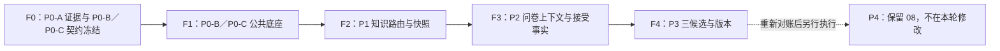

# “创作—说需求”P0-A 已落地与 P0-B～P3 错峰并行主实现计划

> **面向 AI（人工智能）代理的工作者：** 必需子技能：使用 superpowers:subagent-driven-development（子代理驱动开发，推荐）或 superpowers:executing-plans（分批执行计划）逐任务实现此计划。步骤使用复选框（`- [ ]`）语法来跟踪进度。

**目标：** 以 main 上已经完成的 P0-A 身份与安全底座为只读基线，冻结 P0-B／P0-C 的稳定 Service（业务服务）与 DTO（数据传输对象），组织三名开发错峰并行交付 P0-B～P3；不改变原业务范围，不重复实施 P0-A，不在本轮执行 P4。

**架构：** 主计划是 P0-A 事实、P0-B～P3 RuoYi 分层注册表、共享文件 owner（负责人）、三人时间线、F0～F4 门禁与迁移顺序的唯一汇总；业务细节仍由原业务规格和对应子计划负责。后端业务聚合只使用 `domain`、同级 `dto`、`mapper`、`service`、`service.impl`，端侧 HTTP（超文本传输协议）对象只在 user/platform 模块，外部 client/provider（客户端／提供商）及原始类型只在 `ai-video-infra`。

**技术栈：** Java 21（后端编程语言）、Spring Boot 4.1.0（Java 应用框架）、RuoYi-Vue-Plus 6.x（若依增强版）、MyBatis-Plus（数据访问增强工具）、Sa-Token（认证授权框架）、SnailJob（分布式任务调度）、MySQL 8 与 Redis 7（本机受控集成测试环境）、React 19（前端视图库）、Umi Max 4（前端应用框架）、Ant Design 6（蚂蚁设计组件库）、ProComponents 3（中后台高级组件库）、Vitest（前端单元测试）、Playwright（浏览器端到端测试）。

**阅读约定：** 正文中的 API（应用编程接口）、SQL（结构化查询语言）、DDL（数据定义语言）、IT（集成测试）、JSON（结构化数据格式）、ZIP（压缩包）、Outbox（事务发件箱）等英文术语首次出现时附中文含义；反引号中的类名、字段名、文件名、命令和接口路径是必须原样使用的程序标识符，不翻译其拼写，但由相邻中文解释其用途。

---

## 规格与执行边界

- 业务范围继续由 `docs/superpowers/specs/2026-07-28-say-requirements-copy-generation-design.md` 定义；本轮不新增、删减或改写其中的业务 API（应用编程接口）、字段、状态、错误码、数据库结构或 P4 上线范围。
- `docs/superpowers/specs/2026-08-02-say-requirements-copy-generation-parallel-delivery-design.md` 只治理 P0-B／P0-C、P1～P3 的并行组织、文件所有权、冻结点与 RuoYi 分层纠偏；它不是第二份业务规格。
- 旧的 `docs/superpowers/specs/2026-07-07-user-auth-login-design.md` 和对应实现计划只用于历史追溯，禁止执行其中的 `ai_user + userType + StpUtil`（用户表加用户类型加默认令牌工具）方案。
- 七个实施包共同交付完整范围，不以 MVP（最小可行产品）为理由省略账号管理、登录管理、权限、空态、失败态、审计、额度明细或越权测试。
- 跨包字段、接口、状态、错误码、价格或权限发生变化时，先修改 `docs/API_CONTRACT.md`、`docs/DOMAIN_MODEL.md`、`docs/ASYNC_TASKS.md` 或 `docs/ARCHITECTURE.md`，再修改代码。
- 所有用户可见英文均提供中文显示；稳定代码标识、数据库字段和类型名保留英文。
- 用户已批准本轮六份计划文档在当前 main 工作区按单文件 owner 串行整改：主计划、P0-B、P0-C、P1、P2、P3。该批准仅覆盖文档整改；后续业务实现仍必须使用独立的 `codex/` 前缀分支与隔离 worktree（工作树），不得在同一目录并发写业务文件。

### P0-A 已完成只读基线与 F0 证据

- P0-A 已在 main 完成身份安全实现、RuoYi 分层整改和自动化门禁；本主计划不再创建、迁移或重复执行 P0-A 业务代码。
- 现行代码事实以 `ai-video-api/ruoyi-modules/ai-video/ai-video-core/src/main/java/org/dromara/aivideo/identity` 为准；分层整改落地提交为 `93c27e38d`，历史完成记录只用于追溯。
- F0 证据来源固定为 `docs/superpowers/plans/2026-07-28-say-requirements-copy-generation-p0a-identity-security.md`、`docs/superpowers/specs/2026-08-01-p0a-ruoyi-layering-remediation-design.md` 与 `docs/superpowers/plans/2026-08-01-p0a-ruoyi-layering-remediation.md` 的执行记录。
- P0-A 自动化证据为 16 个精确 Failsafe（集成测试插件）类、70 tests、0 failures、0 errors、0 skipped；后端各模块单元测试、创作端 P0-A 定向测试与构建、运营端测试与构建均已有记录。实际发布时一次性失效旧 App 会话仍是发布维护窗口门禁，不是 P0-B～P3 代码阻塞。
- P0-A 保留的延期项只有用户注册；本轮不得据此扩张 P0-B～P3 范围。

### 2026-07-30 本机受控集成测试决定

- 本决定适用于 P0-A 至 P4 的全部后端开发、调试、自动化和 `*IT`（集成测试）：直接使用开发机本机安装的 MySQL 8 与 Redis 7，禁止 Docker、Docker Compose、Testcontainers、WSL、虚拟机、Podman 以及其他容器化、虚拟化环境。
- 所有 `*IT` 复用 P0-A 导出的 `LocalIntegrationEnvironment`（本机受控集成环境夹具），并通过 Maven 配置 `local-integration-test` 执行。该夹具默认读取用户端 `application-dev.yml` 的标准数据源和 Redis 配置；`AI_VIDEO_IT_MYSQL_URL`、`AI_VIDEO_IT_MYSQL_USERNAME`、`AI_VIDEO_IT_MYSQL_PASSWORD`、`AI_VIDEO_IT_REDIS_HOST`、`AI_VIDEO_IT_REDIS_PORT`、`AI_VIDEO_IT_REDIS_DATABASE`、`AI_VIDEO_IT_REDIS_PASSWORD` 仅作为可选覆盖。
- 夹具必须在任何建表、迁移、清理或连接前校验 MySQL/Redis 地址仅为 `localhost`、`127.0.0.1` 或 `::1`；MySQL 数据库名必须为 `ai_video_test`；Redis 必须使用独立逻辑库 `15` 和每次运行独立的 `aivideo:it:<runId>:` 前缀。配置缺失或校验不通过时 fail-fast（立即失败），绝不读取或写入开发、预发、生产库。
- 清理只允许影响 `ai_video_test` 和当前 `runId` 的 Redis 前缀，禁止 `FLUSHALL`；数据库密码直接保存在并提交于两端 `application-dev.yml`，命令输出和测试日志不得输出密码。
- 该决定替代本主计划及 P0-A/P0-B/P0-C/P1/P2/P3/P4 中此前所有容器测试描述；它只变更开发、测试方式，不改变生产部署策略。

## 后端任务执行前置阅读

- 每次开始后端任务前，必须完整阅读 `ai-video-api/.codex/skills/ruoyi-plus-ai-coding/SKILL.md` 与 `ai-video-api/.codex/skills/ruoyi-plus-ai-coding/references/backend.md`，不得只凭既有记忆实现 RuoYi-Vue-Plus（若依增强版）分层。
- 随后逐项对照 `ai-video-api/ruoyi-modules/ruoyi-gen/src/main/resources/fm/java/*.ftl`、`ai-video-api/ruoyi-modules/ruoyi-gen/src/main/resources/fm/xml/mapper.xml.ftl` 的 FreeMarker（代码生成模板引擎）模板，并查阅仓库内职责最接近的真实业务模块；模板、真实模块与本计划共同决定 Maven（Java 项目构建工具）模块位置、分层、Mapper（数据访问映射器）、事务和测试写法。
- 创作端用户实体“不继承 `BaseEntity`（默认审计基类）”以及创作端控制器“不使用默认 `@Log`（运营用户日志注解）”是本需求为隔离用户端与运营端身份而明确规定的安全例外，优先级高于通用 CRUD（增删改查）模板；必须改用强类型操作者字段与 `IAppSecurityAuditService`（创作端安全审计服务）。

### RuoYi 分层稳定注册表硬决定

- 本决定适用于 P0-B、P0-C、P1、P2、P3 的后端实现；P0-A 已按同一规则落地为只读基线，P4 保持原计划并在 F4 后另行对账。
- 后端业务聚合只能使用 RuoYi 的 `domain`、与其平级的 `dto`、`mapper`、`service`、`service.impl`；端侧 HTTP 模块另使用 `domain.bo`、`domain.vo`、`controller`。Service 接口为 `I...Service`，实现为 `...ServiceImpl`；共享核心无 HTTP（超文本传输协议）入口时省略 BO、VO 和 Controller。
- Entity（实体）保持贫血持久化对象，事务、状态流转、归属、幂等、额度与跨 Mapper（数据映射器）编排均放入 Service。AI 视频业务专属的稳定跨模块 Service 契约使用 `ai-video-core` 对应聚合 `dto` 包中的 `*DTO`，不得迁入全局 `ruoyi-api`。
- HTTP BO（请求对象）、VO（响应对象）和 Controller 只允许位于 `ai-video-user` 或 `ai-video-platform`；共享 core 不放 HTTP BO/VO。外部供应商直接 client/provider、SDK 对象与原始请求／响应只允许位于 `ai-video-infra`，不得泄漏成核心 Service DTO。
- 禁止新增平行业务层或以 DDD（领域驱动设计）、Clean Architecture（整洁架构）、Hexagonal Architecture（六边形架构）替代 RuoYi 的贫血 Entity 加 Service 编排；技术辅助包不得承载第二套业务 Service。

## 计划文件结构

- 本文件：`docs/superpowers/plans/2026-07-28-say-requirements-copy-generation-master.md`
  - 整改：汇总 P0-A 事实、P0-B～P3 稳定注册表、三人时间线和 F0～F4 门禁。
- 已存在、只读证据：`docs/superpowers/plans/2026-07-28-say-requirements-copy-generation-p0a-identity-security.md`
  - 已完成的独立创作端账号、登录、客户端、角色权限、会话、登录日志、安全审计和运营管理；禁止重复实施。
- 已存在、整改：`docs/superpowers/plans/2026-07-28-say-requirements-copy-generation-p0b-workspace-authorization.md`
  - 个人/组织工作区、成员、组织角色、对象授权、数据范围和修订失效。
- 已存在、整改：`docs/superpowers/plans/2026-07-28-say-requirements-copy-generation-p0c-business-foundation.md`
  - 方向目录、草稿入口、统一任务、额度、价格、详细流水、幂等操作槽和两端公共请求层。
- 已存在、整改：`docs/superpowers/plans/2026-07-28-say-requirements-copy-generation-p1-knowledge.md`
  - 系统知识中心、不可变知识版本、绑定、确定性路由、快照与受控导入。
- 已存在、整改：`docs/superpowers/plans/2026-07-28-say-requirements-copy-generation-p2-questionnaire.md`
  - 逐题付费问卷、答案修订、分支、固定补充字段和外部证据确认。
- 已存在、整改：`docs/superpowers/plans/2026-07-28-say-requirements-copy-generation-p3-script.md`
  - 一次生成 A/B/C 三套文案、不可变版本、付费优化、确认和用户文案库。
- 已存在、保持不改：`docs/superpowers/plans/2026-07-28-say-requirements-copy-generation-p4-integration.md`
  - F4 后重新对账可靠通知、既有任务/账单跨域验收、资料迁移、端到端验收、灰度、监控和回退；本轮禁止直接执行或修改。

## 后端模块与共享接口

### Maven（Java 项目构建工具）模块

```text
ai-video-api/ruoyi-modules/ai-video/
├── ai-video-core      # Entity、DTO、Mapper、Service 与 Service 实现
├── ai-video-infra     # 直接 client/provider、任务调度、缓存与外部集成
├── ai-video-user      # 只含创作端 Controller 与用户端装配
└── ai-video-platform  # 只含 /api/admin/** 管理 Controller 与管理装配

ai-video-api/ai-video-integration-tests  # 仅用于独立进程黑盒集成测试
ai-video-api/ruoyi-extend/ruoyi-snailjob-server
                                      # 仅作为 P4 测试期调度基础设施第三进程
```

依赖方向固定为：

```text
ai-video-core <- ai-video-infra
ai-video-core <- ai-video-user
ai-video-core <- ai-video-platform
ai-video-user-api -> ai-video-user + ai-video-infra
ruoyi-admin -> ai-video-platform + ai-video-infra
ai-video-integration-tests -> ai-video-user-api + ruoyi-admin（仅 test 范围，位于 Reactor 最后）
```

`ai-video-integration-tests` 不进入任何生产应用依赖图；它在 P4 复制两个已打包的业务可执行 JAR（Java 归档），以不同端口启动 `ai-video-user-api` 和 `ruoyi-admin`，并额外启动 `ruoyi-snailjob-server` 作为调度基础设施第三进程，通过 HTTP（超文本传输协议）验证双向身份隔离、耐久扫描恢复和完整链路。业务应用始终只有用户端与运营端两个；`ruoyi-snailjob-server` 不是第三个业务应用，也不得成为任一业务应用的生产 Maven 依赖。禁止用同一 Spring 上下文代替真实双应用和独立调度进程边界。

包根固定为 `org.dromara.aivideo`。下列注册表是 P0-A～P3 跨阶段 Service 的唯一稳定名称；子计划只能补充同聚合内部方法，不能创造同义接口。

| 阶段 | 稳定 Service 路径 | 责任 |
| --- | --- | --- |
| P0-A 已落地 | `identity/service/IAppIdentityService.java`、`identity/service/IAppSessionService.java`、`identity/service/IAppPermissionService.java`、`identity/service/IAppSecurityAuditService.java` | 身份、会话、创作端权限和只追加安全审计 |
| P0-B | `authorization/service/IWorkspaceAuthorizationService.java` | 当前工作区、可用工作区、资源动作、成员与授权修订 |
| P0-C | `task/service/IAiTaskService.java`、`task/service/IAiTaskExecutionDispatcher.java`、`task/service/IAiTaskAttemptService.java`、`quota/service/IQuotaBillingService.java`、`direction/service/IDirectionCatalogService.java` | 草稿、任务、执行租约、尝试、额度；方向目录的跨阶段读取只返回已发布的不可变快照 |
| P1 | `knowledge/service/IKnowledgeRoutingService.java`、`knowledge/service/IKnowledgeSnapshotService.java` | 已发布知识路由和不可变知识快照 |
| P2 | `questionnaire/service/IQuestionnaireContextService.java`、`questionnaire/service/IEvidenceReviewService.java` | 当前问卷上下文、问答／补充修订、接受事实与决定修订映射 |
| P3 | `script/service/IScriptGenerationService.java`、`script/service/IScriptVersionService.java`、`script/service/IUserScriptQueryService.java` | 三候选生成、不可变版本、确认、优化和用户文案查询 |

### P0-A 精确消费映射

- `identity/dto/AppPrincipalSnapshotDTO.java`、`identity/dto/AppWorkspaceSessionSnapshotDTO.java` 与 `identity/dto/AppSecurityAuditDTO.java` 是现行 DTO；`identity/domain/AppSessionInvalidationReason.java` 是现行失效原因枚举。
- `identity/security/AppActorContext.java` 继续作为安全上下文，保存 `actorType + actorId`；它不是业务 DTO，也不得移动到 HTTP 对象。
- `IAppSessionService` 的跨阶段签名精确为 `AppPrincipalSnapshotDTO replaceWorkspace(AppWorkspaceSessionSnapshotDTO workspace)`、`void invalidateUserSessions(Long appUserId, AppSessionInvalidationReason reason)`、`void invalidateOrganizationSessions(Long organizationId, AppSessionInvalidationReason reason)`。
- `IAppSecurityAuditService` 的写入口精确为 `void append(AppSecurityAuditDTO command)`。
- `AppSecurityAuditDTO` 的八个字段及顺序固定为 `resourceType`、`resourceId`、`action`、`actorType`、`actorId`、`beforeDigest`、`afterDigest`、`reason`。
- `AppLoginHelper` 读取 `StpLogic("app")` 登录上下文，`AppSessionRevisionGuard` 校验身份、凭据、权限、客户端和工作区修订；P0-B 只能消费这些现行类型，不得复制 P0-A 快照。

### 跨阶段 DTO 注册表

| 阶段 | 唯一 DTO |
| --- | --- |
| P0-B | `WorkspaceContextDTO`、`WorkspaceSummaryDTO`、`ResourceOwnershipDTO`、`ResourceDataScopeDTO`、`SwitchWorkspaceDTO` |
| P0-C 草稿／步骤 | `CreateScriptDraftDTO`、`ScriptDraftOverviewDTO`、`StepGuardDTO` |
| P0-C 额度 | `QuotaLockRequestDTO`、`QuotaLockResultDTO`、`QuotaAccountSnapshotDTO` |
| P0-C 任务 | `TaskInitiatorDTO`、`ChargeableTaskDTO`、`FreeTaskDTO`、`TaskRevisionSnapshotDTO`、`TaskCreationResultDTO`、`TaskResultReferenceDTO`、`AiTaskExecutionLeaseDTO`、`AiTaskAttemptHandleDTO`、`ProviderUsageDTO` |
| P0-C 方向 | `DirectionCatalogSnapshotDTO` |
| P1 | `KnowledgeRouteRequestDTO`、`KnowledgeRouteResultDTO`、`KnowledgePlanDTO`、`KnowledgeSnapshotRequestDTO`、`KnowledgeSnapshotDTO` |
| P2 | `QuestionnaireContextDTO`、`QuestionnaireAnswerRevisionDTO`、`QuestionnaireSupplementRevisionDTO`、`EvidenceReviewContextDTO`、`AcceptedEvidenceFactDTO`、`EvidenceDecisionRevisionDTO` |
| P3 | `ScriptGenerationRequestDTO`、`ScriptGenerationResultDTO`、`ScriptOptimizationRequestDTO`、`ScriptOptimizationResultDTO`、`ScriptFrozenInputDTO`、`ScriptVersionDTO`、`ScriptConfirmationDTO`、`UserScriptSummaryDTO` |

`DirectionCatalogSnapshotDTO` 位于 `direction/dto`，是方向目录跨阶段只读快照的唯一名称；八个 record component 的名称与顺序精确固定为 `catalogVersion`、`contentHash`、`industryCatalogVersion`、`purposeCatalogVersion`、`durationRuleVersion`、`industries`、`purposesByIndustry`、`targetDurations`。`catalogVersion`、两个目录子版本都必须为正数，`durationRuleVersion` 必须非空，`contentHash` 必须是 64 位小写十六进制摘要。`IDirectionCatalogService` 的跨阶段职责仅限读取当前已发布目录并返回该不可变快照；草稿编辑、分页管理、发布命令和 HTTP BO／VO 不进入稳定 DTO，下游不得直读方向 Entity、Mapper 或端侧 VO。

HTTP 边界不得直接序列化 `DirectionCatalogSnapshotDTO`：方向选项响应只映射聚合 `catalogVersion` 与三组选项，方向保存请求只接收 `expectedCatalogVersion` 和用户选择，不公开或接收 `contentHash`、`industryCatalogVersion`、`purposeCatalogVersion`、`durationRuleVersion`。P2 保存方向时必须只读取一次当前 published snapshot，在同一快照上校验 `expectedCatalogVersion`、行业／用途 code 与目标时长，再由服务端把三个子版本写入方向修订；客户端不得提交、伪造或覆盖追溯子版本。

P3 上述八个稳定 DTO 全部位于 `script/dto`；HTTP BO／VO 仍留在 user/platform 端侧。主计划和子计划只允许使用这组拼写，不得再造同义类型，也不得以 questionnaire Mapper、Entity 或 HTTP VO 取代稳定 Service DTO。

`IWorkspaceAuthorizationService` 至少冻结以下签名：

```java
WorkspaceContextDTO resolveCurrentWorkspace();
List<WorkspaceSummaryDTO> listAvailableWorkspaces();
WorkspaceSummaryDTO switchCurrentWorkspace(SwitchWorkspaceDTO request, AppActorContext actor);
void requireWorkspacePermission(String permissionCode);
void requireResourceAction(ResourceOwnershipDTO resource, String action);
ResourceDataScopeDTO resolveDataScope(String resourceType, String action);
void initializeCreatorGrant(ResourceOwnershipDTO resource, AppActorContext actor);
void inheritResourceGrants(
    ResourceOwnershipDTO source, ResourceOwnershipDTO target, AppActorContext actor);
```

收费任务跨包调用只允许使用 P0-C 冻结的以下签名：

```java
public interface IAiTaskService {
    TaskCreationResultDTO createChargeableTask(ChargeableTaskDTO request);
    TaskCreationResultDTO createFreeTask(FreeTaskDTO request);
    void requireGenerationContextWritable(
        Long draftId,
        Long branchRevision);
    void inheritQuestionnaireTaskGroupMembers(
        Long draftId,
        Long sourceBranchRevision,
        Long targetBranchRevision,
        List<Long> retainedRootTaskIds,
        TaskInitiatorDTO initiator);
    List<AiTaskExecutionLeaseDTO> claimExecutableTasks(
        Instant now, String workerId, Instant leaseExpiresAt, int limit);
    AiTaskExecutionLeaseDTO renewLease(
        AiTaskExecutionLeaseDTO lease, Instant newLeaseExpiresAt);
    void recordHandlerFailure(
        AiTaskExecutionLeaseDTO lease,
        String failureCode,
        String failureMessage,
        boolean retryable);
    void markSuccess(
        AiTaskExecutionLeaseDTO lease, TaskResultReferenceDTO result);
    void markFailed(
        AiTaskExecutionLeaseDTO lease,
        String failureCode,
        String failureMessage);
}

public interface IAiTaskExecutionDispatcher {
    void enqueue(Long rootTaskId, Long executionTaskId);
}

public interface IAiTaskAttemptService {
    AiTaskAttemptHandleDTO startAttempt(
        Long rootTaskId,
        Long executionTaskId,
        String leaseOwner,
        String callPurpose,
        String provider,
        @Nullable String model,
        String inputHash);
    void completeAttempt(
        Long attemptId, ProviderUsageDTO usage, String outputHash);
    void failAttempt(
        Long attemptId,
        ProviderUsageDTO usage,
        String failureCode,
        String failureMessage);
}

public interface IQuotaBillingService {
    QuotaLockResultDTO lock(QuotaLockRequestDTO request);
    QuotaAccountSnapshotDTO settle(Long operationId, Long rootTaskId);
    QuotaAccountSnapshotDTO release(
        Long operationId, Long rootTaskId, String failureCode);
}
```

`IAiTaskService.requireGenerationContextWritable(Long draftId, Long branchRevision)` 与
`IAiTaskService.inheritQuestionnaireTaskGroupMembers(Long draftId, Long sourceBranchRevision, Long targetBranchRevision, List<Long> retainedRootTaskIds, TaskInitiatorDTO initiator)`
都是 `Propagation.MANDATORY`（强制已有事务传播）写事务入口。前者在 P2 任何答案、补充或接受事实变更前，以
`script:{draftId}:{branchRevision}` 精确定位任务组；当存在 `script_generate` 或 `script_optimize` 且状态为
`pending`、`queued`、`running` 的根任务时抛出 `46123`，`data` 只能包含
`rootTaskId`、`taskType`、`status`。后者只继承问卷任务组 membership（成员关系），不复制任务、用量、账本或操作槽；
它必须校验同租户、当前工作区 `app_user` 发起主体、`targetBranchRevision = sourceBranchRevision + 1`、
保留根任务为 `question_generate`、资源为当前脚本草稿、任务族与 source membership 一致。完全相同重放幂等，
partial（部分）、superset（超集）、conflict（冲突）或把 origin（原生）成员冒充 inherited（继承）均失败关闭。

P2 冻结给 P3 的并发读入口精确为：

```java
public interface IQuestionnaireContextService {
    QuestionnaireContextDTO lockCurrentContextForGeneration(
        Long draftId,
        Long branchId);
}
```

`lockCurrentContextForGeneration` 必须在非 `readOnly` 的 `Propagation.MANDATORY` 事务内，按
`draft -> current_branch` 顺序执行 `SELECT ... FOR UPDATE`，在锁内重新校验工作区归属、当前分支、答案 identity（身份）／context（上下文）摘要与顺序，随后才允许 P3 按全局锁序进入操作槽、额度与任务创建。

`IAiTaskService.createChargeableTask/createFreeTask` 只创建 `pending`（待入队）根任务和执行任务，绝不自行调用 `enqueue`。P1／P2／P3 的 Service 必须提供外层同一 `@Transactional`（事务）边界，固定按 `create -> freeze immutable input -> enqueue`（创建任务、冻结不可变输入、耐久入队）的顺序执行；复用既有任务时立即返回，不再次冻结或入队。`IAiTaskExecutionDispatcher.enqueue` 使用 `Propagation.MANDATORY`（强制已有事务传播）或等价显式守卫要求真实事务存在，只建立耐久执行资格，不执行模型、不创建任务、不锁定或结算额度。

三步与收费任务的额度锁定必须同成同败：冻结或入队任一步失败时，根任务、执行任务、额度锁、冻结输入和 `queued`（已入队）状态全部不可见，禁止捕获冻结异常后调用 `markFailed` 做补偿。父子两次状态条件更新任一失败时整笔事务回滚。数据库隔离保证提交前不会被扫描器领取，所以扫描器永远看不到没有冻结输入的 `queued` 行。`ai-video-infra` 的 SnailJob（分布式任务调度）周期扫描器首次领取执行任务时同时把聚合根任务 `queued -> running`（已入队转执行中）；租约过期的执行任务被重新领取时根任务保持 `running`。扫描器只分配租约，不创建提供商尝试；达到最大领取次数时必须把父子任务终结为固定失败，禁止无限 `running`。该扫描器才是最终恢复来源；事务提交后的即时唤醒只能作为可选加速，唤醒失败不得丢失已经提交的 `queued` 记录。

`ai-video-infra` 的直接任务处理器注册表保证每个任务类型恰好一个同步处理器：重复类型阻止启动，未知类型以固定错误终结，单个处理器异常不得阻断同批后续任务。模型生成和外部检索只描述为 `ai-video-infra` 内直接 client/provider 技术边界；禁止在 core 创建模型或搜索端口，也禁止让供应商原始类型进入稳定 DTO。每次真实外部调用前，处理器用完整租约调用 `IAiTaskAttemptService.startAttempt`；服务锁定 execution（执行任务）后校验 `leaseOwner`，原子分配下一调用序号，并在新租约开始调用前把旧租约遗留的未终态尝试收敛为 `worker_lease_lost`，保留已知请求编号、用量和成本。每个收费根任务最多产生 3 次真实提供商尝试，超过上限以 `AI_TASK_PROVIDER_ATTEMPTS_EXHAUSTED` 确定性失败，三次明细都保存但用户仍只按这一逻辑操作结算一次。真实调用成功或失败都写 `ProviderUsageDTO`；没有提供商调用的免费知识导入不得产生尝试。模型／搜索超时必须小于租约剩余时间，否则先条件续租；过期工作器不得写尝试、成本、业务结果或终态。

用户端身份适配只能生成 `actorType=app_user` 的 `TaskInitiatorDTO`，运营端身份适配只能生成 `actorType=sys_user` 的 `TaskInitiatorDTO`；两端不查询、不尝试也不回退另一身份域。收费任务和额度锁只接受当前工作区的 `app_user`；免费 `knowledge_import` 以及额度调整、退款、补偿只接受 `sys_user`。异步结算／释放从根任务和计费操作读取已冻结的强类型发起主体，后台线程不得猜当前登录；这只统一操作者数据形状，不合并两端账号、角色、权限或会话。

`ChargeableTaskDTO` 固定携带任务类型、操作类型、资源、操作槽、任务族、任务组、幂等键、请求摘要、费率版本、`TaskInitiatorDTO` 和 `TaskRevisionSnapshotDTO`；`FreeTaskDTO` 固定携带任务类型、资源、任务族、任务组、幂等键、请求摘要、`TaskInitiatorDTO` 和免费任务修订快照，不含操作槽、费率或计费字段。`TaskCreationResultDTO` 固定返回根任务编号、执行任务编号、可空计费操作编号和是否复用；只有免费 `knowledge_import`（知识导入）的计费操作编号为空。后续计划不得另造旧式收费任务方法或结算引用对象。

`AiTaskType.code`（任务类型稳定值）只允许 `question_generate`、`evidence_retrieve`、`script_generate`、`script_optimize`、`knowledge_import`。`script_regenerate` 只是重新生成的计费操作类型，任务类型仍为 `script_generate`，并由 `generationMode`（生成方式）区分首次生成和重新生成。

### P0-C F1 向前修订证据

已经生成的 `git-metadata/p0c-f1-handoff.json` 是不可变原始证据，不得覆盖、重排或补字段；
`originalF1Head` 必须是 `amendmentHead` 的祖先。P0-C 以新的
`git-metadata/p0c-f1-contract-addendum.json` 记录向前修订，顶层键及顺序精确为：

```text
originalF1Head
amendmentHead
originalF1HandoffSha256
requiredMethods
schemaAddendum
owner
reviewer
reviewStatus
reviewedHead
reviewCompletedAtUtc
evidence
capturedAtUtc
```

`requiredMethods` 精确记录本主计划冻结的两个 `IAiTaskService` 方法完整签名。
`schemaAddendum` 的键及值精确为：

```json
{
  "forwardMigration": "20260728_04a_p0c_task_group_guard.sql",
  "taskGroupMemberTable": "av_ai_task_group_member",
  "activeTaskIndex": "idx_av_ai_task_active_group",
  "originValues": ["origin", "inherited"],
  "creatorTypes": ["app_user", "sys_user"],
  "globalLockOrder": ["draft", "current_branch", "operation_slot", "quota_account", "task_or_group_member"],
  "scriptGroupKey": "script:{draftId}:{branchRevision}",
  "inheritanceScope": "membership_only",
  "forbiddenCopies": ["task", "usage", "ledger", "operation_slot"]
}
```

`evidence` 必须是固定顺序的三个对象且每项仅含 `kind`、`path`、`sha256`：

1. `source-signatures` → `git-metadata:p0c-f1-addendum/source-signatures.manifest.json`；
2. `migration-04a` → `git-metadata:p0c-f1-addendum/migration-04a.manifest.json`；
3. `independent-review` → `git-metadata:p0c-f1-contract-addendum-review.json`。

独立复核文件 `git-metadata/p0c-f1-contract-addendum-review.json` 的键及顺序精确为
`owner`、`reviewer`、`reviewStatus`、`reviewedHead`、`originalF1Head`、
`originalF1HandoffSha256`、`requiredMethodsSha256`、`schemaAddendumSha256`、
`reviewCompletedAtUtc`。所有 SHA-256 必须从当前文件实时计算；`owner` 与 `reviewer` 经 trim 后忽略大小写仍必须不同；
`reviewStatus` 必须为 `PASS`；`reviewedHead = amendmentHead`；时间必须为 UTC，且
`capturedAtUtc >= reviewCompletedAtUtc`。

## 数据库脚本顺序

仓库当前没有自动迁移框架，本功能使用 MySQL（关系型数据库）专用、可重复执行的顺序脚本，不把它们称为自动迁移：

```text
docs/sql/ai-video/mysql/
├── 20260728_01_p0a_identity_security.sql
├── 20260728_02_p0b_workspace_authorization.sql
├── 20260728_03_p0c_task_quota_direction.sql
├── 20260728_04_p0_seed.sql
├── 20260728_04a_p0c_task_group_guard.sql
├── 20260728_05_p1_knowledge.sql
├── 20260728_06_p2_questionnaire.sql
├── 20260728_07_p3_script.sql
└── 20260728_08_p4_integration.sql
```

迁移真实集成顺序固定为：

```text
01 → 02 → 03 → 04 → 04a → 05 → 06 → 07
```

`01` 是已落地 P0-A 基线；`02` 属于 P0-B，`03 → 04 → 04a` 属于 P0-C，`04a` 是只能向前追加的任务组并发守卫修订，`05` 属于 P1，`06` 属于 P2，`07` 属于 P3。`08` 保留给 P4，但必须在 F4 后先对 P4 子计划重新对账，本轮不得编辑、执行或据其声明通过。`docs/sql/ai-video/mysql/README.md` 由迁移清单 owner 串行维护数据库版本、执行顺序、摘要、验证查询和回退原则；不得跳过上游脚本，也不得把同一张表分散到两个阶段脚本或同时维护在增量脚本与 `ry_vue.sql`。

`04a` 必须新增 `av_ai_task_group_member`，唯一键为
`(tenant_id, task_group_key, root_task_id)`；`origin_type` 只允许 `origin|inherited`，
`creator_type` 只允许 `app_user|sys_user`，并对 root task 建立同 tenant 外键。`av_ai_task` 上新增
`idx_av_ai_task_active_group`，支持按 tenant、task group、task role、status、task type、id 锁定活动根任务。
所有涉及脚本草稿、问卷和文案生成的写事务使用唯一全局锁序
`draft -> current_branch -> operation_slot -> quota_account -> task_or_group_member`；不得以 gap lock（间隙锁）替代共同 branch（分支）行锁。
任务组继承仅复制 membership，不复制 `task`、`usage`、`ledger`、`operation_slot`。跨继承组统计费用按
`usageOperationId` 去重，禁止 `SUM(DISTINCT amount)`。

## 前端共享路径

创作端：

```text
ai-video-ui/ai-video-webapp/src/services/ai-video/
├── core/{types,errors,ruoyiAdapter,queryClient}.ts
├── auth/{types,api,session}.ts
├── workspace/{types,api}.ts
├── tasks/{types,api}.ts
├── quota/{types,api}.ts
├── studio/{types,api,queryKeys}.ts
└── scripts/{types,api,adapters}.ts
```

运营端：

```text
ai-video-ui/ai-video-platform-ui/src/api/aivideo/
├── shared/{types,constants,pageAdapter}.ts
├── identity/
├── workspace/
├── direction/
├── knowledge/
├── quota/
├── tariff/
├── usage/
└── task/
```

所有 HTTP（超文本传输协议）编号、修订号、额度和金额在 TypeScript（类型脚本语言）边界均使用字符串；只有进度百分比、列表序号和固定时长使用数字。

P1、P2、P3 必须各自维护与冻结类型一致的独立 Mock（模拟接口），不得共享字段副本：

- P1：`ai-video-ui/ai-video-platform-ui/mock/aivideo-knowledge.ts`。
- P2：`ai-video-ui/ai-video-webapp/mock/aivideo-studio.ts`。
- P3：`ai-video-ui/ai-video-webapp/mock/aivideo-scripts.ts`。

## 并行时间线、共享 owner 与冻结门禁

开发切片允许错峰重叠；真实数据库升级、上游替身移除、真实联调和合并必须严格按以下顺序：



### F0～F4 退出门禁

- **F0：** P0-A 只读证据可追溯；P0-B 给出 `AppSessionServiceImpl` 从当前仅接受 `canonicalPersonalWorkspace` 到服务端规范组织快照的扩展方案；P0-B／P0-C 稳定 Service、DTO、公共错误、HTTP 适配和共享文件 owner 冻结。
- **F1：** P0-B／P0-C 实现完成；迁移 `02 → 03 → 04 → 04a` 在本机受控环境通过；个人／组织授权、跨账号数据范围、草稿幂等、任务恢复、操作槽、额度锁定／结算／释放、任务组并发写守卫与公共前端鉴权／任务／额度状态全部通过。不可变原 `p0c-f1-handoff.json`、新的 exact 12-field addendum、三项 evidence 与独立 review 同时通过；F1 前禁止真实模型和搜索调用。F1 修订形成后 P1、P2、P3 三条下游分支必须全部 rebase 到同一 amendment 提交，未 rebase 不得继续真实集成。
- **F2：** P1 的 `05` 迁移、仅已发布知识路由、A／B／C 确定性路由、不可变知识快照、知识导入与平台页验收通过；F2 handoff 必须绑定原 F1 handoff SHA、F1 addendum SHA、原／修订 F1 head，并冻结五个 P1 DTO 的 component registry 与 source SHA-256。P2 必须再次 rebase 到 F2，移除 P1 替身并接真实 P1 Service／DTO；P3 也必须 rebase 到 F2，但此时只允许按 registry 接入 P1 稳定 DTO，不得提前接 P2 实现或 Mapper。
- **F3：** P2 的 `06` 迁移、逐题分支、问卷上下文、接受事实、答案 identity JSON 与 context JSON 分离、`factId -> decisionRevision` 精确映射通过；F3 handoff 必须冻结 P2 六个 DTO 的 component registry/source SHA、两个 Service 最终签名、`lockCurrentContextForGeneration` 锁协议、写守卫协议及 identity/order 协议。P3 必须再次 rebase 到 F3，移除 P2 替身并接真实 P2 Service／DTO、冻结输入、收费任务和外部调用。
- **F4：** P3 的 `07` 迁移、A／B／C 三候选原子保存、每套三个标题、优化、确认、不可变版本树、文案库、权限与下游准确版本引用通过；P3 生产源码与全部真实 `*IT.java` 必须同时不存在 P1／P2 替身。F4 后才可重新审阅 P4 与 `08`，本轮不直接执行 P4。

真实集成／合并顺序固定为 `F0 → F1 → F2 → F3 → F4`；数据库迁移顺序固定为 `01→02→03→04→04a→05→06→07`。任何下游分支都可以提前存在，但不得把 Mock、测试替身、未审查字段或真实上游接线提前合入 main。

### 三名开发错峰时间线

| 开发 | F0～F1 前 | 到达上游门禁后 | 禁止事项 |
| --- | --- | --- | --- |
| A | P0-B 全量，随后 P0-C 全量 | P3 在 F1 rebase；F2 再 rebase 且只接 P1 DTO；F3 再 rebase、移除 P2 替身并完成真实集成 | 不在 P0-B 阶段创建草稿／任务／额度，不在 F2 前接 P1 真实 DTO，不在 F3 前接 P2 真实能力 |
| B | P1 独立切片：纯逻辑、类型、`mock/aivideo-knowledge.ts`、局部平台页和 `05` 设计 | F1 rebase 并接 P0-C，完成真实 P1 集成和 F2 | 不在 F1 前合入真实任务、迁移或导入链路 |
| C | P2 独立切片：答案规范化、分支策略、类型、`mock/aivideo-studio.ts` 和局部工作台组件 | F1 先 rebase；F2 再 rebase、移除 P1 替身并完成真实 P2 集成和 F3 | 不在 F2 前接真实知识，不在 F3 前向 P3 提供未冻结实现 |

P3 的 `mock/aivideo-scripts.ts` 与局部组件由 A 在 F1 后独立拥有；B、C 在冻结点轮换担任独立 reviewer（审查者），任何人不得审查自己的实现。

### 共享文件单 owner 清单

以下文件或文件组在任何时刻只能有一个写 owner；冻结任务卡必须记录 owner、基线提交、接收窗口和独立 reviewer，其他泳道只读：

- 公共契约：`docs/ARCHITECTURE.md`、`docs/API_CONTRACT.md`、`docs/DOMAIN_MODEL.md`、`docs/ASYNC_TASKS.md`。
- 公共错误：`ai-video-api/ruoyi-modules/ai-video/ai-video-core/src/main/java/org/dromara/aivideo/common/error/AiVideoErrorCode.java`。
- Maven Reactor／公共模块 POM：`ai-video-api/pom.xml`、`ai-video-api/ruoyi-modules/ai-video/pom.xml`、`ai-video-api/ruoyi-modules/ai-video/ai-video-core/pom.xml`、`ai-video-api/ruoyi-modules/ai-video/ai-video-infra/pom.xml`、`ai-video-api/ruoyi-modules/ai-video/ai-video-user/pom.xml`、`ai-video-api/ruoyi-modules/ai-video/ai-video-platform/pom.xml`、`ai-video-api/ai-video-user-api/pom.xml`、`ai-video-api/ai-video-integration-tests/pom.xml`、`ai-video-api/ruoyi-admin/pom.xml`。
- 前端清单与锁文件：`ai-video-ui/ai-video-webapp/package.json`、`ai-video-ui/ai-video-webapp/package-lock.json`、`ai-video-ui/ai-video-platform-ui/package.json`、`ai-video-ui/ai-video-platform-ui/package-lock.json`、`ai-video-ui/ai-video-platform-ui/pnpm-lock.yaml`。
- 迁移清单：`docs/sql/ai-video/mysql/README.md` 与 `01 → 07` 执行清单；各阶段仍只写自己的迁移脚本。
- 公共前端基础：`ai-video-ui/ai-video-webapp/src/services/ai-video/core/types.ts`、`ai-video-ui/ai-video-webapp/src/services/ai-video/core/errors.ts`、`ai-video-ui/ai-video-webapp/src/services/ai-video/core/ruoyiAdapter.ts`、`ai-video-ui/ai-video-webapp/src/services/ai-video/core/queryClient.ts`、`ai-video-ui/ai-video-platform-ui/src/api/aivideo/shared/types.ts`、`ai-video-ui/ai-video-platform-ui/src/api/aivideo/shared/constants.ts`、`ai-video-ui/ai-video-platform-ui/src/api/aivideo/shared/pageAdapter.ts`。
- 用户端共享组装：`ai-video-ui/ai-video-webapp/src/app.tsx`、`ai-video-ui/ai-video-webapp/src/pages/digital-human-studio/index.tsx`、`ai-video-ui/ai-video-webapp/src/pages/digital-human-studio/components/StudioTopbar.tsx`、`ai-video-ui/ai-video-webapp/src/pages/digital-human-studio/model.ts`。

### P1／P2／P3 共性前端状态矩阵

P1、P2、P3 的真实接口与独立 Mock 都必须覆盖：鉴权恢复、加载、初始空、搜索无结果、分页、网络／超时／HTTP 5xx 与重试、401 单次退出、403 权限不足、提交中防重复、取消不作为失败、成功后统一 query key 刷新、修订冲突、版本冲突、上下文过期、任务排队／运行／成功／失败／取消／过期、危险操作二次确认。各子计划再保留本模块特有的导入、证据、候选、版本树和下游引用阻止状态。

### P2／P3 收费链状态

只有 P2 问题／证据生成与 P3 文案生成／优化的收费链额外覆盖额度不足、费率变化重确认、额度锁定、结算、释放和操作槽冲突；这些状态不得扩散到 P1。

### P1 免费导入状态

P1 的 `knowledge_import` 只通过 `FreeTaskDTO` 创建免费任务，计费操作编号固定为空；前端覆盖文件校验、导入排队／运行／成功／失败／取消和重试，但不得制造额度不足、费率变化、锁定、结算或释放等收费状态。

所有 Maven（Java 项目构建工具）测试门禁以对应子计划最后一个“全量门禁/最终验收”任务为唯一精确命令源，主计划不得用 `-Dit.test='*IT'`（全部集成测试通配符）替代。子计划必须列出准确模块和类名，并检查本次命令之后生成的 Surefire/Failsafe XML（单元/集成测试报告）：每个预期目标类 `tests > 0`、`failures = 0`、`errors = 0`，且 `skipped < tests`，否则即使 Maven 输出 `BUILD SUCCESS`（构建成功）也视为门禁失败。`failsafe.failIfNoSpecifiedTests=false` 只用于避免 `-am` 带入的无目标依赖模块误报，不能作为目标模块“没有执行测试”的豁免。

## 全局不可变约束

1. 创作端和运营端的用户、客户端、角色、权限、登录助手及会话完全分开，不做映射、同号推导或自动同步。
2. 运营端管理 `app_*` 资源仍使用 `sys_user` 令牌和独立管理权限，不能签发 `app` 令牌或冒充创作用户。
3. 每道问题只在上一题有效答案保存后创建一个新的收费根任务；固定补充字段不调用模型、不收费。
4. 全部问题都是多选，每题固定支持自定义；取消勾选后保留本地文字，但请求不携带有效自定义文本。
5. 规范答案摘要不变时复用当前分支；摘要改变时才建立子分支并排除旧后缀。
6. 第 5 题后信息仍不足时只展示确定性补充字段，不创建第 6 题模型任务。
7. 三套文案的每次真实模型请求都必须原子返回固定 A/B/C，每套恰好三个标题；正常路径只调用一次，结构无效最多同租约修复一次，所有恢复调用合计受每个根任务最多 3 次真实提供商尝试约束。
8. 每个根任务只创建一个 `executionNo=1` 执行子任务；自动恢复只重新领取同一执行租约并追加调用尝试。收费根任务与 `av_ai_usage_operation` 一对一，执行子任务和自动恢复不得另建计费操作。
9. 业务操作槽存在非终态根任务时，任何不同幂等键都返回 `46123`；前端只刷新活跃任务，不自动换键重放。
10. 额度变化只通过不可变流水追加，锁定、结算、释放、退款和补偿各自具有唯一事件键并保存前后余额。
11. 模型结果写库前重新校验草稿、分支、生成上下文修订号和输入摘要；旧上下文结果丢弃并释放额度。
12. 系统知识中心与用户文案库是两个事实域；用户文案不会自动回流系统知识。

### 任务 1：六份计划整改与独立审查

**任务卡：**

- **单一目标／不做：** 串行整改主计划、P0-B、P0-C、P1、P2、P3 六份现有计划，使 P0-A 事实、RuoYi 路径、Service／DTO、owner 和 F0～F4 一致；不修改业务代码、公共契约语义、SQL 或 P4；六份计划必须逐文件完成独立 review 后各自暂存、各自提交，禁止批量暂存、批量提交或 push。
- **权威来源：** 原业务规格、`docs/superpowers/specs/2026-08-02-say-requirements-copy-generation-parallel-delivery-design.md`、`RULES.md`、`docs/AI_AGENT_GOVERNANCE.md` 和本主计划注册表。
- **风险／人员／并发：** 红色；开发 A 实施，开发 B 独立契约 reviewer；同一任务最多 2 人，reviewer 只读。
- **精确文件所有权：** `docs/superpowers/plans/2026-07-28-say-requirements-copy-generation-master.md`、`docs/superpowers/plans/2026-07-28-say-requirements-copy-generation-p0b-workspace-authorization.md`、`docs/superpowers/plans/2026-07-28-say-requirements-copy-generation-p0c-business-foundation.md`、`docs/superpowers/plans/2026-07-28-say-requirements-copy-generation-p1-knowledge.md`、`docs/superpowers/plans/2026-07-28-say-requirements-copy-generation-p2-questionnaire.md`、`docs/superpowers/plans/2026-07-28-say-requirements-copy-generation-p3-script.md`；一次只允许一个文件 owner。
- **前置／退出门禁：** 用户已批准六计划在当前 main 串行整改并记录起始 `git status --short`；退出时六计划通过开发规范、F0～F4／迁移／稳定名称正向扫描、旧业务层负向扫描，独立 reviewer 无 `[必须修复]`，且形成六个每次只包含一份计划的独立提交；全程禁止 push。
- **Review 检查点 1：** P0-A 精确映射与 P0-B／P0-C 注册表完成后核对签名、八字段审计 DTO、组织会话阻塞及任务／额度规则。
- **Review 检查点 2：** 六计划完成后只复核差异、owner、三个 Mock、替身移除、F0～F4 和 P4 不变边界。
- **固定输出：** `完成项`、`风险`、`验证证据`、`阻塞项`。

**R0 Git 行为：** 开发 A 每次只整改一份计划，开发 B 对该文件完成独立 review 且无 `[必须修复]` 后，开发 A 才能执行 `git add -- <该计划的精确路径>`；随后必须断言 `git diff --cached --name-only` 仅有该文件，再单独提交并进入下一份计划。主计划的提交主题固定为 `docs: 对齐说需求主计划并行门禁`，供只读基线门禁精确定位；禁止六文件批量 `git add`、批量 commit 或任何 `git push`。

#### R1：开发 C 只读预审任务卡

- **单一目标／不做：** 在 R0 开始写第一份计划前，从已提交 `HEAD` 对六份计划做只读预审，提前报告跨计划契约、owner、路径、门禁和验证脚本风险；不修改文件、不暂存、不提交、不 push，也不替代开发 B 的逐文件独立 review。
- **权威来源：** 原业务规格、并行交付规格、`RULES.md`、`docs/AI_AGENT_GOVERNANCE.md`、本主计划注册表，以及执行预审时已经提交的 `HEAD`；R0 尚未提交的工作区内容不是权威输入。
- **风险／人员／并发：** 红色但纯只读；仅开发 C 执行。R0 仍由开发 A 写、开发 B review，同一 R0 文件窗口最多 2 人；R1 不取得 owner、不进入 R0 的可写并发槽。
- **只读范围：** 上述 `$plans` 六份已提交版本、其引用的公共契约和治理文档，以及 `git status --porcelain=v1 -uall`；读取计划内容必须使用 `git show HEAD:<path>`，或复用一个已经存在且指向同一 `HEAD` 的干净只读 worktree。R1 不得新建 worktree，也不得直接把 R0 未提交工作区当作预审输入。
- **独立性／前置：** R1 在 R0 写入前完成；它不依赖、不得读取或引用 R0 的未提交差异。预审前后必须位于同一提交，且完整 porcelain 状态逐行完全相同；任何状态差异都使 R1 失败并停止 R0。
- **Review 检查点：** 逐项输出六计划的契约／路径、阶段 owner／移交、F0～F4 依赖、正反向门禁四类发现；每条必须带已提交文件路径和行号，不以“整体正常”代替证据。
- **固定输出：** `完成项`、`风险`、`验证证据`、`阻塞项`，四项都必须出现；无内容时明确写“无”。

**R1 状态同一性门禁：**

```powershell
Set-Location D:\Workspace\ai\projects\ai-video
$r1HeadBefore = git rev-parse HEAD
if ($LASTEXITCODE -ne 0) { throw 'R1 无法读取预审前 HEAD' }
$r1StatusBefore = @(git status --porcelain=v1 -uall)

# 开发 C 在这里仅通过只读 worktree 或 git show HEAD:<path> 完成预审。

$r1HeadAfter = git rev-parse HEAD
$r1StatusAfter = @(git status --porcelain=v1 -uall)
if ($r1HeadAfter -ne $r1HeadBefore) { throw 'R1 前后 HEAD 不同' }
$r1StatusDelta = @(Compare-Object -ReferenceObject $r1StatusBefore -DifferenceObject $r1StatusAfter -CaseSensitive -SyncWindow 0)
if ($r1StatusDelta.Count -gt 0) { $r1StatusDelta; throw 'R1 前后 git status --porcelain=v1 -uall 不完全相同' }
```

**逐文件正向／反向验证命令：**

```powershell
Set-Location D:\Workspace\ai\projects\ai-video
$plans = @(
  'docs/superpowers/plans/2026-07-28-say-requirements-copy-generation-master.md',
  'docs/superpowers/plans/2026-07-28-say-requirements-copy-generation-p0b-workspace-authorization.md',
  'docs/superpowers/plans/2026-07-28-say-requirements-copy-generation-p0c-business-foundation.md',
  'docs/superpowers/plans/2026-07-28-say-requirements-copy-generation-p1-knowledge.md',
  'docs/superpowers/plans/2026-07-28-say-requirements-copy-generation-p2-questionnaire.md',
  'docs/superpowers/plans/2026-07-28-say-requirements-copy-generation-p3-script.md'
)
if ($plans.Count -ne 6) { throw "目标计划数量错误：$($plans.Count)" }
foreach ($plan in $plans) {
  if (-not (Test-Path -LiteralPath $plan -PathType Leaf)) { throw "目标计划缺失：$plan" }
}

function Assert-PlanMatch([string] $Needle, [string] $Path) {
  $matches = @(rg -n -F -- $Needle $Path)
  if ($LASTEXITCODE -gt 1) { throw "rg 正向扫描失败：$Path :: $Needle" }
  if ($matches.Count -eq 0) { throw "计划缺少精确要求：$Path :: $Needle" }
}
function Assert-NoPlanMatch([string] $Pattern, [string] $Path, [string] $Message) {
  $matches = @(rg -n -P -- $Pattern $Path)
  if ($LASTEXITCODE -gt 1) { throw "rg 负向扫描失败：$Path :: $Message" }
  if ($matches.Count -gt 0) { $matches; throw "$Message：$Path" }
}

$requirements = [ordered]@{
  $plans[0] = @('F0','F1','F2','F3','F4','01→02→03→04→04a→05→06→07','IWorkspaceAuthorizationService','IAiTaskService','requireGenerationContextWritable','inheritQuestionnaireTaskGroupMembers','IDirectionCatalogService','DirectionCatalogSnapshotDTO','expectedCatalogVersion','industryCatalogVersion','purposeCatalogVersion','durationRuleVersion','IKnowledgeRoutingService','IQuestionnaireContextService','lockCurrentContextForGeneration','IScriptGenerationService','ScriptGenerationRequestDTO','UserScriptSummaryDTO')
  $plans[1] = @('IWorkspaceAuthorizationService','AppSessionServiceImplTest.java','20260728_02_p0b_workspace_authorization.sql','F1')
  $plans[2] = @('IAiTaskService','requireGenerationContextWritable','inheritQuestionnaireTaskGroupMembers','IQuotaBillingService','IDirectionCatalogService','DirectionCatalogSnapshotDTO','expectedCatalogVersion','industryCatalogVersion','purposeCatalogVersion','durationRuleVersion','TaskCreationResultDTO','20260728_03_p0c_task_quota_direction.sql','20260728_04_p0_seed.sql','20260728_04a_p0c_task_group_guard.sql','F1')
  $plans[3] = @('IDirectionCatalogService','DirectionCatalogSnapshotDTO','industryCatalogVersion','purposeCatalogVersion','durationRuleVersion','IKnowledgeRoutingService','IKnowledgeSnapshotService','KnowledgeRouteResultDTO','20260728_05_p1_knowledge.sql','mock/aivideo-knowledge.ts','F2')
  $plans[4] = @('IQuestionnaireContextService','IEvidenceReviewService','EvidenceDecisionRevisionDTO','20260728_06_p2_questionnaire.sql','mock/aivideo-studio.ts','F3')
  $plans[5] = @('IScriptGenerationService','IScriptVersionService','IUserScriptQueryService','ScriptGenerationRequestDTO','ScriptGenerationResultDTO','ScriptOptimizationRequestDTO','ScriptOptimizationResultDTO','ScriptFrozenInputDTO','ScriptVersionDTO','ScriptConfirmationDTO','UserScriptSummaryDTO','20260728_07_p3_script.sql','mock/aivideo-scripts.ts','F4')
}
foreach ($entry in $requirements.GetEnumerator()) {
  foreach ($required in $entry.Value) { Assert-PlanMatch $required $entry.Key }
}

$coreForbidden = 'ai-video-core[\\/]src[\\/](?:main|test)[\\/]java[\\/]org[\\/]dromara[\\/]aivideo[\\/](?:[^ \r\n]*[\\/])?(?:application|port|adapter|command|model|aggregate|repository|routing|validation|infra|client)[\\/]'
$coreBoVo = 'ai-video-core[\\/]src[\\/]main[\\/]java[\\/]org[\\/]dromara[\\/]aivideo[\\/][^ \r\n]*[\\/]domain[\\/](?:bo|vo)[\\/]'
$coreDomainEnums = 'ai-video-core[\\/]src[\\/]main[\\/]java[\\/]org[\\/]dromara[\\/]aivideo[\\/][^ \r\n]*[\\/]domain[\\/]enums[\\/]'
$coreProvider = 'ai-video-core[\\/]src[\\/]main[\\/]java[\\/]org[\\/]dromara[\\/]aivideo[\\/](?:[^ \r\n]*[\\/])?provider[\\/]'
$endpointForbidden = 'ai-video-(?:user|platform)[\\/]src[\\/](?:main|test)[\\/]java[\\/]org[\\/]dromara[\\/]aivideo[\\/](?:[A-Za-z0-9_.*-]+[\\/])*(?:application|port|adapter|command|model|aggregate|repository|routing|validation|infra|client|provider)[\\/]'
$infraForbidden = 'ai-video-infra[\\/]src[\\/](?:main|test)[\\/]java[\\/]org[\\/]dromara[\\/]aivideo[\\/](?:(?:[A-Za-z0-9_.*-]+[\\/])*(?:application|port|adapter|command|model|aggregate|repository|routing|validation)[\\/]|(?:[A-Za-z0-9_.*-]+[\\/])+infra[\\/])'
$dottedForbidden = 'org\.dromara\.aivideo\.(?!infra(?:\.|$))[A-Za-z0-9_.]+\.(?:application|port|adapter|command|model|aggregate|repository|routing|validation|infra)\.'
$endpointDottedForbidden = 'org\.dromara\.aivideo\.(?:user|platform)(?:\.[A-Za-z0-9_]+)*\.(?:application|port|adapter|command|model|aggregate|repository|routing|validation|infra|client|provider)\.'
$infraDottedForbidden = 'org\.dromara\.aivideo\.infra\.(?:[A-Za-z0-9_]+\.)*(?:application|port|adapter|command|model|aggregate|repository|routing|validation|infra)\.'
$shortBackendClass = '(?<![A-Za-z0-9_.\\/-])(?:\.[\\/])?(?:(?:ruoyi-modules[\\/]ai-video[\\/])?(?:ai-video-core|ai-video-infra|ai-video-user|ai-video-platform)|ai-video-user-api|ruoyi-admin)[\\/]src[\\/](?:main|test)[\\/]java[\\/][^ \r\n`''"]+\.java'
$negativeScans = [ordered]@{
  $coreForbidden = '计划仍含禁止的 core 业务路径'
  $coreBoVo = '计划仍把 HTTP BO/VO 放在 core'
  $coreDomainEnums = '计划仍把业务枚举放在 domain/enums'
  $coreProvider = '计划仍把外部 provider 放在 core'
  $endpointForbidden = '计划仍在 user／platform 任意层级引入禁止的业务层或外部集成目录'
  $infraForbidden = '计划仍在 infra 根或嵌套位置引入禁止的业务层，或创建嵌套 infra'
  $dottedForbidden = '计划仍含禁止的点式 Java 包引用'
  $endpointDottedForbidden = '计划仍含 user／platform 禁止目录的点式 Java 包引用'
  $infraDottedForbidden = '计划仍含 infra 业务层或嵌套 infra 的点式 Java 包引用'
  $shortBackendClass = '计划仍含未从仓库根起写的短路径后端类'
}

# 最小正反例：user／platform 在任意层级都禁止十二类目录；infra 允许合法根 infra
# （包括 infra/task）和直接集成 client／provider，但不允许列出的业务层或嵌套 infra。
$boundaryCases = @(
  @{ Name = 'user nested adapter fails'; Pattern = $endpointForbidden; Sample = (('ai-video-' + 'user') + '/src/main/java/org/dromara/aivideo/user/studio/' + 'adapter/Bad.java'); Expected = $true },
  @{ Name = 'platform direct provider fails'; Pattern = $endpointForbidden; Sample = (('ai-video-' + 'platform') + '/src/test/java/org/dromara/aivideo/platform/' + 'provider/BadTest.java'); Expected = $true },
  @{ Name = 'user controller passes'; Pattern = $endpointForbidden; Sample = (('ai-video-' + 'user') + '/src/main/java/org/dromara/aivideo/user/studio/controller/StudioController.java'); Expected = $false },
  @{ Name = 'infra root application fails'; Pattern = $infraForbidden; Sample = (('ai-video-' + 'infra') + '/src/main/java/org/dromara/aivideo/' + 'application/Bad.java'); Expected = $true },
  @{ Name = 'infra nested infra fails'; Pattern = $infraForbidden; Sample = (('ai-video-' + 'infra') + '/src/main/java/org/dromara/aivideo/task/' + 'infra/Bad.java'); Expected = $true },
  @{ Name = 'infra legal task passes'; Pattern = $infraForbidden; Sample = (('ai-video-' + 'infra') + '/src/main/java/org/dromara/aivideo/' + 'infra/task/AiTaskScanner.java'); Expected = $false },
  @{ Name = 'infra direct client passes'; Pattern = $infraForbidden; Sample = (('ai-video-' + 'infra') + '/src/main/java/org/dromara/aivideo/' + 'client/KnowledgeClient.java'); Expected = $false },
  @{ Name = 'infra direct provider passes'; Pattern = $infraForbidden; Sample = (('ai-video-' + 'infra') + '/src/main/java/org/dromara/aivideo/' + 'provider/KnowledgeProvider.java'); Expected = $false },
  @{ Name = 'user dotted provider fails'; Pattern = $endpointDottedForbidden; Sample = ('org.dromara.aivideo.' + 'user.studio.' + 'provider.BadProvider'); Expected = $true },
  @{ Name = 'infra dotted nested application fails'; Pattern = $infraDottedForbidden; Sample = ('org.dromara.aivideo.' + 'infra.task.' + 'application.BadService'); Expected = $true },
  @{ Name = 'infra dotted legal task passes'; Pattern = $infraDottedForbidden; Sample = ('org.dromara.aivideo.' + 'infra.task.AiTaskScanner'); Expected = $false }
)
foreach ($case in $boundaryCases) {
  $actual = [regex]::IsMatch($case.Sample, $case.Pattern)
  if ($actual -ne $case.Expected) { throw "目录边界最小用例失败：$($case.Name) :: $($case.Sample)" }
}
foreach ($plan in $plans) {
  foreach ($scan in $negativeScans.GetEnumerator()) {
    Assert-NoPlanMatch $scan.Key $plan $scan.Value
  }
}

powershell.exe -NoProfile -ExecutionPolicy Bypass -File .\scripts\validate-development-standards.ps1
if ($LASTEXITCODE -ne 0) { throw '开发规范检查失败' }
git diff --check
if ($LASTEXITCODE -ne 0) { throw '差异检查失败' }
```

### 任务 2：P0-A 已完成只读基线与 F0 证据

**任务卡：**

- **单一目标／不做：** 从 main 源码、P0-A 原计划和分层整改记录汇集 F0 证据；不重复实施或修改 P0-A，不把发布维护窗口会话清理误报为已执行。
- **权威来源：** P0-A 子计划、2026-08-01 分层整改规格／计划、提交 `93c27e38d` 和 `identity` 现行源码。
- **风险／人员／并发：** 红色但只读；开发 A 汇证，开发 C 独立安全复核；最多 2 人，全部只读。
- **精确文件所有权：** 无可写文件；只读 `ai-video-api/ruoyi-modules/ai-video/ai-video-core/src/main/java/org/dromara/aivideo/identity/service/IAppIdentityService.java`、`ai-video-api/ruoyi-modules/ai-video/ai-video-core/src/main/java/org/dromara/aivideo/identity/service/IAppSessionService.java`、`ai-video-api/ruoyi-modules/ai-video/ai-video-core/src/main/java/org/dromara/aivideo/identity/service/IAppPermissionService.java`、`ai-video-api/ruoyi-modules/ai-video/ai-video-core/src/main/java/org/dromara/aivideo/identity/service/IAppSecurityAuditService.java`、`ai-video-api/ruoyi-modules/ai-video/ai-video-core/src/main/java/org/dromara/aivideo/identity/dto/AppPrincipalSnapshotDTO.java`、`ai-video-api/ruoyi-modules/ai-video/ai-video-core/src/main/java/org/dromara/aivideo/identity/dto/AppWorkspaceSessionSnapshotDTO.java`、`ai-video-api/ruoyi-modules/ai-video/ai-video-core/src/main/java/org/dromara/aivideo/identity/dto/AppSecurityAuditDTO.java`、`ai-video-api/ruoyi-modules/ai-video/ai-video-core/src/main/java/org/dromara/aivideo/identity/domain/AppSessionInvalidationReason.java`、`ai-video-api/ruoyi-modules/ai-video/ai-video-core/src/main/java/org/dromara/aivideo/identity/security/AppActorContext.java`、`docs/superpowers/plans/2026-07-28-say-requirements-copy-generation-p0a-identity-security.md`、`docs/superpowers/specs/2026-08-01-p0a-ruoyi-layering-remediation-design.md`、`docs/superpowers/plans/2026-08-01-p0a-ruoyi-layering-remediation.md`。
- **前置／退出门禁：** 分支包含 `93c27e38d` 且无 P0-A 差异；退出时 `IAppIdentityService`、`IAppSessionService`、`IAppPermissionService`、`IAppSecurityAuditService`、三个 DTO、失效枚举、安全上下文、三个会话签名、八字段审计 DTO 与 16 类／70 tests 证据进入 F0。
- **Review 检查点 1：** 逐项复核源码类型名、包、签名和字段顺序。
- **Review 检查点 2：** 复核测试数、发布剩余门禁和注册延期，不接受“测试正常”。
- **固定输出：** `完成项`、`风险`、`验证证据`、`阻塞项`。

**正向／反向验证命令：**

```powershell
Set-Location D:\Workspace\ai\projects\ai-video
git merge-base --is-ancestor 93c27e38d HEAD
if ($LASTEXITCODE -ne 0) { throw 'HEAD 不包含 P0-A 分层整改提交 93c27e38d' }

$sourceRequirements = [ordered]@{
  'ai-video-api/ruoyi-modules/ai-video/ai-video-core/src/main/java/org/dromara/aivideo/identity/service/IAppIdentityService.java' = @('public interface IAppIdentityService')
  'ai-video-api/ruoyi-modules/ai-video/ai-video-core/src/main/java/org/dromara/aivideo/identity/service/IAppSessionService.java' = @('public interface IAppSessionService','AppPrincipalSnapshotDTO replaceWorkspace(AppWorkspaceSessionSnapshotDTO workspace)','void invalidateUserSessions(Long appUserId, AppSessionInvalidationReason reason)','void invalidateOrganizationSessions(Long organizationId, AppSessionInvalidationReason reason)')
  'ai-video-api/ruoyi-modules/ai-video/ai-video-core/src/main/java/org/dromara/aivideo/identity/service/IAppPermissionService.java' = @('public interface IAppPermissionService')
  'ai-video-api/ruoyi-modules/ai-video/ai-video-core/src/main/java/org/dromara/aivideo/identity/service/IAppSecurityAuditService.java' = @('public interface IAppSecurityAuditService','void append(AppSecurityAuditDTO command)')
  'ai-video-api/ruoyi-modules/ai-video/ai-video-core/src/main/java/org/dromara/aivideo/identity/dto/AppPrincipalSnapshotDTO.java' = @('AppPrincipalSnapshotDTO')
  'ai-video-api/ruoyi-modules/ai-video/ai-video-core/src/main/java/org/dromara/aivideo/identity/dto/AppWorkspaceSessionSnapshotDTO.java' = @('AppWorkspaceSessionSnapshotDTO')
  'ai-video-api/ruoyi-modules/ai-video/ai-video-core/src/main/java/org/dromara/aivideo/identity/dto/AppSecurityAuditDTO.java' = @('public record AppSecurityAuditDTO')
  'ai-video-api/ruoyi-modules/ai-video/ai-video-core/src/main/java/org/dromara/aivideo/identity/domain/AppSessionInvalidationReason.java' = @('enum AppSessionInvalidationReason')
  'ai-video-api/ruoyi-modules/ai-video/ai-video-core/src/main/java/org/dromara/aivideo/identity/security/AppActorContext.java' = @('AppActorContext')
}
foreach ($entry in $sourceRequirements.GetEnumerator()) {
  if (-not (Test-Path -LiteralPath $entry.Key -PathType Leaf)) { throw "P0-A 精确源码缺失：$($entry.Key)" }
  foreach ($required in $entry.Value) {
    if (-not (Select-String -LiteralPath $entry.Key -SimpleMatch $required -Quiet)) { throw "P0-A 精确源码不符：$($entry.Key) :: $required" }
  }
}
$auditDto = Get-Content -Raw -LiteralPath 'ai-video-api/ruoyi-modules/ai-video/ai-video-core/src/main/java/org/dromara/aivideo/identity/dto/AppSecurityAuditDTO.java'
$auditFieldOrder = '(?s)String\s+resourceType\s*,\s*String\s+resourceId\s*,\s*String\s+action\s*,\s*AppActorType\s+actorType\s*,\s*Long\s+actorId\s*,\s*String\s+beforeDigest\s*,\s*String\s+afterDigest\s*,\s*String\s+reason'
if ($auditDto -notmatch $auditFieldOrder) { throw 'AppSecurityAuditDTO 八字段名称、类型或顺序漂移' }
if (-not (Select-String -LiteralPath 'docs/superpowers/plans/2026-08-01-p0a-ruoyi-layering-remediation.md' -SimpleMatch '70 tests、0 failures、0 errors、0 skipped' -Quiet)) { throw 'P0-A 已记录自动化计数缺失' }

$plannedTests = @(
  'ai-video-api/ruoyi-modules/ai-video/ai-video-core/src/test/java/org/dromara/aivideo/identity/IdentityPackageBoundaryTest.java',
  'ai-video-api/ruoyi-modules/ai-video/ai-video-core/src/test/java/org/dromara/aivideo/identity/service/impl/AppSessionServiceImplTest.java',
  'ai-video-api/ruoyi-modules/ai-video/ai-video-core/src/test/java/org/dromara/aivideo/identity/AppSessionWorkspaceInvalidationIT.java',
  'ai-video-api/ai-video-integration-tests/src/test/java/org/dromara/aivideo/identity/http/DualTokenIsolationIT.java'
)
foreach ($testFile in $plannedTests) {
  if (-not (Test-Path -LiteralPath $testFile -PathType Leaf)) { throw "P0-A 代表性测试文件缺失：$testFile" }
}
if (-not (Select-String -LiteralPath $plannedTests -SimpleMatch 'rejectsCallerSuppliedWorkspaceFactsAndInvalidatesOnlyTheSelectedOrganizationSession' -Quiet)) { throw 'P0-A 组织会话隔离方法缺失' }

Set-Location D:\Workspace\ai\projects\ai-video\ai-video-api
.\mvnw.cmd -pl :ai-video-core,:ai-video-infra,:ai-video-user,:ai-video-platform -am -Dmaven.test.skip=false -DskipTests=false -DskipITs=true test
if ($LASTEXITCODE -ne 0) { throw 'P0-A 相关模块全量单元测试失败' }
$unitReports = @(
  'ruoyi-modules/ai-video/ai-video-core/target/surefire-reports/TEST-org.dromara.aivideo.identity.IdentityPackageBoundaryTest.xml',
  'ruoyi-modules/ai-video/ai-video-core/target/surefire-reports/TEST-org.dromara.aivideo.identity.service.impl.AppSessionServiceImplTest.xml'
)
Remove-Item -LiteralPath $unitReports -Force -ErrorAction SilentlyContinue
$unitStartedAt = (Get-Date).ToUniversalTime()
.\mvnw.cmd -pl :ai-video-core -am -Dmaven.test.skip=false -DskipTests=false -DskipITs=true '-Dtest=IdentityPackageBoundaryTest,AppSessionServiceImplTest' test
if ($LASTEXITCODE -ne 0) { throw 'P0-A 代表性精确单元测试失败' }
foreach ($report in $unitReports) {
  if (-not (Test-Path -LiteralPath $report -PathType Leaf) -or (Get-Item -LiteralPath $report).LastWriteTimeUtc -lt $unitStartedAt) { throw "P0-A 本次 Surefire XML 缺失或过期：$report" }
  [xml]$xml = Get-Content -Raw -LiteralPath $report; $suite = $xml.testsuite
  if ([int]$suite.tests -le 0 -or [int]$suite.failures -ne 0 -or [int]$suite.errors -ne 0 -or [int]$suite.skipped -ne 0) { throw "P0-A Surefire XML 计数无效：$report" }
}

$itReports = @(
  'ruoyi-modules/ai-video/ai-video-core/target/failsafe-reports-external-http-it/TEST-org.dromara.aivideo.identity.AppSessionWorkspaceInvalidationIT.xml',
  'ai-video-integration-tests/target/failsafe-reports-external-http-it/TEST-org.dromara.aivideo.identity.http.DualTokenIsolationIT.xml'
)
Remove-Item -LiteralPath $itReports -Force -ErrorAction SilentlyContinue
$itStartedAt = (Get-Date).ToUniversalTime()
.\mvnw.cmd '-Pdev,local-integration-test,external-http-it' -pl :ai-video-user-api,:ruoyi-admin,:ai-video-integration-tests -am -Dmaven.test.skip=false -DskipTests=false -DskipITs=false -Dfailsafe.failIfNoSpecifiedTests=false '-Dit.test=AppSessionWorkspaceInvalidationIT,DualTokenIsolationIT' verify
if ($LASTEXITCODE -ne 0) { throw 'P0-A 代表性 local-integration-test 失败' }
foreach ($report in $itReports) {
  if (-not (Test-Path -LiteralPath $report -PathType Leaf)) { throw "P0-A 本次 Failsafe XML 缺失：$report" }
  if ((Get-Item -LiteralPath $report).LastWriteTimeUtc -lt $itStartedAt) { throw "P0-A Failsafe XML 不是本次生成：$report" }
  [xml]$xml = Get-Content -Raw -LiteralPath $report
  $suite = $xml.testsuite
  if ([int]$suite.tests -le 0 -or [int]$suite.failures -ne 0 -or [int]$suite.errors -ne 0 -or [int]$suite.skipped -ne 0) { throw "P0-A Failsafe XML 计数无效：$report" }
}

Set-Location D:\Workspace\ai\projects\ai-video
$readOnly = @(
  'ai-video-api/ruoyi-modules/ai-video/ai-video-core/src/main/java/org/dromara/aivideo/identity',
  'ai-video-api/ruoyi-modules/ai-video/ai-video-core/src/test/java/org/dromara/aivideo/identity',
  'ai-video-api/ai-video-integration-tests/src/test/java/org/dromara/aivideo/identity/http',
  'docs/superpowers/plans/2026-07-28-say-requirements-copy-generation-p0a-identity-security.md',
  'docs/superpowers/specs/2026-08-01-p0a-ruoyi-layering-remediation-design.md',
  'docs/superpowers/plans/2026-08-01-p0a-ruoyi-layering-remediation.md'
) + $plannedTests
$readOnly = @($readOnly | Sort-Object -Unique)
$masterCommit = @(git log --format='%H' --grep='^docs: 对齐说需求主计划并行门禁$' -1)
if ($LASTEXITCODE -ne 0 -or $masterCommit.Count -ne 1) { throw '无法定位主计划并行门禁提交' }
$p0aBaseline = git rev-parse "$($masterCommit[0])^"
if ($LASTEXITCODE -ne 0 -or -not $p0aBaseline) { throw '无法定位主计划并行门禁提交的父提交' }
$committedChanges = @(git diff --name-only "$p0aBaseline..HEAD" -- $readOnly)
if ($LASTEXITCODE -ne 0 -or $committedChanges.Count -gt 0) { $committedChanges; throw '只读 P0-A 基线存在本轮已提交变化（含测试）' }
$workingChanges = @(git diff --name-only -- $readOnly)
if ($LASTEXITCODE -ne 0 -or $workingChanges.Count -gt 0) { $workingChanges; throw '只读 P0-A 基线存在未暂存变化（含测试）' }
$stagedChanges = @(git diff --cached --name-only -- $readOnly)
if ($LASTEXITCODE -ne 0 -or $stagedChanges.Count -gt 0) { $stagedChanges; throw '只读 P0-A 基线存在已暂存变化（含测试）' }
$untrackedChanges = @(git ls-files --others --exclude-standard -- $readOnly)
if ($LASTEXITCODE -ne 0 -or $untrackedChanges.Count -gt 0) { $untrackedChanges; throw '只读 P0-A 基线存在未跟踪新增（含测试）' }
```

以上四个文件是代表性精确门禁；仍必须执行 P0-A 子计划最终列出的 16 个 IT 类，并对本次生成的每个 Surefire／Failsafe XML 逐一断言 `tests > 0`、`failures = 0`、`errors = 0`、`skipped = 0`。

### 任务 3：P0-B 工作区、组织授权与组织会话扩展

**任务卡：**

- **单一目标／不做：** 交付个人／组织工作区、成员、角色、对象授权、SQL 数据范围和修订失效，并让服务端规范组织快照安全进入现行会话；不重做登录，不创建草稿／任务／额度，不接受客户端权限／租户／计费事实。
- **权威来源：** 原业务规格 P0-B、并行交付规格、本主计划 P0-A 映射与 P0-B 子计划。
- **风险／人员／并发：** 红色；开发 A 实施，开发 B 独立安全／授权 reviewer；同一任务最多 2 人。
- **精确文件所有权：** `ai-video-api/ruoyi-modules/ai-video/ai-video-core/src/main/java/org/dromara/aivideo/authorization/**`、`ai-video-api/ruoyi-modules/ai-video/ai-video-core/src/test/java/org/dromara/aivideo/authorization/**`、`ai-video-api/ruoyi-modules/ai-video/ai-video-core/src/main/java/org/dromara/aivideo/identity/security/AppWorkspaceSwitchAdmissionConsumer.java`、`ai-video-api/ruoyi-modules/ai-video/ai-video-core/src/main/java/org/dromara/aivideo/identity/service/impl/AppSessionServiceImpl.java`、`ai-video-api/ruoyi-modules/ai-video/ai-video-core/src/test/java/org/dromara/aivideo/identity/service/impl/AppSessionServiceImplTest.java`、`ai-video-api/ruoyi-modules/ai-video/ai-video-core/src/test/java/org/dromara/aivideo/identity/AppSessionIntegrationTestFixture.java`、`ai-video-api/ruoyi-modules/ai-video/ai-video-core/src/test/java/org/dromara/aivideo/identity/AppSessionWorkspaceInvalidationIT.java`、`ai-video-api/ruoyi-modules/ai-video/ai-video-user/src/main/java/org/dromara/aivideo/user/authorization/**`、`ai-video-api/ruoyi-modules/ai-video/ai-video-user/src/test/java/org/dromara/aivideo/user/authorization/**`、`ai-video-api/ruoyi-modules/ai-video/ai-video-platform/src/main/java/org/dromara/aivideo/platform/authorization/**`、`ai-video-api/ruoyi-modules/ai-video/ai-video-platform/src/test/java/org/dromara/aivideo/platform/authorization/**`、`docs/sql/ai-video/mysql/20260728_02_p0b_workspace_authorization.sql`、`ai-video-ui/ai-video-webapp/src/services/ai-video/workspace/**`、`ai-video-ui/ai-video-webapp/src/pages/digital-human-studio/components/WorkspaceSwitcher*.tsx`、`ai-video-ui/ai-video-platform-ui/src/api/aivideo/organization/**`、`ai-video-ui/ai-video-platform-ui/src/pages/aivideo/organization/**`；`WorkspaceSwitchAdmissionProofStore.java` 位于上述 `authorization/**` 所有权内，但必须在 Task 4 清单中显式列出。上述后端 `src/test`、`WorkspaceSwitcher*.test.tsx`、workspace Service 内 `*.test.ts` 和平台 organization 页内 `*.test.tsx` 是本任务测试所有权。
- **Task 4 共享文件窗口：** 开发 A 是唯一 writer，独占上述 `identity` consumer、会话实现、单元测试、集成测试 fixture 和既有会话 IT；开发 B 只读独立 review。P0-A 的 `IAppSessionService` 和既有 DTO 公开签名保持只读。本文档同步提交未通过开发 B review 并合入前，P0-B Task 4 继续阻塞，不得创建业务代码、测试骨架或暂存实现文件。
- **前置／退出门禁：** F0 后开始；退出时 P0-B 的 F1 部分通过 `02`、个人／组织切换、成员修订、对象动作、跨账号和 SQL 数据范围。
- **Review 检查点 1：** 当前 `AppSessionServiceImpl.canonicalPersonalWorkspace` 只接受个人快照是明确阻塞；审查服务端组织事实源扩展且保持 `replaceWorkspace` 签名不变。
- **Review 检查点 2：** 审查无凭据、伪造、过期、错误角色、跨账号、直接接口、组织 A／B 失效隔离及审计证据。
- **固定输出：** `完成项`、`风险`、`验证证据`、`阻塞项`。

**Task 4 精确暂存清单：**

Task 4 的实现提交只能暂存下列十个文件；提交前暂存区必须为空，`git add -- $task4ExpectedStaging` 后必须用 `Compare-Object` 证明暂存集合精确相等，禁止 `git add .`：

```powershell
$task4ExpectedStaging = @(
  'ai-video-api/ruoyi-modules/ai-video/ai-video-core/src/main/java/org/dromara/aivideo/authorization/service/IWorkspaceAuthorizationService.java',
  'ai-video-api/ruoyi-modules/ai-video/ai-video-core/src/main/java/org/dromara/aivideo/authorization/service/impl/WorkspaceAuthorizationServiceImpl.java',
  'ai-video-api/ruoyi-modules/ai-video/ai-video-core/src/main/java/org/dromara/aivideo/authorization/service/impl/WorkspaceSwitchAdmissionProofStore.java',
  'ai-video-api/ruoyi-modules/ai-video/ai-video-core/src/main/java/org/dromara/aivideo/identity/security/AppWorkspaceSwitchAdmissionConsumer.java',
  'ai-video-api/ruoyi-modules/ai-video/ai-video-core/src/main/java/org/dromara/aivideo/identity/service/impl/AppSessionServiceImpl.java',
  'ai-video-api/ruoyi-modules/ai-video/ai-video-core/src/test/java/org/dromara/aivideo/identity/service/impl/AppSessionServiceImplTest.java',
  'ai-video-api/ruoyi-modules/ai-video/ai-video-core/src/test/java/org/dromara/aivideo/identity/AppSessionIntegrationTestFixture.java',
  'ai-video-api/ruoyi-modules/ai-video/ai-video-core/src/test/java/org/dromara/aivideo/authorization/WorkspaceAuthorizationServiceTest.java',
  'ai-video-api/ruoyi-modules/ai-video/ai-video-core/src/test/java/org/dromara/aivideo/authorization/WorkspaceAuthorizationIT.java',
  'ai-video-api/ruoyi-modules/ai-video/ai-video-core/src/test/java/org/dromara/aivideo/identity/AppSessionWorkspaceInvalidationIT.java'
)
$stagedBefore = @(git diff --cached --name-only)
if ($LASTEXITCODE -ne 0) { throw '读取暂存区失败' }
if ($stagedBefore.Count -ne 0) {
  throw "提交前暂存区必须为空：$($stagedBefore -join ', ')"
}
git add -- $task4ExpectedStaging
if ($LASTEXITCODE -ne 0) { throw '暂存 P0-B Task 4 文件失败' }
$actualStaging = @(git diff --cached --name-only)
if ($LASTEXITCODE -ne 0) { throw '读取暂存结果失败' }
$stagingDiff = Compare-Object `
  ($task4ExpectedStaging | Sort-Object -Unique) `
  ($actualStaging | Sort-Object -Unique)
if ($stagingDiff) { $stagingDiff; throw 'Task 4 暂存集合与精确清单不一致' }
git diff --cached --check
if ($LASTEXITCODE -ne 0) { throw 'Task 4 暂存差异格式检查失败' }
```

**完整验证命令：**

```powershell
Set-Location D:\Workspace\ai\projects\ai-video
$plannedTests = @(
  'ai-video-api/ruoyi-modules/ai-video/ai-video-core/src/test/java/org/dromara/aivideo/identity/service/impl/AppSessionServiceImplTest.java',
  'ai-video-api/ruoyi-modules/ai-video/ai-video-core/src/test/java/org/dromara/aivideo/authorization/WorkspaceAuthorizationServiceTest.java',
  'ai-video-ui/ai-video-webapp/src/pages/digital-human-studio/components/WorkspaceSwitcher.test.tsx'
)
$task4SharedFiles = @(
  'ai-video-api/ruoyi-modules/ai-video/ai-video-core/src/main/java/org/dromara/aivideo/authorization/service/impl/WorkspaceSwitchAdmissionProofStore.java',
  'ai-video-api/ruoyi-modules/ai-video/ai-video-core/src/main/java/org/dromara/aivideo/identity/security/AppWorkspaceSwitchAdmissionConsumer.java',
  'ai-video-api/ruoyi-modules/ai-video/ai-video-core/src/test/java/org/dromara/aivideo/identity/AppSessionIntegrationTestFixture.java',
  'ai-video-api/ruoyi-modules/ai-video/ai-video-core/src/test/java/org/dromara/aivideo/identity/AppSessionWorkspaceInvalidationIT.java'
)
$itSources = @(
  'ai-video-api/ruoyi-modules/ai-video/ai-video-core/src/test/java/org/dromara/aivideo/authorization/WorkspaceSchemaIT.java',
  'ai-video-api/ruoyi-modules/ai-video/ai-video-core/src/test/java/org/dromara/aivideo/authorization/WorkspaceAuthorizationIT.java',
  'ai-video-api/ruoyi-modules/ai-video/ai-video-core/src/test/java/org/dromara/aivideo/identity/AppSessionWorkspaceInvalidationIT.java',
  'ai-video-api/ruoyi-modules/ai-video/ai-video-core/src/test/java/org/dromara/aivideo/authorization/OrganizationAdminServiceIT.java',
  'ai-video-api/ruoyi-modules/ai-video/ai-video-user/src/test/java/org/dromara/aivideo/user/authorization/WorkspaceControllerIT.java',
  'ai-video-api/ruoyi-modules/ai-video/ai-video-platform/src/test/java/org/dromara/aivideo/platform/authorization/AppOrganizationControllerIT.java',
  'ai-video-api/ai-video-user-api/src/test/java/org/dromara/aivideo/assembly/UserAuthorizationBoundaryIT.java',
  'ai-video-api/ruoyi-admin/src/test/java/org/dromara/aivideo/assembly/PlatformAuthorizationBoundaryIT.java'
)
foreach ($requiredFile in @($plannedTests + $task4SharedFiles + $itSources | Sort-Object -Unique)) {
  if (-not (Test-Path -LiteralPath $requiredFile -PathType Leaf)) {
    throw "P0-B 必需文件缺失：$requiredFile"
  }
}
foreach ($itSource in $itSources) {
  if (-not (Select-String -LiteralPath $itSource -SimpleMatch '@Tag("dev")' -Quiet)) {
    throw "$itSource 缺少类级 @Tag(`"dev`")"
  }
}
$sessionImpl = 'ai-video-api/ruoyi-modules/ai-video/ai-video-core/src/main/java/org/dromara/aivideo/identity/service/impl/AppSessionServiceImpl.java'
foreach ($baselineText in @('canonicalPersonalWorkspace','workspaceNotAvailable')) {
  if (-not (Select-String -LiteralPath $sessionImpl -SimpleMatch $baselineText -Quiet)) { throw "P0-B 会话扩展基线缺失：$baselineText" }
}
$scenarioMethods = @('switchRejectsStaleMembershipAndDoesNotReplaceSession','objectGenerateGrantDoesNotConferBillingPermission')
foreach ($method in $scenarioMethods) {
  if (-not (Select-String -LiteralPath $plannedTests -SimpleMatch $method -Quiet)) { throw "P0-B 反向场景方法缺失：$method" }
}

# Task 4 一次性证明静态证据选择器
$proofStorePath = $task4SharedFiles[0]
$proofConsumerPath = $task4SharedFiles[1]
$sessionFixturePath = $task4SharedFiles[2]
$sessionProofItPath = $task4SharedFiles[3]
$workspaceAuthorizationImplPath = `
  'ai-video-api/ruoyi-modules/ai-video/ai-video-core/src/main/java/org/dromara/aivideo/authorization/service/impl/WorkspaceAuthorizationServiceImpl.java'
$proofStoreText = Get-Content -Raw -LiteralPath $proofStorePath
if ($proofStoreText -match '\bpublic\s+(?:final\s+)?class\s+WorkspaceSwitchAdmissionProofStore\b' `
    -or $proofStoreText -match '\bpublic\s+[^;{]*\b(?:issue|discard)\s*\(') {
  throw '一次性证明 store 或签发／丢弃能力不得公开'
}
$proofConsumerText = Get-Content -Raw -LiteralPath $proofConsumerPath
if ([regex]::Matches($proofConsumerText, '\bconsumeOrThrow\s*\(').Count -ne 1 `
    -or $proofConsumerText -match '\b(?:issue|discard)\s*\(') {
  throw 'identity 证明 consumer 必须只暴露 consumeOrThrow'
}
$workspaceAuthorizationImplText = Get-Content -Raw -LiteralPath $workspaceAuthorizationImplPath
if ([regex]::Matches(
    $workspaceAuthorizationImplText,
    '\bproofStore\.issue\s*\(').Count -ne 1) {
  throw '生产代码必须恰好由 WorkspaceAuthorizationServiceImpl 签发一次证明'
}
$productionRoots = @(
  'ai-video-api/ruoyi-modules/ai-video/ai-video-core/src/main/java',
  'ai-video-api/ruoyi-modules/ai-video/ai-video-user/src/main/java',
  'ai-video-api/ruoyi-modules/ai-video/ai-video-platform/src/main/java'
)
$allProductionJava = @(
  foreach ($productionRoot in $productionRoots) {
    Get-ChildItem -LiteralPath $productionRoot -Recurse -File -Filter '*.java'
  }
)
$unexpectedIssueCalls = Select-String -LiteralPath `
  ($allProductionJava.FullName | Where-Object {
    $_ -ne [System.IO.Path]::GetFullPath($workspaceAuthorizationImplPath)
  }) -Pattern '\bproofStore\.issue\s*\(' -CaseSensitive
if ($unexpectedIssueCalls) {
  $unexpectedIssueCalls
  throw '出现第二个生产证明签发调用点'
}
$controllerFiles = @($allProductionJava | Where-Object { $_.Name -like '*Controller.java' })
$controllerProofBoundaryHits = Select-String -LiteralPath $controllerFiles.FullName `
  -Pattern '\bIAppSessionService\b|\bAppWorkspaceSessionSnapshotDTO\b' -CaseSensitive
if ($controllerProofBoundaryHits) {
  $controllerProofBoundaryHits
  throw 'Controller 不得直连会话服务或接收完整工作区快照 DTO'
}
$proofRelatedFiles = @(
  $proofStorePath,
  $proofConsumerPath,
  $workspaceAuthorizationImplPath,
  $sessionImpl,
  $sessionFixturePath
)
if (Select-String -LiteralPath $proofRelatedFiles -Pattern '\bThreadLocal\b' -CaseSensitive -Quiet) {
  throw '一次性证明不得保存于 ThreadLocal 或本机请求上下文'
}
$sessionProofIt = Get-Content -Raw -LiteralPath $sessionProofItPath
foreach ($requiredProofAssertion in @(
    'directOrganizationSnapshotWithoutAdmissionProofReturns46126',
    'legalOrganizationSwitchThroughAuthorizationService',
    'expiredTamperedOrCrossSessionProofReturns46126WithoutSideEffects',
    'concurrentProofConsumptionAllowsExactlyOneSuccess',
    'consumedProofIsNotRestoredWhenSessionWriteFails',
    'nodeAIssuesAndNodeBConsumesThenReplayFails')) {
  if ($sessionProofIt -notmatch [regex]::Escape($requiredProofAssertion)) {
    throw "会话防伪 IT 缺少：$requiredProofAssertion"
  }
}

Set-Location D:\Workspace\ai\projects\ai-video\ai-video-api
.\mvnw.cmd -pl :ai-video-core,:ai-video-user,:ai-video-platform,:ai-video-user-api,:ruoyi-admin -am -Dmaven.test.skip=false -DskipTests=false -DskipITs=true test
if ($LASTEXITCODE -ne 0) { throw 'P0-B 相关模块全量单元测试失败' }
$unitReports = @(
  'ruoyi-modules/ai-video/ai-video-core/target/surefire-reports/TEST-org.dromara.aivideo.authorization.WorkspaceAuthorizationServiceTest.xml',
  'ruoyi-modules/ai-video/ai-video-core/target/surefire-reports/TEST-org.dromara.aivideo.identity.service.impl.AppSessionServiceImplTest.xml'
)
Remove-Item -LiteralPath $unitReports -Force -ErrorAction SilentlyContinue
$unitStartedAt = (Get-Date).ToUniversalTime()
.\mvnw.cmd -pl :ai-video-core -am -Dmaven.test.skip=false -DskipTests=false -DskipITs=true '-Dtest=WorkspaceAuthorizationServiceTest,AppSessionServiceImplTest' test
if ($LASTEXITCODE -ne 0) { throw 'P0-B 精确单元测试失败' }
foreach ($report in $unitReports) {
  if (-not (Test-Path -LiteralPath $report -PathType Leaf) -or (Get-Item -LiteralPath $report).LastWriteTimeUtc -lt $unitStartedAt) { throw "P0-B 本次 Surefire XML 缺失或过期：$report" }
  [xml]$xml = Get-Content -Raw -LiteralPath $report; $suite = $xml.testsuite
  if ([int]$suite.tests -le 0 -or [int]$suite.failures -ne 0 -or [int]$suite.errors -ne 0 -or [int]$suite.skipped -ne 0) { throw "P0-B Surefire XML 计数无效：$report" }
}

Set-Location D:\Workspace\ai\projects\ai-video\ai-video-ui\ai-video-webapp
npm.cmd test -- src/pages/digital-human-studio/components/WorkspaceSwitcher.test.tsx
if ($LASTEXITCODE -ne 0) { throw 'P0-B 代表性前端测试失败' }

Set-Location D:\Workspace\ai\projects\ai-video\ai-video-api
$itReports = @(
  'ruoyi-modules/ai-video/ai-video-core/target/failsafe-reports/TEST-org.dromara.aivideo.authorization.WorkspaceSchemaIT.xml',
  'ruoyi-modules/ai-video/ai-video-core/target/failsafe-reports/TEST-org.dromara.aivideo.authorization.WorkspaceAuthorizationIT.xml',
  'ruoyi-modules/ai-video/ai-video-core/target/failsafe-reports/TEST-org.dromara.aivideo.identity.AppSessionWorkspaceInvalidationIT.xml',
  'ruoyi-modules/ai-video/ai-video-core/target/failsafe-reports/TEST-org.dromara.aivideo.authorization.OrganizationAdminServiceIT.xml',
  'ruoyi-modules/ai-video/ai-video-user/target/failsafe-reports/TEST-org.dromara.aivideo.user.authorization.WorkspaceControllerIT.xml',
  'ruoyi-modules/ai-video/ai-video-platform/target/failsafe-reports/TEST-org.dromara.aivideo.platform.authorization.AppOrganizationControllerIT.xml',
  'ai-video-user-api/target/failsafe-reports/TEST-org.dromara.aivideo.assembly.UserAuthorizationBoundaryIT.xml',
  'ruoyi-admin/target/failsafe-reports/TEST-org.dromara.aivideo.assembly.PlatformAuthorizationBoundaryIT.xml'
)
Remove-Item -LiteralPath $itReports -Force -ErrorAction SilentlyContinue
$itStartedAt = (Get-Date).ToUniversalTime()
.\mvnw.cmd -pl :ai-video-core,:ai-video-user,:ai-video-platform,:ai-video-user-api,:ruoyi-admin -am `
  '-Pdev,local-integration-test' --fail-at-end `
  -Dmaven.test.skip=false -DskipTests=false -DskipITs=false `
  -Dfailsafe.failIfNoSpecifiedTests=false `
  '-Dit.test=WorkspaceSchemaIT,WorkspaceAuthorizationIT,AppSessionWorkspaceInvalidationIT,OrganizationAdminServiceIT,WorkspaceControllerIT,AppOrganizationControllerIT,UserAuthorizationBoundaryIT,PlatformAuthorizationBoundaryIT' verify
if ($LASTEXITCODE -ne 0) { throw 'P0-B 固定八项 local-integration-test 失败' }
foreach ($itReport in $itReports) {
  if (-not (Test-Path -LiteralPath $itReport -PathType Leaf)) {
    throw "P0-B 本次 Failsafe XML 缺失：$itReport"
  }
  if ((Get-Item -LiteralPath $itReport).LastWriteTimeUtc -lt $itStartedAt) {
    throw "P0-B Failsafe XML 不是本次生成：$itReport"
  }
  [xml]$xml = Get-Content -Raw -LiteralPath $itReport
  $suite = $xml.testsuite
  if ([int]$suite.tests -le 0 -or [int]$suite.failures -ne 0 `
      -or [int]$suite.errors -ne 0 -or [int]$suite.skipped -ne 0) {
    throw "P0-B Failsafe XML 计数无效：$itReport"
  }
}
```

Task 3 的集成测试选择器固定为上述八个 IT 类，不得缩减为代表性子集；八个源文件都必须有类级 `@Tag("dev")`，八份本次生成的 Failsafe XML 都必须满足 `tests > 0`、`failures = 0`、`errors = 0`、`skipped = 0`。一次性证明静态证据选择器还必须证明 store／consumer 可见性、唯一签发点、Controller 边界、无 `ThreadLocal` 以及既有 `AppSessionWorkspaceInvalidationIT` 的六个防伪场景。

### 任务 4：P0-C 任务、额度、方向与草稿公共底座

**任务卡：**

- **单一目标／不做：** 交付草稿、方向、根／执行任务、恢复、尝试、额度锁定／结算／释放、任务组 membership、不可变流水和公共请求层；方向快照必须按八个精确 component 同时携带聚合版本与三个服务端追溯子版本，但 HTTP 只公开聚合版本；不实现 P1～P3，不在 F1 前调用真实模型／搜索，不改变幂等、操作槽或计费语义，不复制继承任务、用量、账本或操作槽。
- **权威来源：** 原业务规格 P0-C、`docs/ASYNC_TASKS.md`、本主计划 `IDirectionCatalogService`／`DirectionCatalogSnapshotDTO` 与其余 P0-C 注册表、P0-C 子计划。
- **风险／人员／并发：** 红色；开发 A 在 P0-B 后实施，开发 C 独立资金／并发 reviewer；同一任务最多 2 人。
- **精确文件所有权：**
  - **Core main/test：** `ai-video-api/ruoyi-modules/ai-video/ai-video-core/src/main/java/org/dromara/aivideo/studio/**`、 `ai-video-api/ruoyi-modules/ai-video/ai-video-core/src/main/java/org/dromara/aivideo/task/**`、 `ai-video-api/ruoyi-modules/ai-video/ai-video-core/src/main/java/org/dromara/aivideo/quota/**`、 `ai-video-api/ruoyi-modules/ai-video/ai-video-core/src/main/java/org/dromara/aivideo/direction/**`、 `ai-video-api/ruoyi-modules/ai-video/ai-video-core/src/test/java/org/dromara/aivideo/studio/**`、 `ai-video-api/ruoyi-modules/ai-video/ai-video-core/src/test/java/org/dromara/aivideo/task/**`、 `ai-video-api/ruoyi-modules/ai-video/ai-video-core/src/test/java/org/dromara/aivideo/quota/**`、 `ai-video-api/ruoyi-modules/ai-video/ai-video-core/src/test/java/org/dromara/aivideo/direction/**`
  - **Infra main/test：** `ai-video-api/ruoyi-modules/ai-video/ai-video-infra/src/main/java/org/dromara/aivideo/task/**`、 `ai-video-api/ruoyi-modules/ai-video/ai-video-infra/src/main/java/org/dromara/aivideo/provider/**`、 `ai-video-api/ruoyi-modules/ai-video/ai-video-infra/src/main/java/org/dromara/aivideo/client/**`、 `ai-video-api/ruoyi-modules/ai-video/ai-video-infra/src/test/java/org/dromara/aivideo/task/**`、 `ai-video-api/ruoyi-modules/ai-video/ai-video-infra/src/test/java/org/dromara/aivideo/provider/**`、 `ai-video-api/ruoyi-modules/ai-video/ai-video-infra/src/test/java/org/dromara/aivideo/client/**`
  - **User/Platform main/test：** `ai-video-api/ruoyi-modules/ai-video/ai-video-user/src/main/java/org/dromara/aivideo/user/studio/**`、 `ai-video-api/ruoyi-modules/ai-video/ai-video-user/src/main/java/org/dromara/aivideo/user/task/**`、 `ai-video-api/ruoyi-modules/ai-video/ai-video-user/src/main/java/org/dromara/aivideo/user/quota/**`、 `ai-video-api/ruoyi-modules/ai-video/ai-video-user/src/main/java/org/dromara/aivideo/user/direction/**`、 `ai-video-api/ruoyi-modules/ai-video/ai-video-user/src/test/java/org/dromara/aivideo/user/studio/**`、 `ai-video-api/ruoyi-modules/ai-video/ai-video-user/src/test/java/org/dromara/aivideo/user/task/**`、 `ai-video-api/ruoyi-modules/ai-video/ai-video-user/src/test/java/org/dromara/aivideo/user/quota/**`、 `ai-video-api/ruoyi-modules/ai-video/ai-video-user/src/test/java/org/dromara/aivideo/user/direction/**`、 `ai-video-api/ruoyi-modules/ai-video/ai-video-platform/src/main/java/org/dromara/aivideo/platform/task/**`、 `ai-video-api/ruoyi-modules/ai-video/ai-video-platform/src/main/java/org/dromara/aivideo/platform/quota/**`、 `ai-video-api/ruoyi-modules/ai-video/ai-video-platform/src/main/java/org/dromara/aivideo/platform/direction/**`、 `ai-video-api/ruoyi-modules/ai-video/ai-video-platform/src/test/java/org/dromara/aivideo/platform/task/**`、 `ai-video-api/ruoyi-modules/ai-video/ai-video-platform/src/test/java/org/dromara/aivideo/platform/quota/**`、 `ai-video-api/ruoyi-modules/ai-video/ai-video-platform/src/test/java/org/dromara/aivideo/platform/direction/**`
  - **SQL、F1 修订证据 + 两端 UI：** `docs/sql/ai-video/mysql/20260728_03_p0c_task_quota_direction.sql`、 `docs/sql/ai-video/mysql/20260728_04_p0_seed.sql`、 `docs/sql/ai-video/mysql/20260728_04a_p0c_task_group_guard.sql`、不可变只读 `git-metadata/p0c-f1-handoff.json`、新建 `git-metadata/p0c-f1-contract-addendum.json`、`git-metadata/p0c-f1-addendum/source-signatures.manifest.json`、`git-metadata/p0c-f1-addendum/migration-04a.manifest.json`、`git-metadata/p0c-f1-contract-addendum-review.json`、 `ai-video-ui/ai-video-webapp/src/services/ai-video/tasks/**`、 `ai-video-ui/ai-video-webapp/src/services/ai-video/quota/**`、 `ai-video-ui/ai-video-webapp/src/services/ai-video/direction/**`、`ai-video-ui/ai-video-webapp/src/services/ai-video/studio/types.ts`、`ai-video-ui/ai-video-webapp/src/services/ai-video/studio/api.ts`、`ai-video-ui/ai-video-webapp/src/services/ai-video/studio/queryKeys.ts`、 `ai-video-ui/ai-video-platform-ui/src/api/aivideo/shared/**`、 `ai-video-ui/ai-video-platform-ui/src/api/aivideo/direction/**`、 `ai-video-ui/ai-video-platform-ui/src/api/aivideo/quota/**`、 `ai-video-ui/ai-video-platform-ui/src/api/aivideo/task/**`、 `ai-video-ui/ai-video-platform-ui/src/api/aivideo/tariff/**`、 `ai-video-ui/ai-video-platform-ui/src/api/aivideo/usage/**`、 `ai-video-ui/ai-video-platform-ui/src/pages/aivideo/direction/**`、 `ai-video-ui/ai-video-platform-ui/src/pages/aivideo/quota/**`、 `ai-video-ui/ai-video-platform-ui/src/pages/aivideo/task/**`、 `ai-video-ui/ai-video-platform-ui/src/pages/aivideo/tariff/**`、 `ai-video-ui/ai-video-platform-ui/src/pages/aivideo/usage/**`；上述 UI 根下的 `**/*.test.ts` 与 `**/*.test.tsx` 属于本任务测试所有权，公共错误／POM／锁文件按共享 owner 窗口写。
- **阶段所有权移交：** P0-C owner 独占上述 core／user／前端 `studio` 文件直到 F1 冻结；F1 通过并由双方记录基线提交、接收窗口和 reviewer 后，`ai-video-api/ruoyi-modules/ai-video/ai-video-core/src/main/java/org/dromara/aivideo/studio/domain/AvScriptBranch.java`、`ai-video-api/ruoyi-modules/ai-video/ai-video-core/src/main/java/org/dromara/aivideo/studio/mapper/ScriptBranchMapper.java`、`ai-video-api/ruoyi-modules/ai-video/ai-video-core/src/main/java/org/dromara/aivideo/studio/mapper/ScriptDraftMapper.java` 以及 `ai-video-ui/ai-video-webapp/src/services/ai-video/studio/types.ts`、`ai-video-ui/ai-video-webapp/src/services/ai-video/studio/api.ts`、`ai-video-ui/ai-video-webapp/src/services/ai-video/studio/queryKeys.ts` 移交给 P2 owner。Task 6 在移交完成前只能只读这些文件，P0-C owner 在移交后也不得继续写，禁止两个阶段所有权重叠。
- **前置／退出门禁：** F0 可做契约和纯逻辑，持久化／合并等待 P0-B；退出时 F1 通过 `02 → 03 → 04 → 04a`、公共鉴权、任务、额度、幂等、操作槽、恢复、尝试上限、结算／释放／补偿、两个新 `IAiTaskService` 方法、任务组 membership 与两端状态；`DirectionCatalogSnapshotDTO` 的精确 component 顺序、三个子版本正数／非空验证、完整 fixture 和负向测试同时通过，且 HTTP VO／BO 不含 `contentHash` 或三个子版本；原 F1 handoff 保持逐字节不变，新的 addendum／三项 evidence／review 全部通过 exact schema 和 live SHA 门禁。
- **Review 检查点 1：** 冻结五个 Service、全部 DTO、`DirectionCatalogSnapshotDTO` 八个 component 的精确顺序与“内部完整快照／HTTP 聚合版本”映射、`create -> freeze -> enqueue`、两个 `Propagation.MANDATORY` 任务组方法、强类型发起主体、全局锁序和 direct client/provider 边界。
- **Review 检查点 2：** 审查重复请求、冻结回滚、重复领取、租约丢失、三次尝试耗尽、46123 活动任务阻断、membership 完整重放／冲突关闭、按 `usageOperationId` 去重且禁止 `SUM(DISTINCT amount)`、重复结算／释放、对账与恢复。
- **固定输出：** `完成项`、`风险`、`验证证据`、`阻塞项`。

**完整验证命令：**

```powershell
Set-Location D:\Workspace\ai\projects\ai-video
$plannedTests = @(
  'ai-video-api/ruoyi-modules/ai-video/ai-video-core/src/test/java/org/dromara/aivideo/quota/QuotaBillingServiceTest.java',
  'ai-video-api/ruoyi-modules/ai-video/ai-video-core/src/test/java/org/dromara/aivideo/task/AiTaskServiceTest.java',
  'ai-video-api/ruoyi-modules/ai-video/ai-video-infra/src/test/java/org/dromara/aivideo/task/provider/AiTaskExecutionScannerIT.java',
  'ai-video-ui/ai-video-webapp/src/pages/digital-human-studio/components/TaskCenterView.test.tsx'
)
foreach ($testFile in $plannedTests) {
  if (-not (Test-Path -LiteralPath $testFile -PathType Leaf)) { throw "P0-C 代表性测试文件缺失：$testFile" }
}
$scenarioMethods = @('sameIntentReturnsRootButDifferentHashConflicts','freezeFailureRollsBackTaskQuotaInputAndQueueBeforeScannerCanSeeIt','settleAndReleaseRaceHasOneWinnerAndOneTerminalLedger','fourthProviderCallIsRejectedByRootBudget','taskCreationRejectsTheOppositeIdentityDomainInBothDirections','successfulProviderAttemptThenStaleResultFailsWithoutRetryAndReleasesQuota')
foreach ($method in $scenarioMethods) {
  if (-not (Select-String -LiteralPath $plannedTests -SimpleMatch $method -Quiet)) { throw "P0-C 反向场景方法缺失：$method" }
}

Set-Location D:\Workspace\ai\projects\ai-video\ai-video-api
.\mvnw.cmd -pl :ai-video-core,:ai-video-infra,:ai-video-user,:ai-video-platform,:ai-video-user-api,:ruoyi-admin -am -Dmaven.test.skip=false -DskipTests=false -DskipITs=true test
if ($LASTEXITCODE -ne 0) { throw 'P0-C 相关模块全量单元测试失败' }
$unitReports = @(
  'ruoyi-modules/ai-video/ai-video-core/target/surefire-reports/TEST-org.dromara.aivideo.task.AiTaskServiceTest.xml',
  'ruoyi-modules/ai-video/ai-video-core/target/surefire-reports/TEST-org.dromara.aivideo.quota.QuotaBillingServiceTest.xml'
)
Remove-Item -LiteralPath $unitReports -Force -ErrorAction SilentlyContinue
$unitStartedAt = (Get-Date).ToUniversalTime()
.\mvnw.cmd -pl :ai-video-core -am -Dmaven.test.skip=false -DskipTests=false -DskipITs=true '-Dtest=AiTaskServiceTest,QuotaBillingServiceTest' test
if ($LASTEXITCODE -ne 0) { throw 'P0-C core 精确单元测试失败' }
foreach ($report in $unitReports) {
  if (-not (Test-Path -LiteralPath $report -PathType Leaf) -or (Get-Item -LiteralPath $report).LastWriteTimeUtc -lt $unitStartedAt) { throw "P0-C 本次 Surefire XML 缺失或过期：$report" }
  [xml]$xml = Get-Content -Raw -LiteralPath $report; $suite = $xml.testsuite
  if ([int]$suite.tests -le 0 -or [int]$suite.failures -ne 0 -or [int]$suite.errors -ne 0 -or [int]$suite.skipped -ne 0) { throw "P0-C Surefire XML 计数无效：$report" }
}

Set-Location D:\Workspace\ai\projects\ai-video\ai-video-ui\ai-video-webapp
npm.cmd test -- src/pages/digital-human-studio/components/TaskCenterView.test.tsx
if ($LASTEXITCODE -ne 0) { throw 'P0-C 代表性前端测试失败' }

Set-Location D:\Workspace\ai\projects\ai-video\ai-video-api
$itReport = 'ruoyi-modules/ai-video/ai-video-infra/target/failsafe-reports/TEST-org.dromara.aivideo.task.provider.AiTaskExecutionScannerIT.xml'
Remove-Item -LiteralPath $itReport -Force -ErrorAction SilentlyContinue
$itStartedAt = (Get-Date).ToUniversalTime()
.\mvnw.cmd -pl :ai-video-infra -am '-Pdev,local-integration-test' -Dmaven.test.skip=false -DskipTests=false -DskipITs=false -Dfailsafe.failIfNoSpecifiedTests=false -Dit.test=AiTaskExecutionScannerIT verify
if ($LASTEXITCODE -ne 0) { throw 'P0-C 代表性 local-integration-test 失败' }
if (-not (Test-Path -LiteralPath $itReport -PathType Leaf)) { throw 'P0-C 本次 Failsafe XML 缺失' }
if ((Get-Item -LiteralPath $itReport).LastWriteTimeUtc -lt $itStartedAt) { throw 'P0-C Failsafe XML 不是本次生成' }
[xml]$xml = Get-Content -Raw -LiteralPath $itReport
$suite = $xml.testsuite
if ([int]$suite.tests -le 0 -or [int]$suite.failures -ne 0 -or [int]$suite.errors -ne 0 -or [int]$suite.skipped -ne 0) { throw 'P0-C Failsafe XML 计数无效' }
```

以上四个文件是代表性精确门禁；仍必须逐字执行 P0-C 子计划最终验收列出的全部 IT 类，并逐一解析本次生成的 Surefire／Failsafe XML，断言 `tests > 0`、`failures = 0`、`errors = 0`、`skipped = 0`。

### 任务 5：P1 独立切片、F1 集成与 F2

**任务卡：**

- **单一目标／不做：** 交付已发布知识的确定性路由、不可变快照、受控导入和平台页；不实现问卷或文案生成，不在 F1 前接真实 P0-C 任务／迁移。
- **权威来源：** 原业务规格 P1、并行交付规格、本主计划 `IDirectionCatalogService`／`DirectionCatalogSnapshotDTO`、`IKnowledgeRoutingService`／`IKnowledgeSnapshotService` 与 P1 子计划。
- **风险／人员／并发：** 红色；开发 B 实施，开发 C 独立数据／迁移 reviewer；同一任务最多 2 人。
- **精确文件所有权：** `ai-video-api/ruoyi-modules/ai-video/ai-video-core/src/main/java/org/dromara/aivideo/knowledge/**`、`ai-video-api/ruoyi-modules/ai-video/ai-video-core/src/test/java/org/dromara/aivideo/knowledge/**`、`ai-video-api/ruoyi-modules/ai-video/ai-video-infra/src/main/java/org/dromara/aivideo/knowledge/**`、`ai-video-api/ruoyi-modules/ai-video/ai-video-infra/src/test/java/org/dromara/aivideo/knowledge/**`、`ai-video-api/ruoyi-modules/ai-video/ai-video-platform/src/main/java/org/dromara/aivideo/platform/knowledge/**`、`ai-video-api/ruoyi-modules/ai-video/ai-video-platform/src/test/java/org/dromara/aivideo/platform/knowledge/**`、`docs/sql/ai-video/mysql/20260728_05_p1_knowledge.sql`、`ai-video-ui/ai-video-platform-ui/src/api/aivideo/knowledge/**`、`ai-video-ui/ai-video-platform-ui/src/pages/aivideo/knowledge/**`、`ai-video-ui/ai-video-platform-ui/src/pages/dynamicPage.tsx`、`ai-video-ui/ai-video-platform-ui/mock/aivideo-knowledge.ts`、`ai-video-ui/ai-video-platform-ui/src/api/aivideo/knowledge/**/*.test.ts`、`ai-video-ui/ai-video-platform-ui/src/pages/aivideo/knowledge/**/*.test.tsx`；公共错误和 shared 文件走 owner 窗口。
- **前置／退出门禁：** F0 后可做纯逻辑、类型、Mock、局部页面和 `05` 设计；F1 时 P1、P2、P3 三条分支都必须 rebase 到同一 F1 amendment 基线。P1 必须同时校验不可变原 `p0c-f1-handoff.json`、exact addendum、三项 evidence 与独立 review，再移除全部 P0-C 替身，接入真实 P0-C Service／DTO，并在生产源码和全部真实 `*IT.java` 上完成真实集成；所有构造或读取方向快照的 fixture 必须使用八个精确 component 并验证三个追溯子版本，禁止把这些内部字段加入 HTTP Mock；退出时 `05`、路由／快照／免费导入／平台验收通过并形成 F2。
- **Review 检查点 1：** F1 rebase 后核对 `originalF1HandoffSha256`、`f1AddendumSha256`、`originalF1Head`、`f1AmendmentHead`、P0-C 替身清零、真实任务创建、免费导入、方向绑定、方向快照八 component fixture 和稳定 DTO 无漂移；F2 只能在这些证据通过后冻结。
- **Review 检查点 2：** F2 前审查仅已发布知识可路由、A／B／C 确定排序、快照可追溯、ZIP 安全、退役／引用和 403。
- **固定输出：** `完成项`、`风险`、`验证证据`、`阻塞项`。

F2 handoff 必须增加 `originalF1HandoffSha256`、`f1AddendumSha256`、`originalF1Head`、
`f1AmendmentHead`、`stableDtoComponentRegistry`、`stableDtoSourceSha256`。
`stableDtoComponentRegistry` 精确覆盖 P1 五个 DTO；至少 `KnowledgePlanDTO` 的 record component（记录组件）
与顺序固定为 `String candidateCode`、`String planCode`、`Long primaryTemplateVersionId`、
`String angleCode`、`String differentiatorTechniqueCode`。P1 只冻结 DTO component 与 A／B／C 排序；
`angleSummary` 不进入 provider（外部提供商）schema，也不由 P1 冻结展示文案，它由 P3 使用版本化 formatter
从 `KnowledgePlanDTO` 的路由／排序事实确定性派生。

**完整验证命令：**

```powershell
Set-Location D:\Workspace\ai\projects\ai-video
$plannedTests = @(
  'ai-video-api/ruoyi-modules/ai-video/ai-video-core/src/test/java/org/dromara/aivideo/knowledge/KnowledgeRoutingServiceTest.java',
  'ai-video-api/ruoyi-modules/ai-video/ai-video-core/src/test/java/org/dromara/aivideo/knowledge/KnowledgeSnapshotServiceTest.java',
  'ai-video-api/ruoyi-modules/ai-video/ai-video-core/src/test/java/org/dromara/aivideo/knowledge/P1KnowledgeMigrationIT.java',
  'ai-video-ui/ai-video-platform-ui/src/pages/aivideo/knowledge/index.test.tsx'
)
foreach ($testFile in $plannedTests) {
  if (-not (Test-Path -LiteralPath $testFile -PathType Leaf)) { throw "P1 代表性测试文件缺失：$testFile" }
}
foreach ($method in @('conflictingRequiredRulesFailBeforeModelInvocation','routeFailsInsteadOfDuplicatingWhenOnlyTwoUniqueTriplesExist','snapshotKeepsFrozenFragmentsAfterKnowledgeRetires','migrationCreatesAllP1TablesAndCanRunTwice')) {
  if (-not (Select-String -LiteralPath $plannedTests -SimpleMatch $method -Quiet)) { throw "P1 精确场景方法缺失：$method" }
}

# 单元测试中的受控 fake 可保留；替身门禁只覆盖 P1 生产源码与全部真实 *IT.java。
$productionRoots = @(
  'ai-video-api/ruoyi-modules/ai-video/ai-video-core/src/main/java/org/dromara/aivideo/knowledge',
  'ai-video-api/ruoyi-modules/ai-video/ai-video-infra/src/main/java/org/dromara/aivideo/knowledge',
  'ai-video-api/ruoyi-modules/ai-video/ai-video-platform/src/main/java/org/dromara/aivideo/platform/knowledge'
)
$integrationTestRoots = @(
  'ai-video-api/ruoyi-modules/ai-video/ai-video-core/src/test/java/org/dromara/aivideo/knowledge',
  'ai-video-api/ruoyi-modules/ai-video/ai-video-infra/src/test/java/org/dromara/aivideo/knowledge',
  'ai-video-api/ruoyi-modules/ai-video/ai-video-platform/src/test/java/org/dromara/aivideo/platform/knowledge'
)
foreach ($root in $productionRoots) {
  if (-not (Test-Path -LiteralPath $root -PathType Container)) { throw "P1 生产源码根缺失：$root" }
}
$productionJava = @($productionRoots | ForEach-Object {
  Get-ChildItem -LiteralPath $_ -Recurse -File -Filter '*.java'
})
$realItJava = @($integrationTestRoots | Where-Object { Test-Path -LiteralPath $_ -PathType Container } | ForEach-Object {
  Get-ChildItem -LiteralPath $_ -Recurse -File -Filter '*IT.java'
})
if ($productionJava.Count -eq 0 -or $realItJava.Count -eq 0) { throw 'P1 生产源码或真实 IT 范围为空' }
$integrationSurface = @($productionJava) + @($realItJava)
$mockSyntaxPattern = '(?i)(?:\b(?:org\.mockito|io\.mockk|org\.mockk)(?:\.|\b)|\b(?:Mockito|MockK)\b|@\s*(?:Mock|MockBean|MockitoBean|SpyBean|MockitoSpyBean|MockK|RelaxedMockK|SpyK)\b|\b(?:mock|mockk|spy|spyk)\s*\()'
$forbiddenMockSyntax = @(Select-String -LiteralPath $integrationSurface.FullName -Pattern $mockSyntaxPattern)
if ($forbiddenMockSyntax.Count -gt 0) { $forbiddenMockSyntax; throw 'Mockito／MockK／mock／spy 语法进入 P1 生产或真实 IT 链路' }
$upstreamContracts = [ordered]@{
  'IAiTaskService' = 'org.dromara.aivideo.task.service.IAiTaskService'
  'IAiTaskExecutionDispatcher' = 'org.dromara.aivideo.task.service.IAiTaskExecutionDispatcher'
  'IDirectionCatalogService' = 'org.dromara.aivideo.direction.service.IDirectionCatalogService'
  'FreeTaskDTO' = 'org.dromara.aivideo.task.dto.FreeTaskDTO'
  'TaskCreationResultDTO' = 'org.dromara.aivideo.task.dto.TaskCreationResultDTO'
  'DirectionCatalogSnapshotDTO' = 'org.dromara.aivideo.direction.dto.DirectionCatalogSnapshotDTO'
}
$contractFamilies = @($upstreamContracts.Keys | ForEach-Object {
  if ($_ -match '^I(?=[A-Z]).*(?:Service|Dispatcher)$') { $_.Substring(1) } else { $_ }
} | Sort-Object -Unique)
$familyPattern = (($contractFamilies | ForEach-Object { [regex]::Escape($_) }) -join '|')
$namedSubstitutePattern = '(?i)\b(?:Fake|Stub|Temporary|TestDouble|InMemory|Noop|NoOp|Dummy)_?I?(?:' + $familyPattern + ')\b'
$forbiddenNamedFiles = @($integrationSurface | Where-Object { $_.Name -match $namedSubstitutePattern })
$forbiddenNamedText = @(Select-String -LiteralPath $integrationSurface.FullName -Pattern $namedSubstitutePattern)
if ($forbiddenNamedFiles.Count -gt 0 -or $forbiddenNamedText.Count -gt 0) {
  $forbiddenNamedFiles.FullName; $forbiddenNamedText
  throw '精确替身前缀与 P0-C 契约族名组合进入 P1 生产或真实 IT 链路'
}
$serviceContracts = @($upstreamContracts.Keys | Where-Object { $_ -match '^I[A-Za-z0-9_]*(?:Service|Dispatcher)$' })
$servicePattern = (($serviceContracts | ForEach-Object { [regex]::Escape($_) }) -join '|')
$qualifiedServicePattern = '(?:(?:[A-Za-z_$][A-Za-z0-9_$]*)\.)*(?:' + $servicePattern + ')'
$localImplementationPattern = '(?s)\b(?:class|record|enum)\s+[A-Za-z_$][A-Za-z0-9_$]*[^\{]*\bimplements\s+[^\{]*\b(?:' + $qualifiedServicePattern + ')\b[^\{]*\{'
$localExtensionPattern = '(?s)\binterface\s+[A-Za-z_$][A-Za-z0-9_$]*[^\{]*\bextends\s+[^\{]*\b(?:' + $qualifiedServicePattern + ')\b[^\{]*\{'
$anonymousImplementationPattern = '(?s)\bnew\s+(?:' + $qualifiedServicePattern + ')\s*\([^;\{]*\)\s*\{'
$lambdaImplementationPattern = '(?s)(?:\b(?:' + $qualifiedServicePattern + ')\s+[A-Za-z_$][A-Za-z0-9_$]*\s*=|\(\s*(?:' + $qualifiedServicePattern + ')\s*\))\s*(?:\([^;\{\}]*\)|[A-Za-z_$][A-Za-z0-9_$]*)\s*->'
$factoryLambdaPattern = '(?s)\b(?:' + $qualifiedServicePattern + ')\s+[A-Za-z_$][A-Za-z0-9_$]*\s*\([^\)]*\)\s*\{[^\}]*\breturn\s+(?:\([^;\{\}]*\)|[A-Za-z_$][A-Za-z0-9_$]*)\s*->'
$localContractSubstitutes = @($integrationSurface | Where-Object {
  $source = Get-Content -Raw -LiteralPath $_.FullName
  $source -match $localImplementationPattern -or $source -match $localExtensionPattern -or
    $source -match $anonymousImplementationPattern -or $source -match $lambdaImplementationPattern -or
    $source -match $factoryLambdaPattern
})
if ($localContractSubstitutes.Count -gt 0) { $localContractSubstitutes.FullName; throw 'P1 下游以本地类型、匿名实现或 lambda 实现 P0-C 稳定 Service／Dispatcher 契约' }
$contractSubstituteCases = @(
  @{ Name = 'anonymous service fails'; Sample = 'IAiTaskService x = new IAiTaskService() {}'; Expected = $true },
  @{ Name = 'assigned dispatcher lambda fails'; Sample = 'IAiTaskExecutionDispatcher x = (a,b) -> {}'; Expected = $true },
  @{ Name = 'constructor injection passes'; Sample = 'Worker(IAiTaskService taskService) { this.taskService = taskService; }'; Expected = $false }
)
foreach ($case in $contractSubstituteCases) {
  $actual = $case.Sample -match $localImplementationPattern -or $case.Sample -match $localExtensionPattern -or
    $case.Sample -match $anonymousImplementationPattern -or $case.Sample -match $lambdaImplementationPattern -or
    $case.Sample -match $factoryLambdaPattern
  if ($actual -ne $case.Expected) { throw "P1 稳定契约替身最小用例失败：$($case.Name)" }
}
foreach ($contract in $upstreamContracts.GetEnumerator()) {
  $typeName = [regex]::Escape($contract.Key)
  $importPattern = '(?m)^\s*import\s+' + [regex]::Escape($contract.Value) + '\s*;'
  $typedUsePattern = '(?:\bnew\s+' + $typeName + '\s*\(|\b' + $typeName + '\s+[A-Za-z_$][A-Za-z0-9_$]*\b)'
  $exactConsumers = @($realItJava | Where-Object {
    $source = Get-Content -Raw -LiteralPath $_.FullName
    $source -match $importPattern -and $source -match $typedUsePattern
  })
  if ($exactConsumers.Count -eq 0) { throw "P1 真实 IT 未精确消费 P0-C 稳定契约：$($contract.Key)" }
}

Set-Location D:\Workspace\ai\projects\ai-video\ai-video-api
.\mvnw.cmd -pl :ai-video-core,:ai-video-infra,:ai-video-platform,:ruoyi-admin -am -Dmaven.test.skip=false -DskipTests=false -DskipITs=true test
if ($LASTEXITCODE -ne 0) { throw 'P1 相关模块全量单元测试失败' }
$unitReports = @(
  'ruoyi-modules/ai-video/ai-video-core/target/surefire-reports/TEST-org.dromara.aivideo.knowledge.KnowledgeRoutingServiceTest.xml',
  'ruoyi-modules/ai-video/ai-video-core/target/surefire-reports/TEST-org.dromara.aivideo.knowledge.KnowledgeSnapshotServiceTest.xml'
)
Remove-Item -LiteralPath $unitReports -Force -ErrorAction SilentlyContinue
$unitStartedAt = (Get-Date).ToUniversalTime()
.\mvnw.cmd -pl :ai-video-core -am -Dmaven.test.skip=false -DskipTests=false -DskipITs=true '-Dtest=KnowledgeRoutingServiceTest,KnowledgeSnapshotServiceTest' test
if ($LASTEXITCODE -ne 0) { throw 'P1 代表性精确单元测试失败' }
foreach ($report in $unitReports) {
  if (-not (Test-Path -LiteralPath $report -PathType Leaf) -or (Get-Item -LiteralPath $report).LastWriteTimeUtc -lt $unitStartedAt) { throw "P1 本次 Surefire XML 缺失或过期：$report" }
  [xml]$xml = Get-Content -Raw -LiteralPath $report; $suite = $xml.testsuite
  if ([int]$suite.tests -le 0 -or [int]$suite.failures -ne 0 -or [int]$suite.errors -ne 0 -or [int]$suite.skipped -ne 0) { throw "P1 Surefire XML 计数无效：$report" }
}

Set-Location D:\Workspace\ai\projects\ai-video\ai-video-ui\ai-video-platform-ui
pnpm.cmd test -- src/pages/aivideo/knowledge/index.test.tsx
if ($LASTEXITCODE -ne 0) { throw 'P1 代表性前端测试失败' }

Set-Location D:\Workspace\ai\projects\ai-video\ai-video-api
$itReport = 'ruoyi-modules/ai-video/ai-video-core/target/failsafe-reports/TEST-org.dromara.aivideo.knowledge.P1KnowledgeMigrationIT.xml'
Remove-Item -LiteralPath $itReport -Force -ErrorAction SilentlyContinue
$itStartedAt = (Get-Date).ToUniversalTime()
.\mvnw.cmd -pl :ai-video-core -am '-Pdev,local-integration-test' -Dmaven.test.skip=false -DskipTests=false -DskipITs=false -Dfailsafe.failIfNoSpecifiedTests=false -Dit.test=P1KnowledgeMigrationIT verify
if ($LASTEXITCODE -ne 0) { throw 'P1 代表性 local-integration-test 失败' }
if (-not (Test-Path -LiteralPath $itReport -PathType Leaf)) { throw 'P1 本次 Failsafe XML 缺失' }
if ((Get-Item -LiteralPath $itReport).LastWriteTimeUtc -lt $itStartedAt) { throw 'P1 Failsafe XML 不是本次生成' }
[xml]$xml = Get-Content -Raw -LiteralPath $itReport
$suite = $xml.testsuite
if ([int]$suite.tests -le 0 -or [int]$suite.failures -ne 0 -or [int]$suite.errors -ne 0 -or [int]$suite.skipped -ne 0) { throw 'P1 Failsafe XML 计数无效' }
```

以上四个文件是代表性精确门禁；仍必须逐字执行 P1 子计划最终验收列出的全部 IT 类，并逐一解析本次生成的 Surefire／Failsafe XML，断言 `tests > 0`、`failures = 0`、`errors = 0`、`skipped = 0`。F2 证据还必须记录 P1 已 rebase 到 F1，且 P1 生产源码与全部真实 `*IT.java` 已无 P0-C 替身。

### 任务 6：P2 独立切片、F2 集成与 F3

**任务卡：**

- **单一目标／不做：** 交付方向保存、逐题问卷、答案修订、分支、固定补充、证据审核和接受事实上下文；保存方向必须从同一次 published `DirectionCatalogSnapshotDTO` 校验聚合版本与选项并持久化三个服务端追溯子版本，不接受客户端子版本；不生成候选文案，不把 P1 替身留在生产或真实集成链路。
- **权威来源：** 原业务规格 P2、并行交付规格、本主计划 `IDirectionCatalogService`／`DirectionCatalogSnapshotDTO`、两个 P2 Service／六个 DTO 与 P2 子计划。
- **风险／人员／并发：** 红色；开发 C 实施，开发 B 独立任务／额度／数据 reviewer；同一任务最多 2 人。
- **精确文件所有权：** `ai-video-api/ruoyi-modules/ai-video/ai-video-core/src/main/java/org/dromara/aivideo/questionnaire/**`、`ai-video-api/ruoyi-modules/ai-video/ai-video-core/src/test/java/org/dromara/aivideo/questionnaire/**`、`ai-video-api/ruoyi-modules/ai-video/ai-video-core/src/main/java/org/dromara/aivideo/studio/domain/AvScriptBranch.java`、`ai-video-api/ruoyi-modules/ai-video/ai-video-core/src/main/java/org/dromara/aivideo/studio/mapper/ScriptBranchMapper.java`、`ai-video-api/ruoyi-modules/ai-video/ai-video-core/src/main/java/org/dromara/aivideo/studio/mapper/ScriptDraftMapper.java`、`ai-video-api/ruoyi-modules/ai-video/ai-video-infra/src/main/java/org/dromara/aivideo/questionnaire/**`、`ai-video-api/ruoyi-modules/ai-video/ai-video-infra/src/test/java/org/dromara/aivideo/questionnaire/**`；用户端只允许 `ai-video-api/ruoyi-modules/ai-video/ai-video-user/src/main/java/org/dromara/aivideo/user/studio/domain/bo/SaveDirectionBo.java`、`StartQuestionnaireBo.java`、`SubmitQuestionTurnBo.java`、`SaveSupplementBo.java`、`CreateEvidenceSearchBo.java`、`SaveEvidenceDecisionsBo.java`，`ai-video-api/ruoyi-modules/ai-video/ai-video-user/src/main/java/org/dromara/aivideo/user/studio/domain/vo/QuestionnaireSnapshotVo.java`、`QuestionnaireAdvanceVo.java`、`QuestionTurnVo.java`、`QuestionTurnBlockingDetailVo.java`、`AdaptiveQuestionVo.java`、`EvidenceSnapshotVo.java`，以及 `ai-video-api/ruoyi-modules/ai-video/ai-video-user/src/main/java/org/dromara/aivideo/user/studio/controller/StudioDirectionController.java`、`StudioQuestionnaireController.java`、`StudioEvidenceController.java`；后端验收文件固定为 `ai-video-api/ruoyi-modules/ai-video/ai-video-user/src/test/java/org/dromara/aivideo/user/studio/controller/StudioQuestionnaireControllerTest.java`、`ai-video-api/ai-video-user-api/src/test/java/org/dromara/aivideo/bootstrap/UserQuestionnaireAssemblyIT.java`、`ai-video-api/ai-video-user-api/src/test/java/org/dromara/aivideo/bootstrap/QuestionnaireEndToEndIT.java`。其余所有权为 `docs/sql/ai-video/mysql/20260728_06_p2_questionnaire.sql`、`ai-video-ui/ai-video-webapp/src/services/ai-video/studio/**`、`ai-video-ui/ai-video-webapp/mock/aivideo-studio.ts`、`ai-video-ui/ai-video-webapp/src/pages/digital-human-studio/steps/DemandStep.tsx`、`ai-video-ui/ai-video-webapp/src/pages/digital-human-studio/steps/DemandStep.test.tsx`、`ai-video-ui/ai-video-webapp/src/pages/digital-human-studio/components/DirectionForm*.tsx`、`ai-video-ui/ai-video-webapp/src/pages/digital-human-studio/components/QuestionnaireProgress*.tsx`、`ai-video-ui/ai-video-webapp/src/pages/digital-human-studio/components/AdaptiveQuestionCard*.tsx`、`ai-video-ui/ai-video-webapp/src/pages/digital-human-studio/components/SupplementFields*.tsx`、`ai-video-ui/ai-video-webapp/src/pages/digital-human-studio/components/EvidenceReviewPanel*.tsx`、`ai-video-ui/ai-video-webapp/src/pages/digital-human-studio/components/GenerationCostConfirm*.tsx`、`ai-video-ui/ai-video-webapp/src/pages/digital-human-studio/components/TaskProgressPanel*.tsx`、`ai-video-ui/ai-video-webapp/src/pages/digital-human-studio/hooks/useStudioDraft*.ts*`、`ai-video-ui/ai-video-webapp/src/pages/digital-human-studio/hooks/useQuestionnaireTask*.ts*`；工作台根文件由共享 owner 串行合入。
- **阶段所有权前置：** Task 6 在 F1 前只能只读 `ai-video-api/ruoyi-modules/ai-video/ai-video-core/src/main/java/org/dromara/aivideo/studio/domain/AvScriptBranch.java`、`ai-video-api/ruoyi-modules/ai-video/ai-video-core/src/main/java/org/dromara/aivideo/studio/mapper/ScriptBranchMapper.java`、`ai-video-api/ruoyi-modules/ai-video/ai-video-core/src/main/java/org/dromara/aivideo/studio/mapper/ScriptDraftMapper.java` 与 `ai-video-ui/ai-video-webapp/src/services/ai-video/studio/types.ts`、`ai-video-ui/ai-video-webapp/src/services/ai-video/studio/api.ts`、`ai-video-ui/ai-video-webapp/src/services/ai-video/studio/queryKeys.ts`；仅当 Task 4 记录 F1 基线提交、接收窗口和 reviewer 并完成移交后，P2 owner 才能写这些文件。其余 `studio/**` 仍按本任务 owner 窗口管理。
- **前置／退出门禁：** F0 后可做规范化、分支策略、类型、Mock 和局部组件；F1 时 P2 必须 rebase 到同一 F1 amendment 基线并验证 addendum，且不得提前消费尚未真实集成的 P1。F2 通过后 P2 再次 rebase 到 F2，按 `stableDtoComponentRegistry`／`stableDtoSourceSha256` 移除全部 P1 替身并接真实知识 Service／DTO、收费任务和 `06`；退出时方向保存仅接收 `expectedCatalogVersion`，并证明同一 published snapshot 的 `industryCatalogVersion`、`purposeCatalogVersion`、`durationRuleVersion` 已由服务端写入方向修订；问卷上下文、接受事实、答案 identity/context 双 JSON、`factId -> decisionRevision` 映射和生产源码／全部真实 `*IT.java` 的真实集成通过，形成 F3。
- **Review 检查点 1：** F1 先核对共同 amendment 基线、04a 和 Task 4 所有权移交；F2 rebase 后核对方向快照八 component、HTTP 不泄漏三个子版本、P1 Service／五 DTO component/source SHA、P1 替身清零、收费任务、`requireGenerationContextWritable`、membership 继承、操作槽和额度接线，生产源码与全部真实 `*IT.java` 不得含 P1 替身。
- **Review 检查点 2：** F3 前审查方向保存只读取一次 published snapshot、聚合版本／code／时长同源校验、三个追溯子版本服务端派生，相同答案复用、改答分支、第五题后补充、证据失败／冲突、旧结果拒绝、额度不足／费率变化、活动生成 46123 阻断、分支锁并发与答案 identity/order 漂移。
- **固定输出：** `完成项`、`风险`、`验证证据`、`阻塞项`。

F3 handoff 必须冻结 `QuestionnaireContextDTO`、`QuestionnaireAnswerRevisionDTO`、
`QuestionnaireSupplementRevisionDTO`、`EvidenceReviewContextDTO`、`AcceptedEvidenceFactDTO`、
`EvidenceDecisionRevisionDTO` 六个 DTO 的 component registry 与 source SHA-256，并冻结
`IQuestionnaireContextService`、`IEvidenceReviewService` 最终签名。P3 的唯一加锁入口为
`QuestionnaireContextDTO lockCurrentContextForGeneration(Long draftId, Long branchId)`；
handoff 还必须记录 `requireGenerationContextWritable` 写守卫协议、答案 identity JSON 与 answer context JSON
严格分离、问题／事实有序协议以及 formatter version。答案 identity 只用于稳定哈希身份；完整问题、答案、补充和接受事实内容只进入 context，不得把旧单一 `canonicalAnswerJson` 继续作为两种语义的共同字段。

**完整验证命令：**

```powershell
Set-Location D:\Workspace\ai\projects\ai-video
$plannedTests = @(
  'ai-video-api/ruoyi-modules/ai-video/ai-video-infra/src/test/java/org/dromara/aivideo/questionnaire/evidence/AllowedExternalUriPolicyTest.java',
  'ai-video-api/ruoyi-modules/ai-video/ai-video-infra/src/test/java/org/dromara/aivideo/questionnaire/provider/QuestionGenerationOutputValidatorTest.java',
  'ai-video-api/ruoyi-modules/ai-video/ai-video-core/src/test/java/org/dromara/aivideo/questionnaire/QuestionnaireMigrationIT.java',
  'ai-video-api/ruoyi-modules/ai-video/ai-video-user/src/test/java/org/dromara/aivideo/user/studio/controller/StudioQuestionnaireControllerTest.java',
  'ai-video-api/ai-video-user-api/src/test/java/org/dromara/aivideo/bootstrap/UserQuestionnaireAssemblyIT.java',
  'ai-video-api/ai-video-user-api/src/test/java/org/dromara/aivideo/bootstrap/QuestionnaireEndToEndIT.java',
  'ai-video-ui/ai-video-webapp/src/pages/digital-human-studio/steps/DemandStep.test.tsx'
)
foreach ($testFile in $plannedTests) {
  if (-not (Test-Path -LiteralPath $testFile -PathType Leaf)) { throw "P2 代表性测试文件缺失：$testFile" }
}
foreach ($method in @('rejectsUnsafeEvidenceUris','rejectsEveryStructuralViolationBeforeAttemptCanComplete','appliesMigrationsOneThroughSixAndReplaysP2Migration')) {
  if (-not (Select-String -LiteralPath $plannedTests -SimpleMatch $method -Quiet)) { throw "P2 精确场景方法缺失：$method" }
}
# 单元测试中的受控 fake 可保留；替身门禁只覆盖 P2 生产源码与全部真实 *IT.java。
$productionScopes = @(
  'ai-video-api/ruoyi-modules/ai-video/ai-video-core/src/main/java/org/dromara/aivideo/questionnaire',
  'ai-video-api/ruoyi-modules/ai-video/ai-video-core/src/main/java/org/dromara/aivideo/studio/domain/AvScriptBranch.java',
  'ai-video-api/ruoyi-modules/ai-video/ai-video-core/src/main/java/org/dromara/aivideo/studio/mapper/ScriptBranchMapper.java',
  'ai-video-api/ruoyi-modules/ai-video/ai-video-core/src/main/java/org/dromara/aivideo/studio/mapper/ScriptDraftMapper.java',
  'ai-video-api/ruoyi-modules/ai-video/ai-video-infra/src/main/java/org/dromara/aivideo/questionnaire',
  'ai-video-api/ruoyi-modules/ai-video/ai-video-user/src/main/java/org/dromara/aivideo/user/studio/domain/bo',
  'ai-video-api/ruoyi-modules/ai-video/ai-video-user/src/main/java/org/dromara/aivideo/user/studio/domain/vo',
  'ai-video-api/ruoyi-modules/ai-video/ai-video-user/src/main/java/org/dromara/aivideo/user/studio/controller'
)
$integrationTestRoots = @(
  'ai-video-api/ruoyi-modules/ai-video/ai-video-core/src/test/java/org/dromara/aivideo/questionnaire',
  'ai-video-api/ruoyi-modules/ai-video/ai-video-infra/src/test/java/org/dromara/aivideo/questionnaire',
  'ai-video-api/ruoyi-modules/ai-video/ai-video-user/src/test/java/org/dromara/aivideo/user/studio/controller',
  'ai-video-api/ai-video-user-api/src/test/java/org/dromara/aivideo/bootstrap'
)
$productionJava = @(foreach ($scope in $productionScopes) {
  if (-not (Test-Path -LiteralPath $scope)) { throw "P2 生产源码范围缺失：$scope" }
  $item = Get-Item -LiteralPath $scope
  if ($item.PSIsContainer) { Get-ChildItem -LiteralPath $scope -Recurse -File -Filter '*.java' } else { $item }
})
$realItJava = @($integrationTestRoots | Where-Object { Test-Path -LiteralPath $_ -PathType Container } | ForEach-Object {
  Get-ChildItem -LiteralPath $_ -Recurse -File -Filter '*IT.java'
})
if ($productionJava.Count -eq 0 -or $realItJava.Count -eq 0) { throw 'P2 core/infra/user 生产源码或真实 IT 范围为空' }
$integrationSurface = @($productionJava) + @($realItJava)
$mockSyntaxPattern = '(?i)(?:\b(?:org\.mockito|io\.mockk|org\.mockk)(?:\.|\b)|\b(?:Mockito|MockK)\b|@\s*(?:Mock|MockBean|MockitoBean|SpyBean|MockitoSpyBean|MockK|RelaxedMockK|SpyK)\b|\b(?:mock|mockk|spy|spyk)\s*\()'
$forbiddenMockSyntax = @(Select-String -LiteralPath $integrationSurface.FullName -Pattern $mockSyntaxPattern)
if ($forbiddenMockSyntax.Count -gt 0) { $forbiddenMockSyntax; throw 'Mockito／MockK／mock／spy 语法进入 P2 生产或真实 IT 链路' }
$directionSnapshotPath = 'ai-video-api/ruoyi-modules/ai-video/ai-video-core/src/main/java/org/dromara/aivideo/direction/dto/DirectionCatalogSnapshotDTO.java'
$directionSnapshotSource = Get-Content -Raw -LiteralPath $directionSnapshotPath
$directionSnapshotHeader = '(?s)record\s+DirectionCatalogSnapshotDTO\s*\(\s*Long\s+catalogVersion\s*,\s*String\s+contentHash\s*,\s*Long\s+industryCatalogVersion\s*,\s*Long\s+purposeCatalogVersion\s*,\s*String\s+durationRuleVersion\s*,\s*List<IndustryOption>\s+industries\s*,\s*Map<String,\s*List<PurposeOption>>\s+purposesByIndustry\s*,\s*List<TargetDurationOption>\s+targetDurations\s*\)'
if ($directionSnapshotSource -notmatch $directionSnapshotHeader) {
  throw 'P2 上游 DirectionCatalogSnapshotDTO 八个 component 名称或顺序漂移'
}
$saveDirectionBoPath = 'ai-video-api/ruoyi-modules/ai-video/ai-video-user/src/main/java/org/dromara/aivideo/user/studio/domain/bo/SaveDirectionBo.java'
$saveDirectionBoSource = Get-Content -Raw -LiteralPath $saveDirectionBoPath
if ($saveDirectionBoSource -notmatch '\bLong\s+expectedCatalogVersion\b') {
  throw 'SaveDirectionBo 缺少唯一聚合并发字段 expectedCatalogVersion'
}
if ($saveDirectionBoSource -match '\b(?:contentHash|industryCatalogVersion|purposeCatalogVersion|durationRuleVersion)\b') {
  throw 'SaveDirectionBo 泄漏服务端目录摘要或追溯子版本'
}
$studioClientRoot = 'ai-video-ui/ai-video-webapp/src/services/ai-video/studio'
$studioClientFiles = @(Get-ChildItem -LiteralPath $studioClientRoot -Recurse -File | Where-Object {
  $_.Extension -in @('.ts','.tsx')
})
if ($studioClientFiles.Count -eq 0) { throw 'P2 用户端 studio TypeScript 契约范围为空' }
$studioDirectionLeaks = @(Select-String -LiteralPath $studioClientFiles.FullName -Pattern '\b(?:contentHash|industryCatalogVersion|purposeCatalogVersion|durationRuleVersion)\b')
if ($studioDirectionLeaks.Count -gt 0) {
  $studioDirectionLeaks
  throw 'P2 用户端 studio TypeScript 泄漏服务端目录摘要或追溯子版本'
}
$upstreamContracts = [ordered]@{
  'IAiTaskService' = 'org.dromara.aivideo.task.service.IAiTaskService'
  'IAiTaskExecutionDispatcher' = 'org.dromara.aivideo.task.service.IAiTaskExecutionDispatcher'
  'IAiTaskAttemptService' = 'org.dromara.aivideo.task.service.IAiTaskAttemptService'
  'IDirectionCatalogService' = 'org.dromara.aivideo.direction.service.IDirectionCatalogService'
  'DirectionCatalogSnapshotDTO' = 'org.dromara.aivideo.direction.dto.DirectionCatalogSnapshotDTO'
  'TaskInitiatorDTO' = 'org.dromara.aivideo.task.dto.TaskInitiatorDTO'
  'ChargeableTaskDTO' = 'org.dromara.aivideo.task.dto.ChargeableTaskDTO'
  'TaskRevisionSnapshotDTO' = 'org.dromara.aivideo.task.dto.TaskRevisionSnapshotDTO'
  'TaskCreationResultDTO' = 'org.dromara.aivideo.task.dto.TaskCreationResultDTO'
  'AiTaskAttemptHandleDTO' = 'org.dromara.aivideo.task.dto.AiTaskAttemptHandleDTO'
  'ProviderUsageDTO' = 'org.dromara.aivideo.task.dto.ProviderUsageDTO'
  'IKnowledgeRoutingService' = 'org.dromara.aivideo.knowledge.service.IKnowledgeRoutingService'
  'IKnowledgeSnapshotService' = 'org.dromara.aivideo.knowledge.service.IKnowledgeSnapshotService'
  'KnowledgeRouteRequestDTO' = 'org.dromara.aivideo.knowledge.dto.KnowledgeRouteRequestDTO'
  'KnowledgeRouteResultDTO' = 'org.dromara.aivideo.knowledge.dto.KnowledgeRouteResultDTO'
  'KnowledgeSnapshotRequestDTO' = 'org.dromara.aivideo.knowledge.dto.KnowledgeSnapshotRequestDTO'
  'KnowledgeSnapshotDTO' = 'org.dromara.aivideo.knowledge.dto.KnowledgeSnapshotDTO'
}
$contractFamilies = @($upstreamContracts.Keys | ForEach-Object {
  if ($_ -match '^I(?=[A-Z]).*(?:Service|Dispatcher)$') { $_.Substring(1) } else { $_ }
} | Sort-Object -Unique)
$familyPattern = (($contractFamilies | ForEach-Object { [regex]::Escape($_) }) -join '|')
$namedSubstitutePattern = '(?i)\b(?:Fake|Stub|Temporary|TestDouble|InMemory|Noop|NoOp|Dummy)_?I?(?:' + $familyPattern + ')\b'
$forbiddenNamedFiles = @($integrationSurface | Where-Object { $_.Name -match $namedSubstitutePattern })
$forbiddenNamedText = @(Select-String -LiteralPath $integrationSurface.FullName -Pattern $namedSubstitutePattern)
if ($forbiddenNamedFiles.Count -gt 0 -or $forbiddenNamedText.Count -gt 0) {
  $forbiddenNamedFiles.FullName; $forbiddenNamedText
  throw '精确替身前缀与 P0-C／P1 契约族名组合进入 P2 生产或真实 IT 链路'
}
$substituteGateCases = @(
  @{ Name = 'temporaryDirectory passes'; Sample = 'temporaryDirectory'; Expected = $false },
  @{ Name = 'Stubborn passes'; Sample = 'Stubborn'; Expected = $false },
  @{ Name = 'MockMvc passes'; Sample = 'MockMvc'; Expected = $false },
  @{ Name = 'InMemoryAiTaskService fails'; Sample = 'InMemoryAiTaskService'; Expected = $true },
  @{ Name = 'NoopKnowledgeRoutingService fails'; Sample = 'NoopKnowledgeRoutingService'; Expected = $true },
  @{ Name = 'Mockito fails'; Sample = 'Mockito'; Expected = $true }
)
foreach ($case in $substituteGateCases) {
  $actual = [regex]::IsMatch($case.Sample, $mockSyntaxPattern) -or [regex]::IsMatch($case.Sample, $namedSubstitutePattern)
  if ($actual -ne $case.Expected) { throw "替身门禁最小用例失败：$($case.Name)" }
}
$serviceContracts = @($upstreamContracts.Keys | Where-Object { $_ -match '^I[A-Za-z0-9_]*(?:Service|Dispatcher)$' })
$servicePattern = (($serviceContracts | ForEach-Object { [regex]::Escape($_) }) -join '|')
$qualifiedServicePattern = '(?:(?:[A-Za-z_$][A-Za-z0-9_$]*)\.)*(?:' + $servicePattern + ')'
$localImplementationPattern = '(?s)\b(?:class|record|enum)\s+[A-Za-z_$][A-Za-z0-9_$]*[^\{]*\bimplements\s+[^\{]*\b(?:' + $qualifiedServicePattern + ')\b[^\{]*\{'
$localExtensionPattern = '(?s)\binterface\s+[A-Za-z_$][A-Za-z0-9_$]*[^\{]*\bextends\s+[^\{]*\b(?:' + $qualifiedServicePattern + ')\b[^\{]*\{'
$anonymousImplementationPattern = '(?s)\bnew\s+(?:' + $qualifiedServicePattern + ')\s*\([^;\{]*\)\s*\{'
$lambdaImplementationPattern = '(?s)(?:\b(?:' + $qualifiedServicePattern + ')\s+[A-Za-z_$][A-Za-z0-9_$]*\s*=|\(\s*(?:' + $qualifiedServicePattern + ')\s*\))\s*(?:\([^;\{\}]*\)|[A-Za-z_$][A-Za-z0-9_$]*)\s*->'
$factoryLambdaPattern = '(?s)\b(?:' + $qualifiedServicePattern + ')\s+[A-Za-z_$][A-Za-z0-9_$]*\s*\([^\)]*\)\s*\{[^\}]*\breturn\s+(?:\([^;\{\}]*\)|[A-Za-z_$][A-Za-z0-9_$]*)\s*->'
$localContractSubstitutes = @($integrationSurface | Where-Object {
  $source = Get-Content -Raw -LiteralPath $_.FullName
  $source -match $localImplementationPattern -or $source -match $localExtensionPattern -or
    $source -match $anonymousImplementationPattern -or $source -match $lambdaImplementationPattern -or
    $source -match $factoryLambdaPattern
})
if ($localContractSubstitutes.Count -gt 0) { $localContractSubstitutes.FullName; throw 'P2 下游以本地类型、匿名实现或 lambda 实现 P0-C／P1 稳定 Service／Dispatcher 契约' }
$contractSubstituteCases = @(
  @{ Name = 'anonymous service fails'; Sample = 'IAiTaskService x = new IAiTaskService() {}'; Expected = $true },
  @{ Name = 'qualified anonymous service fails'; Sample = 'new org.dromara.aivideo.task.service.IAiTaskService() {}'; Expected = $true },
  @{ Name = 'assigned dispatcher lambda fails'; Sample = 'IAiTaskExecutionDispatcher x = (a,b) -> {}'; Expected = $true },
  @{ Name = 'cast dispatcher lambda fails'; Sample = '(IAiTaskExecutionDispatcher) arg -> dispatch(arg)'; Expected = $true },
  @{ Name = 'factory dispatcher lambda fails'; Sample = 'IAiTaskExecutionDispatcher create() { return (a,b) -> dispatch(a,b); }'; Expected = $true },
  @{ Name = 'constructor injection passes'; Sample = 'Worker(IAiTaskService taskService) { this.taskService = taskService; }'; Expected = $false },
  @{ Name = 'typed real assignment passes'; Sample = 'IAiTaskService taskService = applicationContext.getBean(IAiTaskService.class);'; Expected = $false }
)
foreach ($case in $contractSubstituteCases) {
  $actual = $case.Sample -match $localImplementationPattern -or $case.Sample -match $localExtensionPattern -or
    $case.Sample -match $anonymousImplementationPattern -or $case.Sample -match $lambdaImplementationPattern -or
    $case.Sample -match $factoryLambdaPattern
  if ($actual -ne $case.Expected) { throw "稳定契约替身最小用例失败：$($case.Name)" }
}
foreach ($contract in $upstreamContracts.GetEnumerator()) {
  $typeName = [regex]::Escape($contract.Key)
  $importPattern = '(?m)^\s*import\s+' + [regex]::Escape($contract.Value) + '\s*;'
  $typedUsePattern = '(?:\bnew\s+' + $typeName + '\s*\(|\b' + $typeName + '\s+[A-Za-z_$][A-Za-z0-9_$]*\b)'
  $exactConsumers = @($realItJava | Where-Object {
    $source = Get-Content -Raw -LiteralPath $_.FullName
    $source -match $importPattern -and $source -match $typedUsePattern
  })
  if ($exactConsumers.Count -eq 0) { throw "P2 真实 IT 未精确消费 P0-C／P1 稳定契约：$($contract.Key)" }
}

Set-Location D:\Workspace\ai\projects\ai-video\ai-video-api
.\mvnw.cmd -pl :ai-video-core,:ai-video-infra,:ai-video-user,:ai-video-user-api -am -Dmaven.test.skip=false -DskipTests=false -DskipITs=true test
if ($LASTEXITCODE -ne 0) { throw 'P2 相关模块全量单元测试失败' }
$unitReports = @(
  'ruoyi-modules/ai-video/ai-video-infra/target/surefire-reports/TEST-org.dromara.aivideo.questionnaire.evidence.AllowedExternalUriPolicyTest.xml',
  'ruoyi-modules/ai-video/ai-video-infra/target/surefire-reports/TEST-org.dromara.aivideo.questionnaire.provider.QuestionGenerationOutputValidatorTest.xml'
)
Remove-Item -LiteralPath $unitReports -Force -ErrorAction SilentlyContinue
$unitStartedAt = (Get-Date).ToUniversalTime()
.\mvnw.cmd -pl :ai-video-infra -am -Dmaven.test.skip=false -DskipTests=false -DskipITs=true -Dsurefire.failIfNoSpecifiedTests=false '-Dtest=AllowedExternalUriPolicyTest,QuestionGenerationOutputValidatorTest' test
if ($LASTEXITCODE -ne 0) { throw 'P2 代表性精确单元测试失败' }
foreach ($report in $unitReports) {
  if (-not (Test-Path -LiteralPath $report -PathType Leaf) -or (Get-Item -LiteralPath $report).LastWriteTimeUtc -lt $unitStartedAt) { throw "P2 本次 Surefire XML 缺失或过期：$report" }
  [xml]$xml = Get-Content -Raw -LiteralPath $report; $suite = $xml.testsuite
  if ([int]$suite.tests -le 0 -or [int]$suite.failures -ne 0 -or [int]$suite.errors -ne 0 -or [int]$suite.skipped -ne 0) { throw "P2 Surefire XML 计数无效：$report" }
}

Set-Location D:\Workspace\ai\projects\ai-video\ai-video-ui\ai-video-webapp
npm.cmd test -- src/pages/digital-human-studio/steps/DemandStep.test.tsx
if ($LASTEXITCODE -ne 0) { throw 'P2 代表性前端测试失败' }

Set-Location D:\Workspace\ai\projects\ai-video\ai-video-api
$itReport = 'ruoyi-modules/ai-video/ai-video-core/target/failsafe-reports/TEST-org.dromara.aivideo.questionnaire.QuestionnaireMigrationIT.xml'
Remove-Item -LiteralPath $itReport -Force -ErrorAction SilentlyContinue
$itStartedAt = (Get-Date).ToUniversalTime()
.\mvnw.cmd -pl :ai-video-core -am '-Pdev,local-integration-test' -Dmaven.test.skip=false -DskipTests=false -DskipITs=false -Dfailsafe.failIfNoSpecifiedTests=false -Dit.test=QuestionnaireMigrationIT verify
if ($LASTEXITCODE -ne 0) { throw 'P2 代表性 local-integration-test 失败' }
if (-not (Test-Path -LiteralPath $itReport -PathType Leaf)) { throw 'P2 本次 Failsafe XML 缺失' }
if ((Get-Item -LiteralPath $itReport).LastWriteTimeUtc -lt $itStartedAt) { throw 'P2 Failsafe XML 不是本次生成' }
[xml]$xml = Get-Content -Raw -LiteralPath $itReport
$suite = $xml.testsuite
if ([int]$suite.tests -le 0 -or [int]$suite.failures -ne 0 -or [int]$suite.errors -ne 0 -or [int]$suite.skipped -ne 0) { throw 'P2 Failsafe XML 计数无效' }
```

以上七个文件是代表性精确门禁；仍必须逐字执行 P2 子计划最终验收列出的全部 IT 类，并逐一解析本次生成的 Surefire／Failsafe XML，断言 `tests > 0`、`failures = 0`、`errors = 0`、`skipped = 0`。F3 证据还必须分别记录 P2 的 F1 rebase、F2 rebase 与移交基线，且 P2 生产源码和全部真实 `*IT.java` 已无 P1 替身。

### 任务 7：P3 F1 独立切片、F3 集成与 F4

**任务卡：**

- **单一目标／不做：** 交付 A／B／C 三候选、每套三个标题、修复、优化、确认、不可变版本树和用户文案库；不进入 P4，不直连 P2 Mapper，不保留 P2 替身。
- **权威来源：** 原业务规格 P3、并行交付规格、本主计划三个 P3 Service，以及 `script/dto` 中的 `ScriptGenerationRequestDTO`、`ScriptGenerationResultDTO`、`ScriptOptimizationRequestDTO`、`ScriptOptimizationResultDTO`、`ScriptFrozenInputDTO`、`ScriptVersionDTO`、`ScriptConfirmationDTO`、`UserScriptSummaryDTO`；P3 子计划必须使用同一拼写。
- **风险／人员／并发：** 红色；开发 A 在 F1 后实施，开发 C 独立 AI／任务／权限 reviewer；同一任务最多 2 人。
- **精确文件所有权：** `ai-video-api/ruoyi-modules/ai-video/ai-video-core/src/main/java/org/dromara/aivideo/script/**`、`ai-video-api/ruoyi-modules/ai-video/ai-video-core/src/test/java/org/dromara/aivideo/script/**`、`ai-video-api/ruoyi-modules/ai-video/ai-video-infra/src/main/java/org/dromara/aivideo/script/**`、`ai-video-api/ruoyi-modules/ai-video/ai-video-infra/src/test/java/org/dromara/aivideo/script/**`、`ai-video-api/ruoyi-modules/ai-video/ai-video-user/src/main/java/org/dromara/aivideo/user/script/**`、`ai-video-api/ruoyi-modules/ai-video/ai-video-user/src/test/java/org/dromara/aivideo/user/script/**`、`docs/sql/ai-video/mysql/20260728_07_p3_script.sql`、`ai-video-ui/ai-video-webapp/src/services/ai-video/scripts/**`、`ai-video-ui/ai-video-webapp/mock/aivideo-scripts.ts`、`ai-video-ui/ai-video-webapp/src/pages/digital-human-studio/hooks/useScriptFlow*.ts*`、`ai-video-ui/ai-video-webapp/src/pages/digital-human-studio/components/ScriptCandidateTabs*.tsx`、`ai-video-ui/ai-video-webapp/src/pages/digital-human-studio/components/ScriptVersionEditor*.tsx`、`ai-video-ui/ai-video-webapp/src/pages/digital-human-studio/components/ScriptOptimizationActions*.tsx`、`ai-video-ui/ai-video-webapp/src/pages/digital-human-studio/components/UserScriptLibrary*.tsx`、`ai-video-ui/ai-video-webapp/src/pages/digital-human-studio/components/ScriptDetailDrawer*.tsx`、`ai-video-ui/ai-video-webapp/src/pages/digital-human-studio/components/LibraryView.tsx`、`ai-video-ui/ai-video-webapp/src/pages/digital-human-studio/steps/ScriptStep.tsx`、`ai-video-ui/ai-video-webapp/src/pages/digital-human-studio/steps/ScriptStep.test.tsx`、`ai-video-ui/ai-video-webapp/src/pages/digital-human-studio/steps/VoiceStep.tsx`、`ai-video-ui/ai-video-webapp/src/pages/digital-human-studio/steps/BaseStep.tsx`；共享根文件由 owner 串行合入。
- **前置／退出门禁：** F1 时 P3 必须 rebase 到共同 F1 amendment 基线；F2 时 P3 仅 rebase 并按 component registry/source SHA 消费 P1 已冻结 DTO，禁止在该检查点接 P1 Service，也不得以 P2 替身或未冻结 P2 契约冒充 F2 集成；F3 通过后 P3 再次 rebase，按 F3 registry/signature/protocol 移除全部 P2 替身并接真实问卷上下文、共同 branch 锁、收费任务和外部调用。退出时 `07`、三候选／优化／确认／版本树／文案库全部通过，形成 F4，且生产源码与全部真实 `*IT.java` 均无 P1／P2 替身。
- **Review 检查点 1：** 分别记录 F1、F2、F3 三次 rebase 基线；F2 只核对 P1 DTO component/source SHA 的真实消费并拒绝 P1 Service 接线，F3 再核对 P2 Service／DTO、`lockCurrentContextForGeneration`、答案 identity/context 与 order 协议、P2 替身清零、接受事实与决定修订映射，不允许 questionnaire Mapper 注入。
- **Review 检查点 2：** F4 前审查三候选原子性、三个标题、事实引用、冻结上下文、共同 branch 锁与锁内重检、尝试上限、旧结果拒绝、权限、删除引用阻止和版本冲突，并证明 P3 生产源码及全部真实 `*IT.java` 没有 P1／P2 替身。
- **固定输出：** `完成项`、`风险`、`验证证据`、`阻塞项`。

Task 7 的前端组件名精确为 `ScriptCandidateTabs`、`ScriptVersionEditor`、
`ScriptOptimizationActions`、`UserScriptLibrary`、`ScriptDetailDrawer`。候选中的
`angleSummary` 必须由版本化 `script-recommendation-1` formatter 根据 `KnowledgePlanDTO`
的路由／排序字段确定性派生；provider schema 禁止声明、输出或覆盖该字段，测试必须证明供应商伪造理由不会进入持久化或 HTTP 响应。

**完整验证命令：**

```powershell
Set-Location D:\Workspace\ai\projects\ai-video
$plannedTests = @(
  'ai-video-api/ruoyi-modules/ai-video/ai-video-core/src/test/java/org/dromara/aivideo/script/ScriptGenerationResultValidatorTest.java',
  'ai-video-api/ruoyi-modules/ai-video/ai-video-core/src/test/java/org/dromara/aivideo/script/ScriptVersionServiceTest.java',
  'ai-video-api/ruoyi-modules/ai-video/ai-video-infra/src/test/java/org/dromara/aivideo/script/ScriptGenerationBillingIT.java',
  'ai-video-ui/ai-video-webapp/src/pages/digital-human-studio/steps/ScriptStep.test.tsx'
)
foreach ($testFile in $plannedTests) {
  if (-not (Test-Path -LiteralPath $testFile -PathType Leaf)) { throw "P3 代表性测试文件缺失：$testFile" }
}
foreach ($method in @('rejectsCandidateCodesOtherThanExactlyABC','rejectsCandidateWithoutExactlyThreeDistinctTitles','invalidSecondAttemptPersistsNothingAndReleasesOnce')) {
  if (-not (Select-String -LiteralPath $plannedTests -SimpleMatch $method -Quiet)) { throw "P3 精确场景方法缺失：$method" }
}
# 单元测试中的受控 fake 可保留；替身和 Mapper 门禁只覆盖 P3 生产源码与全部真实 *IT.java。
$productionRoots = @(
  'ai-video-api/ruoyi-modules/ai-video/ai-video-core/src/main/java/org/dromara/aivideo/script',
  'ai-video-api/ruoyi-modules/ai-video/ai-video-infra/src/main/java/org/dromara/aivideo/script',
  'ai-video-api/ruoyi-modules/ai-video/ai-video-user/src/main/java/org/dromara/aivideo/user/script'
)
$integrationTestRoots = @(
  'ai-video-api/ruoyi-modules/ai-video/ai-video-core/src/test/java/org/dromara/aivideo/script',
  'ai-video-api/ruoyi-modules/ai-video/ai-video-infra/src/test/java/org/dromara/aivideo/script',
  'ai-video-api/ruoyi-modules/ai-video/ai-video-user/src/test/java/org/dromara/aivideo/user/script'
)
foreach ($root in $productionRoots) {
  if (-not (Test-Path -LiteralPath $root -PathType Container)) { throw "P3 生产源码根缺失：$root" }
}
$productionJava = @($productionRoots | ForEach-Object {
  Get-ChildItem -LiteralPath $_ -Recurse -File -Filter '*.java'
})
$realItJava = @($integrationTestRoots | Where-Object { Test-Path -LiteralPath $_ -PathType Container } | ForEach-Object {
  Get-ChildItem -LiteralPath $_ -Recurse -File -Filter '*IT.java'
})
if ($productionJava.Count -eq 0 -or $realItJava.Count -eq 0) { throw 'P3 core/infra/user 生产源码或真实 IT 范围为空' }
$integrationSurface = @($productionJava) + @($realItJava)
$mockSyntaxPattern = '(?i)(?:\b(?:org\.mockito|io\.mockk|org\.mockk)(?:\.|\b)|\b(?:Mockito|MockK)\b|@\s*(?:Mock|MockBean|MockitoBean|SpyBean|MockitoSpyBean|MockK|RelaxedMockK|SpyK)\b|\b(?:mock|mockk|spy|spyk)\s*\()'
$forbiddenMockSyntax = @(Select-String -LiteralPath $integrationSurface.FullName -Pattern $mockSyntaxPattern)
if ($forbiddenMockSyntax.Count -gt 0) { $forbiddenMockSyntax; throw 'Mockito／MockK／mock／spy 语法进入 P3 生产或真实 IT 链路' }
$upstreamContracts = [ordered]@{
  'IAiTaskService' = 'org.dromara.aivideo.task.service.IAiTaskService'
  'IAiTaskExecutionDispatcher' = 'org.dromara.aivideo.task.service.IAiTaskExecutionDispatcher'
  'IAiTaskAttemptService' = 'org.dromara.aivideo.task.service.IAiTaskAttemptService'
  'TaskInitiatorDTO' = 'org.dromara.aivideo.task.dto.TaskInitiatorDTO'
  'ChargeableTaskDTO' = 'org.dromara.aivideo.task.dto.ChargeableTaskDTO'
  'TaskRevisionSnapshotDTO' = 'org.dromara.aivideo.task.dto.TaskRevisionSnapshotDTO'
  'TaskCreationResultDTO' = 'org.dromara.aivideo.task.dto.TaskCreationResultDTO'
  'AiTaskAttemptHandleDTO' = 'org.dromara.aivideo.task.dto.AiTaskAttemptHandleDTO'
  'ProviderUsageDTO' = 'org.dromara.aivideo.task.dto.ProviderUsageDTO'
  'IKnowledgeRoutingService' = 'org.dromara.aivideo.knowledge.service.IKnowledgeRoutingService'
  'IKnowledgeSnapshotService' = 'org.dromara.aivideo.knowledge.service.IKnowledgeSnapshotService'
  'KnowledgeRouteResultDTO' = 'org.dromara.aivideo.knowledge.dto.KnowledgeRouteResultDTO'
  'KnowledgeSnapshotDTO' = 'org.dromara.aivideo.knowledge.dto.KnowledgeSnapshotDTO'
  'IQuestionnaireContextService' = 'org.dromara.aivideo.questionnaire.service.IQuestionnaireContextService'
  'IEvidenceReviewService' = 'org.dromara.aivideo.questionnaire.service.IEvidenceReviewService'
  'QuestionnaireContextDTO' = 'org.dromara.aivideo.questionnaire.dto.QuestionnaireContextDTO'
  'EvidenceReviewContextDTO' = 'org.dromara.aivideo.questionnaire.dto.EvidenceReviewContextDTO'
  'AcceptedEvidenceFactDTO' = 'org.dromara.aivideo.questionnaire.dto.AcceptedEvidenceFactDTO'
  'EvidenceDecisionRevisionDTO' = 'org.dromara.aivideo.questionnaire.dto.EvidenceDecisionRevisionDTO'
}
$contractFamilies = @($upstreamContracts.Keys | ForEach-Object {
  if ($_ -match '^I(?=[A-Z]).*(?:Service|Dispatcher)$') { $_.Substring(1) } else { $_ }
} | Sort-Object -Unique)
$familyPattern = (($contractFamilies | ForEach-Object { [regex]::Escape($_) }) -join '|')
$namedSubstitutePattern = '(?i)\b(?:Fake|Stub|Temporary|TestDouble|InMemory|Noop|NoOp|Dummy)_?I?(?:' + $familyPattern + ')\b'
$forbiddenNamedFiles = @($integrationSurface | Where-Object { $_.Name -match $namedSubstitutePattern })
$forbiddenNamedText = @(Select-String -LiteralPath $integrationSurface.FullName -Pattern $namedSubstitutePattern)
if ($forbiddenNamedFiles.Count -gt 0 -or $forbiddenNamedText.Count -gt 0) {
  $forbiddenNamedFiles.FullName; $forbiddenNamedText
  throw '精确替身前缀与 P0-C／P1／P2 契约族名组合进入 P3 生产或真实 IT 链路'
}
$serviceContracts = @($upstreamContracts.Keys | Where-Object { $_ -match '^I[A-Za-z0-9_]*(?:Service|Dispatcher)$' })
$servicePattern = (($serviceContracts | ForEach-Object { [regex]::Escape($_) }) -join '|')
$qualifiedServicePattern = '(?:(?:[A-Za-z_$][A-Za-z0-9_$]*)\.)*(?:' + $servicePattern + ')'
$localImplementationPattern = '(?s)\b(?:class|record|enum)\s+[A-Za-z_$][A-Za-z0-9_$]*[^\{]*\bimplements\s+[^\{]*\b(?:' + $qualifiedServicePattern + ')\b[^\{]*\{'
$localExtensionPattern = '(?s)\binterface\s+[A-Za-z_$][A-Za-z0-9_$]*[^\{]*\bextends\s+[^\{]*\b(?:' + $qualifiedServicePattern + ')\b[^\{]*\{'
$anonymousImplementationPattern = '(?s)\bnew\s+(?:' + $qualifiedServicePattern + ')\s*\([^;\{]*\)\s*\{'
$lambdaImplementationPattern = '(?s)(?:\b(?:' + $qualifiedServicePattern + ')\s+[A-Za-z_$][A-Za-z0-9_$]*\s*=|\(\s*(?:' + $qualifiedServicePattern + ')\s*\))\s*(?:\([^;\{\}]*\)|[A-Za-z_$][A-Za-z0-9_$]*)\s*->'
$factoryLambdaPattern = '(?s)\b(?:' + $qualifiedServicePattern + ')\s+[A-Za-z_$][A-Za-z0-9_$]*\s*\([^\)]*\)\s*\{[^\}]*\breturn\s+(?:\([^;\{\}]*\)|[A-Za-z_$][A-Za-z0-9_$]*)\s*->'
$localContractSubstitutes = @($integrationSurface | Where-Object {
  $source = Get-Content -Raw -LiteralPath $_.FullName
  $source -match $localImplementationPattern -or $source -match $localExtensionPattern -or
    $source -match $anonymousImplementationPattern -or $source -match $lambdaImplementationPattern -or
    $source -match $factoryLambdaPattern
})
if ($localContractSubstitutes.Count -gt 0) { $localContractSubstitutes.FullName; throw 'P3 下游以本地类型、匿名实现或 lambda 实现 P0-C／P1／P2 稳定 Service／Dispatcher 契约' }
$contractSubstituteCases = @(
  @{ Name = 'anonymous service fails'; Sample = 'IAiTaskService x = new IAiTaskService() {}'; Expected = $true },
  @{ Name = 'assigned dispatcher lambda fails'; Sample = 'IAiTaskExecutionDispatcher x = (a,b) -> {}'; Expected = $true },
  @{ Name = 'constructor injection passes'; Sample = 'Worker(IAiTaskService taskService) { this.taskService = taskService; }'; Expected = $false }
)
foreach ($case in $contractSubstituteCases) {
  $actual = $case.Sample -match $localImplementationPattern -or $case.Sample -match $localExtensionPattern -or
    $case.Sample -match $anonymousImplementationPattern -or $case.Sample -match $lambdaImplementationPattern -or
    $case.Sample -match $factoryLambdaPattern
  if ($actual -ne $case.Expected) { throw "P3 稳定契约替身最小用例失败：$($case.Name)" }
}
foreach ($contract in $upstreamContracts.GetEnumerator()) {
  $typeName = [regex]::Escape($contract.Key)
  $importPattern = '(?m)^\s*import\s+' + [regex]::Escape($contract.Value) + '\s*;'
  $typedUsePattern = '(?:\bnew\s+' + $typeName + '\s*\(|\b' + $typeName + '\s+[A-Za-z_$][A-Za-z0-9_$]*\b)'
  $exactConsumers = @($realItJava | Where-Object {
    $source = Get-Content -Raw -LiteralPath $_.FullName
    $source -match $importPattern -and $source -match $typedUsePattern
  })
  if ($exactConsumers.Count -eq 0) { throw "P3 真实 IT 未精确消费 P0-C／P1／P2 稳定契约：$($contract.Key)" }
}
$p2MapperNames = @('EvidenceBatchMapper','EvidenceSourceMapper','EvidenceFactMapper','EvidenceFactDecisionMapper','QuestionnaireExecutionInputMapper','ScriptQuestionMapper','ScriptAnswerRevisionMapper','ScriptSupplementRevisionMapper','ScriptBranchMapper','ScriptBranchQuestionMapper','ScriptDirectionRevisionMapper','ScriptBranchEvidenceDecisionMapper')
$mapperPattern = '\b(?:' + (($p2MapperNames | ForEach-Object { [regex]::Escape($_) }) -join '|') + ')\b'
$forbiddenMappers = @(Select-String -LiteralPath $integrationSurface.FullName -Pattern $mapperPattern)
if ($forbiddenMappers.Count -gt 0) { $forbiddenMappers; throw 'P3 core/infra/user 生产或真实 IT 直接依赖 P2 Mapper' }

Set-Location D:\Workspace\ai\projects\ai-video\ai-video-api
.\mvnw.cmd -pl :ai-video-core,:ai-video-infra,:ai-video-user,:ai-video-user-api -am -Dmaven.test.skip=false -DskipTests=false -DskipITs=true test
if ($LASTEXITCODE -ne 0) { throw 'P3 相关模块全量单元测试失败' }
$unitReports = @(
  'ruoyi-modules/ai-video/ai-video-core/target/surefire-reports/TEST-org.dromara.aivideo.script.ScriptGenerationResultValidatorTest.xml',
  'ruoyi-modules/ai-video/ai-video-core/target/surefire-reports/TEST-org.dromara.aivideo.script.ScriptVersionServiceTest.xml'
)
Remove-Item -LiteralPath $unitReports -Force -ErrorAction SilentlyContinue
$unitStartedAt = (Get-Date).ToUniversalTime()
.\mvnw.cmd -pl :ai-video-core -am -Dmaven.test.skip=false -DskipTests=false -DskipITs=true '-Dtest=ScriptGenerationResultValidatorTest,ScriptVersionServiceTest' test
if ($LASTEXITCODE -ne 0) { throw 'P3 代表性精确单元测试失败' }
foreach ($report in $unitReports) {
  if (-not (Test-Path -LiteralPath $report -PathType Leaf) -or (Get-Item -LiteralPath $report).LastWriteTimeUtc -lt $unitStartedAt) { throw "P3 本次 Surefire XML 缺失或过期：$report" }
  [xml]$xml = Get-Content -Raw -LiteralPath $report; $suite = $xml.testsuite
  if ([int]$suite.tests -le 0 -or [int]$suite.failures -ne 0 -or [int]$suite.errors -ne 0 -or [int]$suite.skipped -ne 0) { throw "P3 Surefire XML 计数无效：$report" }
}

Set-Location D:\Workspace\ai\projects\ai-video\ai-video-ui\ai-video-webapp
npm.cmd test -- src/pages/digital-human-studio/steps/ScriptStep.test.tsx
if ($LASTEXITCODE -ne 0) { throw 'P3 代表性前端测试失败' }

Set-Location D:\Workspace\ai\projects\ai-video\ai-video-api
$itReport = 'ruoyi-modules/ai-video/ai-video-infra/target/failsafe-reports/TEST-org.dromara.aivideo.script.ScriptGenerationBillingIT.xml'
Remove-Item -LiteralPath $itReport -Force -ErrorAction SilentlyContinue
$itStartedAt = (Get-Date).ToUniversalTime()
.\mvnw.cmd -pl :ai-video-infra -am '-Pdev,local-integration-test' -Dmaven.test.skip=false -DskipTests=false -DskipITs=false -Dfailsafe.failIfNoSpecifiedTests=false -Dit.test=ScriptGenerationBillingIT verify
if ($LASTEXITCODE -ne 0) { throw 'P3 代表性 local-integration-test 失败' }
if (-not (Test-Path -LiteralPath $itReport -PathType Leaf)) { throw 'P3 本次 Failsafe XML 缺失' }
if ((Get-Item -LiteralPath $itReport).LastWriteTimeUtc -lt $itStartedAt) { throw 'P3 Failsafe XML 不是本次生成' }
[xml]$xml = Get-Content -Raw -LiteralPath $itReport
$suite = $xml.testsuite
if ([int]$suite.tests -le 0 -or [int]$suite.failures -ne 0 -or [int]$suite.errors -ne 0 -or [int]$suite.skipped -ne 0) { throw 'P3 Failsafe XML 计数无效' }
```

以上四个文件是代表性精确门禁；仍必须逐字执行 P3 子计划最终验收列出的全部 IT 类，并逐一解析本次生成的 Surefire／Failsafe XML，断言 `tests > 0`、`failures = 0`、`errors = 0`、`skipped = 0`。F4 证据还必须逐次列出 F1／F2／F3 rebase，并证明 P3 生产源码和全部真实 `*IT.java` 已无 P1／P2 替身。

### 任务 8：本轮只登记未来 F4 后 P4 重新对账

**任务卡：**

- **单一目标／不做：** 本轮只在主计划登记“未来 F4 通过后，独立开启 P4 重新对账”的任务卡和 fail-closed 门禁，并证明 P4 文件零变化；本轮没有 F4 实施证据，禁止执行未来门禁、执行 P4、修改 P4 子计划或创建 `20260728_08_p4_integration.sql`。
- **权威来源：** 本轮登记仅以原业务规格 P4、现有 P4 子计划和本主计划的未来门禁定义为权威；真正开启 P4 时，才把届时独立取得的 F0～F4 证据与已跟踪迁移作为运行输入。主计划中的静态字样不是 F4 证据。
- **风险／人员／并发：** 红色但只读；本轮由契约 owner 登记、独立 reviewer 复核 P4 零变化；未来 F4 后另开独立 P4 任务，由届时 owner 与独立 P4 reviewer 执行，两个阶段都最多 2 人。
- **精确文件所有权：** 无可写文件；只读 `docs/superpowers/plans/2026-07-28-say-requirements-copy-generation-p4-integration.md` 与 `docs/sql/ai-video/mysql/20260728_08_p4_integration.sql`。
- **当前前置／退出门禁：** 当前不以前置 F4 为条件；退出只证明未来门禁已登记且 P4 子计划、P4 SQL 在本轮无已提交、未暂存、已暂存或未跟踪变化，不能宣称 F4 已通过、P4 已开始或 P4 已完成。
- **未来开启前置／退出门禁：** 只有未来独立任务取得真实 F4 证据后，才能执行下方未来门禁；六个 `02`～`07` 迁移必须存在且已被 Git 跟踪，Tasks 3～7 指定的十五份真实 Surefire／Failsafe XML 必须全部可解析并满足计数，再由负责人决定是否开启 P4。
- **Review 检查点 1（本轮）：** 核对 P4 仍覆盖可靠通知、跨域任务／账单、资料迁移、E2E、灰度、监控和回退且文件零变化；静态 `F4`、迁移名或报告名只能证明登记存在。
- **Review 检查点 2（未来独立任务）：** 核对真实 F4 证据、六个已跟踪迁移、十五份实际 XML、`08` 前置、公共契约差异和独立验收命令后，再决定是否开启新的 P4 工作任务。
- **固定输出：** `完成项`、`风险`、`验证证据`、`阻塞项`。

**本轮登记正向验证命令（不验证 F4）：**

```powershell
Set-Location D:\Workspace\ai\projects\ai-video
$p4Plan = 'docs/superpowers/plans/2026-07-28-say-requirements-copy-generation-p4-integration.md'
$p4Sql = 'docs/sql/ai-video/mysql/20260728_08_p4_integration.sql'
if (-not (Test-Path -LiteralPath $p4Plan -PathType Leaf)) { throw 'P4 子计划缺失' }
if (Test-Path -LiteralPath $p4Sql) { throw 'P4 SQL 被提前创建' }
$masterPlan = 'docs/superpowers/plans/2026-07-28-say-requirements-copy-generation-master.md'
$masterText = Get-Content -Raw -Encoding utf8 -LiteralPath $masterPlan
$task8Start = $masterText.IndexOf('### 任务 8：')
if ($task8Start -lt 0) { throw '无法精确定位 Task 8 起点' }
$handoffMatch = [regex]::Match($masterText.Substring($task8Start), '(?m)^## 最后交接记录\r?$')
if (-not $handoffMatch.Success) { throw '无法精确定位 Task 8 登记区段' }
$handoffStart = $task8Start + $handoffMatch.Index
$task8Section = $masterText.Substring($task8Start, $handoffStart - $task8Start)
foreach ($required in @('未来 F4 后独立开启 P4 的门禁（本轮不得执行）','20260728_02_p0b_workspace_authorization.sql','20260728_07_p3_script.sql','tests > 0','failures = 0','errors = 0','skipped = 0')) {
  if (-not $task8Section.Contains($required)) { throw "P4 未来门禁登记缺失：$required" }
}
```

以上检查只证明未来门禁文本已经登记，绝不构成 F4 或任何测试通过证据。

**本轮 P4 零变化反向验证命令：**

```powershell
Set-Location D:\Workspace\ai\projects\ai-video
$p4Plan = 'docs/superpowers/plans/2026-07-28-say-requirements-copy-generation-p4-integration.md'
$p4Sql = 'docs/sql/ai-video/mysql/20260728_08_p4_integration.sql'
$readOnly = @($p4Plan, $p4Sql)
$masterCommit = @(git log --format='%H' --grep='^docs: 对齐说需求主计划并行门禁$' -1)
if ($LASTEXITCODE -ne 0 -or $masterCommit.Count -ne 1) { throw '无法定位主计划并行门禁提交' }
$p4Baseline = git rev-parse "$($masterCommit[0])^"
if ($LASTEXITCODE -ne 0 -or -not $p4Baseline) { throw '无法定位主计划并行门禁提交的父提交' }

$committedChanges = @(git diff --name-only "$p4Baseline..HEAD" -- $readOnly)
if ($LASTEXITCODE -ne 0) { throw 'P4 已提交差异检查失败' }
if ($committedChanges.Count -gt 0) { $committedChanges; throw 'P4 只读文件存在已提交变化' }
$workingChanges = @(git diff --name-only -- $readOnly)
if ($LASTEXITCODE -ne 0) { throw 'P4 工作区差异检查失败' }
if ($workingChanges.Count -gt 0) { $workingChanges; throw 'P4 只读文件存在未暂存变化' }
$stagedChanges = @(git diff --cached --name-only -- $readOnly)
if ($LASTEXITCODE -ne 0) { throw 'P4 暂存区差异检查失败' }
if ($stagedChanges.Count -gt 0) { $stagedChanges; throw 'P4 只读文件存在已暂存变化' }
$untrackedChanges = @(git ls-files --others --exclude-standard -- $readOnly)
if ($LASTEXITCODE -ne 0) { throw 'P4 未跟踪文件检查失败' }
if ($untrackedChanges.Count -gt 0) { $untrackedChanges; throw 'P4 只读范围出现未跟踪文件' }
```

**未来 F4 后独立开启 P4 的门禁（本轮不得执行）：**

```powershell
Set-Location D:\Workspace\ai\projects\ai-video
$requiredMigrations = @(
  'docs/sql/ai-video/mysql/20260728_02_p0b_workspace_authorization.sql',
  'docs/sql/ai-video/mysql/20260728_03_p0c_task_quota_direction.sql',
  'docs/sql/ai-video/mysql/20260728_04_p0_seed.sql',
  'docs/sql/ai-video/mysql/20260728_04a_p0c_task_group_guard.sql',
  'docs/sql/ai-video/mysql/20260728_05_p1_knowledge.sql',
  'docs/sql/ai-video/mysql/20260728_06_p2_questionnaire.sql',
  'docs/sql/ai-video/mysql/20260728_07_p3_script.sql'
)
if ($requiredMigrations.Count -ne 7) { throw 'P4 前置迁移清单必须恰好为 02、03、04、04a、05、06、07 七个文件' }
foreach ($migration in $requiredMigrations) {
  if (-not (Test-Path -LiteralPath $migration -PathType Leaf)) { throw "P4 前置迁移缺失：$migration" }
  $tracked = @(git ls-files --error-unmatch -- $migration)
  if ($LASTEXITCODE -ne 0 -or $tracked.Count -ne 1 -or $tracked[0] -ne $migration) {
    throw "P4 前置迁移未被 Git 精确跟踪：$migration"
  }
}

$requiredReports = @(
  # Task 3 / P0-B
  'ai-video-api/ruoyi-modules/ai-video/ai-video-core/target/surefire-reports/TEST-org.dromara.aivideo.authorization.WorkspaceAuthorizationServiceTest.xml',
  'ai-video-api/ruoyi-modules/ai-video/ai-video-core/target/surefire-reports/TEST-org.dromara.aivideo.identity.service.impl.AppSessionServiceImplTest.xml',
  'ai-video-api/ruoyi-modules/ai-video/ai-video-core/target/failsafe-reports/TEST-org.dromara.aivideo.authorization.WorkspaceAuthorizationIT.xml',
  # Task 4 / P0-C
  'ai-video-api/ruoyi-modules/ai-video/ai-video-core/target/surefire-reports/TEST-org.dromara.aivideo.task.AiTaskServiceTest.xml',
  'ai-video-api/ruoyi-modules/ai-video/ai-video-core/target/surefire-reports/TEST-org.dromara.aivideo.quota.QuotaBillingServiceTest.xml',
  'ai-video-api/ruoyi-modules/ai-video/ai-video-infra/target/failsafe-reports/TEST-org.dromara.aivideo.task.provider.AiTaskExecutionScannerIT.xml',
  # Task 5 / P1
  'ai-video-api/ruoyi-modules/ai-video/ai-video-core/target/surefire-reports/TEST-org.dromara.aivideo.knowledge.KnowledgeRoutingServiceTest.xml',
  'ai-video-api/ruoyi-modules/ai-video/ai-video-core/target/surefire-reports/TEST-org.dromara.aivideo.knowledge.KnowledgeSnapshotServiceTest.xml',
  'ai-video-api/ruoyi-modules/ai-video/ai-video-core/target/failsafe-reports/TEST-org.dromara.aivideo.knowledge.P1KnowledgeMigrationIT.xml',
  # Task 6 / P2
  'ai-video-api/ruoyi-modules/ai-video/ai-video-infra/target/surefire-reports/TEST-org.dromara.aivideo.questionnaire.evidence.AllowedExternalUriPolicyTest.xml',
  'ai-video-api/ruoyi-modules/ai-video/ai-video-infra/target/surefire-reports/TEST-org.dromara.aivideo.questionnaire.provider.QuestionGenerationOutputValidatorTest.xml',
  'ai-video-api/ruoyi-modules/ai-video/ai-video-core/target/failsafe-reports/TEST-org.dromara.aivideo.questionnaire.QuestionnaireMigrationIT.xml',
  # Task 7 / P3
  'ai-video-api/ruoyi-modules/ai-video/ai-video-core/target/surefire-reports/TEST-org.dromara.aivideo.script.ScriptGenerationResultValidatorTest.xml',
  'ai-video-api/ruoyi-modules/ai-video/ai-video-core/target/surefire-reports/TEST-org.dromara.aivideo.script.ScriptVersionServiceTest.xml',
  'ai-video-api/ruoyi-modules/ai-video/ai-video-infra/target/failsafe-reports/TEST-org.dromara.aivideo.script.ScriptGenerationBillingIT.xml'
)
if ($requiredReports.Count -ne 15) { throw 'P4 前置报告清单必须恰好覆盖 Tasks 3～7 的十五份 XML' }
foreach ($report in $requiredReports) {
  if (-not (Test-Path -LiteralPath $report -PathType Leaf)) { throw "P4 前置 XML 缺失：$report" }
  try {
    [xml]$xml = Get-Content -Raw -LiteralPath $report -ErrorAction Stop
    $suite = $xml.testsuite
    if ($null -eq $suite) { throw '缺少 testsuite 根元素' }
    foreach ($attributeName in @('tests','failures','errors','skipped')) {
      if ($null -eq $suite.Attributes[$attributeName]) { throw "缺少 testsuite.$attributeName 属性" }
    }
    $tests = [int]$suite.tests
    $failures = [int]$suite.failures
    $errors = [int]$suite.errors
    $skipped = [int]$suite.skipped
  } catch {
    throw "P4 前置 XML 无法解析：$report :: $($_.Exception.Message)"
  }
  if ($tests -le 0 -or $failures -ne 0 -or $errors -ne 0 -or $skipped -ne 0) {
    throw "P4 前置 XML 计数失败：$report :: tests=$tests failures=$failures errors=$errors skipped=$skipped"
  }
}
```

## 最后交接记录

每个任务、冻结点和最终交接只允许使用以下四个顶层字段；详细提交、SQL、接口、测试、审查人与剩余风险作为对应字段的子项记录，不得新增平级摘要，也不得只写“测试正常”：

```text
完成项：
  - 实际完成的范围、基线／结束提交、数据库脚本与接口变化
风险：
  - 安全、额度、迁移、替身、发布窗口与回退风险
验证证据：
  - 实际命令、退出码、测试数、失败数、Surefire／Failsafe 报告和独立 reviewer
阻塞项：
  - 未通过门禁、缺失环境、待负责人决定或明确写“无”
```
