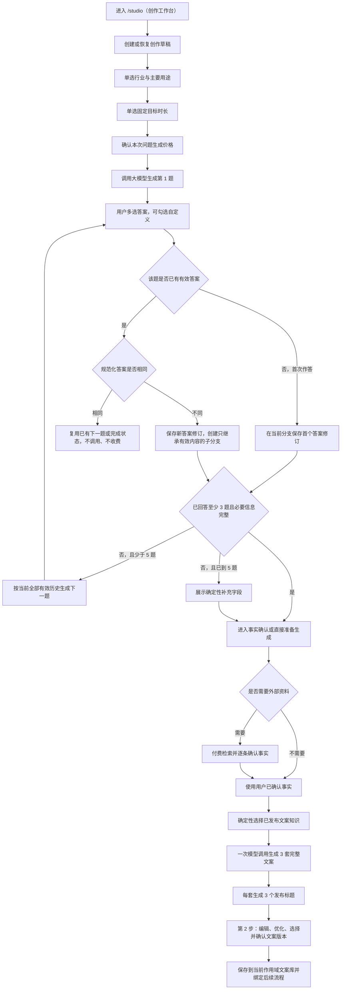
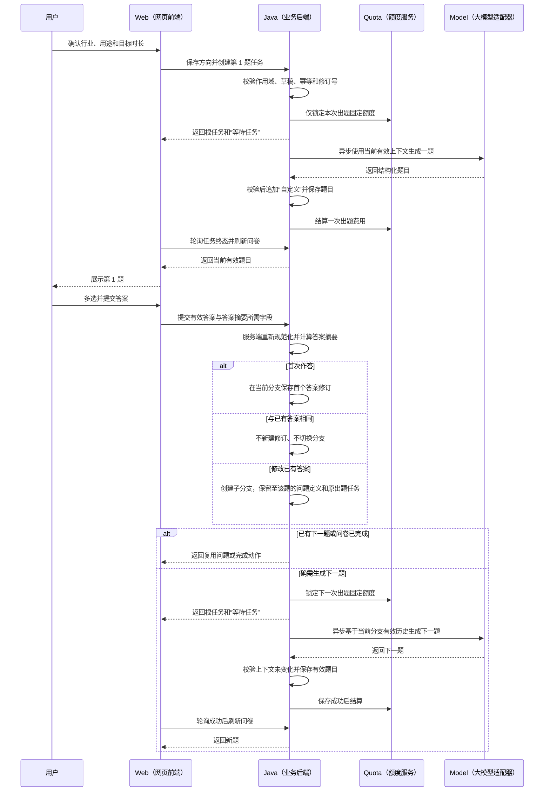
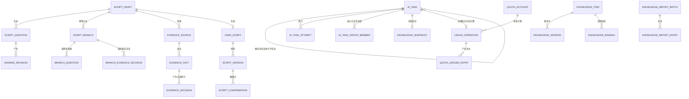

# “创作—说需求”自适应问卷与文案生成设计规格

- 日期：2026-07-28
- 状态：设计已逐节确认，等待用户审阅本规格
- 所属模块：视频创作
- 聚焦子流程：第 1 步“说需求”至第 2 步“确认文案”
- 用户端前端：`ai-video-ui/ai-video-webapp`
- 管理端前端：`ai-video-ui/ai-video-platform-ui`
- 后端：`ai-video-api`，用户端启动模块为 `ai-video-user-api`

## 1. 目标与结论

本规格把当前 `/studio` 页面中静态演示的“说需求”步骤改造成可恢复、可追踪、可计费、可审计的正式创作流程：

1. 用户先确认行业和主要视频用途。
2. 系统每次只调用一次大模型生成下一道问题，不预先生成整套问题。
3. 动态问题全部为多选题，并由服务端统一追加“自定义”选项。
4. 动态问题总数为 3～5 道；第 5 道后仍缺少必要信息时，改用确定性的结构化补充字段。
5. 用户确认可用事实后，系统从已发布的文案知识中确定性选择知识组合，再通过一次文案生成调用返回 3 套完整候选文案，每套包含 3 个发布标题。
6. 每次成功生成一道新问题都独立结算；最终文案生成、外部资料检索、文案重新生成和文案优化分别按各自价格项结算。
7. 每次额度锁定、结算、释放、退款或补偿都产生不可修改、不可删除的详细流水。
8. 用户文案进入当前个人或组织作用域内的“我的文案库”；平台知识进入管理员维护的“系统知识中心”，二者不混用、不自动回流。

本规格不是最小可行产品裁剪。它覆盖本子流程正式上线所需的用户页面、管理页面、后端领域、接口、任务、额度、权限、资料导入、异常状态、测试和协作契约。

## 2. 范围、非目标与规格优先级

### 2.1 本期范围

本期包含三个互相依赖的界面范围：

- 用户端 `/studio` 中的“说需求”和“确认文案”。
- 用户端侧边导航中的“文案”，即当前个人或组织作用域内授权可见的“我的文案库”。
- 管理端“系统知识中心”中的分类、导入、审核、版本和发布能力。

本期包含以下后端能力：

- 创作草稿、方向选择、自适应问卷、固定补充字段和事实确认。
- 文案知识确定性路由、知识快照、提示词版本和模型调用。
- 3 套候选文案、编辑版本、优化版本和确认版本。
- 统一异步任务、幂等、重试、旧结果保护和任务中心聚合。
- 创作端最小身份与工作区基础：个人/组织工作区上下文、组织成员关系、角色到动作映射和核心授权服务。
- 个人或组织作用域下的资源归属、协作授权，以及按单次成功生成结算的额度操作记录与明细流水。
- 系统知识导入、审核、发布、停用和来源追踪。

### 2.2 本期非目标

以下内容明确不在本期实现：

- 向量检索索引。未来可增加向量检索，但关系型数据库仍是知识的唯一事实源，向量索引只能重建，不能决定最终模板或强制规则。
- 用户自建“生成模板”。
- 用户文案自动进入系统知识中心。
- 未脱敏用户数据参与平台知识沉淀。
- 分镜知识和成片制作知识实际参与本次文案生成。
- 让运行中的生产服务直接读取开发机上的 `D:\Workspace\ai\projects\文案`。
- 为接口路径预先增加 `/v1`（第 1 版）之类的版本段。
- 运营人员冒充创作端用户登录、签发创作端令牌或继承创作端角色权限。运营端只能通过独立管理接口维护创作端账号、角色、客户端、会话和组织成员关系，并留下运营主体审计。

### 2.3 与已有文档的关系

本规格继承并遵守：

- `RULES.md`
- `docs/API_CONTRACT.md`
- `docs/DOMAIN_MODEL.md`
- `docs/ASYNC_TASKS.md`
- `docs/ARCHITECTURE.md`
- `docs/FRONTEND_GUIDE.md`
- `docs/BACKEND_GUIDE.md`
- `docs/AI_CODING_RULES.md`
- `ai-video-ui/ai-video-webapp/PRD.md`

文案方法来源：

- 用户最初提供：`D:\Workspace\ai\projects\文案\文案生成流程.md`
- 本次采用的规范化主版本：`D:\Workspace\ai\projects\文案\fenjing\wenan\文案写作逻辑\文案生成流程规范.md`
- 待分类资料根目录：`D:\Workspace\ai\projects\文案\fenjing`

发生冲突时，本规格对以下范围具有更高优先级：

- `docs/superpowers/specs/2026-07-14-template-driven-script-generation-design.md` 中“一次只匹配一个模板、一次只生成一套台词”的内容，由本规格的“三套兼容候选方案”替代。
- `docs/superpowers/specs/2026-07-14-digital-human-a2-glm52-guided-flow-design.md` 和现有产品需求文档中与“动态题型、答案修改后的失效范围、题目生成时机、候选数量、逐次计费”冲突的内容，以本规格为准。
- `docs/superpowers/specs/2026-07-07-user-auth-login-design.md` 和对应实现计划中的 `ai_user + userType + StpUtil`（用户表加用户类型加默认登录工具）方案，由本规格的 `P0-A`（账号与安全底座）完整替代；旧文档只能用于追溯，不得继续执行。
- 其他数字人步骤、声音、形象、底片、时间轴和作品规则不受影响。

实施时必须同步修订上述公共文档中的冲突段落，不能长期保留两套可被不同理解的规则。

### 2.4 实施包边界和依赖顺序

本规格是一个业务闭环的总契约，但不能被误写成前后无检查点的一条超长编码清单。后续 `writing-plans`（编写实现计划）必须输出一个主计划和以下七个有顺序依赖的实施包：

| 实施包 | 中文范围 | 前置依赖 | 契约负责人 |
| --- | --- | --- | --- |
| `P0-A-identity-security` | 账号与安全底座：独立创作端用户、认证客户端、登录方式、令牌会话、角色权限、登录日志、安全审计，以及运营端对这些对象的独立管理入口 | 公共身份与认证契约先更新 | 安全契约负责人 |
| `P0-B-workspace-authorization` | 工作区与组织授权：个人工作区、组织、成员、组织角色、切换、对象授权、数据范围和修订失效 | `P0-A-identity-security` | 授权契约负责人 |
| `P0-C-business-foundation` | 通用业务底座：方向目录、草稿入口、统一任务、任务中心接口、额度账户、价格版本、不可变详细流水和操作槽幂等 | `P0-B-workspace-authorization` | 后端业务契约负责人 |
| `P1-knowledge` | 系统知识中心、文案知识版本、绑定、受控导入和确定性路由 | `P0-C-business-foundation` 的任务能力 | 管理端与知识契约负责人 |
| `P2-questionnaire` | 行业用途与时长、逐题问卷、答案修订、固定补充和证据确认 | `P0-C-business-foundation`；使用 `P1-knowledge` 的已发布目录契约 | 用户端创作契约负责人 |
| `P3-script` | 三候选生成、知识快照、文案版本、优化、确认和用户文案库 | `P0-C-business-foundation`、`P1-knowledge`、`P2-questionnaire` | 文案生成契约负责人 |
| `P4-integration` | 任务中心聚合、账单、通知接入、端到端测试、资料迁移和灰度 | 前六包完成 | 本模块总契约负责人 |

范围约束：

- 七个实施包共同交付本规格，不拆成互不兼容的独立产品。
- 每个包结束时先冻结数据库、接口、状态和测试证据，再允许下一个依赖包合入。
- `P0-A-identity-security` 必须独立可部署、可登录、可管理、可审计并通过双向越权测试；它未通过时不得开始工作区或收费业务。
- `P0-B-workspace-authorization` 必须通过个人/组织工作区、成员修订、对象授权和数据范围测试；它未通过时不得创建草稿、任务、额度账户或业务资源。
- `P0-C-business-foundation` 只建设本规格所需的最小公共任务和额度能力，不顺带实现视频、声音等其他模块尚未确认的计费策略。
- `P1-knowledge` 对分镜、成片和原始记录只提供统一分类、来源、版本、导入和查询能力；本期不实现这些领域的生成路由。
- 通知只接入已有通知中心契约，不在本规格内重做完整消息平台。
- 跨包字段、状态、错误码或结算语义变化必须由本模块总契约负责人组织前端、后端和联调三方审查。

## 3. 当前实现基线与差距

### 3.1 用户端前端现状

当前页面入口为 `http://localhost:8000/studio`，路由定义在：

- `ai-video-ui/ai-video-webapp/config/routes.ts`
- `ai-video-ui/ai-video-webapp/src/pages/digital-human-studio/index.tsx`

当前相关组件：

- `steps/DemandStep.tsx`：行业、用途和本地问答演示。
- `steps/ScriptStep.tsx`：固定文案版本和本地编辑演示。
- `model.ts`：页面静态数据和本地状态。
- `components/LibraryView.tsx`：包含静态“文案”列表。

当前差距：

- 行业、用途、问题和文案均为前端硬编码。
- 问题不是服务端逐题生成，也没有答案版本和分支失效。
- “生成文案”仅切换步骤，没有真实接口、任务、额度或知识选择。
- 页面可以绕过问卷完成条件进入后续步骤。
- 刷新后无法按后端草稿恢复。
- “我的文案”没有真实版本、关联关系和归属校验。

### 3.2 后端现状

- `ai-video-api/ruoyi-modules/ai-video` 只有空目录，没有可用的 Maven（Java 项目构建工具）模块描述、业务代码和数据库脚本。
- `ai-video-user-api` 当前直接依赖多个共享模块，尚未形成用户端业务接口边界。
- 当前仓库尚未实现 PRD（产品需求文档）要求的 `app_user`（创作端用户）、独立登录会话、创作端角色权限、`app_org_member`（组织成员）和当前工作区；它们分别是本规格 `P0-A`（账号与安全底座）和 `P0-B`（工作区与组织授权）硬前置，不得继续沿用运营端 `sys_user`（系统用户）身份或角色来代替。
- `ruoyi-ai` 现有能力不能替代本功能的领域、权限、任务、额度和版本逻辑；它最多作为某个模型提供商适配器。
- 本地已存在项目规则要求的 `ai-video-api/.codex/skills/ruoyi-plus-ai-coding/SKILL.md`（RuoYi Plus 人工智能编码规范）。进入后端实施前必须读取该技能，并按其要求继续阅读后端参考、代码生成模板与相似模块；如果后续工作区缺失该文件，才回退到官方 6.X 分支获取或等待团队安装。

### 3.3 文案资料现状

`fenjing` 目录并不是同一种“文案库”，而是混合了正式知识、训练材料、分镜规则、成片制作规则、原始记录和压缩归档。生产运行时不能把整个目录直接塞给大模型，也不能按文件夹名称粗略判断用途。

## 4. 术语与不可变业务决策

| 术语或代码 | 中文含义 | 本规格定义 |
| --- | --- | --- |
| `systemKnowledgeCenter` | 系统知识中心 | 管理员维护的平台知识总入口，包含四个知识领域。 |
| `copywritingKnowledge` | 文案知识库 | 系统知识中心中唯一参与本期文案生成的知识领域。 |
| `userScriptLibrary` | 用户文案库 | 个人或组织作用域内按所有权和协作授权隔离的生成、编辑、优化和确认文案，不是系统知识。 |
| `draft` | 创作草稿 | 一次“说需求”到文案确认的可恢复业务容器。 |
| `branchRevision` | 创作分支修订号（问卷阶段简称问卷分支） | 已保存的方向、答案、补充或事实决定被不同有效值替换时递增；正常首次补充信息不递增，用于阻止旧任务覆盖新分支。 |
| `answerHash` | 答案摘要 | 规范化有效答案的 SHA-256（安全摘要算法）结果。 |
| `generationContextRevision` | 生成上下文修订号 | 任一有效生成输入首次增加、替换或移除时递增；模型任务同时冻结该修订号和输入摘要，用于防止事实或答案竞态。 |
| `knowledgeSnapshot` | 知识快照 | 某次生成实际使用的知识版本、片段、绑定规则和摘要的不可变记录。 |
| `promptVersion` | 提示词版本 | 某次模型调用使用的已发布提示词版本。 |
| `idempotencyKey` | 幂等键 | 防止重复提交产生重复任务和重复扣费的客户端请求标识。 |
| `tariffVersion` | 价格规则版本 | 某次操作锁定并结算时使用的固定价格版本。 |
| `attempt` | 提供商调用尝试 | 当前执行子任务对模型或检索提供商的一次真实请求记录，和扫描器租约次数分开。 |
| `executionLease` | 执行租约 | 扫描器领取或恢复同一执行子任务时使用的限时所有权；过期工作器不能写尝试、成本、业务结果或终态。 |
| `resourceScope` | 资源作用域 | 从创作端登录上下文派生的个人或组织作用域，决定租户、所有者、协作授权和数据范围。 |
| `billingSubject` | 计费主体 | 草稿创建时冻结的发起用户个人额度主体；任务不能在运行中切换用户或主体。 |

以下决策不可在实施中自行改动：

1. 行业和主要用途是流程前置条件，均为单选；二者可以选择“自定义”并输入文本。
2. 所有大模型生成的动态问题只能多选。
3. 每道动态问题必须由服务端追加稳定代码为 `custom`（自定义）的选项。
4. 选中“自定义”时文本必填；取消勾选后该文本不提交、不进入答案摘要、不进入模型上下文，但前端保留当前输入草稿。
5. 问题逐题生成，绝不一次生成全部问题。
6. 动态问题为 3～5 道；第 5 道后不再调用模型出题。
7. 修改历史答案时，只有规范化后的有效答案真正变化，才创建新答案修订、使下游失效并重新调用。
8. 相同稳定选项代码加相同规范化自定义文本视为“答案未变化”，不创建修订、不使下游失效、不调用模型、不收费。
9. 最终固定生成 3 套完整候选文案，每套固定返回 3 个发布标题。
10. 最终 3 套候选在一次正常模型请求中整包生成，属于一次文案生成价格项，而不是三次收费；受控失败重试仍整包生成且不增加结算次数。
11. 用户明确确认的外部事实才能进入文案；无来源、有冲突或尚未确认的外部事实不能进入。
12. 用户端和管理端接口路径当前不带 `/v1`（第 1 版）。只有未来确实需要长期并存的不兼容契约时才新增 `/api/v2`（第 2 版）。
13. 所有草稿只从创建时冻结的发起用户个人额度账户扣费；组织工作区不拥有独立额度账户，个人额度不足时不得自动改扣其他用户或其他主体账户。

## 5. 端到端流程



### 5.1 问卷逐题时序



## 6. 用户流程与交互规则

### 6.1 草稿创建和恢复

- 进入 `/studio`（创作工作台）时先读取第 11.1 节工作区接口；没有已选择工作区时默认个人工作区。页面在创作标题区显示当前个人或组织名称，并允许从当前用户有权使用的工作区列表切换；本期不在该入口提供创建组织或管理成员能力。
- 首次进入创作时调用 `POST /api/studio/script-drafts`（创建创作草稿）。
- 创建时从创作端认证会话冻结当前 `resourceScope`（资源作用域）和 `billingSubject`（计费主体）：个人工作区形成个人草稿，组织工作区形成组织草稿，但两者的计费主体都固定为实际发起用户的 `app_user` 个人账户；请求对象不得上传或覆盖用户、组织、租户和计费主体编号。
- 切换当前工作区只影响之后新建或查询的资源，不改变已经创建草稿的所有者和计费主体。存在未提交页面输入时先提示保存或放弃；打开的草稿不属于切换后工作区时返回其原工作区摘要并要求用户显式切回，不能悄悄重绑草稿。
- 新草稿初始 `draftRevision = 0`（草稿修订号为 0）、`branchRevision = 1`（首个创作分支为 1）、`generationContextRevision = 0`（生成上下文修订号为 0），并创建空的当前 `av_script_branch`（创作分支）记录。
- 页面地址使用 `/studio?draftId={draftId}`（草稿编号参数）恢复，不新增顶层创作步骤。
- 刷新、重新登录或从任务中心返回时，以后端草稿快照恢复业务状态。
- 纯界面草稿，例如当前未提交的自定义文本、展开状态和编辑器光标，可以由前端状态保存；它们不能改变后端有效答案。
- 草稿不存在、已删除，或当前用户不在草稿租户范围且没有对象级协作授权时，不能自动新建同名草稿掩盖错误，应显示明确的不存在或无权限状态。

### 6.2 行业、主要用途与固定目标时长

行业字段：

| 字段 | 规则 |
| --- | --- |
| `industryCode`（行业稳定代码） | 必填、单选，来自已启用行业目录。 |
| `industryLabel`（行业展示名称） | 只读展示，不作为业务判断值。 |
| `industryCustomText`（自定义行业文本） | 只有代码为 `custom`（自定义）时必填；取消选择后不提交；上限 100 个 Unicode（统一字符编码）字符。 |
| `industryCatalogVersion`（行业目录版本） | 后端保存，前端不能伪造。 |

用途字段：

| 字段 | 规则 |
| --- | --- |
| `purposeCode`（用途稳定代码） | 必填、单选，只显示与当前行业绑定且已启用的用途。 |
| `purposeLabel`（用途展示名称） | 只读展示。 |
| `purposeCustomText`（自定义用途文本） | 只有代码为 `custom`（自定义）时必填；上限 100 个 Unicode（统一字符编码）字符。 |
| `purposeCatalogVersion`（用途目录版本） | 后端保存。 |

固定目标时长：

| 字段 | 规则 |
| --- | --- |
| `targetDurationSeconds`（目标时长秒数） | 必填、单选，只允许 30、45、60、90、120。 |
| `durationRuleVersion`（时长规则版本） | 后端保存，用于追溯当时的字数和容差规则。 |

目标时长是确定性创作约束，不交给动态问题询问，避免“动态题必须多选”和“目标时长只能有一个”发生冲突。用户先确认行业和用途，再选择目标时长，之后才开始第一次付费出题。

交互规则：

- 修改行业后重新加载用途；当前用途不再兼容时必须清空并提示。
- 行业、用途或目标时长的规范化值未变化时，不递增草稿修订号，也不影响问卷。
- 首次把行业、用途和目标时长从空值保存为完整方向时，只递增草稿修订号和生成上下文修订号，不递增分支修订号。
- 已保存方向中的任一规范化值真正变化时，按第 6.4 节创建新分支，问卷、事实检索和候选文案旧后缀保留为历史但不再属于当前分支；用户确认预计重新生成费用后才能开始新分支。
- 保存方向和目标时长本身不收费；成功生成第 1 题才结算第 1 次出题费用。

### 6.3 动态问题契约

每道模型生成的问题必须满足：

- 题目正文清晰且只询问一个主题。
- 模型原始输出包含 2～6 个互不重复的业务选项。
- 所有选项均有稳定代码和中文标签。
- 模型原始输出禁止包含“自定义”“其他”或同义保留选项；一旦出现，整份原始输出按结构无效处理。只有原始输出通过校验后，服务端才统一在末尾追加 `{ code: "custom", label: "自定义" }`。
- `selectionMode`（选择模式）固定为 `multiple`（多选）。
- 至少选择一个选项后才能提交。
- 可返回 `recommendedOptionCodes`（推荐选项代码），页面可以标注“推荐”，但不能自动替用户提交。
- 题目保存其目标信息槽代码，用于服务端判断哪些必要信息已经覆盖。

问题页展示字段：

| 字段 | 展示或编辑 | 规则 |
| --- | --- | --- |
| 当前题号和最多 5 题提示 | 展示 | 显示“第 N 题，最多 5 题”，不虚构固定总题数。 |
| 问题正文 | 展示 | 来自已保存的有效问题版本。 |
| 选项 | 编辑 | 复选框语义，支持键盘操作。 |
| 推荐标记 | 展示 | 只提示，不代替用户决定。 |
| 自定义文本 | 编辑 | 选中“自定义”后必填，上限 500 个 Unicode（统一字符编码）字符。 |
| 本次预计扣费 | 展示 | 生成下一题前展示价格名称、数量和余额。 |
| 返回上一题 | 操作 | 只切换查看，不立即修改数据；当前有效分支内尚未失效的已回答历史题都允许进入编辑态。 |
| 提交并继续 | 操作 | 可以提交当前未回答题，也可以提交当前有效分支内的已回答历史题；保存答案后，确需下一题时创建一次生成任务。 |

### 6.4 有效答案规范化与摘要

服务端是答案摘要的唯一权威计算方，前端计算只能用于提前提示。

规范化步骤固定为：

1. 验证提交的问题属于当前草稿、当前分支且尚未失效；它可以是当前未回答题，也可以是已回答的有效历史题，其他分支、已失效或不属于该草稿的问题一律拒绝。
2. `selectedOptionCodes`（已选普通选项代码）只能包含该问题的普通业务选项，禁止包含服务端保留代码 `custom`（自定义）；去重并按稳定选项代码升序排列。
3. `customSelected`（是否选择自定义）是自定义选项的唯一提交标志；普通选项数组非空或该标志为真，二者至少满足一个。
4. 若 `customSelected`（是否选择自定义）为假，从有效请求中移除自定义文本；若为真，对文本执行 Unicode NFC（统一字符规范形式）、首尾空白删除、连续空白折叠和换行规范化。
5. 形成规范 JSON（结构化数据文本）：问题编号、问题版本摘要、有序选项代码、自定义是否选中、选中时的规范化文本。
6. 对规范 JSON 计算 SHA-256（安全摘要算法），得到 `answerHash`（答案摘要）。

当前问题还没有任何有效答案时，属于“首次作答”：

- 创建第 1 条不可变答案修订，并把它加入当前问卷分支。
- `draftRevision`（草稿修订号）和 `generationContextRevision`（生成上下文修订号）各递增一次。
- `branchRevision`（问卷分支修订号）不递增，不创建新分支，也不改变当前问卷任务组。
- 确需下一题时，在同一分支任务组中创建下一题任务。

同一问题已经有有效答案且最新答案摘要相同时：

- 不创建新的答案修订。
- 不递增 `draftRevision`（草稿修订号）或 `generationContextRevision`（生成上下文修订号）。
- 不递增 `branchRevision`（问卷分支修订号）。
- 不使任何后续问题、答案、证据或文案失效。
- 已存在下一题时直接返回该题。
- 问卷已完成时直接返回当前完成状态。
- 前一次下一题生成失败时，允许用户用新的 `idempotencyKey`（幂等键）重新发起任务；失败调用未结算。
- 不存在新模型调用时不得产生额度流水。

同一问题已经有有效答案且摘要不同时，属于“修改已有答案”：

- 保存不可变的新答案修订。
- 新修订通过 `supersedesAnswerRevisionId`（替代的答案修订编号）指向旧修订；旧修订本身不修改、不删除，父分支仍引用它。
- `draftRevision`（草稿修订号）、`branchRevision`（问卷分支修订号）和 `generationContextRevision`（生成上下文修订号）各递增一次。
- 创建新的当前问卷分支，记录父分支和分叉题；复制该题之前的有效问题成员，并让分叉题指向新答案修订，不复制该题之后的后缀。
- 父分支及其问题、答案、任务和费用保持历史事实，不物理删除；原后缀只是不再属于新的当前分支。
- 新任务必须携带新的分支修订号；旧分支任务返回时不得写入当前分支。
- 页面必须先提示：“答案发生变化，后续内容将重新生成并按成功次数收费。”

创作分支和任务组的成员关系固定为：

- `av_script_branch`（创作分支表）保存草稿、分支修订号、父分支、分叉原因/题序、准确方向修订、准确补充修订、状态和审计信息。
- `av_script_branch_question`（分支问题成员表）按题序保存该分支当前采用的问题、答案修订和来源根任务；新分支显式复制有效前缀成员，因此当前题数不依赖“猜测祖先记录是否仍有效”。
- `av_script_branch_evidence_decision`（分支事实决定成员表）保存该分支当前采用的事实决定修订；同一事实在同一分支最多采用一个修订。
- `av_ai_task_group_member`（任务组成员表）把根任务以 `origin`（本分支产生）或 `inherited`（从父分支继承）角色加入任务组；同一根任务可以被多个历史或当前分支引用，但计费操作和额度流水永远只有原始一份。
- 新分支任务组只继承该分支实际保留的问题定义所对应的根任务，不继承被移除的失效后缀；新生成的问题任务以 `origin`（本分支产生）加入。
- 修改第 N 题已有答案时，新分支保留第 1～N 题的问题定义，因此其任务组必须把产生第 1～N 题的原出题根任务全部以 `inherited`（从父分支继承）加入；其中明确包含第 N 题自己的原出题根任务。第 N+1 题及以后根任务不继承。基于第 N 题新答案生成的新第 N+1 题根任务才以 `origin`（本分支产生）加入并按新成功生成次数结算。
- 当前分支的题数和进度从分支问题成员表计算；任务组费用按成员引用的不同 `usageOperationId`（计费操作编号）去重汇总，并分别标识“此前已付”和“本分支新增”，继承不会再次扣费。

不同分叉原因的上下文继承规则：

| 分叉原因 | 方向 | 问题/答案 | 固定补充 | 事实决定 | 旧候选文案 |
| --- | --- | --- | --- | --- | --- |
| 修改已保存方向 | 使用新方向修订 | 不继承 | 不继承 | 不继承 | 不继承 |
| 修改第 N 题已有答案 | 继承 | 继承第 1～N-1 题；第 N 题沿用问题定义并使用新答案修订 | 不继承 | 不继承 | 不继承 |
| 修改已保存补充字段 | 继承 | 全部继承 | 使用新补充修订 | 不继承 | 不继承 |
| 修改已有事实最终决定 | 继承 | 全部继承 | 继承 | 继承其他事实的决定；目标事实使用新决定修订 | 不继承 |

“不继承”只表示该数据不属于新当前分支，父分支历史记录保持不变。一次批量事实决定修改只创建一个子分支，并在同一事务中复制未变化决定、替换变化决定。

答案保存和下一题付费任务采用两个明确阶段：先持久化免费答案及分支变化，再尝试创建下一题任务。若此时额度不足或价格版本变化，答案仍然保存成功，接口返回“待补充额度”或“待重新确认价格”的下一动作，不回滚用户答案。用户处理阻塞原因后，可以基于同一有效答案和新的幂等键继续生成下一题。

取消勾选“自定义”时：

- 前端 `customDraftByQuestionId`（按问题保存的自定义输入草稿）仍保留文本。
- 提交载荷不得包含该文本，或者必须把它明确置为不参与业务的空值；推荐直接不发送。
- 该文本不得进入答案摘要、模型上下文、日志或计费明细。
- 用户再次勾选时，前端恢复尚未清除的输入草稿。
- 用户主动点击“清空”或离开草稿并选择放弃未提交内容时才删除该前端草稿。

三个修订号的唯一递增规则如下：

| 写入场景 | `draftRevision`（草稿修订号） | `branchRevision`（分支修订号） | `generationContextRevision`（生成上下文修订号） | 下游处理 |
| --- | --- | --- | --- | --- |
| 首次保存方向，或首次增加答案、补充字段、事实最终决定 | `+1` | 不变 | `+1` | 在当前分支继续，不丢弃已有有效前缀。 |
| 保存后的规范值与当前有效值完全相同 | 不变 | 不变 | 不变 | 纯幂等复用。 |
| 用不同有效值替换或移除已保存的方向、答案、补充字段或事实最终决定 | `+1` | `+1` | `+1` | 新建子分支，只继承仍有效前缀，旧后缀保留为历史。 |
| 创建任务、任务进度变化、保存外部检索候选、自动重试 | 不变 | 不变 | 不变 | 使用独立任务、结果和证据版本，不把派生状态伪装成用户输入修订。 |
| 人工编辑或人工智能优化产生文案子版本 | 不变 | 不变 | 不变 | 只新增不可变文案版本。 |
| 首次确认或改为确认另一个当前分支文案版本 | `+1` | 不变 | 不变 | 新增确认记录并更新步骤守卫，不改变生成输入。 |

写接口修订号校验矩阵：

| 写接口 | 请求必须携带 | 成功响应必须返回 |
| --- | --- | --- |
| 保存方向、开始问卷、提交问答、保存补充、创建证据检索、保存事实决定、创建三候选文案 | `draftRevision + branchRevision`（草稿修订号＋分支修订号） | 最新 `draftRevision + branchRevision + generationContextRevision`（三个修订号）。 |
| 确认文案 | `draftRevision + branchRevision + generationContextRevision`（草稿修订号＋分支修订号＋生成上下文修订号）和准确文案版本 | 最新三个修订号。 |
| 保存人工编辑版本、创建文案优化 | 准确父文案版本编号；优化还携带来源分支编号 | 新文案版本编号；不改变草稿输入修订号。 |
| 取消任务 | 根任务编号和任务自身状态版本 | 最新任务状态版本；不改变草稿输入修订号。 |

所有携带草稿修订号的请求必须同时精确匹配当前草稿修订号和分支修订号，不能只校验其中一个；确认文案还必须匹配当前生成上下文修订号，并由服务端比较版本冻结的输入摘要。后台任务必须冻结并在落库前的独立结果事务中锁定当前草稿/分支，重新核对 `branchRevision`（分支修订号）、`generationContextRevision`（生成上下文修订号）和 `generationInputHash`（生成输入摘要）。

`generationInputHash`（生成输入摘要）由服务端对规范 JSON（结构化数据文本）计算 SHA-256（安全摘要算法），字段顺序固定为：方向目录版本、行业/用途代码及有效自定义文本、目标时长、按题序排列的当前分支问题编号和答案摘要、规范化补充字段、按事实编号排序的已接受事实编号及其当前决定修订号。待确认、拒绝、冲突事实和未选自定义草稿不进入摘要。任何任务只使用创建时冻结的摘要，不能在执行过程中重新拼入后来变化的数据。

### 6.5 问题数量和完成判断

- 前 3 道动态问题必须逐道生成和回答。
- 第 1～3 题的主要目标槽顺序固定为 `subject`（创作对象）、`audience`（目标受众）、`coreMessage`（核心信息）；问题正文和选项仍根据行业、用途、时长和全部有效历史自适应生成。
- 前一题的选项即使顺带贡献了后续目标槽，第 2、3 题仍分别对其目标槽进行细化，因此不发生“信息提前完整后无合法第 3 题”的冲突。
- 回答第 3 道或第 4 道后，后端根据问题已覆盖的信息槽和有效答案执行确定性完整度检查。
- 必要信息已完整时不再创建出题任务，直接进入事实确认或文案准备状态。
- 必要信息不完整且当前少于 5 道时，才创建下一道出题任务。
- 回答第 5 道后永不再调用模型生成第 6 道。

第 4、5 题只在仍有缺失槽时生成，目标槽按 `subject`（创作对象）、`audience`（目标受众）、`coreMessage`（核心信息）、`callToAction`（行动号召）、`mustKeepFacts`（必须事实）、`prohibitedContent`（禁止内容）的固定优先顺序选择第一个未完整项。没有缺失槽时停止出题。

动态问卷必须采集的必要信息槽：

| 信息槽代码 | 中文含义 | 完成条件 |
| --- | --- | --- |
| `subject` | 要介绍的产品、服务、知识或事件 | 有明确对象和基础说明。 |
| `audience` | 目标受众 | 至少有一类目标人群。 |
| `coreMessage` | 核心卖点或核心观点 | 至少有一个用户确认的重点。 |

`targetDuration`（目标口播时长）不计入模型问卷的信息槽覆盖判断，它已经在开始问卷前由固定单选字段采集。进入文案生成前仍要对行业、用途、目标时长以及上表三个内容槽执行整体校验。

条件性信息槽：

- `callToAction`（行动号召）：获客、销售、活动或到店用途需要。
- `mustKeepFacts`（必须保留事实）：用户声明有强制事实时需要。
- `prohibitedContent`（禁止内容）：受监管行业或用户声明限制时需要。
- `toneStyle`（语气风格）：未填写时可使用用途绑定的已发布默认值，不阻塞生成。

问题生成时保存它计划覆盖的信息槽；选项答案至少命中一个有效选项后，该信息槽视为已采集。后端仍需对空泛的自定义文本执行长度和有效字符校验，不能只凭模型声称“已完整”。

### 6.6 第 5 题后的确定性补充字段

固定补充字段不是“第 6 题”，不调用出题模型，也不产生出题费用。页面只展示仍缺少的必要或条件性字段：

| 字段 | 控件 | 必填规则 |
| --- | --- | --- |
| 产品、服务、知识或事件说明 | 多行文本 | `subject`（创作对象）缺失时必填，1～2000 个字符。 |
| 目标受众 | 标签多选加自定义输入 | `audience`（目标受众）缺失时必填；1～8 项，每项规范化后 1～100 个字符。 |
| 核心卖点或观点 | 可新增条目的多值输入 | `coreMessages`（核心信息列表）缺失时必填；1～8 项，每项 1～300 个字符。 |
| 目标时长 | 单选 | 仅旧草稿或异常恢复时缺失才展示并必填：30、45、60、90、120 秒；新草稿在问卷前已填写。 |
| 行动号召 | 单行或多行文本 | `callToAction`（行动号召）条件性需要时必填，1～500 个字符。 |
| 必须保留的事实 | 多值输入 | `mustKeepFacts`（必须保留事实列表）在用户声明存在时必填；1～10 项，每项 1～500 个字符。 |
| 禁止出现的内容 | 多值输入 | `prohibitedContents`（禁止内容列表）在受监管或用户声明限制时必填；1～10 项，每项 1～300 个字符。 |
| 语气和风格 | 多选加自定义输入 | `toneStyles`（语气风格选择列表）最多 5 项，每项精确为 `{code, customText}`。普通项的 `code` 不能为保留值 `custom`，规范化后为 1～100 个字符，且 `customText = null`；自定义项的 `code` 固定为 `custom`，最多一项，`customText` 规范化后 1～200 个字符。无值时使用用途默认值。 |
| 其他说明 | 多行文本 | `otherNotes`（其他说明）可选，上限 2000 个字符。 |

所有补充字符串执行与自定义答案相同的 Unicode（统一字符编码）规范化、空白折叠和有效字符校验；数组去重后保存，`toneStyles` 普通项按规范代码去重，自定义代码 `custom` 最多出现一次且只有它允许非空 `customText`。全部补充字段规范化文本合计不得超过 16,000 个字符。补充字段保存后重新运行确定性完整度校验，不再通过模型判断能否进入下一步。

### 6.7 外部资料检索与事实确认

外部资料检索是独立、可选、单独计价的操作：

- 用户主动选择“搜索公开资料”，或者系统根据用途提示“建议补充来源”时，页面展示本次价格后由用户确认发起。
- 检索结果必须记录标题、来源站点、可访问地址、抓取时间、摘要和支持的事实。
- 资料来源地址必须使用后端允许的 HTTP/HTTPS（网络传输协议）地址，并防止服务器端请求伪造、内网探测和不安全重定向。
- 一个资料来源可以拆出多条候选事实；用户决定的最小粒度是“事实”，不是整篇网页或整个来源。
- 每条候选事实的决定状态为 `pending`（待确认）、`accepted`（已接受）、`rejected`（已拒绝）或 `conflicted`（有冲突）。
- 只有用户明确设为 `accepted`（已接受）的事实才进入文案模型上下文。
- `pending`（待确认）、`rejected`（已拒绝）、`conflicted`（有冲突）以及没有来源的外部事实始终被排除。
- 每次事实最终决定的有效集合变化都更新 `generationContextRevision`（生成上下文修订号）和 `generationInputHash`（生成输入摘要）；替换已有最终决定时还按第 6.4 节创建新分支。
- 每个生成、人工编辑或人工智能优化得到的文案版本都必须冻结它所依据的 `branchRevision`（分支修订号）、`generationContextRevision`（生成上下文修订号）和 `generationInputHash`（生成输入摘要）。人工编辑与优化子版本完整继承父版本的这三个来源值，不能伪装成基于后来输入生成。
- 即使首次接受事实、首次增加补充等操作没有创建新分支，只要生成上下文修订号或输入摘要变化，原候选及其子版本就立即成为“历史上下文版本”：记录不删除，但不得继续作为当前候选或被确认。草稿状态和步骤守卫按最新输入重新计算为待生成文案；页面提示用户需要重新生成。
- 当前分支存在 `script_generate`（生成三套文案）或 `script_optimize`（优化文案）运行任务时，事实决定、方向、答案和补充字段写接口返回 `GENERATION_CONTEXT_LOCKED`（生成上下文已锁定），不能边生成边修改。
- 即使并发请求越过界面禁用，任务落库前也必须重新核对事实决定修订、生成上下文修订号和输入摘要；任一不匹配都按旧分支结果丢弃并释放额度，不能保存候选。
- 待确认事实本身不阻塞生成；用户可以选择“跳过未确认事实并继续”，系统只使用已接受事实。页面若让用户临时勾选某条待确认事实，必须先完成“接受”提交才能把它用于文案。
- 冲突事实不能被接受；用户只能拒绝、跳过或重新检索，不能由系统自动择一。
- 用户在问卷和补充字段中主动提供的信息记为 `user_input`（用户输入）来源，视为用户确认，但页面不能把它包装成已被第三方验证。
- 未执行外部检索不阻塞文案生成；系统只能使用用户输入和已发布的写作知识。

### 6.8 最终三套文案

生成前必须满足：

- 行业、用途和必要信息槽完整。
- 不存在未处理的必填补充字段。
- 当前没有影响草稿分支的运行中任务。
- 用户已查看一次文案生成的价格和当前余额。
- 所有被选入上下文的外部事实均已接受；未选择的待确认事实被明确排除。

一次正常模型请求整包返回 3 套完整候选：

- 候选 A：确定性路由得分最高的兼容主模板，标记“推荐”。
- 候选 B、C：只要仍有尚未覆盖的兼容主模板，就优先各使用一个不同主模板；全部兼容模板都已覆盖后才允许通过不同角度或差异化技巧复用模板。
- 如果兼容主模板不足 3 个，允许复用同一主模板；三个方案的“主模板版本 + 表达角度 + 差异化技巧”组合必须不同，其中表达角度或差异化技巧至少一项不同，不要求两项同时不同。
- 禁止为了凑够 3 套而使用不兼容模板。
- 每套文案包含一个正文和恰好 3 个发布标题。
- 三套文案必须在开头、结构或表达角度上有可感知差异，不能只是同义词替换。
- 文案不得包含镜头指令，不得虚构价格、资质、数据、承诺或用户未确认的外部事实。

服务端校验：

- 恰好 3 套候选。
- 每套标题恰好 3 个，标题非空且不重复。
- 正文非空，单套正文上限为 20,000 个 Unicode（统一字符编码）字符；目标时长规则会施加更严格的业务长度范围。
- 引用事实均能关联到用户输入或已接受的外部候选事实。
- 使用的知识均为任务创建时已发布的版本。
- 输出结构不合法时，在同一根任务链中最多创建一个自动修复任务。
- 服务端重新计算字数和预计时长，不信任模型返回的数值。

字数和时长规则：

- `effectiveCharacterCount`（等效字符数）由后端统一工具计算：汉字按字符计数，连续拉丁字母或数字词按一个词元计数，空白和纯标点不计。
- 默认口播速度使用已版本化配置 `240` 等效字符/分钟。
- `estimatedDurationSeconds`（预计时长秒数）按 `ceil(effectiveCharacterCount × 60 ÷ charactersPerMinute)`（等效字符数乘 60 后除以每分钟字符数并向上取整）计算。
- 目标时长允许范围默认使用 ±15%，超出时将该候选判为不满足输出契约并进入一次修复重试。
- 速度和容差必须保存配置版本，后续调整不能改变历史文案的原始估算依据。

### 6.9 第 2 步“确认文案”

顶部仍保持现有 7 个创作步骤，“说需求”完成后进入第 2 步“确认文案”。

页面能力：

- 使用 A、B、C 三个候选标签页切换。
- 每套显示 3 个发布标题，允许选择一个作为当前标题。
- 显示正文、等效字符数、预计时长、使用的主模板名称和“为何推荐”摘要。
- 支持复制。
- 支持人工编辑；保存时创建新的不可变子版本，不覆盖来源版本。
- 支持“更短”“更口语”“强化卖点”“更换开头”“强化行动号召”和自定义优化。
- 每次人工智能优化创建独立任务和独立价格操作；成功后产生新的不可变子版本。
- 用户选择某个准确版本并点击“确认文案”后，创建确认记录并进入“我的文案库”。
- 确认前必须同时验证文案版本冻结的分支修订号、生成上下文修订号和生成输入摘要与草稿当前值完全一致；任一不一致都拒绝确认并刷新草稿。仅“仍在同一分支”不足以证明版本有效。
- 确认版本不能原地覆盖；继续编辑必须从它创建新版本并重新确认。
- 后续声音、数字人和作品只能绑定准确的确认版本编号。

进入第 3 步的守卫条件：

- 存在当前有效的文案确认记录。
- 确认记录属于当前草稿作用域，记录实际确认用户；确认用户必须具备该文案的确认动作授权。
- 确认版本未被删除或失效。
- 如果上游需求分支、生成上下文修订号或生成输入摘要发生变化，原确认记录不可继续用于当前输入。

## 7. 系统知识中心与用户文案库

### 7.1 为什么不是一个“系统文案库”

`D:\Workspace\ai\projects\文案\fenjing` 下的资料属于不同生产阶段。管理端统一命名为“系统知识中心”，避免把文案、分镜、音乐、表演和原始记录误认为同一种文案模板。

系统知识中心固定包含四个一级领域：

| 领域代码 | 中文名称 | 内容边界 | 本期是否参与生成 |
| --- | --- | --- | --- |
| `copywriting` | 文案知识库 | 写作模板、写作技巧、心理机制、案例和强制规则。 | 是 |
| `storyboard` | 分镜知识库 | 镜头拆分、景别、机位、运镜和分镜模板。 | 否 |
| `production` | 成片制作知识库 | 画面描述、字幕、画中画、配乐、音效、表演和调优。 | 否 |
| `raw_record` | 原始资料与过程记录 | 教师原始资料、样例、修改记录、交接文件、压缩包和过程配置。 | 否 |

一个知识条目只选择一个主要领域和一个主要类型，不要求每个“教材”固定同时包含模板、技巧、案例和规则。相关内容通过标签和绑定关系组合。

### 7.2 文案知识类型

| 类型代码 | 中文名称 | 用途 |
| --- | --- | --- |
| `template` | 主模板 | 决定一套文案的主要结构，只允许每个候选选一个。 |
| `technique` | 写作技巧 | 补充开头、转折、节奏、表达和行动号召方法。 |
| `psychology` | 用户心理机制 | 帮助确定诉求角度，不直接当作事实。 |
| `case` | 参考案例 | 提供表达参考，案例中的品牌、价格和数据不得复制为用户事实。 |
| `rule` | 强制规则 | 安全、结构、禁用内容、行业或平台约束；命中条件时必须应用。 |
| `source_material` | 待整理来源材料 | 尚未达到可发布知识标准的原始内容。 |
| `process_record` | 过程记录 | 修改记录、交接说明和整理过程，不直接参与生成。 |

其他三个领域的本期分类代码：

| 所属领域 | 类型代码 | 中文名称 |
| --- | --- | --- |
| 分镜知识 | `storyboard_template` | 分镜模板 |
| 分镜知识 | `shot_rule` | 镜头规则 |
| 分镜知识 | `storyboard_case` | 分镜案例 |
| 分镜知识 | `storyboard_training` | 分镜训练材料 |
| 成片制作知识 | `visual_description_rule` | 画面描述规则 |
| 成片制作知识 | `subtitle_rule` | 字幕规则 |
| 成片制作知识 | `picture_in_picture_rule` | 画中画规则 |
| 成片制作知识 | `music_sound_rule` | 配乐与音效规则 |
| 成片制作知识 | `performance_rule` | 表演规则 |
| 成片制作知识 | `production_case` | 成片制作案例 |
| 原始资料与过程记录 | `course_transcript` | 课程原文 |
| 原始资料与过程记录 | `sample_material` | 示例材料 |
| 原始资料与过程记录 | `revision_record` | 修改记录 |
| 原始资料与过程记录 | `handover_record` | 交接记录 |
| 原始资料与过程记录 | `archive_file` | 归档文件 |
| 原始资料与过程记录 | `tool_configuration` | 工具过程配置 |

本期只为这些类型提供公共元数据、来源、内容、版本、审核和查询；不设计分镜或成片生成专属结构，避免把后续子系统提前塞进本计划。

### 7.3 知识条目公共字段

每个知识条目都有公共元数据：

- 稳定代码、中文名称、所属领域、主要类型。
- 摘要、标签、适用行业、适用用途和适用视频类型。
- 来源文件、来源相对位置、导入批次和来源摘要。
- 当前已发布版本、状态、创建人、审核人、发布时间。

适用范围的权威来源固定为：

- 行业和用途代码来自已发布的 `av_direction_catalog_version`（方向目录版本），知识表只保存稳定代码引用。
- 视频类型代码来自已发布的 `av_video_type_rule`（视频类型规则）结果，不允许管理员在知识条目里临时输入自由文本类型。
- 标签代码来自 RuoYi 字典 `aivideo_knowledge_tag`（人工智能视频知识标签），中文标签可以调整，业务判断只用稳定代码。
- `*`（全部适用）是绑定层允许的显式通配值；空值不等于全部适用。

所有可参与生成的知识都通过统一绑定结构声明适用范围，不能假设技巧、心理或案例拥有主模板字段：

| 绑定字段 | 中文含义 | 空值和通配规则 |
| --- | --- | --- |
| `industryCode` | 行业代码 | 必填，精确代码或 `*`（全部适用）。 |
| `purposeCode` | 用途代码 | 必填，精确代码或 `*`（全部适用）。 |
| `videoTypeCode` | 视频类型代码 | 必填，精确代码或 `*`（全部适用）。 |
| `angleCodes` | 兼容表达角度 | 空数组表示全部角度；非空时必须命中当前方案角度。 |
| `anglePriorities` | 主模板角度优先级 | 仅主模板绑定允许填写，结构为 `{angleCode: integerPriority}`（角度代码到整数优先级）；键必须属于模板支持角度，值范围 -1000～1000，未列角度固定按 0 处理。其他知识类型必须为空对象。 |
| `minDurationSeconds` / `maxDurationSeconds` | 适用时长范围 | 两者同时为空表示全部时长；否则必须成对填写并包含目标时长。 |
| `requiredSlotCodes` | 前置信息槽 | 空数组表示无额外要求；非空时必须全部完整。 |
| `audienceTagCodes` | 目标受众标签 | 空数组表示无受众限制；非空时至少命中一个。 |
| `priority` | 管理员整数优先级 | 必填，范围 -1000～1000。 |
| `required` | 是否为强制知识 | 只有强制规则类型允许为真。 |
| `exclusionConditions` | 互斥条件 | 空数组表示没有；任一命中即排除。 |

发布校验会把所有未填写的数组规范为空数组，把适用代码规范为明确代码或 `*`（全部适用），禁止依赖数据库空值产生隐式含义。

类型专属内容按不同结构保存：

- 主模板：适用条件、结构步骤、时长范围、必需信息槽、互斥条件、支持的表达角度代码和正文规则。
- 写作技巧：稳定技巧代码、适用位置（开头、正文、转折或行动号召）、适用条件、技巧说明和反例。
- 心理机制：目标人群、诉求机制、适用条件和使用边界。
- 案例：案例正文、来源、脱敏状态和可借鉴点。
- 强制规则：稳定规则键、约束值、可选冲突组、触发条件、严重级别、禁止项和校验说明。

不允许为了让字段看起来统一而给所有类型塞入无意义的空模板字段。

### 7.4 知识版本和发布

- 草稿版本状态：`draft`（草稿）。
- 待审核状态：`reviewing`（审核中）。
- 可供生产使用状态：`published`（已发布）。
- 停止新任务使用状态：`retired`（已退役）。
- 已发布版本不可原地修改；编辑会创建新草稿版本。
- 同一知识条目同一时刻最多有一个当前已发布版本。
- 知识绑定同样不可原地修改；编辑绑定会在同一稳定绑定组下插入新版本并退役旧版本。
- 退役只影响新任务，历史任务仍能通过知识快照追溯旧版本。
- 删除知识条目前必须检查版本、绑定和历史快照引用；已有引用时只能逻辑删除或退役。
- 发布和退役必须记录管理员、时间、前后版本与操作原因。
- 生成快照记录准确的知识版本编号和绑定版本编号，不能只记录可变的稳定组代码。

提示词版本不是知识条目。本期提示词作为受控发布工件，通过数据库迁移或具备发布权限的运维流程写入 `av_prompt_version`（提示词版本表），不在“系统知识中心”混成一种教材。价格规则同样属于公共额度配置，不在知识管理页面维护。

### 7.5 知识确定性选择

生成前由 Java（后端业务层）执行确定性路由，不让大模型自己在整个知识库中自由挑选：

1. 根据行业、用途、有效答案和补充字段确定视频类型。
2. 只读取 `published`（已发布）的知识版本。
3. 用行业、用途、视频类型、目标时长、必需信息槽和互斥条件过滤主模板。
4. 按绑定优先级、专用程度和管理员配置排序。
5. 为候选 A 选择最高分主模板。
6. 为候选 B、C 选择其他兼容模板；不足时允许复用兼容主模板，但表达角度或差异化技巧至少一项必须不同。
7. 每个候选只选择一个主模板、最多 3 个相关技巧、最多 2 个心理机制、最多 2 个案例、全部命中的强制规则和用户确认事实。
8. 将三个已经确定的“写作方案”放入一次正常模型请求；受控重试仍发送完整三个方案。

向模型发送的不是整个知识库，只是本次选择的必要片段。模型不能替换主模板、移除强制规则或引用未发布知识。

视频类型使用路由器版本 `video-type-router-1`（视频类型路由第 1 版）：

1. 只评估已发布的视频类型规则。
2. 规则的全部必需条件都满足才算命中。
3. 多条命中时依次按管理员优先级降序、非通配条件数量降序、稳定规则代码升序裁决。
4. 没有命中时使用已发布的保底类型 `general_spoken`（通用口播）；保底规则缺失则返回知识配置错误，不让模型自行猜测类型。

主模板先执行硬过滤：

- 领域必须是文案知识、类型必须是主模板、版本必须已发布。
- 行业、用途和视频类型绑定必须为精确命中或显式 `*`（全部适用）。
- 目标时长必须落在模板允许范围。
- 必需信息槽全部存在。
- 任一互斥条件命中就排除。

通过硬过滤后按以下固定排序元组降序排列，最后一项升序：

1. 视频类型精确匹配优先于通配。
2. 用途精确匹配优先于通配。
3. 行业精确匹配优先于通配。
4. 目标时长范围越窄且仍包含目标值越优先。
5. 管理员配置的整数优先级越高越优先。
6. 稳定绑定组代码按字典序升序。
7. 稳定知识条目代码按字典序升序，保证完全并列时结果可重复。

一个知识条目命中多个已发布绑定版本时，把每个“知识版本 + 绑定版本”视为独立候选，按上表排序后只保留该知识条目的最高项；快照记录实际胜出的准确绑定版本。

知识数量上限：

- 每个候选恰好 1 个主模板。
- 写作技巧先按统一绑定执行硬过滤，再按“角度有明确命中优先、主模板排序元组、稳定代码”排序，直接取前 3 个；不足 3 个时全部取用，允许为 0。
- 心理机制的发布绑定必须至少在用途、视频类型或受众标签中声明一个非通配条件；命中后按“受众明确命中优先、用途/视频类型明确命中优先、优先级、稳定代码”排序，直接取前 2 个；允许为 0。
- 参考案例的发布绑定必须至少在行业、用途或视频类型中声明一个精确条件，禁止全通配案例参与生成；命中后按主模板排序元组取前 2 个；允许为 0。
- 所有命中的强制规则必须纳入，不能按数量截断。
- `rule`（强制规则）类型的发布绑定必须设置 `required = true`（强制），否则禁止发布。
- 可选知识没有额外分数阈值；“取前 N”是唯一裁决规则，避免实现方各自发明阈值。

强制规则必须声明稳定 `ruleKey`（规则键）、约束值和可选冲突组。两个已发布强制规则对同一规则键给出不同约束，或命中同一互斥组时，路由立即失败并返回 `KNOWLEDGE_RULE_CONFLICT`（知识规则冲突），不得让大模型裁决。知识上下文默认总上限为 30,000 个 Unicode（统一字符编码）字符；超过时按“案例、心理、技巧”从最低排序项依次裁减，主模板和强制规则不可裁减。只保留主模板和强制规则仍超限时返回 `KNOWLEDGE_CONTEXT_TOO_LARGE`（知识上下文过大）。

表达角度代码固定为 `direct_value`（直接价值）、`pain_contrast`（痛点反差）、`scene_story`（场景故事）、`cognitive_reversal`（认知反转）和 `step_teaching`（步骤教学）。已发布主模板版本必须用非空且去重的 `supportedAngleCodes`（支持角度代码）声明支持角度；角度优先级的唯一权威来源是胜出绑定版本的 `anglePriorities`（角度优先级），未配置固定为 0。模板正文不得再声明第二套优先级，因此不存在模板值与绑定值的覆盖关系。

每个候选方案的唯一标识固定为 `planIdentity = (primaryTemplateVersionId, angleCode, differentiatorTechniqueCode)`（方案唯一三元组 = 主模板版本编号、表达角度代码、差异化技巧代码）。`differentiatorTechniqueCode`（差异化技巧代码）只能是 `template_default`（模板默认技巧），或格式固定为 `knowledge_version:{versionId}`（知识版本加准确版本编号）的已发布写作技巧；它计入该候选“最多 3 个技巧”的数量上限。

每个主模板的每个支持角度固定产生一个 `template_default`（模板默认技巧）三元组；每个通过硬过滤的已发布技巧再各产生一个技巧三元组。同一角度内 `template_default`（模板默认技巧）排在具体技巧之前，具体技巧按第 7.5 节技巧排序。路由先为每个兼容主模板生成其内部三元组，内部顺序固定为“胜出绑定的角度优先级降序、默认技巧优先、具体差异化技巧排序、角度稳定代码升序、技巧稳定代码升序”。然后按以下两阶段算法选出三套，确保“优先覆盖不同模板”与确定性排序同时成立：

1. 候选 A 取排名第 1 主模板的内部第 1 个三元组。
2. 候选 B、C 依次从尚未出现的最高排名兼容主模板取其内部第 1 个三元组，直到三个位置用完或所有兼容主模板都已各出现一次。
3. 仍有空位时，把所有主模板尚未使用的三元组按“主模板排序元组、内部三元组顺序”合并排序，依次补位；此阶段才允许复用模板。
4. 两个方案只要角度或差异化技巧任一不同即可复用同一主模板，不要求二者同时不同；相同三元组不得重复。

选定差异化技巧后，再从已排序技巧列表中排除重复项并补足该候选的其余技巧，候选技巧总数仍不得超过 3。如果整个已发布知识配置不足 3 个兼容且唯一的三元组，返回 `KNOWLEDGE_NOT_AVAILABLE`（没有可用知识），不得让模型临时使用未声明角度、未发布技巧或不兼容模板。路由输出三个不可变 `planCode`（方案代码）A、B、C、`angleCode`（角度代码）、`differentiatorTechniqueCode`（差异化技巧代码）和每项知识编号。页面中的“为何推荐”由上述命中与排序结果生成，不让模型编造。

本期采用“结构化关系型知识 + 确定性路由”。未来资料量增大后采用“混合检索”：

- 关系型数据库继续保存知识正文、版本、发布状态、适用条件和绑定，是唯一事实源。
- 向量检索只辅助从长案例和行业资料中召回候选片段。
- 主模板、强制规则、版本和权限仍由确定性关系规则决定。
- 向量索引只保存可重建索引和来源编号，损坏或删除后可以从已发布关系数据重建。
- 向量检索结果仍需通过发布状态、领域、归属和事实规则过滤，不能直接成为模型上下文。

### 7.6 知识快照

每个模型任务保存不可变快照，至少包括：

- 知识条目编号、版本编号、主要类型和内容摘要。
- 本次实际注入的片段原文或可复现的冻结内容。
- 绑定规则编号、规则版本和选择得分。
- 三个候选分别使用的方案唯一三元组、主模板和补充知识。
- 提示词版本、模型提供商、模型名称和模型参数摘要。
- 用户有效事实编号、已接受外部事实编号、准确决定修订编号及其来源编号。
- 任务创建时的生成上下文修订号和生成输入摘要。
- 路由器版本、口播速度配置版本和输出校验器版本。

知识后续修改或退役不得改变历史快照。

### 7.7 用户文案库

用户文案库只保存个人或组织作用域内的非平台知识创作成果，并按所有者和协作授权展示：

- 生成候选版本。
- 人工编辑版本。
- 人工智能优化版本。
- 用户确认版本。
- 版本之间的父子关系。
- 关联的声音、数字人和作品数量及最近生成时间。

用户文案不会自动成为系统知识。未来如需沉淀，必须经过用户授权、脱敏、管理员审核、重新分类和发布，本期不实现该回流流程。

### 7.8 `fenjing` 资料分类与导入

初始分类原则：

- `知识库/01–06`、`wenan/口播短视频文案`、`wenan/ip类逻辑`、文案写作流程规则和经审核的文案案例进入“文案知识库”候选区。
- `分镜逻辑`、`分镜逻辑/模板` 中的镜头章节、`分镜头训练` 进入“分镜知识库”候选区。
- 画面描述、字幕与画中画、配乐与音效、表演指导和调优资料进入“成片制作知识库”候选区。
- 教师原始记录、样例原文、修改记录、交接材料、压缩包和过程配置进入“原始资料与过程记录”。
- T01～T11 等混合文件按章节拆分：文案结构归文案知识，镜头规则归分镜知识，音乐与表演规则归成片制作知识。

导入载体固定为“对象存储文件编号 + 清单摘要”：

- 管理员先通过项目统一上传能力上传一个 ZIP（压缩归档）包；创建导入批次时只提交受权访问的文件编号和客户端计算的清单摘要。
- 单个压缩包上限 500 MB（兆字节），最多 10,000 个条目，解压后总量上限 2 GB（吉字节），目录嵌套最多 10 层，压缩比上限 100:1。
- 自动解析文本类型只允许 `.md`（Markdown 标记文本）、`.txt`（纯文本）、`.json`（结构化数据文本）、`.yaml/.yml`（配置文本）和 `.csv`（逗号分隔文本）。
- 其他文件只登记为原始附件元数据，不解析、不进入可发布知识正文。
- 拒绝绝对路径、父目录跳转、符号链接、重复规范路径、加密压缩包和真实类型不匹配文件；包内的压缩归档只登记为原始附件，不继续递归解压。
- 文本单文件上限 20 MB（兆字节）；编码无法可靠识别时标为人工处理，不自动转码发布。

导入流程：

1. 在开发机上运行一次受控离线打包工具，扫描文件并生成只含允许文件的清单或上传包；保存相对路径、文件大小、修改时间和 SHA-256（安全摘要算法）。
2. 识别编码、可读取文本、重复文件、近似重复内容和压缩归档。
3. 生成分类及拆分预览，不直接发布。
4. 管理员调整领域、类型、标题、标签和拆分边界。
5. 逐条检查冲突、敏感信息和来源许可。
6. 创建知识草稿版本。
7. 审核通过后显式发布。

管理端导入接口接收经过校验的上传文件编号或清单，不接收也不访问开发机绝对路径。导入过程不得修改、移动或删除原始文件。生产运行时只读数据库中已发布版本，绝不依赖上述 Windows（微软操作系统）绝对路径。

## 8. 前端设计

### 8.1 用户端路由、布局和导航

- 主入口保持 `/studio`。
- 当前草稿通过 `draftId`（草稿编号）查询参数恢复。
- 顶部 7 步工作流保持不变：
  1. 说需求
  2. 确认文案
  3. 选择形象与声音
  4. 生成并确认声音
  5. 生成数字人底片
  6. 时间轴编辑与重合成
  7. 预览与下载
- 左侧“文案”入口改为真实的“我的文案库”，显示当前个人或组织工作区名称，并按服务端数据范围展示自有及被授权文案，不展示系统模板。
- 生成任务进入统一任务中心；在问卷页同时提供当前“需求问卷”任务组的紧凑进度视图。

管理端使用 `ai-video-platform-ui`（人工智能视频平台管理前端）的后端动态菜单：

- `/ai-video/knowledge-center`（系统知识中心）。
- `/ai-video/text-quota`（文本额度账户）。
- `/ai-video/text-tariffs`（文本价格规则）。

三个入口归入“AI 视频管理”菜单组，并由第 12.2 节权限分别控制。

### 8.2 用户端组件拆分

建议组件及中文职责：

| 组件标识 | 中文职责 |
| --- | --- |
| `DemandStep` | “说需求”步骤容器和状态分发。 |
| `DirectionForm` | 行业、用途与目标时长单选表单。 |
| `QuestionnaireProgress` | 问卷题号、完成信息槽和费用提示。 |
| `AdaptiveQuestionCard` | 单道多选问题、自定义输入和提交操作。 |
| `SupplementFields` | 第 5 题后的固定补充字段。 |
| `EvidenceReviewPanel` | 外部资料来源和事实逐条确认。 |
| `GenerationCostConfirm` | 当前一次操作的价格、余额和确认提示。 |
| `TaskProgressPanel` | 当前任务状态、进度、失败原因和重试。 |
| `ScriptCandidateTabs` | A、B、C 三套候选与标题选择。 |
| `ScriptVersionEditor` | 文案编辑、保存新版本和版本历史。 |
| `ScriptOptimizationActions` | 更短、更口语等付费优化操作。 |
| `UserScriptLibrary` | 用户文案列表、筛选、分页和详情。 |

现有 `ScriptStep.tsx` 和 `LibraryView.tsx` 可以保留视觉结构，但必须去除静态业务数据并接入正式类型与服务。

### 8.3 状态管理

- Umi Model（乌米前端模型）保存当前步骤、未提交表单、自定义文本草稿和界面展开状态。
- React Query（服务端状态查询库）管理草稿快照、问题、任务、额度、证据、文案版本和列表。
- 所有接口路径集中在 `src/services`（接口服务目录）。
- 所有稳定状态值、错误码和中文映射集中在领域类型文件。
- 页面组件不得直接拼接接口路径、判断中文错误消息或自造任务终态。
- 前端所有长整数编号按字符串处理，避免 JavaScript（网页脚本语言）安全整数精度问题。
- 额度和提供商成本按接口字符串或明确最小单位展示，禁止浮点计算余额。

前端草稿状态至少包括：

- `draftId`（草稿编号）。
- `draftRevision`（草稿乐观锁修订号）。
- `branchRevision`（问卷分支修订号）。
- 当前步骤和草稿业务状态。
- 当前问题编号。
- 各问题未提交的选项草稿。
- `customDraftByQuestionId`（按问题保存的自定义文本草稿）。
- 当前运行任务编号。
- 当前候选、编辑版本和确认版本。

草稿恢复必须以服务端草稿总览响应为步骤守卫事实源；前端本地“当前步骤”只能用于短暂界面切换，刷新后必须服从服务端返回的 `currentStepCode`（当前步骤代码）和七步守卫。

### 8.4 页面状态

“说需求”必须覆盖：

- 首次加载骨架。
- 空草稿创建。
- 草稿恢复。
- 行业目录为空。
- 行业或用途加载失败。
- 问题排队中、生成中、成功、失败、取消。
- 答案无变化并复用后续分支。
- 修改答案后的失效和付费警告。
- 固定补充字段。
- 资料检索为空、失败、有冲突和待确认。
- 额度不足。
- 权限不足。
- 草稿版本冲突。
- 任务已过期或旧分支结果被丢弃。
- 最终文案生成中、部分结构非法后的自动修复、最终失败和成功。

“我的文案库”管理页必须覆盖：

- 加载、空列表、搜索无结果、接口失败、权限不足和分页。
- 按行业、用途、版本来源、确认状态和更新时间筛选。
- 查看详情、版本树和真实关联数量。
- 已有关联时的删除限制和确认提示。

管理端“系统知识中心”必须覆盖：

- 加载、空、搜索无结果、失败、权限不足和分页。
- 按领域、主要类型、状态、来源批次和标签筛选。
- 新建、编辑草稿、提交审核、发布、退役和查看历史版本。
- 导入批次上传、解析中、预览、冲突、审核、发布和失败重试。
- 删除或退役前的引用检查与二次确认。

管理端最小“文本额度与价格”页面必须覆盖：

- 个人额度账户分页查询、创作端用户筛选、加载、空、失败和权限不足；`av_quota_account` 不提供组织主体筛选或组织账户分支。
- 赠送或调整弹窗，展示调整前余额、调整量、预计调整后余额、原因和二次确认。
- 价格项列表、历史版本、新建草稿、定时生效和发布确认。
- 不可变额度流水列表和补偿链；计费操作详情显示根任务与结算状态。
- 只有具备 `aivideo:usage-cost:query`（查看人工智能用量成本）权限时，计费操作详情才加载并展示执行尝试、令牌、提供商真实成本和币种；没有该权限时后端也不得返回这些字段。
- 所有成功操作展示生成的流水或价格版本编号，不能只弹一个没有凭据的成功消息。

### 8.5 按钮可用性

- 行业、用途或目标时长任一未确认：“开始问答”禁用。
- 自定义行业或用途为空：保存方向禁用并就地提示。
- 当前问题没有有效选项：提交禁用。
- 勾选自定义但文本为空：提交禁用。
- 当前分支有依赖任务运行中：方向修改、历史答案编辑、补充字段、事实决定、资料检索和文案生成按依赖关系禁用；文案生成或优化运行中时不得改变任何生成输入。
- 必要信息未完整：生成文案禁用，并定位缺失字段。
- 用户在页面临时勾选了待确认或冲突事实：必须先接受可接受事实或取消勾选；未勾选的待确认/冲突事实自动排除，不阻塞生成。
- 额度不足：生成按钮禁用，显示需要额度、当前余额和前往额度页入口。
- 文案生成运行中：不得重复提交；相同幂等键只返回当前任务。
- 没有选定准确文案版本：确认按钮禁用。

### 8.6 Ant Design（蚂蚁设计组件库）建议

- 行业和用途：`Radio.Group`（单选组）或带单选语义的卡片。
- 动态答案：`Checkbox.Group`（复选组），自定义使用 `Checkbox`（复选框）加 `Input.TextArea`（多行输入框）。
- 固定补充字段：`Form`（表单）、`Select`（选择器）、`Input`（输入框）、`Input.TextArea`（多行输入框）。
- 问卷进度：`Steps`（步骤条）或 `Progress`（进度条），但不得显示虚假的固定总题数。
- 任务状态：`Result`（结果页）、`Alert`（提示条）、`Progress`（进度条）和 `Skeleton`（骨架屏）。
- 候选文案：`Tabs`（标签页）、`Card`（卡片）、`Typography`（排版）和正式编辑器。
- 用户文案库和管理端知识列表：`ProTable`（高级表格）。
- 知识详情和版本：`ProDescriptions`（高级描述列表）、`Drawer`（抽屉）或独立详情页。
- 知识编辑：`ProForm`（高级表单）。

### 8.7 中文界面与开发标识

- 所有面向用户和管理员的按钮、标题、状态、错误、空态、字段标签和帮助文字必须显示中文。
- 英文只用于接口字段、稳定代码、数据库字段、开发组件标识或国际通用技术名；需要在界面展示时必须同时提供中文名称或中文解释。
- 前端不得把模型返回的英文状态、提供商原始错误或共享常量名直接暴露给用户。

实施前必须使用项目 Ant Design 技能查询当前安装版本的正式组件接口、语义结构和设计标记，不能凭记忆填写属性。

### 8.8 可访问性和响应式

- 单选和多选必须使用原生或 Ant Design（蚂蚁设计组件库）语义控件，不能只依赖可点击卡片。
- 所有问题、选项、错误、任务状态和费用变化都应被屏幕阅读器读取。
- 焦点在新问题生成成功后移动到题目标题；失败时移动到错误提示。
- 不能只用颜色表示推荐、失效、成功或失败。
- 小屏幕下操作区固定但不得遮挡自定义输入和错误文字。
- 键盘可以完成选择、返回、提交和错误恢复。

### 8.9 接口适配、类型和模拟数据

前端建立独立领域目录，统一维护：

- 草稿、方向、问题、答案、补充字段、证据、任务、文案、版本、额度和知识摘要的 TypeScript（类型脚本语言）类型。
- RuoYi `R<T>`（统一响应泛型）与分页响应适配。
- 稳定状态和错误码到中文展示的映射。
- 任务轮询、停止、重新聚焦和页面卸载规则。

前端可在后端完成前使用契约一致的模拟数据先行开发：

- 行业、用途目录和固定目标时长。
- 3～5 题逐题返回。
- 自定义勾选、取消勾选和文本保留。
- 相同答案复用、不同答案失效。
- 固定补充字段。
- 证据接受、拒绝和冲突。
- 三套候选及每套三个标题。
- 任务状态变化、额度不足、权限不足和版本冲突。

模拟层不得进入生产构建，且字段名、状态值和错误码必须与已确认接口契约一致。

## 9. 后端架构与分层

### 9.1 模块边界

按 `docs/BACKEND_GUIDE.md` 将空的 `ruoyi-modules/ai-video` 建成真实业务模块，目标结构：

```text
ruoyi-modules/ai-video/
  ai-video-core/       共享领域、服务、任务、额度、知识和文案
  ai-video-infra/      模型、检索、队列及其他外部适配
  ai-video-user/       用户端控制器、请求对象和响应对象
  ai-video-platform/   管理端控制器、请求对象和响应对象
```

中文职责：

- `ai-video-core`（核心业务）：不依赖用户端或管理端页面，持有领域规则和事务，不包含任何可被 Spring（Java 应用框架）扫描为网络入口的控制器。
- `ai-video-infra`（基础设施适配）：封装大模型提供商和外部检索，不决定权限、额度或最终状态。
- `ai-video-user`（用户接口）：放置并仅暴露 `/api/studio/**`、`/api/tasks/**`、`/api/quota/**`、`/api/notifications/**` 和用户文案接口的创作端控制器。
- `ai-video-platform`（平台管理接口）：放置并仅暴露 `/api/admin/**` 的运营端控制器，包括知识、方向、额度、价格、任务和成本视图。

依赖装配：

- `ai-video-user-api` 只装配 `ai-video-user` 及其必要的核心与基础设施依赖，控制器扫描基包精确限定在用户接口包，不能扫描或暴露管理端控制器。
- `ruoyi-admin` 只装配 `ai-video-platform` 及必要依赖，控制器扫描基包精确限定在平台管理接口包。
- 任务和额度的领域服务位于 `ai-video-core`（核心业务），但用户查询/取消控制器与管理员跨主体查询/补偿控制器分别位于两个接口模块，禁止把共享控制器放入核心模块后同时暴露。
- 不继续让用户端启动模块以“方便”为由直接暴露所有共享业务模块。
- `ruoyi-ai` 如被复用，只作为 `ai-video-infra` 下的模型提供商适配，不成为本业务的领域源、任务源或额度源。

### 9.2 RuoYi-Vue-Plus（若依快速开发框架增强版）分层

> **2026-08-01 架构硬约束：** 本规格及其全部实施计划必须采用 RuoYi 的贫血 Entity（实体）加 Service（业务服务）编排。业务聚合使用 `domain`、与其平级的 `dto`、`mapper`、`service`、`service.impl`；端侧 HTTP 模块另使用 `domain.bo`、`domain.vo`、`controller`，共享核心无 HTTP（超文本传输协议）入口时省略三者。AI 视频业务专属的稳定跨模块 Service DTO 放在 `ai-video-core` 对应聚合的 `dto` 包，不得迁入全局 `ruoyi-api`。禁止以 DDD（领域驱动设计）、Clean Architecture（整洁架构）或 Hexagonal Architecture（六边形架构）创建 `application`、`port`、`adapter`、`command`、`model` 等平行业务层。历史计划中出现的这类路径仅作问题追溯，未完成 RuoYi 目录整改前不得执行或扩展。

每个业务资源遵循：

- `controller`（控制器）：鉴权、入参接收、统一响应，不堆业务逻辑。
- `domain.bo`（业务请求对象）：字段校验和请求语义。
- `domain.vo`（业务响应对象）：稳定响应，不直接暴露实体。
- `domain`（领域实体）：表映射和领域数据。
- `service`（服务接口）：业务能力。
- `service.impl`（服务实现）：事务、归属、状态流转、幂等和编排。
- `mapper`（数据访问）：使用 `BaseMapperPlus`（增强基础数据映射器）和必要的明确查询。

对象转换优先复用 `MapstructUtils`（对象映射工具），分页使用 `PageQuery`（分页查询对象）和 `PageResult`（分页结果），接口使用 `R<T>`（统一响应泛型）。

### 9.3 事务边界

- 保存替代答案修订、创建子分支、复制有效前缀成员和切换草稿当前分支在一个本地事务中；旧分支和旧后缀保持历史可追溯。
- 创建任务、创建计费操作和锁定当前次额度在一个本地事务中。
- 创建收费任务前必须先原子占用第 11.4 节定义的业务操作槽；占槽、创建根/执行任务、创建计费操作、锁定当前次额度和把槽指向根任务在同一个本地事务中，所有收费任务统一按“操作槽行→额度账户行”的顺序加锁。
- 外部模型调用不放在数据库长事务中。
- 保存有效模型结果、更新任务终态和结算额度在一个可恢复事务流程中，以唯一键保证只结算一次。
- 失败、取消或旧分支结果触发额度释放，释放也必须幂等。
- 回调或轮询落库前再次校验任务终态、草稿分支修订号和来源答案摘要。

## 10. 领域模型

### 10.1 聚合关系



### 10.2 核心数据表草案

表名前缀使用 `av_`（人工智能视频业务）：

| 表 | 中文职责 | 关键字段 |
| --- | --- | --- |
| `av_direction_catalog_version` | 行业与用途目录版本 | 版本号、状态、发布人、发布时间和内容摘要。 |
| `av_industry_option` | 行业选项 | 目录版本、稳定代码、中文名称、排序、启用状态和自定义能力。 |
| `av_purpose_option` | 用途选项 | 目录版本、所属行业代码、稳定代码、中文名称、排序、启用状态和默认语气。 |
| `av_video_type_rule` | 视频类型确定规则 | 稳定规则代码、结果视频类型、行业/用途/信息槽条件、优先级、版本和发布状态。 |
| `av_script_draft` | 创作草稿 | 租户、所有者类型/编号、创建用户、计费主体类型/编号、创建幂等键/请求摘要、草稿状态、草稿/当前分支/生成上下文修订号、生成输入摘要和当前确认版本；租户、创建用户和创建幂等键唯一。 |
| `av_script_direction_revision` | 不可变方向修订 | 草稿、修订号、行业/用途代码及有效自定义文本、目录版本、目标时长、时长规则版本、内容摘要和替代来源。 |
| `av_resource_grant` | 草稿与文案对象级协作授权 | 租户、资源类型/编号、被授权用户或组织角色、查看/编辑/生成/确认/删除动作、授权来源资源、`granted_by_type + granted_by_id`（强类型授权人）、typed 创建/更新 actor、状态、有效期和唯一授权约束；计费主体使用权不混入对象授权，不得以无类型的 `granted_by_user_id` 推断身份域。 |
| `av_script_question` | 不可变动态问题定义 | 草稿、题序、问题正文、选项结构、目标信息槽、问题摘要、来源根任务和产生它的分支修订号；当前有效性由分支成员表决定。 |
| `av_script_answer_revision` | 不可变答案修订 | 问题、修订号、有序普通选项、自定义选择/有效文本、规范答案、答案摘要和替代来源；各分支采用哪一版由分支成员表决定。 |
| `av_script_branch` | 创作输入分支 | 草稿、分支修订号、父分支、分叉原因/题序、方向修订、补充修订、当前/历史状态和审计时间。 |
| `av_script_branch_question` | 分支有效题成员 | 分支、题序、问题、当前答案修订、来源根任务、继承或本分支产生标记；分支加题序唯一。 |
| `av_script_supplement_revision` | 不可变固定补充修订 | 草稿、修订号、规范化结构字段、完整度结果、内容摘要、替代来源和保存时间。 |
| `av_evidence_source` | 外部资料来源 | 草稿、分支、检索任务、标题、站点、地址、抓取时间和内容摘要。 |
| `av_evidence_fact` | 来源中的不可变候选事实 | 来源、事实编号、事实正文、内容摘要、冲突标记和冲突事实编号。 |
| `av_evidence_fact_decision` | 不可变事实决定修订 | 事实、决定修订号、产生它的分支、`accepted`（接受）或 `rejected`（拒绝）、替代来源、决定人、决定时间和生成上下文修订号。 |
| `av_script_branch_evidence_decision` | 分支事实决定成员 | 分支、事实、采用的决定修订、继承或本分支产生标记；分支加事实唯一。 |
| `av_user_script` | 用户文案主体 | 租户、所有者类型/编号、创建用户、来源草稿、行业、用途、标题、当前确认版本和逻辑删除。 |
| `av_script_version` | 不可变文案版本 | 文案主体、父版本、A/B/C 候选代码、来源类型、正文、三个标题结构、字符数、预计时长、来源任务、分支修订号、生成上下文修订号和生成输入摘要。 |
| `av_script_confirmation` | 文案确认记录 | 文案、准确版本、草稿分支、选中标题序号、选中标题文本快照、确认人和确认时间。 |
| `av_knowledge_item` | 系统知识条目 | 领域、主要类型、稳定代码、名称、标签、当前发布版本和来源。 |
| `av_knowledge_version` | 不可变知识版本 | 条目、版本号、状态、正文、类型专属结构、来源摘要、审核和发布时间。 |
| `av_knowledge_binding` | 不可变知识适用规则版本 | 稳定绑定组、版本号、知识条目、行业、用途、视频类型、兼容角度、主模板角度优先级、时长范围、优先级、必需和互斥条件、状态。 |
| `av_knowledge_import_batch` | 知识导入批次 | 来源、目录清单摘要、状态、统计、操作者和错误摘要。 |
| `av_knowledge_import_entry` | 导入明细 | 文件相对路径、文件摘要、建议分类、拆分信息、重复和冲突状态、审核决定。 |
| `av_prompt_version` | 提示词版本 | 用途类型、版本号、状态、内容摘要、模型约束、发布信息。 |
| `av_ai_task` | 统一人工智能任务 | 租户和资源作用域、强类型发起主体、任务角色、父/根任务、任务家族、原始分支任务组、计费方式、仅收费根任务可有的计费操作、来源对象、状态、进度、幂等键、请求摘要、草稿/分支/生成上下文修订号、生成输入摘要、执行租约所有者/到期时间/领取次数、结果引用和失败信息。 |
| `av_ai_task_group_member` | 分支任务组成员 | 任务组键、根任务、`origin`（本分支产生）或 `inherited`（继承）角色、来源分支；任务组键加根任务唯一，同一根任务可被不同分支组引用。 |
| `av_ai_operation_slot` | 防止同一业务位置并发创建重复付费根任务的原子操作槽 | 租户、稳定槽键、可空活跃根任务、槽修订号、占用和释放时间；租户加槽键唯一，协调记录可复用但不承载业务结果或计费事实。 |
| `av_ai_task_attempt` | 提供商调用尝试 | 根/执行任务、调用序号、调用目的、租约所有者、提供商、模型、提供商请求编号、输入/输出摘要、开始结束时间、输入/输出令牌、真实成本与币种、状态和失败码。 |
| `av_knowledge_snapshot` | 生成知识快照 | 根任务、路由版本、提示词版本、冻结知识结构、生成上下文修订号/输入摘要、外部来源/事实/决定修订编号和内容摘要。 |
| `av_quota_account` | 个人额度账户 | 个人租户、固定 `app_user` 主体类型、用户编号、额度单位、可用余额、锁定余额、已用余额、账户修订号；个人主体加单位唯一，不支持组织账户。 |
| `av_quota_tariff` | 版本化价格规则 | 价格项代码、版本、固定额度、状态、生效时间、失效时间和发布审计。 |
| `av_ai_usage_operation` | 一次逻辑计费操作 | 租户、计费主体、发起用户、操作类型、幂等键、请求摘要、价格规则版本、锁定额、结算额和状态；由根任务的唯一外键反向定位。 |
| `av_quota_ledger_entry` | 不可变额度明细 | 账户和计费主体、操作、流水类型、正数事件金额、可用/锁定余额有符号增量及前后值、任务/草稿/问题/文案版本、模型成本、事件唯一键和关联原流水。 |
| `av_user_notification` | 最小任务结果通知 | 租户、接收用户、来源根任务、中文标题/摘要、状态、已读时间和结果资源引用。 |
| `av_outbox_event` | 可靠通知发件事件 | 聚合类型/编号、事件类型、载荷摘要、去重键、投递状态、重试次数和时间。 |

`P0-A`（账号与安全底座）和 `P0-B`（工作区与组织授权）属于创作端身份域，不使用 `av_`（人工智能视频业务）前缀。当前仓库不存在等价实现时必须补齐以下表；若届时已有等价表，契约负责人必须先提交逐字段映射，不能同时维护两套身份事实源：

| 表 | 中文职责 | 最小关键字段与约束 |
| --- | --- | --- |
| `app_user` | 创作端用户和登录主体 | 独立用户编号、规范用户名、密码摘要、可空手机/邮箱、个人租户编号、显示名、状态、凭据修订号、身份修订号和权限修订号；用户名唯一，非空手机和邮箱分别唯一，不得与运营端 `sys_user`（系统用户）建立主键映射、外键映射或隐式同号关系。 |
| `app_auth_client` | 创作端认证客户端 | 独立客户端编号、客户端键、密钥摘要、授权类型、允许访问路径、网络白名单、令牌时限、客户端修订号和状态；客户端键唯一，不读取或复用运营端 `sys_client`（系统客户端）。 |
| `app_social_identity` | 创作端第三方身份绑定 | 创作端用户、第三方来源、第三方主体编号、状态和绑定审计；来源加第三方主体编号唯一，不读取或复用运营端社交绑定表。 |
| `app_permission` | 创作端权限注册表 | 稳定权限代码、中文名称、资源类型、动作、状态和权限修订号；权限代码唯一，供角色授权和管理页面选择。 |
| `app_login_log` | 创作端登录日志 | 登录方式、脱敏账号标识、客户端、结果代码、失败类别、网络与设备摘要、用户编号、会话编号和发生时间；只追加，不存验证码、密码或令牌原文。 |
| `app_security_audit` | 创作端安全审计 | 被操作资源类型/编号、动作、操作者类型 `app_user`（创作用户）或 `sys_user`（运营用户）、操作者编号、前后摘要、原因和请求追踪编号；只追加。 |
| `app_organization` | 创作组织 | 组织编号、租户编号、显示名、状态、组织修订号、typed 创建 actor 和 typed 更新 actor；组织编号唯一。 |
| `app_role` | 创作端系统角色 | 稳定角色代码、个人或组织作用域、中文名称、系统内置标记、角色修订号和状态；角色代码唯一。 |
| `app_role_permission` | 角色到动作映射 | 角色代码、稳定权限代码和状态；角色加权限唯一。 |
| `app_user_role` | 个人作用域角色 | 用户编号、角色代码、状态和有效期；用户加角色唯一。 |
| `app_org_member` | 组织成员关系唯一事实源 | 租户、组织编号、用户编号、角色代码、`active`（有效）/`suspended`（已停用）/`left`（已离开）状态、有效起止时间、成员修订号、typed 创建 actor 和 typed 更新 actor；组织加用户唯一。 |

凡字段语义为 actor type 的数据库列，包括 P0-A 身份表和安全审计、P0-B 组织/成员/
资源授权以及后续任务/账单表，都必须以数据库 `CHECK` 约束限定为
`app_user` 或 `sys_user`；Java 枚举不能替代数据库约束。授权、创建和更新主体必须
同时保存类型与编号，相同数字编号不能作为跨身份域映射或推导依据。

根据当前仓库基线，本计划按上述 `av_ai_task`（统一人工智能任务）、`av_quota_account`（额度账户）、`av_quota_tariff`（价格规则）、`av_ai_usage_operation`（计费操作）和 `av_quota_ledger_entry`（额度流水）建设唯一事实源，不再保留“实现时再决定是否新增”的分支。如果在计划开始前公共模块已经合入等价表，契约负责人必须先形成字段映射和迁移决定并更新本规格，不能在编码中临时双写两套事实源。

`av_ai_usage_operation`（计费操作）与收费根任务是一对一关系：只有 `task_role = root`（根任务）的 `av_ai_task.usage_operation_id`（任务计费操作编号）允许非空，并对该列建立唯一约束；收费根任务必须非空，`knowledge_import`（知识导入）等免费根任务为空。`execution`（执行子任务）的该字段必须为空，通过 `root_task_id`（根任务编号）追溯同一计费操作。自动恢复只重新领取同一执行子任务并追加调用尝试，不复制或新建计费操作；用户手动重试创建新的根任务、执行子任务和计费操作。

### 10.3 JSON（结构化数据文本）字段

允许使用 JSON（结构化数据文本）的字段及固定结构：

- 问题选项：`[{code, label, recommended, slotContributions}]`，服务端保存时必须含 `custom`（自定义）。
- 有序答案：`{selectedCodes, customSelected, customText}`；`selectedCodes`（已选代码）只保存普通业务选项且不包含 `custom`（自定义），`customSelected`（是否选择自定义）单独表达自定义选择，未选自定义时不得保存有效自定义文本。
- 固定补充：按第 6.6 节已登记字段保存，不允许任意追加未定义业务字段；其中 `toneStyles` 固定为 `[{code, customText}]`，普通稳定代码和唯一 `custom` 自定义项使用互斥校验。
- 三个标题：长度固定为 3 的字符串数组。
- 知识类型专属结构：由知识类型鉴别字段决定，并在业务请求对象中分别校验。
- 知识快照：保存版本、片段、规则和证据的冻结结构。

高频筛选字段，例如租户、所有者类型/编号、实际发起用户、状态、行业、用途、题序、任务编号、文案编号、当前版本和时间，不得长期藏在 JSON（结构化数据文本）中。

### 10.4 状态枚举

创作草稿状态：

| 稳定值 | 中文展示 | 允许的主要下一状态 |
| --- | --- | --- |
| `direction_pending` | 待确认方向 | `questionnaire_active` |
| `questionnaire_active` | 问卷进行中 | `supplement_required`、`evidence_review`、`ready_to_generate` |
| `supplement_required` | 待补充必要信息 | `evidence_review`、`ready_to_generate` |
| `evidence_review` | 待确认资料 | `ready_to_generate` |
| `ready_to_generate` | 可生成文案 | `script_generating` |
| `script_generating` | 文案生成中 | `script_ready`、`ready_to_generate` |
| `script_ready` | 文案待确认 | `script_generating`、`script_confirmed`；同分支生成上下文首次增加时回到 `ready_to_generate`（可生成文案）或 `evidence_review`（待确认资料）。 |
| `script_confirmed` | 文案已确认 | 上游分支变化后回到 `questionnaire_active`（问卷进行中）；同分支生成上下文变化后回到 `ready_to_generate`（可生成文案）或 `evidence_review`（待确认资料）。 |
| `archived` | 已归档 | 无自动流转 |

统一任务状态：

| 稳定值 | 中文展示 | 是否终态 |
| --- | --- | --- |
| `pending` | 待提交 | 否 |
| `queued` | 排队中 | 否 |
| `running` | 运行中 | 否 |
| `success` | 成功 | 是 |
| `failed` | 失败 | 是 |
| `cancelled` | 已取消 | 是 |

其他稳定值：

- 任务角色：`root`（根任务）、`execution`（执行子任务）。
- 分支问题成员：`active`（该分支待回答）、`answered`（该分支已回答）；未被子分支继承的旧后缀只存在于父分支，不在子分支伪造“失效成员”。
- 答案修订不设置可变“当前/失效”状态；分支成员决定采用哪一版，新修订用替代来源编号形成审计链，旧分支仍可引用原修订。
- 文案版本来源：`generated`（模型生成）、`manual_edit`（人工编辑）、`ai_optimized`（人工智能优化）。
- 外部候选事实决定：`pending`（待确认）、`accepted`（已接受）、`rejected`（已拒绝）、`conflicted`（有冲突）。
- 额度操作：`locking`（锁定中）、`locked`（已锁定）、`settled`（已结算）、`released`（已释放）、`refunded`（已退款）、`compensated`（已补偿）、`failed`（处理失败）。
- 方向目录和提示词版本：`draft`（草稿）、`published`（已发布）、`retired`（已退役）。
- 价格规则：`draft`（草稿）、`scheduled`（待生效）、`active`（生效中）、`retired`（已退役）；同一价格项同一时刻只能有一个生效版本。

前端只能依赖稳定值进行逻辑判断，中文展示由统一映射或后端字典提供。

### 10.5 归属、不可变和删除

- 所有创作端业务表保存 `tenant_id`（租户编号）、`owner_type`（所有者类型：个人或组织）、`owner_id`（所有者编号）和 `created_by_user_id`（创建用户编号）；任务和流水另存实际发起用户。
- 上述作用域字段与计费主体必须从创作端认证会话中的当前工作区派生，任何用户请求对象都不得允许前端指定或覆盖 `userId`、`ownerId`、`tenantId`、所有者类型或计费主体。
- 个人作用域只允许资源所有者及明确的对象级被授权用户访问。组织作用域先校验当前组织成员关系和第 10.6 节固定角色策略，再校验资源动作权限或项目协作授权；离开组织或授权过期后立即失去后续访问能力。
- 个人所有者对自己的资源拥有隐式完整对象动作；组织所有者和组织管理员对当前组织资源拥有隐式完整对象动作；普通组织成员只访问自己创建并获得默认授权的资源，或 `av_resource_grant`（资源协作授权）明确列出的资源动作。
- 查看、编辑、生成、确认、删除和 `use_billing`（使用个人计费主体）是不同授权动作。`use_billing` 对应独立的 `aivideo:quota:use`（使用额度）角色权限，不存入对象授权；拥有查看或生成权限不能推导出扣个人额度权限。创建付费任务必须同时具备资源生成动作和发起用户个人额度使用权限。
- `app_org_member`（组织成员）是组织成员关系的唯一事实源，`app_role_permission`（角色权限）是工作区动作与计费主体使用权的唯一事实源，`av_resource_grant`（资源协作授权）是本业务对象级动作授权的唯一事实源。工作台不提供成员或人工分享接口，但资源创建与衍生资源事务必须通过第 10.6 节核心授权服务写入默认/继承授权；未来项目协作页面也必须调用同一服务，不能另建第二套共享表。
- 列表查询必须在 Mapper（数据访问映射器）或统一数据权限拦截层附加租户、所有者和协作授权条件，禁止先查询全部数据再在 Java（后端语言）内过滤。
- 查询、恢复、修改、确认、删除、任务详情、额度流水和关联项读取均在服务层再次执行对象级校验。
- 个人或组织工作区资源被分享后，计费主体仍是草稿创建时冻结的发起用户个人账户。协作授权不能改变资源所有者、计费用户或改用被分享者账户。
- 答案修订、文案版本、知识已发布版本、知识快照、任务尝试和额度流水不可更新正文或物理删除。
- 纠错通过创建新版本、替代记录、退役状态或补偿流水完成。
- 草稿和用户文案可逻辑删除；存在后续声音、视频或作品引用时只能隐藏或解除后续使用，不能破坏历史链路。
- 运营管理员不通过创作端协作授权访问资源；跨用户或跨组织查询必须使用独立管理权限并写审计日志。

### 10.6 创作端账号、当前工作区与授权闭环

本节由两个不可跨越的门禁组成：先完成 `P0-A`（账号与安全底座），再完成 `P0-B`（工作区与组织授权）。下游草稿、任务和额度服务只能依赖本节接口，不能直接从前端参数、运营端 `sys_user`（系统用户）角色或写死的组织编号推导作用域。

`ai-video-user-api`（用户接口启动模块）必须使用独立 `app`（创作端）Sa-Token（认证令牌）账号类型、独立令牌会话和独立 `AppLoginHelper`（创作端登录助手），登录、注册、短信、邮件、社交和小程序策略只能查询 `app_user`（创作端用户）、`app_auth_client`（创作端认证客户端）和 `app_social_identity`（创作端第三方身份）。`ruoyi-admin`（运营接口启动模块）继续使用现有 `sys_user`（系统用户）、`sys_client`（系统客户端）、`sys_role`（系统角色）和默认运营端令牌类型。两端没有用户映射、权限映射或自动同步；即使用户名或数字编号相同，也必须视为两个无关主体。

创作端认证运行时固定使用 `StpLogic("app")`（创作端登录逻辑）、`AppLoginUser`（创作端登录用户）、`AppLoginHelper`（创作端登录助手）和按登录类型分派的创作端权限提供者。创作端链路禁止调用默认 `StpUtil`（默认令牌工具）、`LoginHelper`（运营端登录助手）或直接使用只识别运营用户的现有 `SaPermissionImpl`（默认权限实现）。公共 Sa-Token 模块若需要扩展，只能增加按 `loginType`（登录类型）查找权限提供者的扩展点，并保持默认运营端行为不变。

两端都只从单个 `Authorization: Bearer <token>`（认证请求头）读取令牌，关闭 Cookie（浏览器凭证）和查询参数取令牌。请求包含重复认证头、逗号拼接的多个令牌、Cookie 与认证头混合凭证、多个客户端键或不属于当前启动模块的客户端键时，统一在解析身份前拒绝，不能选择其中任意一个继续。`ai-video-user-api` 只按 `app_auth_client` 校验 `clientid`，`ruoyi-admin` 只按 `sys_client` 校验；两套令牌、会话、登录计数和缓存键使用互不读取的命名空间，即使原始令牌字符串偶然相同也不能读取彼此会话。

创作端令牌会话必须冻结用户编号、客户端编号、凭据修订号、身份修订号、权限修订号、当前工作区修订号和可空组织成员修订号。用户停用、改密、找回密码、解绑第三方身份、角色或权限变化、客户端停用或换密、组织成员变化时，事务内递增对应修订并在提交后清除或强制下线受影响的创作端会话；每次受保护请求都校验当前修订，旧快照按未登录或权限已变化拒绝。上述操作只撤销 `app` 会话，不能影响相同数字编号的运营端会话。

用户接口上的 `@SaCheckPermission`（若依权限注解）必须显式使用 `type = app`（创作端账号类型），其 `aivideo:*`（人工智能视频业务）权限只来自 `app_permission`（创作端权限注册表）和 `app_role_permission`（创作端角色权限）。切换工作区时重新计算并替换创作端令牌会话中的工作区权限、角色和修订快照；缓存失效或成员修订变化时立即拒绝旧快照。注解是控制器入口门禁，Service（业务服务）仍按本节顺序重新执行工作区、角色、资源动作和计费主体校验。

令牌隔离是双向的：运营端令牌访问任一用户端 `/api/**` 业务接口时按未登录拒绝，创作端令牌访问任一 `/api/admin/**`、`/system/**` 或其他运营接口时也按未登录拒绝。`ai-video-user-api` 不得暴露运营端登录、用户、角色、菜单、权限或管理控制器；`ruoyi-admin` 不得装配创作端认证控制器。两端可以复用无身份含义的密码散列、验证码、短信、邮件、缓存和 Sa-Token 基础组件，但不能复用用户表、客户端表、角色表、权限表、登录会话或登录助手。

创作端业务代码不得依赖默认 `BaseEntity`（基础实体）中由运营端 `LoginHelper` 自动填充的操作者。创作请求统一从 `AppActorContext`（创作端审计主体上下文）写入 `actorType = app_user` 和创作端用户编号；运营人员管理创作端账号、角色、客户端、组织和会话时写入 `actorType = sys_user` 及运营端编号。相同数字编号的两端用户在日志、创建人、更新人和安全审计中仍可无歧义区分。创作端 Mapper（数据访问映射器）不复用运营端角色或部门数据范围插件，必须使用第 10.5 节工作区与对象授权范围。

运营端的创作用户管理是对独立 `app_*` 资源的受审计管理，不是把创作用户加入 `sys_user`。具备准确运营权限的人员可以新建、查看、编辑、启停创作用户，重置密码，强制下线，管理创作端角色和权限映射，维护认证客户端，查看创作端会话、登录日志和安全审计；不能查看密码或客户端密钥原文，不能签发创作端令牌，不能以创作用户身份进入工作台。新客户端密钥或重置密码只允许在创建/重置成功响应中显示一次，数据库只保存摘要。

系统内置角色及初始映射固定为：

| 稳定角色代码 | 中文角色 | 角色权限集合 | 对象数据范围 |
| --- | --- | --- | --- |
| `personal_creator` | 个人创作者 | 下述“创作者基础权限集合” | 本人拥有的个人资源，以及明确授权给本人的资源。 |
| `organization_owner` | 组织所有者 | 创作者基础权限集合 | 当前组织全部资源。 |
| `organization_admin` | 组织管理员 | 创作者基础权限集合 | 当前组织全部资源。 |
| `organization_member` | 组织成员 | 创作者基础权限集合 | 本人在当前组织创建并获得默认授权的资源，以及明确授权给本人或该角色的资源。 |

“创作者基础权限集合”恰好是：`aivideo:studio:query`（查看创作草稿）、`aivideo:studio:create`（创建创作草稿）、`aivideo:studio:edit`（编辑创作需求）、`aivideo:studio:generate`（创建生成任务）、`aivideo:script:query`（查看用户文案）、`aivideo:script:edit`（编辑用户文案）、`aivideo:script:confirm`（确认文案版本）、`aivideo:script:remove`（删除或隐藏文案）、`aivideo:task:query`（查看任务）、`aivideo:task:cancel`（取消任务）、`aivideo:quota:query`（查看有权查看的额度与账单）、`aivideo:quota:use`（使用当前计费主体额度）、`aivideo:notification:query`（查看任务通知）和 `aivideo:notification:edit`（标记通知已读）。这些权限先由 `P0-A` 迁移以可重复执行方式登记到 `app_permission`（创作端权限注册表），再由 `P0-B` 写入 `app_role`（创作端角色）和 `app_role_permission`（角色权限）的初始映射；后续身份管理能力可以撤销某角色的 `aivideo:quota:use`（使用额度），而资源生成授权不会随之自动撤销或反向推导。

每个有效 `app_user`（创作端用户）在注册事务中获得 `personal_creator`（个人创作者）角色，历史用户由同一可重复迁移补齐；`app_org_member.role_code`（组织成员角色代码）只能引用 `organization_owner`（组织所有者）、`organization_admin`（组织管理员）或 `organization_member`（组织成员）。角色权限映射缺失时按拒绝处理，不能用中文角色名、前端按钮或运营端管理员身份兜底。

当前工作区契约固定为：

1. 登录后默认当前工作区是 `personal`（个人），服务端在当前令牌会话中保存不由业务请求覆盖的 `workspaceKey`（不透明工作区键）和 `workspaceRevision`（工作区修订号）。
2. `GET /api/auth/workspaces`（查询可用工作区）只返回本人个人工作区和 `app_org_member.status = active`（有效）、处于有效期内且组织有效的组织工作区。每项包含不透明工作区键、个人/组织类型、展示名、组织角色代码、成员修订号、工作区修订号、是否当前和工作区级权限代码。
3. `PUT /api/auth/current-workspace`（切换当前工作区）只接收上一步返回的不透明工作区键和预期成员修订号；服务端重新校验成员关系后更新当前令牌会话并返回新的当前工作区。请求不接收租户、所有者或计费主体编号。
4. 组织成员被停用、离开、过期或组织停用后，任何后续组织业务请求都返回 `WORKSPACE_NOT_AVAILABLE`（工作区不可用），同时使该令牌中的组织工作区上下文失效；客户端刷新工作区列表并回到个人工作区，当前失败请求不能静默按个人身份重放。
5. 读缓存必须以组织和成员修订号为键，并由成员变更事件失效；创建草稿、修改资源、创建收费任务和确认文案仍在服务层重新校验当前成员与角色，不允许只信登录时的旧权限快照。

核心授权服务必须提供以下单一入口，名称可按 RuoYi Plus（若依 Plus 框架）的项目约定实现，但语义不可拆成多套：

- `resolveCurrentWorkspace`（解析当前工作区）：从创作端登录用户和令牌会话返回准确租户、所有者、工作区角色及计费主体。
- `requireWorkspacePermission`（校验工作区权限）：新建草稿前校验 `aivideo:studio:create`（创建草稿）；创建任何收费任务前另行校验 `aivideo:quota:use`（使用额度）。
- `requireResourceAction`（校验资源动作）：按资源类型、编号和 `query/edit/generate/confirm/remove`（查看/编辑/生成/确认/删除）之一执行对象级校验。
- `initializeCreatorGrant`（初始化创建者授权）：组织草稿创建事务内，只接受
  `actorType=app_user` 且 `actorId=实际创建用户编号` 的强类型主体，为该用户写入草稿的
  查看、编辑、生成、确认和删除授权；同号 `sys_user` 或其他创作用户必须在写入前拒绝，
  唯一键保证重试不会产生重复授权。个人所有者依赖隐式所有权，不写冗余授权。
- `inheritResourceGrants`（继承资源授权）：从草稿生成用户文案主体时，在同一事务中把草稿当前有效的查看、编辑、生成、确认和删除授权映射到新文案，并记录来源资源；失效或过期授权不复制。

授权判定顺序固定为“登录身份→当前工作区和租户→组织时的有效成员关系→角色权限→资源所有权/角色隐式范围/对象授权→收费时额外校验发起用户个人额度使用权限”。任一步失败都停止，后一步不能补救前一步；对象分享不能授予使用其他用户个人额度的权限。组织普通成员可按上述初始角色映射新建组织草稿，但收费任务仍只冻结并使用该发起成员自己的个人账户。

## 11. 用户端接口契约

接口统一使用 `/api` 前缀、复数资源和 RuoYi `R<T>`（统一响应泛型）。本期路径不加版本段。

### 11.0 `P0-A` 认证与登录管理接口

> **2026-07-30 P0-A 范围调整：** `POST /api/auth/register`、注册页和注册验证码场景延期，不作为本轮已暴露能力；本表保留其后续契约。其余登录和安全会话契约继续按本节执行。

| 方法和路径 | 中文用途 | 关键规则 |
| --- | --- | --- |
| `POST /api/auth/verification-codes` | 申请登录或找回密码验证码 | 请求明确场景和短信/邮件渠道；限流、图形验证码与目标脱敏提示不得泄露账号是否存在；注册验证码场景随注册延期。 |
| `POST /api/auth/register` | 延期：后续注册独立创作端用户 | 只写 `app_*` 身份表；同一事务创建个人租户、个人工作区和 `personal_creator`（个人创作者）角色，传输重试使用幂等键。 |
| `POST /api/auth/login` | 用户名、手机或邮箱加密码登录 | 只查询 `app_user` 和 `app_auth_client`；返回 `app` 类型令牌、当前用户和默认个人工作区。 |
| `POST /api/auth/sms-logins` | 短信验证码登录 | 验证码只能用于登录场景；没有绑定用户时稳定拒绝，不得查询 `sys_user`。 |
| `POST /api/auth/email-logins` | 邮件验证码登录 | 与短信登录使用相同身份隔离、限流和一次性消费规则。 |
| `POST /api/auth/social-logins` | 第三方授权登录或绑定后登录 | 只读写 `app_social_identity`；回调状态、防重放和来源白名单必须校验。 |
| `POST /api/auth/mini-program-logins` | 小程序授权码登录 | 授权码只消费一次，只生成 `app` 类型会话。 |
| `POST /api/auth/password-resets` | 使用已验证短信或邮件凭证重置密码 | 成功后递增凭据修订号并撤销该创作用户的全部旧会话。 |
| `GET /api/auth/me` | 查询当前创作端用户和安全状态 | 只使用 `AppLoginHelper`；返回脱敏联系方式、角色、权限修订和当前工作区，不返回密码摘要。 |
| `PUT /api/auth/password` | 登录后修改密码 | 校验旧密码和密码策略，递增凭据修订号，撤销除当前确认响应外的全部旧会话并要求重新登录。 |
| `POST /api/auth/logout` | 退出当前创作端会话 | 只注销当前 `app` 会话，不影响同号运营用户或其他创作端会话。 |
| `GET /api/auth/sessions` | 查询当前用户的创作端会话 | 返回脱敏设备、客户端、最近活动和当前会话标志，不返回令牌原文。 |
| `DELETE /api/auth/sessions/{sessionId}` | 撤销本人指定创作端会话 | 只能撤销当前创作用户的 `app` 会话；幂等执行并写安全审计。 |

本轮登录页、找回密码页和安全会话页必须覆盖加载、验证码倒计时、提交中、凭据错误、账号停用、客户端不可用、网络失败和成功跳转状态。注册页及其注册成功跳转随注册延期。凭据错误统一显示“账号或凭据不正确”，不能区分用户不存在、密码错误或第三方身份未绑定。

### 11.1 接口清单

| 方法和路径 | 中文用途 | 关键规则 |
| --- | --- | --- |
| `GET /api/auth/workspaces` | 查询当前用户可用的个人和组织工作区 | 只返回服务端验证有效的工作区、不透明工作区键、角色与工作区级权限；标出当前项。 |
| `PUT /api/auth/current-workspace` | 切换当前令牌会话的工作区 | 只接收服务端返回的不透明工作区键和预期成员修订号；重新校验后切换，不接受租户/所有者/计费主体编号。 |
| `GET /api/studio/direction-options` | 获取当前行业、用途和目标时长选项 | 返回一个已发布目录版本；用途按行业稳定代码分组。 |
| `POST /api/studio/script-drafts` | 创建创作草稿 | 从认证会话冻结当前个人或组织资源作用域，并将发起用户的 `app_user` 个人账户冻结为计费主体；返回草稿编号与三个修订号；请求只接受创建幂等键，不接受归属字段；相同键和相同工作区意图返回原草稿。 |
| `GET /api/studio/script-drafts/{id}` | 恢复草稿总览 | 返回可无歧义重建七步工作台的草稿快照，精确结构见第 11.3 节。 |
| `PUT /api/studio/script-drafts/{id}/direction` | 保存行业、用途和目标时长 | 携带草稿与分支修订号；替换已有方向时创建不继承旧问卷后缀的新分支。 |
| `POST /api/studio/script-drafts/{id}/questionnaire/start` | 开始问卷或解除阻塞后继续生成当前下一题 | 携带当前修订号、幂等键和价格版本；首次调用创建第 1 题任务，额度/价格问题解除后调用同一路径继续已保存答案之后的下一题，不重复保存答案、不分叉。 |
| `POST /api/studio/script-drafts/{id}/questionnaire/turns` | 提交当前有效分支中的一道答案并按需生成下一题 | 允许修改尚未失效的已回答历史题；相同答案直接复用，不同答案保存修订并使其后内容失效。 |
| `GET /api/studio/script-drafts/{id}/questionnaire` | 获取有效问卷快照 | 包含历史有效答案、当前题和固定补充需求。 |
| `PUT /api/studio/script-drafts/{id}/questionnaire/supplements` | 保存固定补充字段 | 不调用出题模型、不收费。 |
| `POST /api/studio/script-drafts/{id}/evidence-searches` | 创建外部资料检索任务 | 独立价格项和幂等键。 |
| `GET /api/studio/script-drafts/{id}/evidence` | 获取当前分支的证据快照 | 按来源返回候选事实、冲突关系和用户决定。 |
| `PUT /api/studio/script-drafts/{id}/evidence-decisions` | 批量保存候选事实接受、拒绝决定 | 事实及其来源必须属于当前分支。 |
| `POST /api/studio/script-generations` | 创建三套文案生成任务 | 一次调用、一次价格，返回任务编号。 |
| `POST /api/studio/scripts/{id}/versions` | 保存人工编辑版本 | 同步创建不可变子版本，不调用模型、不收模型费。 |
| `POST /api/studio/scripts/{id}/optimizations` | 创建文案优化任务 | 独立价格项，新结果形成子版本。 |
| `POST /api/studio/scripts/{id}/confirmations` | 确认准确文案版本 | 版本冻结的分支、生成上下文修订号和输入摘要必须仍与草稿当前值一致；创建确认记录，不覆盖版本。 |
| `GET /api/studio/scripts` | 查询“我的文案库” | 分页、筛选，并按当前租户、所有者和协作授权执行数据范围。 |
| `GET /api/studio/scripts/{id}` | 查询文案详情和版本树 | 返回真实关联统计。 |
| `DELETE /api/studio/scripts/{id}` | 逻辑删除或隐藏文案 | 先检查声音、数字人和作品引用。 |
| `GET /api/notifications` | 查询当前用户任务结果通知 | 分页查询未读/已读通知，只返回当前接收用户。 |
| `PUT /api/notifications/{id}/read` | 标记一条通知已读 | 幂等更新，校验接收用户。 |

`P0-C-business-foundation`（通用业务底座）固定提供：

| 方法和路径 | 中文用途 | 关键规则 |
| --- | --- | --- |
| `GET /api/tasks` | 查询当前授权任务中心 | 个人作用域查询本人任务；组织成员默认查询自己发起的任务，组织管理员可查询当前组织任务；支持类型、状态、任务组、来源对象、发起人和时间分页筛选。 |
| `GET /api/tasks/{id}` | 查询任务、租约恢复、调用尝试和结果引用 | 校验租户、资源查看授权和任务查询范围；返回当前执行子任务、租约次数和脱敏调用尝试链。 |
| `POST /api/tasks/{id}/cancel` | 请求取消根任务 | 仅待提交、排队或运行中允许；同时请求取消活跃执行子任务，但不能保证提供商已经执行的请求可撤销。 |
| `GET /api/quota/account` | 查询当前登录用户个人额度账户 | 不接收 `draftId`、用户、租户或主体参数；只从当前 `app` 会话和 `AppUser.personalTenantId` 查询 `app_user` 个人账户，返回字符串余额。 |
| `GET /api/quota/tariffs` | 查询当前已发布价格 | 按操作类型返回固定额度和价格版本。 |
| `GET /api/quota/ledger` | 查询有权查看的简化账单 | 个人账户只看本人；组织成员只看自己发起的组织操作，组织管理员可看当前组织全部操作；支持类型、状态、发起人和时间分页筛选。 |

这些是本规格确定的公共接口，不再保留“以后可能存在其他接口”的未决分支。其他视频、声音模块未来复用时必须兼容这些公共契约。

### 11.2 关键请求字段

切换工作区：

| 字段 | 中文含义 | 规则 |
| --- | --- | --- |
| `workspaceKey` | 不透明工作区键 | 必填且必须来自当前用户最近一次工作区列表；客户端不得解析或自行拼接。 |
| `expectedMembershipRevision` | 预期成员修订号 | 组织工作区必填并必须匹配当前有效成员关系；个人工作区为空。 |

创建草稿：

| 字段 | 中文含义 | 规则 |
| --- | --- | --- |
| `idempotencyKey` | 创建幂等键 | 必填；一次“新建创作”用户意图只生成一次，传输重试和 React（网页界面库）严格模式重复调用必须复用同一键。请求摘要由服务端当前租户、所有者、实际创建用户和计费主体计算，请求不接受这些归属字段。 |

保存方向：

| 字段 | 中文含义 | 规则 |
| --- | --- | --- |
| `draftRevision` | 草稿修订号 | 必填。 |
| `branchRevision` | 问卷分支修订号 | 必填，首次保存方向也必须与当前值一致。 |
| `expectedCatalogVersion` | 用户看到的方向目录版本 | 必填；目录变化时要求刷新选项。 |
| `industryCode` / `industryCustomText` | 行业代码和自定义行业 | 代码必填；选择自定义时文本必填。 |
| `purposeCode` / `purposeCustomText` | 用途代码和自定义用途 | 代码必填；选择自定义时文本必填。 |
| `targetDurationSeconds` | 目标时长秒数 | 必填，只允许 30、45、60、90、120。 |

开始问卷：

| 字段 | 中文含义 | 规则 |
| --- | --- | --- |
| `idempotencyKey` | 幂等键 | 必填。 |
| `draftRevision` | 草稿修订号 | 必填，防止覆盖新方向。 |
| `branchRevision` | 问卷分支修订号 | 必填。 |
| `expectedTariffVersion` | 用户看到的价格版本 | 必填；价格变化时要求重新确认。 |

提交一轮问答：

| 字段 | 中文含义 | 规则 |
| --- | --- | --- |
| `questionId` | 本次提交的问题编号 | 必填；允许当前分支内尚未失效的当前题或已回答历史题，禁止其他草稿、其他分支和已失效问题。 |
| `selectedOptionCodes` | 已选普通业务选项代码 | 数组必填，只能包含普通业务选项，禁止包含 `custom`（自定义）；可以为空，但与 `customSelected`（是否选择自定义）至少一项有效。 |
| `customSelected` | 是否选择自定义 | 必填布尔值，是自定义选项的唯一提交标志。 |
| `customText` | 自定义文本 | `customSelected = true`（选择自定义）时必填且上限 500 个字符；为假时必须省略，服务端收到非空值也不纳入有效答案。 |
| `draftRevision` | 草稿修订号 | 必填。 |
| `branchRevision` | 问卷分支修订号 | 必填。 |
| `idempotencyKey` | 下一题生成幂等键 | 确需生成下一题时必填。 |
| `expectedTariffVersion` | 用户确认的价格版本 | 确需生成下一题时必填。 |

创建文案生成：

| 字段 | 中文含义 | 规则 |
| --- | --- | --- |
| `draftId` | 草稿编号 | 必填。 |
| `draftRevision` | 草稿修订号 | 必填。 |
| `branchRevision` | 问卷分支修订号 | 必填。 |
| `idempotencyKey` | 幂等键 | 必填。 |
| `expectedTariffVersion` | 用户确认的价格版本 | 必填。 |
| `generationMode` | 生成方式 | `initial`（首次生成）或 `regenerate`（重新生成）；后端根据当前有效候选再次校验。 |

服务端自行解析当前有效答案、补充字段、已接受外部候选事实、知识路由和提示词版本；前端不得直接上传“要使用的系统模板正文”。

保存固定补充字段：

| 字段 | 中文含义 | 规则 |
| --- | --- | --- |
| `draftRevision` / `branchRevision` | 草稿和分支修订号 | 必填。 |
| `subject` / `audience` / `coreMessages` | 创作对象、目标受众和核心信息 | 只提交服务端声明缺失或用户主动补充的字段。 |
| `targetDurationSeconds` | 目标时长 | 仅旧草稿或异常恢复缺失时提交，固定为 30、45、60、90、120 之一。 |
| `callToAction` / `mustKeepFacts` / `prohibitedContents` | 行动号召、必须事实和禁止内容 | 按条件必填。 |
| `toneStyles` | 语气风格选择 | 可选，最多 5 个 `{code, customText}`；普通项 `code != custom`、规范化后为 1～100 个字符且 `customText = null`，`code = custom` 的项最多一个且 `customText` 为 1～200 个字符。 |
| `otherNotes` | 其他说明 | 可选，最多 2000 个字符。 |

保存证据决定：

| 字段 | 中文含义 | 规则 |
| --- | --- | --- |
| `draftRevision` / `branchRevision` | 草稿和分支修订号 | 均必填并精确匹配当前值。 |
| `decisions` | 候选事实决定列表 | 每项包含属于当前草稿和来源的 `factId`（事实编号）、`decision`（接受或拒绝）和可空 `expectedDecisionRevision`（用户看到的事实决定修订号）；已有决定时修订号必须匹配，`conflicted`（有冲突）的事实不允许接受。 |

创建外部资料检索：

| 字段 | 中文含义 | 规则 |
| --- | --- | --- |
| `draftRevision` / `branchRevision` | 草稿和分支修订号 | 均必填并精确匹配当前值。 |
| `queryIntent` | 用户希望补充的资料范围 | 可选，上限 500 个字符；未填写时由后端根据当前有效简报生成受限检索词。 |
| `idempotencyKey` / `expectedTariffVersion` | 幂等键和价格版本 | 必填。 |

创建文案优化：

| 字段 | 中文含义 | 规则 |
| --- | --- | --- |
| `sourceVersionId` | 来源文案版本编号 | 必填且位于当前租户/所有者作用域、当前文案和当前有效分支，实际用户具备编辑和生成授权。 |
| `branchRevision` | 来源问卷分支修订号 | 必填，必须与来源文案版本记录的分支一致。 |
| `optimizationType` | 优化类型 | `shorter`（更短）、`more_colloquial`（更口语）、`strengthen_selling_points`（强化卖点）、`change_hook`（更换开头）、`strengthen_call_to_action`（强化行动号召）或 `custom`（自定义）。 |
| `customInstruction` | 自定义优化要求 | 选择 `custom`（自定义）时必填，上限 1000 个字符。 |
| `idempotencyKey` / `expectedTariffVersion` | 幂等键和价格版本 | 必填。 |

保存人工编辑版本：

| 字段 | 中文含义 | 规则 |
| --- | --- | --- |
| `parentVersionId` | 父文案版本编号 | 必填。 |
| `scriptText` | 文案正文 | 必填，不设置旧版 120 字限制；上限 20,000 个字符。 |
| `publishTitles` | 三个发布标题 | 必填，恰好 3 个，每个 1～100 个字符且同一版本内去重。 |
| `selectedTitleIndex` | 当前选中标题序号 | 必填，只允许 0、1、2。 |
| `idempotencyKey` | 保存幂等键 | 必填，避免双击产生两个版本。 |

确认文案：

| 字段 | 中文含义 | 规则 |
| --- | --- | --- |
| `versionId` | 准确文案版本编号 | 必填。 |
| `draftRevision` | 草稿修订号 | 必填。 |
| `branchRevision` | 问卷分支修订号 | 必填且必须仍是当前分支。 |
| `generationContextRevision` | 生成上下文修订号 | 必填且必须仍是当前值；服务端还必须比较版本冻结的生成输入摘要与草稿当前摘要。 |
| `selectedTitleIndex` | 确认采用的发布标题序号 | 必填，只允许 0、1、2。 |
| `idempotencyKey` | 确认幂等键 | 必填。 |

### 11.3 关键响应字段

方向选项响应包含：

- `catalogVersion`（目录版本）。
- `industries`（行业列表）：稳定代码、中文名称、排序和是否允许自定义。
- `purposesByIndustry`（按行业分组的用途）：稳定代码、中文名称、排序和是否允许自定义。
- `targetDurations`（目标时长列表）：30、45、60、90、120 秒及中文标签。

草稿总览响应固定包含：

| 字段 | 中文含义 | 精确规则 |
| --- | --- | --- |
| `draftId` / `draftRevision` / `branchRevision` / `generationContextRevision` | 草稿编号、草稿修订号、当前分支修订号和生成上下文修订号 | 长整数编号按字符串返回，修订号用于后续写请求和任务竞态校验。 |
| `resourceScope` / `billingSubject` | 资源作用域和计费主体摘要 | 返回个人或组织类型、可展示名称和脱敏编号；编号只读，不能由后续请求覆盖。 |
| `draftStatus` | 草稿业务状态 | 使用第 10.4 节唯一稳定值。 |
| `currentStepCode` | 当前步骤代码 | 只能是 `demand`（说需求）、`script_confirmation`（确认文案）、`avatar_voice`（选择形象与声音）、`voice_generation`（生成并确认声音）、`avatar_base`（生成数字人底片）、`timeline`（时间轴编辑与重合成）或 `preview_download`（预览与下载）。 |
| `stepGuards` | 七步步骤守卫 | 恰好 7 项；每项包含步骤代码、`locked`（锁定）、`available`（可进入）、`current`（当前）或 `completed`（已完成）状态，以及可空的稳定阻塞代码和中文阻塞原因。 |
| `directionSummary` | 方向摘要 | 行业、用途、目标时长、目录版本及是否完整。 |
| `questionnaireSummary` | 问卷摘要 | 当前分支有效题数、状态、当前未回答问题编号、是否需要固定补充和缺失信息槽；不把历史分支题目计入。 |
| `activeRootTask` | 当前分支活跃根任务摘要 | 没有活跃任务时为空；存在时使用下述公共任务摘要，历史分支任务不得返回到此字段。 |
| `scriptSummary` | 文案摘要 | 可空；只把分支修订号、生成上下文修订号和输入摘要均与草稿当前值一致的版本列为 A/B/C 当前候选或当前编辑版本；另返回历史上下文版本数量。包含用户文案编号、确认版本编号、确认标题序号和标题文本快照。 |
| `requiredResourceRefs` | 继续恢复所需资源引用 | 数组项固定为 `{resourceType, resourceId}`；资源类型只能是 `questionnaire`（问卷）、`evidence`（证据）、`task`（任务）或 `script`（文案），前端通过集中接口服务获取，不由页面拼接地址。 |

服务端根据领域状态计算 `currentStepCode`（当前步骤代码）和 `stepGuards`（步骤守卫），前端不得根据“是否曾经点过下一步”自行解锁。当前规格只实现前两步的数据闭环，但总览仍必须返回完整 7 项守卫，未实现或前置条件不满足的后续步骤使用明确中文阻塞原因。

任务创建响应在公共 `taskId`（任务编号）、`status`（状态）、`progress`（进度）基础上增加：

| 字段 | 中文含义 |
| --- | --- |
| `taskFamilyKey` | 跨分支任务家族键，用于查看同一草稿历史。 |
| `taskGroupKey` | 含分支修订号的当前任务聚合键。 |
| `operationType` | 本次操作类型。 |
| `billingSubject` | 实际承担本次额度锁定的发起用户 `app_user` 个人账户摘要。 |
| `quotaLocked` | 仅本次操作临时锁定的额度，不是整场问卷最高额度。 |
| `tariffVersion` | 实际采用的价格版本。 |
| `draftRevision` | 任务创建时的草稿修订号。 |
| `branchRevision` | 任务创建时的问卷分支修订号。 |
| `generationContextRevision` / `generationInputHash` | 任务冻结的生成上下文修订号和输入摘要。 |

需求问卷任务组摘要额外返回 `branchRevision`（分支修订号）、`validQuestionCount`（当前有效题数）、`inheritedTaskCount`（继承任务数）、`originTaskCount`（本分支新任务数）、`previouslySettledQuota`（此前已结算额度）和 `currentBranchSettledQuota`（本分支新增结算额度）。两项费用按不同计费操作编号去重，继承成员不得同时计入本分支新增费用。

开始/继续问卷响应固定包含当前三个修订号、`reused`（是否复用现有问题或任务）、`nextAction`、可空 `rootTask`、可空 `question` 和始终非空的 `missingSlots`，但不包含 `answerSaved`、`answerChanged` 或 `answerRevisionId`。`nextAction` 只允许 `wait_task`、`show_question`、`show_supplement`、`review_evidence`、`generate_script`；额度或价格阻塞由该请求直接返回稳定业务错误。

问答轮响应增加：

| 字段 | 中文含义 | 精确规则 |
| --- | --- | --- |
| `answerSaved` | 答案是否已保存 | 问答轮正常响应固定为真；即使下一题受额度或价格阻塞也为真。 |
| `answerChanged` | 有效答案是否真正变化 | 布尔值。 |
| `answerRevisionId` | 当前有效答案修订编号 | 长整数按字符串返回。 |
| `draftRevision` / `branchRevision` / `generationContextRevision` | 保存后的三个修订号 | 必须返回，供下一次继续操作和任务结果竞态校验。 |
| `reused` | 是否复用已有分支结果 | 相同答案并直接返回已有后续结果时为真。 |
| `nextAction` | 下一动作 | 只能是 `wait_task`（等待任务）、`show_question`（展示问题）、`show_supplement`（展示补充字段）、`review_evidence`（确认资料）、`generate_script`（可生成文案）、`resolve_quota`（补充额度）或 `reconfirm_tariff`（重新确认价格）。 |
| `rootTask` | 下一题根任务摘要 | `nextAction = wait_task`（等待任务）时必填，结构与任务创建响应相同；其他动作时为空。 |
| `question` | 可立即展示的问题 | 仅 `nextAction = show_question`（展示问题）时必填；新任务尚未完成时不得伪装成同步问题。 |
| `missingSlots` | 仍缺少的信息槽 | 无缺失时返回空数组。 |
| `blockingDetail` | 下一题创建阻塞详情 | 仅补充额度或重新确认价格时必填，结构见下文。 |

`blockingDetail`（阻塞详情）固定包含：

| 字段 | 中文含义 | 精确规则 |
| --- | --- | --- |
| `businessCode` | 稳定数字业务代码 | 只能是 `46114`（额度不足）或 `46115`（价格版本变化）。 |
| `billingSubject` | 当前计费主体摘要 | 返回个人或组织类型和可展示名称，必须与草稿冻结主体一致。 |
| `requiredQuota` / `availableQuota` / `lockedQuota` | 本次所需、当前可用和当前锁定额度 | 按整数最小单位的十进制字符串返回。 |
| `previousTariffVersion` / `currentTariffVersion` | 用户确认的旧价格版本和当前价格版本 | 价格变化时均必填；额度不足时仍返回当前版本，旧版本可以为空。 |
| `currentUnitQuota` | 当前一次出题固定价格 | 按整数最小单位的十进制字符串返回。 |
| `draftRevision` / `branchRevision` / `generationContextRevision` | 答案保存后的三个修订号 | 必须与问答轮外层字段一致。 |
| `resumeOperation` | 解除阻塞后继续的动作 | 固定为 `generate_next_question`（生成下一题）。 |

提交答案后如因额度或价格未能创建下一题，接口仍返回成功的 RuoYi `R<T>`（统一响应泛型），`answerSaved = true`（答案已保存），并分别使用 `resolve_quota`（补充额度）或 `reconfirm_tariff`（重新确认价格）及上述结构化阻塞详情；不得返回失败外层让前端误以为答案没有保存。解除阻塞后，前端必须使用这里返回的三个修订号和新确认的价格版本调用 `POST .../questionnaire/start` 继续当前下一题，不能再次提交相同答案来触发生成；因此“相同答案不分叉、不调用模型、不重复扣费”始终成立。开始第 1 题或恢复下一题的请求本身不存在答案保存阶段，额度不足或价格变化直接返回对应业务错误。

任务到达终态后的业务资源刷新固定为：

| 操作 | 成功后刷新 | 失败或取消后刷新 |
| --- | --- | --- |
| 第 1 题或下一题生成 | 草稿总览和问卷快照 | 任务详情、草稿总览和问卷快照，以恢复重试入口。 |
| 外部资料检索 | 草稿总览和证据快照 | 任务详情、草稿总览和证据快照。 |
| 三候选文案生成或重新生成 | 草稿总览；按任务 `resultRefId`（结果引用编号）读取文案详情 | 任务详情和草稿总览。 |
| 文案优化 | 按任务 `resultRefId`（结果引用编号）读取所属文案详情和版本树 | 任务详情和原文案详情。 |

公共任务终态响应必须包含 `resultRefType`（结果资源类型）和可空的 `resultRefId`（结果资源编号）；成功且产生业务结果时二者必填。前端轮询任务只负责得知终态，不把任务结果载荷当作业务资源快照。

外部资料检索成功结果按来源分组：

- `sourceId`（来源编号）、标题、站点、受控外部地址和抓取时间。
- 每个来源包含一个或多个候选事实：`factId`（事实编号）、事实正文、`decisionStatus`（决定状态）、可空 `decisionRevision`（当前分支采用的决定修订号）和冲突事实编号列表。
- 来源本身没有接受状态；用户决定只落在候选事实。

### 11.4 幂等和乐观锁

- 创建草稿的唯一范围为 `tenantId + actorUserId + idempotencyKey`（租户、实际创建用户和幂等键），通过 `av_script_draft`（创作草稿）的唯一约束原子去重；相同键和相同服务端工作区请求摘要返回原草稿并标记 `reused = true`（已复用），相同键但请求摘要不同返回 `IDEMPOTENCY_KEY_CONFLICT`（幂等键冲突）。客户端每次用户主动点击“新建创作”时生成一个新键，传输重试、React（网页界面库）严格模式重复调用和按钮防抖范围内都复用该键。
- 生成类接口唯一范围为 `tenantId + actorUserId + operationType + idempotencyKey`（租户、实际发起用户、操作类型和幂等键）；组织协作者不能用相同文本键互相占用请求。
- 同一幂等键、同一请求摘要返回已有任务。
- 同一幂等键但请求摘要不同，返回 `IDEMPOTENCY_KEY_CONFLICT`（幂等键冲突）。
- 幂等键用于识别一次客户端意图，但不能单独防止不同幂等键或不同组织协作者对同一业务位置并发收费。所有收费任务还必须通过 `av_ai_operation_slot`（人工智能操作槽）执行资源级原子占位。
- 稳定槽键固定为：出题 `question:{draftId}:{branchRevision}:{nextQuestionOrdinal}`（问题加草稿、分支和下一题序号），资料检索 `evidence:{draftId}:{branchRevision}`（资料加草稿和分支），三候选生成/重新生成统一使用 `script:{draftId}:{branchRevision}:{generationInputHash}`（文案加草稿、分支和输入摘要），文案优化使用 `optimize:{sourceVersionId}`（优化加来源版本）。槽键原文或其无碰撞编码必须能够从审计字段还原。
- 创建事务先以“租户＋槽键”可重复插入槽行，再对准确槽行执行数据库行锁或等价条件更新。槽内已有非终态根任务时，不得再创建任务、计费操作或锁定流水：只有请求携带与原任务完全相同的 `idempotencyKey`（幂等键）且请求摘要相同时，才直接返回原根任务并标记 `reused = true`（已复用）；相同键但摘要不同仍返回 `IDEMPOTENCY_KEY_CONFLICT`（幂等键冲突）；任何不同幂等键，无论是否为同一发起用户或相同请求摘要，都返回 `GENERATION_CONTEXT_LOCKED`（生成上下文已锁定）及脱敏活跃任务摘要。服务端不为第二个幂等键建立隐式别名，客户端收到该锁定错误后只刷新活跃任务或结果，不自动换键重试。
- 根任务进入任一终态的同一结果事务中，只允许用 `activeRootTaskId = 当前根任务编号`（活跃根任务等于当前根任务）的条件清空槽占用；旧回调不能释放后来任务的槽。进程崩溃时必须先由任务看门狗把超时根任务推进到明确终态并完成额度释放，再清空槽，不能仅凭槽超时抢占仍可能运行的提供商请求。
- 第 6.4 节写接口矩阵列出的请求必须同时携带 `draftRevision`（草稿修订号）和 `branchRevision`（问卷分支修订号），服务端不得选择性忽略其中一个。
- 任一修订号落后时返回 `DRAFT_REVISION_CONFLICT`（草稿修订冲突），并附最新三个修订号和草稿摘要供前端刷新。
- 用户主动重新生成必须创建新的幂等键；相同答案已有成功下一题时不允许借“重试”绕过复用规则。
- 相同答案没有成功下一题且不存在运行任务时，处理额度或价格阻塞后可用新幂等键补建下一题任务，不创建答案修订。

### 11.5 稳定业务错误码

RuoYi `R<T>`（统一响应泛型）的 `code`（响应代码）是数字。本规格中的英文名称是 Java（后端语言）和 TypeScript（类型脚本语言）共享常量名，不作为第二套响应状态。前端只按数字 `code` 分支，`msg`（中文消息）只用于展示。失败时 `data`（数据）可以携带该错误专属的结构化详情，例如最新修订号、所需额度和当前余额。

| 数字代码 | 共享常量名 | 中文含义 | 前端处理 |
| --- | --- | --- | --- |
| `46101` | `SCRIPT_DRAFT_NOT_FOUND` | 创作草稿不存在 | 显示结果页并提供返回创作入口。 |
| `46102` | `SCRIPT_DRAFT_FORBIDDEN` | 当前用户不在草稿租户/所有者范围且没有所需协作授权 | 显示权限不足，不泄露数据。 |
| `46103` | `DRAFT_REVISION_CONFLICT` | 草稿修订冲突 | 拉取最新草稿并提示用户。 |
| `46104` | `DIRECTION_INCOMPLETE` | 行业、用途或目标时长未完整 | 定位方向表单。 |
| `46105` | `QUESTION_NOT_ACTIVE` | 问题不属于当前草稿的有效分支，或已经失效 | 刷新问卷；当前分支内尚未失效的已回答历史题不触发此错误。 |
| `46106` | `QUESTION_OPTION_INVALID` | 问题选项无效 | 刷新问题，不按中文消息判断。 |
| `46107` | `CUSTOM_TEXT_REQUIRED` | 已选自定义但文本为空 | 聚焦自定义输入。 |
| `46108` | `QUESTION_LIMIT_REACHED` | 已达到 5 题限制 | 转到固定补充字段。 |
| `46109` | `QUESTIONNAIRE_INCOMPLETE` | 问卷必要信息不完整 | 展示缺失字段。 |
| `46111` | `KNOWLEDGE_NOT_AVAILABLE` | 没有兼容的已发布文案知识 | 阻止生成并通知运营配置。 |
| `46112` | `MODEL_INVALID_RESPONSE` | 大模型输出结构无效 | 保留草稿，提供人工重试。 |
| `46113` | `MODEL_CONTENT_REFUSED` | 大模型拒绝生成内容 | 展示安全原因，不自动重试。 |
| `46114` | `QUOTA_INSUFFICIENT` | 当前额度不足 | 显示所需额度、余额和额度入口。 |
| `46115` | `TARIFF_VERSION_CHANGED` | 价格版本已变化 | 展示新价格并要求重新确认。 |
| `46116` | `IDEMPOTENCY_KEY_CONFLICT` | 幂等键被不同请求占用 | 生成新幂等键并重新确认。 |
| `46117` | `SCRIPT_VERSION_NOT_CURRENT_BRANCH` | 文案版本不属于当前需求分支 | 禁止确认并刷新版本。 |
| `46118` | `SCRIPT_HAS_REFERENCES` | 文案已有后续引用 | 只允许隐藏或解除后续使用。 |
| `46119` | `TASK_NOT_CANCELLABLE` | 当前任务不能取消 | 刷新任务状态。 |
| `46120` | `KNOWLEDGE_CONTEXT_TOO_LARGE` | 强制知识超出模型上下文预算 | 阻止生成并通知管理员整理。 |
| `46121` | `KNOWLEDGE_RULE_CONFLICT` | 已发布强制知识规则互相冲突 | 阻止生成并通知管理员解决冲突。 |
| `46122` | `DIRECTION_CATALOG_CHANGED` | 行业或用途目录版本已经变化 | 刷新方向选项并要求用户重新确认。 |
| `46123` | `GENERATION_CONTEXT_LOCKED` | 当前生成任务运行中，生成输入暂不可修改 | 展示当前任务并在终态后刷新草稿。 |
| `46124` | `BILLING_SUBJECT_FORBIDDEN` | 当前用户无权使用请求绑定的个人额度主体 | 阻止创建任务；不得改扣其他用户或其他主体账户。 |
| `46125` | `SCRIPT_VERSION_CONTEXT_STALE` | 文案版本冻结的生成上下文已不是草稿当前上下文 | 禁止确认，刷新草稿并提示重新生成文案。 |
| `46126` | `WORKSPACE_NOT_AVAILABLE` | 当前个人或组织工作区不存在、已停用、成员关系失效或修订已变化 | 刷新工作区列表；组织场景回到个人工作区，但不自动重放失败请求。 |
| `46127` | `WORKSPACE_ACTION_FORBIDDEN` | 当前工作区角色缺少创建草稿等工作区级动作 | 禁止操作并显示所缺动作的中文说明。 |
| `46128` | `APP_AUTH_CREDENTIALS_INVALID` | 创作端账号或登录凭据不正确 | 统一显示“账号或凭据不正确”；不得区分账号不存在、密码错误或第三方身份未绑定。 |
| `46129` | `APP_ACCOUNT_UNAVAILABLE` | 创作端账号已停用、注销中或身份修订失效 | 清理创作端会话并返回登录页；不得影响运营端会话。 |
| `46130` | `APP_AUTH_CLIENT_UNAVAILABLE` | 创作端客户端不存在、已停用、换密或不允许当前路径/网络 | 拒绝请求并提示客户端不可用；不得回退查询 `sys_client`。 |
| `46131` | `APP_SESSION_REVISION_STALE` | 创作端会话中的凭据、身份、权限、客户端或工作区修订已过期 | 撤销当前 `app` 会话并要求重新登录或重新选择工作区。 |
| `46132` | `MULTIPLE_AUTH_CREDENTIALS_REJECTED` | 请求包含重复、拼接或跨通道的多个认证凭据 | 在解析用户前拒绝，清理当前请求状态，不选择任一凭据继续。 |
| `46133` | `APP_PASSWORD_RESET_REQUIRED` | 当前创作端账号必须先修改初始或重置密码 | 只放行当前用户、安全会话、退出和修改密码接口。 |
| `46134` | `APP_ROLE_REVISION_CONFLICT` | 运营端编辑创作端角色或权限时预期修订号过期 | 刷新角色详情并由运营人员重新确认，不覆盖他人修改。 |

示例：额度不足返回 `code = 46114`，`data`（数据）包含 `billingSubjectType`（计费主体类型）、`requiredQuota`（所需额度）、`availableQuota`（可用额度）和 `tariffVersion`（价格版本）。HTTP（超文本传输协议）状态和 RuoYi `R<T>`（统一响应泛型）外层格式保持项目公共约定。

## 12. 管理端接口与权限

### 12.1 管理端接口

| 方法和路径 | 中文用途 |
| --- | --- |
| `GET /api/admin/app-users` | 分页查询独立创作端用户，联系方式默认脱敏。 |
| `POST /api/admin/app-users` | 创建创作端用户、个人租户、个人工作区和初始角色；一次性返回初始密码。 |
| `GET /api/admin/app-users/{id}` | 查询创作端用户详情、角色、安全状态和会话摘要。 |
| `PUT /api/admin/app-users/{id}` | 编辑创作端用户显示信息，不允许改变用户编号或映射运营用户。 |
| `POST /api/admin/app-users/{id}/status-changes` | 启用或停用创作端用户；停用立即递增身份修订并撤销全部创作端会话。 |
| `POST /api/admin/app-users/{id}/password-resets` | 生成一次性初始密码并递增凭据修订；响应后不再读取明文。 |
| `POST /api/admin/app-users/{id}/kickouts` | 按原因强制撤销该创作用户全部 `app` 会话。 |
| `PUT /api/admin/app-users/{id}/roles` | 替换个人作用域角色集合，使用预期权限修订号防并发覆盖。 |
| `GET /api/admin/app-roles` | 查询创作端角色、作用域、权限和引用数。 |
| `POST /api/admin/app-roles` | 创建非系统内置创作端角色。 |
| `PUT /api/admin/app-roles/{id}` | 编辑角色元数据和状态，系统内置角色稳定代码不可修改。 |
| `PUT /api/admin/app-roles/{id}/permissions` | 按预期角色修订号替换角色权限映射并使受影响会话失效。 |
| `GET /api/admin/app-permissions` | 查询创作端权限注册表，只读返回稳定权限代码与中文说明。 |
| `GET /api/admin/app-auth-clients` | 查询创作端认证客户端、授权方式、路径和网络限制。 |
| `POST /api/admin/app-auth-clients` | 创建创作端认证客户端；密钥明文只在本次响应显示。 |
| `PUT /api/admin/app-auth-clients/{id}` | 编辑客户端策略或停用客户端，递增客户端修订号并撤销相关会话。 |
| `POST /api/admin/app-auth-clients/{id}/secret-rotations` | 轮换客户端密钥；新密钥只显示一次，旧密钥立即失效。 |
| `GET /api/admin/app-sessions` | 按创作用户、客户端和活动时间分页查询脱敏会话。 |
| `DELETE /api/admin/app-sessions/{id}` | 撤销准确创作端会话并记录运营主体与原因。 |
| `GET /api/admin/app-login-logs` | 分页查询创作端登录成功、失败和拒绝记录。 |
| `GET /api/admin/app-security-audits` | 查询账号、角色、客户端、组织和会话安全操作审计。 |
| `GET /api/admin/app-organizations` | 分页查询创作组织及状态、成员数和组织修订号。 |
| `POST /api/admin/app-organizations` | 创建创作组织并指定一个有效创作用户为组织所有者。 |
| `PUT /api/admin/app-organizations/{id}` | 编辑或启停组织；停用后立即使组织工作区上下文失效。 |
| `GET /api/admin/app-organizations/{id}/members` | 查询组织成员、角色、有效期和成员修订号。 |
| `POST /api/admin/app-organizations/{id}/members` | 添加独立创作端用户为组织成员。 |
| `PUT /api/admin/app-organizations/{id}/members/{userId}` | 修改成员角色、状态或有效期并递增成员修订号。 |
| `DELETE /api/admin/app-organizations/{id}/members/{userId}` | 将成员标记为已离开，禁止物理删除历史成员关系。 |
| `GET /api/admin/studio/direction-catalogs` | 查询行业与用途目录版本。 |
| `POST /api/admin/studio/direction-catalogs` | 从当前版本复制并创建目录草稿。 |
| `PUT /api/admin/studio/direction-catalogs/{id}` | 编辑草稿中的行业、用途、排序和启用状态。 |
| `POST /api/admin/studio/direction-catalogs/{id}/publish` | 发布一个新的完整方向目录版本。 |
| `GET /api/admin/quotas/accounts` | 分页查询创作端用户个人文本额度账户，不提供组织额度账户分支。 |
| `POST /api/admin/quotas/accounts/{accountId}/adjustments` | 通过幂等赠送或调整流水改变准确额度账户。 |
| `GET /api/admin/quotas/ledger` | 跨授权主体分页查询额度事件和补偿链。 |
| `GET /api/admin/quotas/tariffs` | 查询价格规则历史。 |
| `POST /api/admin/quotas/tariffs` | 创建价格规则草稿版本。 |
| `POST /api/admin/quotas/tariffs/{id}/publish` | 发布新价格版本并设置生效时间。 |
| `GET /api/admin/ai-usage/operations` | 分页查询计费操作、根任务、发起人和结算状态；默认不返回提供商成本。 |
| `GET /api/admin/ai-usage/operations/{id}/costs` | 查询一次操作的执行子任务、尝试、令牌、提供商成本和币种；要求独立成本权限。 |
| `GET /api/admin/tasks` | 按授权数据范围分页查询人工智能任务、任务组、主体、发起人和终态。 |
| `GET /api/admin/tasks/{id}` | 查询根任务、执行子任务、尝试、结果引用和失败链；成本字段仍受独立权限控制。 |
| `POST /api/admin/tasks/{id}/cancel` | 运营人员请求取消可取消根任务，必须填写中文原因并写审计。 |
| `GET /api/admin/knowledge/items` | 分页查询知识条目。 |
| `POST /api/admin/knowledge/items` | 创建知识条目和首个草稿版本。 |
| `GET /api/admin/knowledge/items/{id}` | 查询条目、版本、绑定和引用。 |
| `PUT /api/admin/knowledge/items/{id}` | 只编辑名称、标签、来源等公共元数据，不修改版本正文。 |
| `DELETE /api/admin/knowledge/items/{id}` | 在引用检查后逻辑删除。 |
| `POST /api/admin/knowledge/items/{id}/versions` | 创建知识草稿版本。 |
| `POST /api/admin/knowledge/versions/{id}/submit-review` | 提交审核。 |
| `POST /api/admin/knowledge/versions/{id}/publish` | 发布并切换当前生产版本。 |
| `POST /api/admin/knowledge/versions/{id}/retire` | 退役版本。 |
| `GET /api/admin/knowledge/bindings` | 查询知识适用绑定。 |
| `POST /api/admin/knowledge/bindings` | 新建稳定绑定组和第 1 个版本。 |
| `PUT /api/admin/knowledge/bindings/{id}` | 在稳定绑定组下创建新版本并退役旧版本，不原地修改历史行。 |
| `GET /api/admin/knowledge/video-type-rules` | 查询已发布和草稿视频类型规则。 |
| `POST /api/admin/knowledge/video-type-rules` | 创建视频类型规则草稿。 |
| `POST /api/admin/knowledge/video-type-rules/{id}/publish` | 发布视频类型规则版本。 |
| `POST /api/admin/knowledge/import-batches` | 创建资料导入任务。 |
| `GET /api/admin/knowledge/import-batches/{id}` | 查询导入批次和预览。 |
| `PUT /api/admin/knowledge/import-batches/{id}/entries` | 保存分类、拆分和审核决定。 |
| `POST /api/admin/knowledge/import-batches/{id}/commit` | 将审核结果写成知识草稿，不自动发布。 |

关键管理字段：

| 资源 | 必填字段 | 只读或服务端字段 |
| --- | --- | --- |
| 创作端用户 | 用户名、显示名、至少一种可用登录标识、状态和个人角色 | 独立用户编号、密码摘要、身份/凭据/权限修订号、会话摘要和安全审计。 |
| 创作端角色 | 稳定角色代码、中文名称、个人/组织作用域、权限代码集合和状态 | 系统内置标志、角色修订号、用户/成员引用数和更新审计。 |
| 创作端认证客户端 | 客户端键、授权类型、允许路径、网络白名单、令牌时限和状态 | 密钥摘要、客户端修订号、活动会话数和轮换审计；密钥明文只显示一次。 |
| 创作组织与成员 | 组织名称、状态、成员创作用户编号、组织角色、有效期 | 组织/成员修订号、工作区键、创建和变更审计。 |
| 方向目录 | 行业稳定代码与名称、用途稳定代码与名称、行业用途绑定、排序和启用状态 | 目录版本、内容摘要、发布人和发布时间。 |
| 额度调整 | 准确账户编号、正负整数额度、`grant`（赠送）或 `adjustment`（调整）、原因、幂等键 | 主体类型/编号、前后可用/锁定余额、流水编号、操作者和时间。 |
| 价格规则 | 价格项代码、固定正整数额度、生效时间和发布说明 | 版本、状态、发布人和发布时间。 |
| 知识条目 | `domainCode`（领域代码）、`typeCode`（主要类型）、`name`（名称）、来源、适用标签 | 稳定代码、当前发布版本、引用数量、创建和更新审计。 |
| 知识版本 | 条目编号、正文、与类型对应的结构化内容、版本说明 | 版本号、内容摘要、状态、审核人、发布人和时间。 |
| 适用绑定 | 知识条目、行业、用途、视频类型、兼容角度、主模板角度优先级、统一优先级和条件 | 命中引用数量、创建和更新审计。 |
| 视频类型规则 | 结果类型代码、行业/用途/信息槽条件、整数优先级和版本说明 | 稳定规则代码、状态、摘要和发布审计。 |
| 导入批次 | 上传文件编号或受控清单编号、来源说明 | 文件摘要、统计、状态、错误摘要和操作者。 |
| 导入明细审核 | 目标领域、主要类型、拆分范围和审核决定 | 原相对路径、重复项、冲突项和来源摘要。 |

发布接口必须携带当前知识草稿修订号和发布说明；服务端以乐观锁防止两名管理员同时发布不同内容。发布不会自动启动模型任务，也不会改变已创建任务的知识快照。

### 12.2 权限标识

用户端：

- `aivideo:studio:query`（查看创作草稿）
- `aivideo:studio:create`（创建创作草稿）
- `aivideo:studio:edit`（编辑创作需求）
- `aivideo:studio:generate`（创建生成任务）
- `aivideo:script:query`（查看用户文案）
- `aivideo:script:edit`（编辑用户文案）
- `aivideo:script:confirm`（确认文案版本）
- `aivideo:script:remove`（删除或隐藏文案）
- `aivideo:task:query`（查看自己的任务）
- `aivideo:task:cancel`（取消自己的任务）
- `aivideo:quota:query`（查看自己的额度与账单）
- `aivideo:quota:use`（使用当前发起用户自己的个人额度；每个收费操作独立校验）
- `aivideo:quota:organization-query` 保留为历史权限代码但不分配、不提供组织额度接口；后续兼容清理需单独迁移。
- `aivideo:notification:query`（查看自己的任务通知）
- `aivideo:notification:edit`（标记自己的通知已读）

管理端：

- `aivideo:app-user:query`（查询创作端用户）
- `aivideo:app-user:add`（创建创作端用户）
- `aivideo:app-user:edit`（编辑和启停创作端用户）
- `aivideo:app-user:reset-password`（重置创作端用户密码）
- `aivideo:app-user:kickout`（强制下线创作端用户）
- `aivideo:app-user:assign-role`（分配创作端个人角色）
- `aivideo:app-role:query`（查询创作端角色权限）
- `aivideo:app-role:edit`（创建或编辑创作端角色）
- `aivideo:app-role:assign-permission`（替换创作端角色权限）
- `aivideo:app-auth-client:query`（查询创作端认证客户端）
- `aivideo:app-auth-client:edit`（创建、编辑或停用创作端认证客户端）
- `aivideo:app-auth-client:rotate-secret`（轮换创作端客户端密钥）
- `aivideo:app-session:query`（查询创作端会话）
- `aivideo:app-session:kickout`（撤销创作端会话）
- `aivideo:app-login-log:query`（查询创作端登录日志）
- `aivideo:app-security-audit:query`（查询创作端安全审计）
- `aivideo:app-organization:query`（查询创作组织和成员）
- `aivideo:app-organization:edit`（创建、编辑或启停创作组织）
- `aivideo:app-member:edit`（添加、变更或移出组织成员）
- `aivideo:direction:query`（查看行业用途目录）
- `aivideo:direction:edit`（编辑行业用途目录草稿）
- `aivideo:direction:publish`（发布行业用途目录）
- `aivideo:quota:admin-query`（管理端查看额度账户）
- `aivideo:quota:adjust`（人工调整额度）
- `aivideo:quota:ledger-query`（管理端查看额度流水与补偿链）
- `aivideo:usage:query`（管理端查看计费操作和任务关联）
- `aivideo:usage-cost:query`（管理端查看提供商令牌和真实成本）
- `aivideo:task:admin-query`（管理端查看授权范围任务）
- `aivideo:task:admin-cancel`（管理端取消授权范围任务）
- `aivideo:tariff:query`（查看价格规则）
- `aivideo:tariff:publish`（发布价格规则）
- `aivideo:knowledge:query`（查看知识）
- `aivideo:knowledge:add`（新建知识）
- `aivideo:knowledge:edit`（编辑知识）
- `aivideo:knowledge:review`（审核知识）
- `aivideo:knowledge:publish`（发布或退役知识）
- `aivideo:knowledge:remove`（删除知识）
- `aivideo:knowledge:import`（导入资料）

管理端菜单、按钮和后端注解必须使用相同权限标识；前端隐藏按钮不能替代后端鉴权。

## 13. 异步任务

### 13.1 任务类型

| 稳定值 | 中文名称 | 来源对象 | 是否用户计费 |
| --- | --- | --- | --- |
| `question_generate` | 生成需求问题 | 创作草稿和当前分支 | 是，成功保存新题后结算。 |
| `evidence_retrieve` | 检索外部资料 | 创作草稿和当前分支 | 是，按已确认价格规则结算。 |
| `script_generate` | 生成三套文案 | 创作草稿和当前分支 | 是，一个根任务逻辑操作最多结算一次。 |
| `script_optimize` | 优化文案版本 | 准确文案版本 | 是，一个根任务逻辑操作最多结算一次。 |
| `knowledge_import` | 导入系统知识 | 管理端导入批次 | 否，不扣用户额度。 |

每道问题对应一个 `question_generate`（生成需求问题）根任务和一个执行子任务，该根任务位于“需求问卷”任务组下；真实提供商调用作为该执行子任务下的调用尝试保存。任务使用 `taskFamilyKey = questionnaire:{draftId}`（需求问卷加草稿编号）关联同一草稿的全部历史，使用 `taskGroupKey = questionnaire:{draftId}:{branchRevision}`（再加问卷分支修订号）标识当前分支组。根任务只保存产生它的原始任务组，当前分支聚合通过 `av_ai_task_group_member`（任务组成员表）读取本分支产生和从父分支继承的成员；因此新分支能准确包含有效前缀而排除旧后缀。任务中心默认只把当前分支聚合成一条“需求问卷”，旧分支在“历史分支”中单独展示。题数按分支问题成员计算，费用按不同计费操作去重且标出继承/新增，不能把继承任务再次收费。展开后可查看每道题的调用尝试、原始计费分支、费用和失败记录。

首次生成和用户主动重新生成都使用任务类型 `script_generate`（生成三套文案），通过请求字段 `generationMode`（生成方式）区分；计费操作分别使用 `script_generate`（首次生成）和 `script_regenerate`（重新生成）。`script_regenerate` 是价格项，不是另一套任务状态或任务类型。

### 13.2 状态流转

```text
pending（待提交）
  -> queued（排队中）
  -> running（运行中）
  -> success（成功）

pending / queued / running
  -> failed（失败）

pending / queued / running
  -> cancelled（已取消）
```

- 终态不得被普通回调改回运行态。
- 用户请求先创建一条 `root`（根）角色任务和一条 `execution`（执行）角色子任务，接口返回的 `taskId`（任务编号）始终是根任务；执行子任务自身的 `usageOperationId`（计费操作编号）必须为空。
- 每次真实提供商调用在当前执行子任务下创建一条不可变 attempt（调用尝试）明细，按 `providerCallSequence`（提供商调用序号）递增记录请求编号、令牌、已知成本、输入/输出摘要和终态；扫描器领取或恢复租约本身不创建调用尝试。
- 网络或进程异常自动恢复时，耐久扫描器在旧租约过期后重新领取同一执行子任务，并由新的调用尝试继续记录；旧租约未完成的尝试收敛为 `worker_lease_lost`（工作器租约丢失），保留已经观察到的请求编号、用量和成本。租约重领和提供商调用次数是两套独立计数。
- 自动恢复继续沿用根任务唯一计费操作和原任务组，不再次锁定或结算额度。
- 用户手动重试已经失败的逻辑操作时创建新的根任务、新幂等键和新的计费操作，并保留旧根任务。
- 当前执行子任务产生有效结果并成功落库后，执行子任务和根任务同时进入 `success`（成功）。
- 确定性业务失败、提供商尝试上限耗尽或执行租约次数耗尽后，执行子任务和根任务同时进入 `failed`（失败）。
- 提供商返回并完成严格校验后，attempt 可以先成功终结；业务结果事务在任何写入前锁定并重核冻结的 `branchRevision`、`generationContextRevision` 和 `generationInputHash`。任一值已过期时不落业务结果、不调用 `markSuccess`，统一抛 `AiTaskNonRetryableException("STALE_BRANCH_RESULT", 脱敏消息)`；提供商 attempt 保留成功明细，父子任务由扫描器以 `failed/STALE_BRANCH_RESULT`（失败/旧分支结果已丢弃）收敛，当前计费操作释放且不结算，不得把该异常当作暂态失败再次调用提供商。

### 13.3 创建、执行和落库

创建前：

- 草稿范围任务校验登录、租户/所有者/协作动作权限、计费主体使用权限、草稿状态、三个修订号、资源引用、幂等、价格版本和额度；文案优化校验准确来源版本及其分支；知识导入校验管理身份、批次和导入权限。
- 收费任务按第 11.4 节先占用准确业务操作槽；已有非终态任务时复用或拒绝，不能因为换了幂等键、浏览器或组织协作者而再锁一笔额度。
- 收费任务仅锁定当前这一次操作的固定价格；免费 `knowledge_import`（知识导入）不创建计费操作或额度流水。
- 收费任务在一个事务中占用操作槽并持久化 `pending`（待入队）的根任务、执行子任务、唯一计费操作和 `lock`（锁定）流水；免费任务只持久化 `pending` 根/执行任务且不占收费操作槽。P1/P2/P3 的流程编排服务必须在同一外层事务继续冻结不可变输入，并调用唯一调度入口把父子任务条件更新为 `queued`（已入队）；冻结或入队失败时任务、额度锁、输入和队列状态全部回滚。接口都只返回根任务编号。

执行时：

- 大模型适配器只接收已脱敏、已确认、最小必要上下文。
- 每次真实提供商调用都由当前执行租约承载，并在同一执行子任务下创建一条调用尝试；调用序号由公共尝试服务在行锁内分配，业务处理器不得自行猜序号。
- 提供商不能直接更新业务草稿、额度余额或任务中心终态。

结果落库前再次校验：

- 根任务和尚在处理的执行子任务均未进入不可覆盖终态。
- 草稿范围任务确认草稿和来源资源仍在任务冻结的租户、所有者和协作授权范围，计费主体没有变化；文案优化确认来源版本内容摘要、来源分支和生成上下文仍与冻结值一致；知识导入确认管理批次仍可提交。
- 草稿范围任务的 `branchRevision`（创作分支修订号）、`generationContextRevision`（生成上下文修订号）、`generationInputHash`（生成输入摘要）、来源答案摘要和事实决定修订均与任务冻结值匹配。
- 输出结构、数量、安全和事实引用通过服务端校验。
- 使用的知识和提示词版本与任务快照一致。

只有结果成功保存成当前分支有效业务数据后才结算。

### 13.4 重试

- 网络中断、超时、HTTP 429（请求过多）、提供商 5xx（服务端异常）和工作器进程退出可以在租约过期后自动恢复；活跃租约不能被并行重复领取。
- 结构不合法最多在同一租约内自动修复一次，修复调用使用新的调用尝试，但不创建第二个执行子任务。
- 同一个收费根任务默认最多发生 3 次真实提供商调用；结构修复、网络恢复和进程恢复产生的调用尝试共同计入该上限。超过上限以 `AI_TASK_PROVIDER_ATTEMPTS_EXHAUSTED`（提供商尝试已耗尽）确定性失败，不继续产生平台成本。
- 同一执行子任务默认最多领取 3 次租约；租约达到上限后父子任务以 `AI_TASK_RETRY_EXHAUSTED`（任务恢复次数已耗尽）失败。租约领取次数和真实提供商调用次数分别记录，不能互相代替。
- 自动恢复仍通过根任务追溯同一个计费操作，不重复锁定、不重复结算；用户端不生成自动恢复幂等键。
- 任务详情返回 `rootTaskId`（根任务编号）、`executionTaskId`（当前执行任务编号）、租约恢复次数和完整调用尝试链，前端按根任务展示一次逻辑操作。
- 权限、租户/所有者/协作授权、额度不足、价格变化、内容拒绝、配置缺失和草稿版本冲突不自动重试。
- 每次调用尝试记录目的、失败分类、提供商请求编号、令牌、已知成本、输入/输出摘要和耗时；这三次内部尝试不产生第二笔用户扣费。

### 13.5 大模型结构化输出契约

“一次模型请求生成三套”指一次正常的逻辑生成操作不会按 A、B、C 分别调用模型；每个真实调用尝试都必须把三个写作方案一起发送并要求一次返回完整三套。只有网络或结构失败触发的受控自动恢复才会产生额外提供商请求，恢复调用仍整包生成三套，累计不超过 3 次，并且整个根任务只结算一次。

#### 13.5.1 逐题生成原始输出

大模型必须返回以下精确结构，JSON Schema（结构化数据校验模式）禁止未登记的额外字段：

```json
{
  "schemaVersion": "question-generation-1",
  "targetSlotCode": "subject",
  "questionText": "请多选最符合本次视频的介绍重点",
  "options": [
    {
      "label": "突出产品解决的核心问题",
      "normalizedValue": "problem_solution",
      "slotContributions": ["subject", "coreMessage"]
    },
    {
      "label": "突出用户最容易感知的实际价值",
      "normalizedValue": "perceived_value",
      "slotContributions": ["subject", "coreMessage"]
    }
  ],
  "recommendedOptionIndexes": [0]
}
```

字段含义与校验：

| 字段 | 中文含义 | 精确约束 |
| --- | --- | --- |
| `schemaVersion` | 输出结构版本 | 固定为 `question-generation-1`（问题生成第 1 版）。 |
| `targetSlotCode` | 本题主要目标信息槽 | 必须与服务端按第 6.5 节选定并传入的目标槽完全相同；第 1～3 题允许细化已被其他选项顺带覆盖的目标槽，第 4～5 题必须是未完整槽。 |
| `questionText` | 问题正文 | 4～200 个 Unicode（统一字符编码）字符。 |
| `options` | 模型业务选项 | 2～6 项；数组顺序即展示顺序。 |
| `label` | 选项中文标签 | 1～80 个字符，不得是“自定义”“其他”或其同义保留项。 |
| `normalizedValue` | 供后续上下文使用的规范语义值 | 1～300 个字符，不得包含指令或未确认事实。 |
| `slotContributions` | 该选项可覆盖的信息槽 | 非空且只能引用本次允许的槽代码。 |
| `recommendedOptionIndexes` | 推荐选项下标 | 0～2 项，去重且必须落在选项数组范围内。 |

模型不能返回选择模式、选项代码或自定义选项。出现单选声明、额外自定义字段、保留标签、选项不足或任何额外字段时，整份原始输出判为结构无效并进入一次修复任务；服务端不猜测、不兼容两种行为。原始输出通过后，服务端按顺序分配 `option_01`～`option_06`（业务选项代码），设置 `selectionMode = multiple`（选择模式为多选），最后追加代码固定为 `custom`（自定义）的选项。

#### 13.5.2 三候选文案原始输出

```json
{
  "schemaVersion": "script-generation-1",
  "candidates": [
    {
      "candidateCode": "A",
      "planCode": "A",
      "angleCode": "pain_contrast",
      "primaryTemplateVersionId": "190000000000000001",
      "differentiatorTechniqueCode": "knowledge_version:190000000000000021",
      "angleSummary": "从用户最直接的痛点切入",
      "publishTitles": ["别再让素材整理拖慢创作", "新手也能快速理清视频素材", "把混乱素材变成清晰创作步骤"],
      "scriptText": "素材越积越多，真正开始创作时却总找不到需要的内容，这往往不是你不够努力，而是缺少一套清晰的整理方法。我们的服务帮助新手快速整理素材，把零散文件按用途归类，再按创作顺序形成可执行清单。现在就从最常用的一组素材开始整理，让下一条视频更快进入制作。",
      "factReferences": [
        {
          "factId": "fact_user_001",
          "textFragment": "帮助新手快速整理素材"
        }
      ]
    },
    {
      "candidateCode": "B",
      "planCode": "B",
      "angleCode": "scene_story",
      "primaryTemplateVersionId": "190000000000000002",
      "differentiatorTechniqueCode": "template_default",
      "angleSummary": "用真实创作场景带出解决方法",
      "publishTitles": ["一次找素材的经历改变了流程", "创作卡住时先整理这件事", "从手忙脚乱到有序开拍"],
      "scriptText": "准备拍视频时，桌面上是图片，聊天里是文案，硬盘里还有几个版本，光是确认素材就耗掉了精力。后来我们把每项内容放回统一流程：先确认用途，再归类素材，最后生成清晰清单。创作者不用反复翻找，也能把注意力留给表达本身。打开现有素材，从今天要拍的主题开始整理。",
      "factReferences": []
    },
    {
      "candidateCode": "C",
      "planCode": "C",
      "angleCode": "step_teaching",
      "primaryTemplateVersionId": "190000000000000003",
      "differentiatorTechniqueCode": "knowledge_version:190000000000000033",
      "angleSummary": "按步骤说明如何快速完成整理",
      "publishTitles": ["三步建立清晰素材流程", "视频开拍前先完成这份清单", "素材整理可以这样做"],
      "scriptText": "想让创作更顺畅，可以先做三件事。第一，按本次视频用途筛出真正需要的素材；第二，把正文、图片和参考内容放进统一分类；第三，按使用顺序检查缺项并形成清单。完成后，你会清楚下一步该准备什么，也能减少来回确认。现在选一个准备拍摄的主题，照着这三个步骤开始整理。",
      "factReferences": []
    }
  ]
}
```

字段含义与校验：

| 字段 | 中文含义 | 精确约束 |
| --- | --- | --- |
| `schemaVersion` | 输出结构版本 | 固定为 `script-generation-1`（文案生成第 1 版）。 |
| `candidates` | 候选文案 | 恰好 3 项。 |
| `candidateCode` | 候选代码 | 恰好包含 A、B、C，各一次。 |
| `planCode` | 服务端写作方案代码 | 必须与候选代码相同，并能在知识快照中找到。 |
| `angleCode` | 服务端选定的表达角度代码 | 必须与对应写作方案完全相同。 |
| `primaryTemplateVersionId` | 主模板准确版本编号 | 必须等于服务端为该方案选定的已发布版本。 |
| `differentiatorTechniqueCode` | 服务端选定的差异化技巧代码 | 必须与对应写作方案完全相同，只能是 `template_default`（模板默认技巧）或 `knowledge_version:{versionId}`（知识版本加准确版本编号）格式，且该版本存在于知识快照。 |
| `angleSummary` | 表达角度摘要 | 1～200 个字符。 |
| `publishTitles` | 发布标题 | 恰好 3 个；每个 1～100 个字符；同一候选内去重。 |
| `scriptText` | 完整口播正文 | 1～20,000 个字符，并通过目标时长、内容和事实校验。 |
| `factReferences` | 正文事实引用 | 可以为空；每项只能引用任务输入中的用户事实或已接受外部事实。 |
| `factId` | 事实编号 | 必须存在于任务冻结事实包。 |
| `textFragment` | 正文使用片段 | 必须是当前候选正文中的准确连续子串。 |

后端给每条用户输入事实和已接受外部事实分配不可变 `factId`（事实编号）。服务端检查：

- 所有引用编号都属于本任务冻结事实包。
- 引用片段确实出现在对应正文。
- 数字、价格、资质、排名、疗效、保证性承诺和明确统计类声明必须有事实引用。
- 被拒绝、待确认、有冲突或不在事实包的编号一律拒绝。

候选差异校验：

- 三个服务端写作方案的 `primaryTemplateVersionId + angleCode + differentiatorTechniqueCode`（主模板版本编号＋表达角度代码＋差异化技巧代码）三元组必须互不相同。
- 正文去除空白和纯标点并统一英文大小写后，任意两套的前 40 个等效字符不得完全相同。
- 任意两套正文的字符三元组 Jaccard（集合交并比）相似度必须小于 0.85；达到或超过时视为仅做轻微改写并触发整包修复。

三个候选作为一个原子结果校验和落库：任何一套、任何一个标题或任何一条事实引用不合法，整个任务都不保存部分候选。自动修复任务必须重新返回完整 A、B、C 三套，不能把不同尝试中的候选拼接在一起。

#### 13.5.3 文案优化原始输出

文案优化固定使用 `script-optimization-1`（文案优化第 1 版）结构，包含：

- `schemaVersion`（结构版本）。
- `sourceVersionId`（来源文案版本编号，必须与请求一致）。
- `publishTitles`（恰好三个发布标题）。
- `scriptText`（优化后的完整正文）。
- `factReferences`（事实引用）。

正文、标题、事实和长度使用与三候选相同的校验规则。优化只产生一个新子版本，不改变来源版本。

#### 13.5.4 修复任务

- 修复任务仍使用目标业务的同一输出结构版本。
- 修复输入只包含原冻结输入、原始无效响应、结构化校验错误和同一知识快照。
- 修复不能更换行业、用途、答案、事实、知识方案或价格操作。
- 问题结构无效或文案结构无效都最多自动修复一次，并受根任务链最多 3 个提供商任务的总上限约束。

### 13.6 轮询与任务中心

- 页面创建任务后立即获得任务编号。
- 前台可先每 1 秒轮询，连续 10 秒未完成后调整为每 2 秒；页面进入后台后降低频率，重新聚焦时立即刷新。
- 遇到终态、草稿分支变化、页面离开当前草稿或连续 3 次网络失败时停止当前高频轮询。
- 连续 3 次网络失败后展示中文离线提示和“立即重试”；浏览器 `online`（恢复联网）事件触发时立即刷新任务详情和对应业务资源。
- 即使页面关闭，任务仍在后端执行并能在任务中心查询。
- 本期不要求 WebSocket（网页实时双向通信）或 SSE（服务器单向事件推送）；未来增加实时通道也不能替代后端任务记录。

### 13.7 通知

- 最终文案生成或文案优化在用户离开当前页面后成功或失败，应进入通知中心。
- 单道问题在用户仍停留问卷页时只更新页面和任务组；离开页面后失败可产生聚合通知，避免每题多条骚扰。
- 额度不足在创建前同步提示，不额外制造失败通知。
- 当前仓库没有可直接复用的正式创作端通知事实源，因此本期按第 10.2 节建设最小 `av_user_notification`（用户通知）和 `av_outbox_event`（可靠发件事件），不依赖占位页面内存数据。
- 任务终态事务只写通知发件事件；异步投递器按唯一去重键 `task:{rootTaskId}:{terminalStatus}:{recipientUserId}`（任务、终态、接收用户）创建至多一条通知，重复投递只返回原通知。
- 个人任务通知发送给实际发起用户；组织任务默认发送给实际发起用户，组织管理员通过组织任务/账单权限查询，不把每个成员任务广播给全组织。
- 用户通过第 11.1 节通知接口分页读取和幂等标记已读；通知只保存中文摘要和结果引用，不保存完整模型请求或敏感正文。

## 14. 额度、价格与详细流水

### 14.1 额度单位和账户生命周期

- 本规格使用整数最小单位 `ai_text_credit`（人工智能文本额度点），不使用浮点数。
- 每个创作端用户只有一个该单位的个人账户，数据库唯一约束为 `tenantId + subjectType + subjectId + unitCode`（租户、主体类型、主体编号和额度单位）；`av_quota_account.subject_type` 只允许 `app_user`，`subject_id` 固定指向创作端用户，不支持组织主体。
- 个人积分账户只能由明确的配置或发放流程创建；首次查询和创建文本任务都不得隐式创建零余额账户，缺失时返回稳定错误并保持零写入。
- 草稿创建时冻结发起用户个人计费主体。个人或组织工作区草稿都只查该用户个人账户；余额不足或账户缺失时不允许回退、拼接或透支其他用户或主体账户。
- 生产环境初始余额不会凭空写入；免费赠送、订阅同步或管理员调整都必须创建 `grant`（赠送）或 `adjustment`（调整）流水。
- 本期提供管理员人工调整能力，不实现支付、下单或订阅系统。未来外部计费系统接入时只能通过幂等的赠送/调整接口增加额度。
- 可用余额不允许为负数。锁定使用带账户修订号或条件更新的原子语句，避免并发超扣。
- 负向人工调整只能扣可用余额，不能侵占正在运行任务的锁定余额；可用余额不足时拒绝并要求先处理相关任务。

### 14.2 核心结算规则

不预冻结整场问卷的最高额度。每一次可能产生模型成本的操作独立处理：

1. 用户触发操作前展示固定价格项、价格版本和当前余额。
2. 后端在创建任务时只锁定当前操作的固定额度。
3. 有效结果成功保存后结算一次。
4. 失败、取消、超时、结构最终不合法或旧分支结果被丢弃时释放，不收费。
5. 自动重试属于同一逻辑操作，不额外收费。
6. 用户手动重新生成或答案真正变化后重新生成，属于新逻辑操作；每次成功分别收费。
7. 用户中途放弃问卷，已经成功生成并保存的问题仍然收费，尚未成功的操作释放。
8. 相同答案直接复用结果时没有模型调用，也没有额度变化。

第 1 题同样是付费题：成功生成并保存才结算。用户“回答”本身免费；如果提交后确需生成下一题，成功生成下一题才产生下一笔结算。

### 14.3 价格项

| 价格项代码 | 中文名称 | 结算单位 |
| --- | --- | --- |
| `question_generate` | 生成一道需求问题 | 每道成功新问题一次。 |
| `evidence_retrieve` | 检索一次外部资料 | 每个成功检索任务一次。 |
| `script_generate` | 生成三套候选文案 | 三套合并为一次。 |
| `script_regenerate` | 重新生成三套候选文案 | 每次成功重新生成一次。 |
| `script_optimize` | 优化一个文案版本 | 每次成功优化一次。 |

价格规则由管理配置版本化。任务创建后锁定价格版本；价格在任务运行期间调整不改变该任务。用户看到的版本与当前版本不一致时，后端不静默按新价格扣费，而是返回价格变化错误并要求用户重新确认。

各价格项的“成功”判定：

- 生成问题：一条符合契约的新问题已保存为当前分支有效问题。
- 外部检索：已保存一个结构有效、带来源状态的检索结果包；明确的“没有找到结果”也是一次成功检索并结算，页面必须在用户发起前说明，提供商异常或结构失败则不结算。
- 生成或重新生成文案：A、B、C 三套及全部标题原子保存成功。
- 优化文案：一个新的不可变优化版本保存成功。

### 14.4 不可变详细流水

每一次额度事件都保存一条不可变流水：

| 字段 | 中文说明 |
| --- | --- |
| `tenantId` / `subjectType` / `subjectId` | 个人租户和实际承担额度变化的发起用户；`subjectType` 固定为 `app_user`。 |
| `actorUserId` | 发起本次业务操作的创作端用户；系统恢复任务时同时记录系统来源。 |
| `occurredAt` | 事件时间。 |
| `operationType` | 操作类型及中文名称。 |
| `ledgerType` | `grant`（赠送）、`adjustment`（调整）、`lock`（锁定）、`settle`（结算）、`release`（释放）、`refund`（退款）或 `compensation`（补偿）。 |
| `amount` | 事件绝对金额，必须为正整数；不能靠正负号猜事件方向。 |
| `availableDelta` / `lockedDelta` | 本事件对可用余额和锁定余额的有符号整数增量。 |
| `availableBefore` / `availableAfter` | 变动前后可用余额。 |
| `lockedBefore` / `lockedAfter` | 变动前后已锁定余额。 |
| `tariffCode` / `tariffVersion` | 价格项和价格版本。 |
| `idempotencyKey` / `requestHash` | 幂等键和请求摘要。 |
| `draftId` / `questionId` | 关联草稿和问题。 |
| `rootTaskId` / `executionTaskId` / `attemptId` | 关联根任务、执行子任务和真实提供商调用尝试。 |
| `scriptId` / `scriptVersionId` | 关联文案和准确版本。 |
| `provider` / `model` | 模型提供商和模型名称。 |
| `inputTokens` / `outputTokens` | 输入、输出令牌数。 |
| `providerCost` / `currency` | 提供商成本和币种；使用定点小数并按字符串输出。 |
| `failureCode` | 释放或失败原因。 |
| `relatedLedgerId` | 退款或补偿对应的原流水。 |
| `eventKey` | 事件唯一键，用于阻止回调、恢复或并发处理重复写同一额度事件。 |
| `createdBy` | 系统、用户或管理员操作来源。 |

各流水对账户的唯一余额语义：

| 流水类型 | `amount`（事件金额） | `availableDelta`（可用增量） | `lockedDelta`（锁定增量） | 额外约束 |
| --- | --- | --- | --- | --- |
| `grant`（赠送） | `q > 0` | `+q` | `0` | 增加总余额。 |
| 正向 `adjustment`（调整） | `q > 0` | `+q` | `0` | 增加总余额并记录管理员原因。 |
| 负向 `adjustment`（调整） | `q > 0` | `-q` | `0` | 只扣可用余额，不得变负。 |
| `lock`（锁定） | `q > 0` | `-q` | `+q` | 总余额不变，一个计费操作最多一次。 |
| `settle`（结算） | 与锁定额相同 | `0` | `-q` | 总余额减少，一个已锁定操作最多一次。 |
| `release`（释放） | 与尚未处理锁定额相同 | `+q` | `-q` | 总余额不变，与结算互斥。 |
| `refund`（退款） | `q =` 原结算额 | `+q` | `0` | 关联原结算流水；本期只允许一次全额退款。 |
| 正向 `compensation`（补偿） | `q > 0` | `+q` | `0` | 关联被纠正流水和独立纠错键。 |
| 负向 `compensation`（补偿） | `q > 0` | `-q` | `0` | 关联被纠正流水，可用余额不足时不得执行。 |

每条流水保存后的数值必须满足 `availableAfter = availableBefore + availableDelta`（变动后可用余额 = 变动前可用余额 + 可用增量）和 `lockedAfter = lockedBefore + lockedDelta`（变动后锁定余额 = 变动前锁定余额 + 锁定增量），两种余额都不得为负。锁定、结算和释放是不同事件，不能通过修改同一条流水的金额冒充历史。账务纠错只能追加补偿流水并关联原流水。

管理员调整请求使用有符号 `delta`（调整增量）：正数映射为正向调整，负数映射为负向调整；流水中的 `amount = abs(delta)`（事件金额为调整增量绝对值），方向只由 `availableDelta`（可用余额增量）表达。

### 14.5 恰好结算一次

- `av_ai_usage_operation`（人工智能用量操作）对租户、实际发起用户、操作类型和幂等键建立唯一约束，并与根任务一对一。
- `lock`（锁定）、`settle`（结算）和 `release`（释放）分别使用 `operation:{operationId}:{ledgerType}`（计费操作加流水类型）作为唯一事件键；同一操作只有一个锁定事件，并且结算与释放只能二选一。
- `refund`（退款）对 `relatedLedgerId + ledgerType`（原流水加退款类型）建立唯一约束；本期只支持一次全额退款。
- `grant`（赠送）和 `adjustment`（调整）对计费主体、流水类型和管理员提交的幂等键建立唯一约束。
- `compensation`（补偿）必须携带全局唯一 `correctionKey`（纠错键），事件唯一键为 `compensation:{relatedLedgerId}:{correctionKey}`（补偿、原流水和纠错键），允许对同一原流水进行多次有审计理由的独立纠错但不能重复同一纠错。
- 账户条件更新、计费操作状态迁移和对应流水插入必须在同一数据库事务中完成；唯一键冲突时读取并返回已有事件，不能再次改变余额。
- 结算使用条件状态更新 `locked -> settled`（已锁定到已结算），释放使用 `locked -> released`（已锁定到已释放）；只有影响行数为 1 的事务可以写对应流水，另一并发事务读取胜出终态并不得再改余额。
- 回调、轮询和任务恢复都必须先读取当前计费状态。
- 已结算操作重复收到成功回调时只返回已有结果。
- 已释放或已取消操作的迟到结果不能重新结算，也不能进入当前业务分支。
- 数据库异常导致“结果已保存、结算未完成”时由补偿任务按计费操作恢复；不能再次调用模型。

### 14.6 用户账单与管理员成本视图

用户侧显示：

- 中文操作名称。
- 发起用户个人计费主体；组织资源场景同时记录实际发起成员，不产生组织额度主体。
- 时间、额度数量和状态。
- 关联的需求草稿、题号或文案。
- 锁定、结算、释放、退款或补偿结果。
- 简洁失败原因。

管理员侧在有成本权限时额外显示：

- 提供商、模型、令牌、真实成本、币种。
- 每次执行尝试和自动重试。
- 幂等键、请求摘要、价格版本和补偿链。

管理端普通额度权限只允许调用额度账户、流水和计费操作列表；提供商、模型令牌和真实成本字段只由 `/api/admin/ai-usage/operations/{id}/costs`（管理端用量成本详情）返回，并要求独立 `aivideo:usage-cost:query`（查看人工智能用量成本）权限。后端必须在序列化前裁剪无权字段，不能只靠前端隐藏。

模型请求正文、完整用户自定义文本和敏感输入不直接显示在普通账单中。

## 15. 安全、事实约束与审计

### 15.1 安全

- 模型密钥、检索密钥和内部地址只保存在后端安全配置。
- 只向模型发送完成当前操作所需的最小数据。
- 用户输入和外部网页内容均视为不可信，不得让其中的提示文本改变系统规则、知识选择或权限。
- 外部资料抓取限制协议、域名解析、重定向、响应大小、内容类型和超时，防止服务器端请求伪造。
- 导入文件检查扩展名、真实类型、大小、编码、压缩炸弹、路径穿越和恶意内容。
- 模型原始响应只按受限权限保留，用户端只返回稳定业务字段。
- 日志默认记录摘要和编号，不记录密钥，不把未选中的自定义文本写入日志。

### 15.2 事实和内容边界

- 系统知识中的案例只提供写法，不能当成当前用户事实。
- 用户明确输入的事实可以使用，但标记来源为用户输入。
- 外部事实必须有来源并由用户接受。
- 冲突证据不能自动择一。
- 不生成用户未提供的价格、疗效、资质、销量、排名、承诺或引用。
- 强制行业规则优先于写作技巧和案例。
- 内容拒绝、安全策略命中和高风险行业限制必须返回可理解原因并保留草稿。

### 15.3 审计事件

必须审计：

- 草稿创建、方向变化和分支修订。
- 每个问题、答案修订、答案摘要和下游失效范围。
- 每次任务创建、执行尝试、自动重试、终态和旧结果丢弃。
- 每次知识路由、知识快照、提示词版本和模型参数摘要。
- 每条外部证据来源与用户决定。
- 每个候选文案、人工编辑、人工智能优化和确认版本。
- 每次额度锁定、结算、释放、退款和补偿。
- 管理员导入、拆分、审核、发布、退役和跨用户查询。

审计日志中的用户内容按权限脱敏，保留时间遵守平台数据治理要求。

## 16. 前后端协作与交付切分

### 16.1 契约先行

在并行编码前，契约负责人先冻结：

- 数据表和状态枚举。
- 用户与管理接口字段。
- 任务类型、任务状态和聚合规则。
- 错误码。
- 价格项、额度事件和流水字段。
- 问题与三套文案的模型输出结构。
- 知识条目类型和快照结构。

上述字段、状态、接口路径或计费语义变化必须前端、后端和联调三方共同审查。

### 16.2 可并行工作

前端可先行：

- 基于模拟契约完成方向、逐题问卷、自定义保留、补充字段、证据确认和三候选页面。
- 完成用户文案库和管理端知识中心的完整页面状态。
- 完成统一状态、错误和费用展示。

后端可并行：

- 建立 `ai-video` 业务模块和用户/管理控制器隔离。
- 完成数据库、权限、归属、版本和知识导入。
- 完成任务、模型适配、幂等、旧结果保护和逐次结算。

模型契约可并行：

- 设计逐题输出结构、三候选输出结构、修复提示词和校验器。
- 用规范化文案资料构造固定测试样本。

### 16.3 必须等待后端的部分

- 真实余额和扣费结果。
- 草稿刷新恢复和跨设备恢复。
- 真实任务终态和任务中心。
- 租户、所有者、协作动作和计费主体校验。
- 已发布知识路由和知识快照。
- 外部资料检索与来源安全检查。
- 文案版本、确认版本和下游关联统计。

### 16.4 联调顺序

1. 草稿、行业用途和恢复。
2. 第 1 题任务及逐题轮询。
3. 答案摘要相同与不同的两条分支。
4. 第 5 题后固定补充字段。
5. 外部证据检索和确认。
6. 三套文案生成和知识快照。
7. 文案编辑、优化、确认和用户文案库。
8. 每次操作的锁定、结算、释放和账单。
9. 管理端知识导入、审核和发布。
10. 任务中心聚合、通知和刷新恢复。

## 17. 测试策略

### 17.1 前端测试

- 工作区列表只展示服务端返回的个人和有效组织工作区；切换组织工作区后页面显示组织名，未提交输入会先提示，已经打开的草稿不会被重绑。
- 组织成员关系失效返回 `46126` 后刷新工作区并回到个人工作区，不自动重放原组织请求。
- 行业和用途必须单选，自定义选择时文本必填。
- 目标时长必须在 30、45、60、90、120 秒中单选，并在开始问卷前完成。
- 当前工作区可显示个人或组织，但计费主体始终显示发起用户的个人账户；组织草稿账户缺失或额度不足时不改扣其他成员或其他主体账户。
- 动态问题只使用多选，每题都有服务端返回的自定义选项。
- 取消勾选自定义后输入框内容仍在，但提交载荷不含文本。
- 再次勾选自定义恢复文本。
- 只选择自定义时提交普通选项空数组和 `customSelected = true`（选择自定义）；普通选项数组永远不含 `custom`（自定义）。
- 能返回并提交当前有效分支中的已回答历史题；其他分支或已失效题只刷新问卷，不覆盖页面现状。
- 提交相同答案显示复用状态，不进入生成加载态，不显示新扣费。
- 提交不同答案展示失效警告并刷新后续分支。
- 创建下一题后先进入 `wait_task`（等待任务）状态，只有任务成功并刷新问卷后才展示新题。
- 答案已保存但下一题受额度或价格阻塞时，页面保留新答案，并显示结构化的余额或新价格信息。
- 题目逐道出现，任何时刻不展示尚未生成的未来问题。
- 第 1、2、3 题分别细化创作对象、目标受众和核心信息，即使前题顺带覆盖也不会少于 3 题。
- 第 3～5 题完整度分支正确。
- 第 5 题后只显示固定补充字段。
- 固定补充字段在条目数量、单项长度或总计 16,000 字符超限时就地提示且不能提交。
- 页面刷新、任务后台完成和从任务中心返回时，按服务端七步守卫、当前分支任务及资源引用恢复，不使用历史分支任务解锁步骤。
- 排队、运行、成功、失败、取消、额度不足、权限不足和草稿冲突均有稳定界面。
- 三套候选和每套三个标题严格展示。
- 未确认文案不能进入第 3 步。
- 用户文案库覆盖加载、空、无搜索结果、失败、权限和分页。

### 17.2 后端单元与集成测试

- `P0-A` 独立创作端账号、客户端、权限和内置角色迁移可重复执行；`P0-B` 的个人创作者、组织所有者、组织管理员和组织成员得到第 10.6 节准确权限集合，组织成员的 `generate`（生成）与 `use_billing`（使用额度）分别校验。
- 创作端注册、登录和第三方绑定只读写独立 `app_*` 身份表；运营端同名用户、相同数字编号、同名角色或同名权限均不能被解析为创作端身份，停用任一端用户不会误改另一端用户。
- `@SaCheckPermission(type = app)`（创作端权限注解）的 `aivideo:*` 权限只来自当前创作端角色；单独给运营端 `sys_user`（系统用户）增加同名菜单权限不能获得创作权限，切换工作区后旧权限快照立即失效。
- 使用有效运营端令牌请求用户业务接口、使用有效创作端令牌请求运营接口、交换两端客户端键以及把两种令牌同时放入请求，均必须被双向隔离测试拒绝；失败响应不得泄露另一端用户是否存在。
- 重复 `Authorization`（认证）请求头、逗号拼接令牌、Cookie/查询参数与请求头混合凭据、多个客户端键均在身份解析前确定性拒绝；原始令牌值相同也不能跨 `app` 与运营端会话命名空间读取。
- 创作端停用、改密、找回密码、第三方解绑、权限变化、客户端停用或换密只使受影响的 `app` 会话失效；运营端退出、强踢和改密也不得误撤销同号创作用户。
- 相同数字编号的创作用户和运营用户在授权人、创建人、更新人、登录日志和安全审计中保存不同操作者类型；actor type 数据库 `CHECK` 拒绝 `app_user/sys_user` 之外的值；运营端数据权限不能扩大创作端 Mapper（数据访问映射器）的查询范围。
- 用户端启动上下文不存在运营登录、用户、角色、菜单和管理控制器；运营端启动上下文不存在创作端登录控制器，两个方向都通过应用装配测试。
- 当前工作区只由令牌会话和有效身份记录解析；伪造工作区键、过期成员修订号、停用组织、离开成员和把运营端 `sys_user`（系统用户）角色冒充创作端角色均被拒绝。
- 运营端组织与成员 Controller（控制器）必须把独立运营登录转换为
  `AppActorContext.sysUser`，但核心 `OrganizationAdminService`（组织管理服务）的每个
  写方法还必须在入口第一条业务语句再次要求 `actorType=sys_user`。直接传入同号
  `AppActorContext.appUser` 时，在任何查询、加锁、写入、审计或提交后回调之前拒绝；
  组织、成员、对象授权和安全审计均无新增或修改。
- 组织成员创建草稿时同一事务产生创建者对象授权，写入 `granted_by_type=app_user + granted_by_id=实际创建用户编号` 以及同源 typed create/update actor；重复请求不重复授权。从草稿生成用户文案时只继承当前有效对象动作，并保存执行继承操作的强类型主体。
- 创建草稿使用相同幂等键并发提交两次只产生一份草稿和一组创建者授权；相同键在服务端工作区请求摘要变化后返回 `46116`，不返回另一工作区的草稿。
- 租户、所有者、创建用户和计费主体只从认证工作区获取；跨租户、无组织成员关系、无协作动作授权和伪造归属字段均被拒绝。
- 个人和组织工作区草稿都只锁发起用户自己的个人账户；余额不足时不切换到其他用户或其他主体账户。
- `ai-video-user-api`（用户接口启动模块）的端点扫描测试只能发现用户控制器，`/api/admin/**` 在该启动模块必须不可达。
- 行业和用途目录版本正确保存。
- 答案选项排序、空白折叠、未选自定义文本排除和摘要稳定。
- 普通选项数组含 `custom`（自定义）、只选自定义但文本为空、普通选项与自定义均未选择时均被稳定拒绝。
- 当前分支内有效历史题允许修改；其他草稿、其他分支和已失效题返回 `46105`。
- 同摘要不创建答案修订、不失效、不建任务、不写额度流水。
- 首次回答创建答案修订但不递增分支修订号，下一题仍进入同一分支任务组。
- 修改已有答案且摘要不同才创建子分支；新分支显式继承修改题之前的有效问题成员并排除旧后缀。
- 修改第 N 题后，新任务组继承产生第 1～N 题的原根任务，明确包含第 N 题自身出题任务；第 N+1 题及以后不继承。继承只建立成员引用，题数正确、原费用标记为此前已付且不产生新流水。
- 每个写接口按矩阵校验并返回修订号；首次增加、相同值和替换已有值分别命中唯一递增规则。
- 运行中旧分支结果不能覆盖新分支；若提供商 attempt 已成功而结果事务才发现冻结的
  分支修订、生成上下文修订或输入摘要已过期，集成测试必须断言 attempt/成本保持
  success（成功），业务结果零写入，父子任务立即
  `failed/STALE_BRANCH_RESULT`，收费操作只 release（释放）一次且不 settle
  （结算），再次扫描不重试提供商。
- 文案任务运行中修改事实决定被 `46123` 拒绝；模拟并发绕过时，决定修订、生成上下文修订或输入摘要不一致会丢弃结果并释放。
- 正常完成路径至少生成并回答 3 道动态问题。
- 动态问题数量不超过 5。
- 固定补充字段完整度由确定性规则判断。
- 固定补充数组数量、单项长度和规范化总长度边界逐一校验。
- 当前分支和历史分支使用不同任务组键，题数、进度和费用不混算。
- 只有已发布文案知识进入路由。
- 每个候选恰好一个兼容主模板。
- 有三个兼容主模板时 A、B、C 必须先各覆盖一个模板，不能因为最高模板存在多个角度而提前复用。
- 只有两个兼容主模板时先各选一个，再从全部未用三元组的稳定排序中补第 3 个。
- 知识不足时复用兼容模板而不是选择不兼容模板。
- 只有一个兼容主模板和一个兼容角度、但存在三个可用差异化技巧时，仍能形成三个唯一方案；相同模板下角度或差异化技巧任一不同即视为不同方案。
- 唯一方案三元组少于三个时返回 `KNOWLEDGE_NOT_AVAILABLE`（没有可用知识），不得重复三元组或临时使用未发布技巧凑数。
- 主模板角度优先级只读取胜出绑定的 -1000～1000 整数值，未配置按 0；模板正文中的伪优先级字段被发布校验拒绝。
- 技巧固定取前 3、心理固定取前 2、案例固定取前 2，数量不足时不补不兼容知识。
- 强制规则冲突会阻止生成，不能交给模型裁决。
- 知识快照在知识退役后仍可追溯。
- 文案版本不可变，确认绑定准确版本。
- 文案版本及人工编辑/优化子版本冻结同一生成上下文修订号和输入摘要；首次增加补充或接受事实后，旧版本即使仍在同一分支也不能确认并返回 `46125`。
- 确认记录持久化选中标题序号和标题文本快照，刷新后可重建准确标题与正文。
- 所有生成接口在相同幂等键和请求摘要下只创建一个任务。
- 同幂等键不同请求摘要返回冲突。
- 根任务与计费操作一对一，所有执行子任务的计费操作字段为空并通过根任务追溯；自动重试不复制操作。
- 问答轮创建下一题时返回 `wait_task`（等待任务）和根任务摘要；额度或价格阻塞时答案事务已提交，响应包含最新修订号和完整阻塞详情。
- 草稿总览始终返回恰好七个服务端步骤守卫，活跃任务只来自当前分支，资源引用与实际业务记录一致。
- 每次成功结果只产生一次结算流水。
- 自动重试不重复锁定或结算。
- 失败、取消、结构最终错误和旧结果丢弃会释放。
- 补偿通过新流水完成，原流水不可更新或删除。
- 赠送、正负调整、锁定、结算、释放、退款和正负补偿逐项验证可用/锁定增量、前后余额恒等式和非负约束。
- 重复锁定、结算、释放、退款和相同纠错键补偿均被事件唯一键幂等复用，结算与释放不能同时成功。
- 同一下一题序号或同一草稿生成输入在两个浏览器及两个组织协作者并发提交时，操作槽最多允许一个非终态根任务和一笔锁定；只有完全相同的幂等键与请求摘要可复用，任何不同幂等键都被 `46123` 阻止且不会建立幂等别名。旧根任务终态回调不能释放后来根任务占用的槽。
- 通知发件重复投递只产生一条用户通知；无成本权限的管理员响应不包含提供商、令牌和真实成本字段。

### 17.3 模型契约测试

固定样本至少覆盖电商零售、教育培训、餐饮美食、家居装修和本地生活：

- 出题输出能解析且一次只有一道题。
- 规格中的问题示例和三候选示例本身通过相同 JSON Schema（结构化数据校验模式），分别满足 2～6 个选项和恰好 A/B/C 三项。
- 模型返回单选声明、额外自定义字段或“自定义/其他”保留选项时，服务端固定判为结构无效并触发一次修复任务；只对通过校验的输出追加服务端自定义选项。
- 服务端追加的自定义代码永远稳定为 `custom`（自定义）。
- 后一题上下文包含全部当前有效历史，不包含失效答案和未选自定义文本。
- 结构无效只修复重试一次，根任务链最多三个提供商任务。
- 正常三候选路径只产生一个提供商任务，并在同一次响应中返回完整 A、B、C；只有受控失败重试才产生后续任务。
- 任一候选无效时不保存另外两套；修复任务重新返回完整三套。
- 最终恰好 3 套正文，每套恰好 3 个标题。
- 三套有明显结构或角度差异。
- 不包含镜头指令。
- 不复制案例中的品牌、价格或数据。
- 未接受的外部事实不能出现在正文。
- 目标时长超出容差时触发校验和修复。

### 17.4 端到端验收测试

核心路径：

1. 新用户默认进入个人工作区并创建草稿。
2. 选择“电商零售 + 产品或服务介绍”。
3. 成功生成并结算第 1 题。
4. 逐题回答到完整。
5. 生成三套文案。
6. 编辑候选 B，生成新版本。
7. 对新版本执行一次付费优化。
8. 确认准确版本。
9. 刷新并从“我的文案库”恢复。
10. 验证任务中心、知识快照和账单链完整。

分支路径：

- 返回第 1 题选择相同答案，验证后续问题编号、任务数和余额都不变。
- 返回第 1 题选择不同答案，验证后续失效、重新生成和新结算。
- 首次连续回答第 1～3 题，验证分支修订号不变且都聚合到同一当前任务组。
- 修改第 1 题后，验证新任务组继承第 1 题原出题费用引用、排除原第 2～3 题，并只对新生成题结算。
- 返回第 1 题但提交其他分支或已失效的问题编号，验证稳定拒绝；提交当前分支有效历史题则允许。
- 修改历史答案保存成功但下一题额度不足，验证答案和新分支保留、未创建任务，并可充值后按响应修订号继续。
- 刷新等待中的问卷任务，验证总览恢复当前步骤和根任务；任务成功后按约定刷新问卷才出现下一题。
- 第 5 题后仍缺目标受众，验证出现固定字段且没有第 6 题费用。
- 模型第一次结构错误、第二次成功，验证只结算一次。
- 模型最终失败，验证释放且草稿保留。
- 任务运行时草稿分支变化，验证旧结果丢弃且不结算。
- 已有候选后首次接受一条事实，验证不必创建子分支，但生成上下文变化使旧候选及其编辑/优化子版本无法确认，必须重新生成。
- 两名有权组织成员用不同幂等键并发请求同一下一题或同一输入的三候选，验证只产生一个根任务、一笔锁定和最多一次结算，第二个键稳定返回 `46123` 且前端不自动换键重试；相同键与相同摘要的网络重试才返回原根任务。
- 模拟 React（网页界面库）严格模式和网络重投使用同一创建幂等键调用创建草稿，验证只出现一个草稿编号；用户再次主动新建时使用新键并得到新草稿。
- 证据有冲突，验证未接受事实不能进入文案。
- 额度不足，验证任务未创建且没有锁定流水。
- 受控初始化一个有效组织及普通成员，成员切换到组织工作区并创建草稿；验证创建者默认授权自动产生、`aivideo:studio:generate`（生成）与 `aivideo:quota:use`（使用额度）分别通过后只扣该成员个人账户，不创建或查询组织额度账户。测试中临时撤销 `organization_member`（组织成员）角色的使用额度映射后，即使资源生成授权仍在也不能再创建收费任务。

## 18. 资料迁移与上线

### 18.1 迁移阶段

1. 建立 `fenjing` 全量清单和摘要，不改原文件。
2. 完成四个知识领域的分类预览。
3. 拆分混合文件并标记重复、冲突和敏感信息。
4. 导入为草稿知识版本。
5. 由懂文案的管理员审核主模板、技巧、案例和强制规则。
6. 先发布能够覆盖验收行业和用途的最小完整知识集合。
7. 用固定离线样本验证路由和三候选输出。
8. 再对真实用户开放生成。

“最小完整知识集合”只限制首批发布资料数量，不裁剪本规格的产品功能和异常状态。

### 18.2 上线保护

- 新问卷和新文案生成使用功能开关按环境或用户灰度。
- 旧静态演示数据不能与真实数据混合保存。
- 已存在静态前端状态不能伪造迁移成后端已确认文案。
- 知识路由无兼容模板时阻止生成并告警，不能退化为把整个目录发给模型。
- 价格规则、提示词和知识版本分别灰度并可回退到上一已发布版本。
- 回退只影响新任务，历史任务继续使用其快照。

## 19. 验收标准

本功能只有同时满足以下条件才算完成：

- 用户能从行业和用途开始完成逐题需求确认。
- 用户在开始付费问卷前选择一个固定目标时长。
- 动态题全部多选且每题支持自定义。
- 自定义取消勾选后不提交但保留输入草稿。
- 每次只生成下一题，动态题总数为 3～5。
- 第 5 题后信息不足时使用固定补充字段，不再生成第 6 题。
- 相同答案不创建修订、不失效、不调用、不扣费。
- 首次回答在同一分支前进；只有修改已有答案且摘要不同时创建子分支，显式继承有效前缀并按新的成功生成次数收费。
- 每道成功新问题都有且只有一笔结算，失败或旧结果有对应释放。
- 每次额度变化有完整、不可变、可追踪的详细流水。
- `P0-A`（账号与安全底座）先提供独立可登录、可管理、可审计的创作端账号、客户端、角色权限和会话，并通过双向越权测试；运营端只能受审计地管理这些独立资源，不能冒充创作用户或继承其权限。
- `P0-B`（工作区与组织授权）再提供可用的个人/组织工作区、有效组织成员关系、固定角色动作映射和单一核心授权服务；普通组织成员可以按默认策略创建自己的组织草稿，资源生成与发起成员个人额度使用分别鉴权。
- 个人和组织工作区草稿都使用创建时冻结的发起用户个人账户，无权限、账户缺失或余额不足时不跨用户、跨主体改扣。
- 用户能确认外部事实来源；未确认和冲突事实不会进入文案。
- 系统只使用已发布文案知识，并保存准确知识快照。
- 一次文案任务稳定返回 3 套完整候选，每套恰好 3 个发布标题。
- 同一业务操作槽在并发下最多存在一个非终态收费根任务和一笔额度锁定；更换幂等键或协作者不能重复收费。
- 用户能编辑、优化、确认并保存不可变文案版本。
- 文案版本冻结生成上下文修订号和输入摘要；上下文变化后，旧版本不可被确认。
- 刷新或重新进入页面不会丢失已提交创作进度。
- 用户文案按租户、个人/组织所有者和协作动作授权隔离，并展示真实版本和后续关联。
- 管理员能分类、导入、审核、发布、退役和追踪系统知识版本。
- 系统知识中心四个领域边界明确，本期只有文案知识参与生成。
- 所有生成任务都能在统一任务中心追踪。
- 任务结果通知可持久查询并幂等已读；管理员成本明细受独立权限保护。
- 用户端启动模块不能访问管理端知识接口。
- 前端、后端、任务、额度、知识和文案版本均使用同一套稳定状态与错误契约。

## 20. 实施时必须同步更新的文档

实施计划必须把以下文档更新列为正式任务，而不是收尾备注：

- `ai-video-ui/ai-video-webapp/PRD.md`：精确候选数量、逐题规则、固定补充、分支失效和计费。
- `docs/API_CONTRACT.md`：本模块资源路径、任务响应补充字段和稳定错误码。
- `docs/DOMAIN_MODEL.md`：新增领域对象、状态、不可变版本和额度明细。
- `docs/ASYNC_TASKS.md`：本模块任务类型、聚合、轮询、重试和结算语义。
- `docs/ARCHITECTURE.md`：`ai-video` 四层业务模块和用户/管理控制器隔离。
- `docs/BACKEND_GUIDE.md`：如实际模块装配路径与当前建议有差异，更新真实路径。
- 2026-07-07 用户登录规格和实现计划：保留“已由 `P0-A` 替代、禁止继续执行”的明确状态，任何公共契约不得继续引用 `ai_user + userType + StpUtil` 方案。
- 与本规格冲突的两份 2026-07-14 规格：增加“由本规格对应章节替代”的明确链接。

## 21. 设计完成后的下一步

本规格经用户审阅批准后，才使用 `writing-plans`（编写实现计划）技能生成可执行的分阶段实现计划。在此之前不修改业务代码、数据库或接口。
